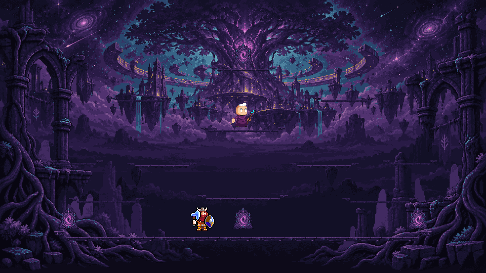

# CODEX-ART-01 결과 보고

## 완료

중앙 렐름 **Yggdrasil Heart**용 원경, 투명 중경, 3-슬라이스 플랫폼 2종, 포털, 컨택트 시트를 제작했다. 콘셉트 아트의 우주색 보라/남색과 세계수 심장 이미지를 유지하되, 실제 전투가 벌어지는 화면 중앙·하단은 어둡고 저대비로 비워 두었다. 제품 소스와 기존 테스트는 수정하지 않았다.



위 이미지는 `RealmCatalog.gd`의 중앙 렐름 플랫폼 12개와 포털 4개 좌표를 그대로 사용하고, 기존 프레이·유키 스프라이트의 불투명 몸체를 각각 96px 높이로 맞춰 합성한 창 모드 Godot 캡처다.

## 생성 파일

| 파일 | 측정 크기 | 측정 결과 |
|---|---:|---|
| `assets/art/realm_center/bg_far.png` | 1920×1080 | 2,073,600픽셀 전부 불투명, RGBA 조합 24개 |
| `assets/art/realm_center/bg_mid.png` | 1920×1080 | 완전 투명 1,446,712픽셀, 반투명 15,512픽셀 |
| `assets/art/realm_center/platform_main.png` | 236×54 | 54 / 128 / 54px 3-슬라이스 |
| `assets/art/realm_center/platform_sub.png` | 160×32 | 32 / 96 / 32px 3-슬라이스 |
| `assets/art/realm_center/portal.png` | 96×96 | 투명 배경, 불투명 4,548픽셀 |
| `assets/art/realm_center/contact_sheet.png` | 1920×1520 | 1920×1080 실배치 목업 + 개별 자산 미리보기 |
| `reports/codex-art-01/realm_preview.png` | 1920×1080 | 창 모드 Godot 뷰포트 캡처 |

프롬프트 전문, 24색 팔레트, 슬라이스 좌표, 그리기 방식은 `smash-nine-prototype/assets/art/realm_center/README.md`에 기록했다. 사용한 도구는 내장 이미지 생성 경로이며, Godot `Image` API로 픽셀화·팔레트 제한·알파 정리·슬라이싱을 수행했다.

## 확인 및 테스트

다음 두 스크립트를 Godot 4.7로 실행했다.

```text
godot --headless --path . -s tests/art_preview/realm/build_assets.gd
godot --path . --windowed -s tests/art_preview/realm/preview.gd
godot --headless --path . -s tests/art_preview/realm/verify_assets.gd
```

자동 검증 결과:

- 6개 최종 PNG 크기 일치
- `bg_far.png` 완전 불투명 확인
- 개별 아트 5종의 모든 2×2 블록이 같은 RGBA 값인 2배 최근접 픽셀 그리드 확인
- 메인/보조 플랫폼 반복 중앙 조각의 첫 열과 마지막 열이 픽셀 단위로 동일함 확인
- 창 모드 캡처 1920×1080 확인
- `SCRIPT ERROR`, `Parse Error` 및 알려진 인증서 경고 외 다른 `ERROR` 없음

모든 Godot 실행에서 샌드박스의 알려진 잡음인 `Failed to read the root certificate store` 한 줄은 발생했다.

## 리드 통합 메모

- `bg_far` → `bg_mid` → 포털 → 플랫폼 → 캐릭터 순으로 그리면 현재 목업과 같은 깊이가 나온다.
- 두 배경은 중앙 렐름 로컬 좌표 `(0, 0)`에서 1920×1080 1:1 배치한다.
- 메인 플랫폼은 높이 54px 고정, 보조 플랫폼은 원본 32px를 실제 28/30/32/34px 높이에 `NEAREST`로 맞춘다.
- 플랫폼 중앙 조각은 가로 타일링한다. 메인은 좌우 마진 54px, 보조는 좌우 마진 32px다.
- 포털 이미지는 카탈로그 포털 좌표에 하단 중앙을 맞춘다.
- 제품 토글과 `RealmWorld`/`RealmBackdrop` 연결은 리드 소유 코드이므로 이 브랜치에서는 구현하지 않았다.

## 현재 상태와 가독성 우려

측정 사실:

- 전투가 집중되는 하단 중앙은 원경의 세부 묘사가 적고, 중경의 중앙은 투명하다.
- 프레이와 유키의 밝은 얼굴/장비는 목업에서 배경과 구분된다.
- 상단 40%의 세계수, 별, 부유 유적은 하단보다 명도와 디테일이 높다.
- 최종 파일은 24색 RGB 팔레트와 0/0.5/1 알파 단계로 정리했다.

사람이 판단해야 할 취향:

- 상단 세계수와 은하가 최종전 분위기를 충분히 주는지, 또는 시선이 너무 강하게 끌리는지
- 좌우 폐허 프레임이 화면 깊이를 주는지, 또는 가장자리 전투를 답답하게 만드는지
- 포털의 자홍색 중심이 목적물로 충분히 눈에 띄는지, 혹은 4개 동시 배치 시 과한지
- 짙은 보라 플랫폼이 실제 HUD, 히트 스파크, 캐릭터별 이펙트 아래에서도 충분히 읽히는지

## 남은 작업 / 확인하지 못한 항목

- 실제 게임 토글 연결과 라이브 매치 실행은 제품 소스 수정 금지 범위 때문에 수행하지 않았다.
- 실제 적색 서든 데스 영역, HUD, 공격 이펙트를 새 배경과 동시에 합성한 검증은 하지 않았다. 리드 통합 후 최우선 육안 확인 항목이다.
- `.git`이 샌드박스에서 읽기 전용이라 직접 커밋하지 못했다. `commit.ps1`은 기존 스테이징이 비어 있을 때 허용된 세 경로만 추가하고 커밋하도록 작성했다.
