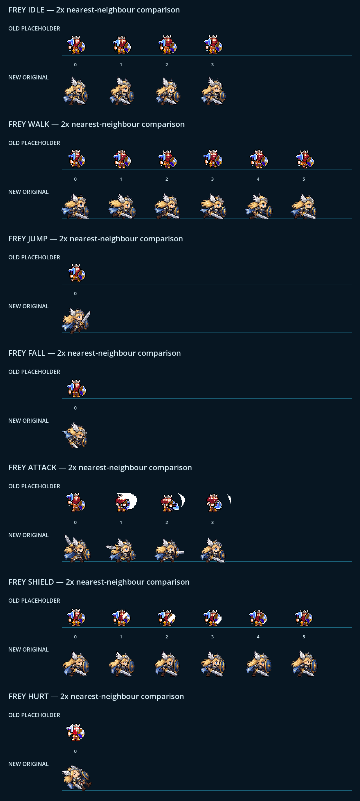

# CODEX-ART-02 결과 보고 — Frey 오리지널 스프라이트 시트 후보

## 완료

금발 발키리 브루저 프레이의 오리지널 스프라이트 시트 후보를 제작했다. 최종 파일은
`smash-nine-prototype/assets/art/frey/frey_sheet.png`이며, 기존 `Frey.gd`의 6열 컷과
애니메이션 행 구성을 그대로 사용하도록 384x448 / 셀 64x64 규격으로 맞췄다.

제품 소스(`scripts/`, `characters/`, `scenes/`, `project.godot`)와 기존 테스트는 수정하지 않았다.

## 산출물

| 파일 | 크기 / 용도 |
|---|---|
| `assets/art/frey/frey_sheet.png` | 384x448 RGBA, 최종 후보 시트 |
| `assets/art/frey/frey_sheet.png.import` | Godot 4.7 텍스처 임포트 메타데이터 |
| `assets/art/frey/generated_source.png` | 1223x1286 ImageGen 고해상도 원본 |
| `assets/art/frey/README.md` | 아틀라스 계약과 리드 통합 메모 |
| `tests/art_preview/frey/build_sheet.gd` | Godot `Image` API 기반 최근접 축소·정렬·클린업 |
| `tests/art_preview/frey/preview_frey.gd` | 기존/신규를 같은 `AnimatedSprite2D` 컷으로 2x 렌더 |
| `tests/art_preview/frey/verify_frey.gd` | 크기, 사용/미사용 셀, 발 기준선, 중심 측정 |
| `reports/codex-art-02/compare_*.png` | 애니메이션 7종별 기존/신규 2x 비교 화면, 각 1040x330 |
| `reports/codex-art-02/contact_sheet.png` | 전체 비교 연락판, 1040x2310 |
| `reports/codex-art-02/alignment.csv` | 23프레임 정렬 실측값 |

## 행 구성

| 행 | 애니메이션 | 사용 프레임 | 루프/의도 |
|---:|---|---:|---|
| 0 | idle | 4 | 호흡, 검을 낮추고 방패를 앞에 둠 |
| 1 | walk | 6 | 달리기 사이클 |
| 2 | jump | 1 | 상승 자세 |
| 3 | fall | 1 | 낙하 자세 |
| 4 | attack | 4 | 준비 → 초기 스윙 → 수평 활성 → 회수 |
| 5 | shield | 6 | 전방 방패 가드와 미세한 자세 변화 |
| 6 | hurt | 1 | 뒤로 밀리는 피격 자세 |

## 이미지 생성과 후처리

- 생성 방식: Codex 기본 내장 ImageGen (`stylized-concept`), 투명 배경 요청
- 참고 이미지 역할: `Concept1.png`, `Concept2.png`는 캐릭터 정체성과 픽셀 아트 톤 참고 전용
- 기존 `frey_prototype.png` 역할: 배치·셀·플레이 크기 비교 전용이며 디자인 복제에는 사용하지 않음
- 생성 원본을 6x7 논리 셀로 분리한 뒤 각 셀을 51x46으로 최근접 축소
- 알파 0.42 미만 제거, 작은 분리 픽셀 덩어리 제거, 알파를 불투명/투명으로 정리
- 모든 사용 프레임의 불투명 중심을 x=32에 맞추고 발 최하단을 y=48에 맞춤

### 최종 생성 프롬프트

```text
Use case: stylized-concept
Asset type: original 2D pixel-art game character sprite atlas for a Godot platform-brawler
Input images: Image 1 and Image 2 are style and character-roster references only. Use their readable chibi proportions, crisp outlined pixel-art feeling, dramatic fantasy palette, and the blonde Valkyrie Frey identity. Do not copy any existing game sprite or logo.

Primary request: Create one production-ready sprite atlas for FREY, an original blonde Valkyrie bruiser. She faces RIGHT in every frame. She wears a silver winged helm, navy-blue and steel armor with small gold trim, a short pale-blue cape, brown boots, carries a broad silver sword in her right hand and a round blue-and-gold shield on her forward/left arm. She must look slightly heavy, physical, direct, and readable.

Canvas/layout: EXACTLY 6 columns by 7 rows of equal square cells. Show faint non-rendered logical spacing only; do NOT draw grid lines or labels. Every figure stays completely inside its own cell. Character feet share one identical bottom baseline in all grounded frames, and the torso center stays on one identical vertical axis. Leave generous transparent padding. Use the complete rows exactly:
Row 0: 4 idle frames (gentle breathing, sword lowered, shield forward), then 2 empty transparent cells.
Row 1: 6-frame run cycle, strong readable contacts and passing poses.
Row 2: 1 rising jump frame in column 0, then 5 empty transparent cells.
Row 3: 1 falling frame in column 0, then 5 empty transparent cells.
Row 4: 4-frame horizontal sword attack: clear wind-up, early swing, active broad horizontal slash, recovery; then 2 empty transparent cells.
Row 5: 6-frame guard animation, shield raised toward the right/front; subtle recoil/breathing, repeated poses allowed.
Row 6: 1 hurt/knockback frame in column 0, then 5 empty transparent cells.

Style/medium: authentic hand-crafted pixel art created at a larger working resolution for later nearest-neighbor reduction to 64x64 cells; crisp hard pixel clusters, limited cohesive palette, strong dark navy outline, no anti-aliased painterly edges, no gradients, no semi-transparent motion blur. Match the attached concept art's cute super-deformed fantasy fighter proportions without copying any third-party sprite.
Lighting/mood: bright blonde hair, pale skin, steel highlights and blue shield must read clearly on dark navy gameplay backgrounds.
Animation consistency: same exact face, hair silhouette, helmet wings, body proportions, costume colors, sword length, shield size, and outline thickness in every frame. Keep the shield visibly round. Keep sword and shield separate and readable. No costume redesign between frames.
Constraints: transparent background outside opaque pixels; no text; no labels; no numbers; no logos; no watermark; no scenery; no ground shadows; no grid lines; no cropped weapons; no extra characters; no duplicate characters in empty cells; no left-facing frames.
```

## 정량 검증 결과

`verify_frey.gd` 결과: `FREY_VERIFY PASS`.

| 측정 항목 | 결과 |
|---|---|
| 최종 캔버스 | 384x448, 요구값 일치 |
| 셀 구조 | 6x7, 셀당 64x64 |
| 사용 프레임 | 23개 모두 비어 있지 않음 |
| 미사용 셀 | 19개 모두 완전 투명 |
| 발 기준선 | 23개 모두 y=48 |
| 불투명 픽셀 중심 x | 31.50~32.47 (목표 x=32, 최대 편차 0.50px) |
| 사용 프레임 경계 폭 | 36~44px |
| 사용 프레임 경계 높이 | 35~41px, 공격 준비 프레임 41px |

세부 23프레임 값은 `alignment.csv`에 기록했다. 이 중심값은 장비까지 포함한 **불투명 픽셀 무게중심**이며,
인체 몸통 중심을 자동 인식한 값은 아니다.

## 시각적 확인



위 비교에서 위쪽 행은 기존 플레이스홀더, 아래쪽 행은 신규 오리지널 후보이다. 청록색 선은 동일한
캐릭터 원점 기준선이며, 신규 시트가 금발·윙드 헬름·검·원형 방패를 어두운 배경에서 더 크게 읽히게 한다.

## 현재 확인된 일관성과 제한

### 측정된 사실

- 23프레임 모두 오른쪽을 향하는 얼굴과 전방 장비 방향으로 구성됐다.
- 팔레트는 금발, 강철/백색, 네이비/청색, 금색 테두리, 갈색 부츠로 유지된다.
- 헬름 날개, 원형 청색 방패, 은색 검이 모든 프레임에서 식별된다.
- 모든 사용 프레임은 동일 발 기준선과 1px 이내의 불투명 중심축을 가진다.
- 신규 캐릭터 경계는 기존(대체로 폭 26~36px, 높이 24~28px)보다 크다.

### 사람이 판단해야 하는 취향 영역

- 현행 scale 2에서 신규 프레이의 체격이 다른 캐릭터 대비 적절한가. 의도적으로 기존보다 크고 묵직하다.
- 6프레임 달리기의 다리 변화가 실제 속도에서 충분히 읽히는가.
- 4프레임 공격이 흰색 모션 아크 없이도 준비/활성/회수 타이밍을 충분히 전달하는가.
- 방패 6프레임의 변화가 너무 미세하지 않은가.
- 점프와 낙하의 실루엣 차이가 실제 전투 배경에서 충분한가.
- 콘셉트 패널의 귀여운 비율과 게임 내 전투 가독성 사이 균형이 맞는가.

## 리드 통합 메모

승인 시 `characters/frey/Frey.gd` 4행의 텍스처 preload만 다음으로 바꾸면 된다.

```gdscript
const PROTOTYPE_TEXTURE := preload("res://assets/art/frey/frey_sheet.png")
```

기존 `configure_character_sprite()`의 셀 크기, 열 수, 시작 인덱스, 프레임 수, FPS, 루프 설정은 그대로
호환된다. 이 유닛은 제품 소스를 수정하지 않았다.

## 실행·검증 명령

```powershell
# 원본에서 최종 시트 재생성
<godot-console> --headless --path . -s tests/art_preview/frey/build_sheet.gd

# 구조/정렬 검증
<godot-console> --headless --path . -s tests/art_preview/frey/verify_frey.gd

# 7종 비교 화면과 연락판 생성 (windowed)
<godot-console> --path . -s tests/art_preview/frey/preview_frey.gd
```

Godot 4.7에서 최종 검증과 7종 프리뷰 캡처가 완료됐다. 실행 중 샌드박스 고유의
`ERROR: Failed to read the root certificate store.` 한 줄만 발생했으며, 프로젝트 가이드에 명시된 알려진 잡음이다.
그 외 최종 실행에는 `SCRIPT ERROR`, `Parse Error`, 추가 `ERROR`가 없었다.

## 남은 작업

- 리드/사용자의 시각 승인
- 승인 시 제품 코드의 텍스처 preload 1줄 교체
- 실제 8인 매치에서 다른 캐릭터·이펙트·HUD와 함께 크기 및 공격 가독성 확인

