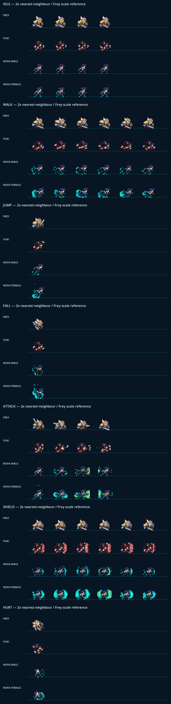

# CODEX-ART-03A 결과 보고 — Yuki / Nova 오리지널 캐릭터 시트

## 완료

Unit A 우선순위 3장을 모두 제작했다. 유키 여성 시트 1장과 같은 캐릭터 디자인을
공유하는 노바 남성/여성 시트 2장이며, 모두 프레이와 같은 384x448 / 64x64 셀 계약을
사용한다. 추가 조건에 따라 각 시트의 64x64 초상화도 만들었다.

제품 소스(`scripts/`, `characters/`, `scenes/`, `project.godot`)와 기존 테스트는
수정하지 않았다.

## 산출물

| 파일 | 크기 / 용도 |
|---|---|
| `assets/art/yuki/yuki_sheet.png` | 384x448 RGBA, 유키 최종 후보 시트 |
| `assets/art/yuki/yuki_portrait.png` | 64x64 RGBA, 선택 초상화 |
| `assets/art/nova/nova_male_sheet.png` | 384x448 RGBA, 노바 남성 최종 후보 시트 |
| `assets/art/nova/nova_male_portrait.png` | 64x64 RGBA, 선택 초상화 |
| `assets/art/nova/nova_female_sheet.png` | 384x448 RGBA, 노바 여성 최종 후보 시트 |
| `assets/art/nova/nova_female_portrait.png` | 64x64 RGBA, 선택 초상화 |
| `assets/art/*/*_generated_source.png` | 각 1161x1355, 내장 ImageGen 원본 |
| `tests/art_preview/chars_a/build_sheets.gd` | Godot `Image` 후처리 및 초상화 생성 |
| `tests/art_preview/chars_a/verify_sheets.gd` | 규격·투명 셀·발·중심축·초상화 검증 |
| `tests/art_preview/chars_a/preview_sheets.gd` | 프레이 포함 2배율 비교 캡처 |
| `reports/codex-art-03a/alignment.csv` | 69프레임 정렬 실측값 |
| `reports/codex-art-03a/compare_*.png` | 애니메이션 7종 비교판, 각 1120x655 |
| `reports/codex-art-03a/contact_sheet.png` | 전체 비교판, 1120x4585 |
| `reports/codex-art-03a/prompts.md` | 사용한 ImageGen 프롬프트 3개 |

## 디자인 결과

### 유키

- 유지: 여성 음양사, 원거리 부적, 설치 결계형 컨트롤러, 가볍고 민첩한 체형.
- 재설계: 검은 높은 묶음머리, 자주/주홍 비대칭 퇴마사 복식, 상아색 부적,
  금색 음양 장식.
- 공격 행은 부적 준비 → 전방 투척 → 종이 궤적 → 회수로 읽히며, 방어 행은
  수인을 유지하면서 몸 앞에 작은 적금색 결계를 세운다.

### 노바 남성 / 여성

- 유지: 슈퍼히어로, 속도를 중력 타격으로 전환하는 추격자, 청록→금 고속 강조.
- 재설계: 얼굴이 보이는 짙은 남색 우주 수트, 은색 흉갑/전완, 중력 궤도 문장,
  청록 장갑과 부츠. 무기와 망토는 없다.
- 공격 행은 몸을 웅크린 준비 → 발진 → 중력 펀치 → 제동이며, 방어 행은 팔을
  교차하고 작은 원형 중력장을 유지한다.
- 두 변형은 복식 패널, 문장, 장비, 머리색/실루엣, 효과색과 동작을 공유한다.
  여성형은 어깨가 좁고 허리/골반선과 얼굴이 다르지만 64x64에서는 차이가
  의도적으로 미세하다.

## 생성 및 후처리

- 생성 방식: Codex 내장 ImageGen, 투명 배경, `stylized-concept` 2회와
  `style-transfer` 1회.
- 참고 이미지 역할: `Concept1.png`, `Concept2.png`는 세계/역할/픽셀 톤의 넓은
  틀만 사용했고, `frey_sheet.png`는 크기·픽셀 밀도·외곽선 기준으로 사용했다.
- 노바 여성 원본은 노바 남성 원본을 직접 참조해 동일한 수트/장비/팔레트를
  잠그고 체형만 바꾸도록 생성했다.
- 각 1161x1355 원본을 6x7 논리 셀로 자르고 51x46으로 최근접 축소했다.
- 알파 0.35 미만 제거, 나머지는 완전 불투명화, 3픽셀 미만의 작은 분리 섬 제거.
- 각 프레임의 불투명 중심을 x=32에 맞추고 최하단을 y=48에 맞췄다.
- 정확한 프롬프트 전문은 `prompts.md`에 기록했다.

## 정량 검증 결과

최종 `verify_sheets.gd` 결과는 `CHARS_A_VERIFY PASS`다.

| 시트 | 사용 프레임 | 중심 x 범위 | 경계 폭 | 경계 높이 |
|---|---:|---:|---:|---:|
| Yuki | 23 | 31.64~32.49 | 36~47px | 34~38px |
| Nova male | 23 | 31.56~32.50 | 29~48px | 32~46px |
| Nova female | 23 | 31.55~32.37 | 30~51px | 34~46px |

공통 측정 사실:

- 세 캔버스 모두 384x448 RGBA8이다.
- 사용 프레임 69개는 모두 비어 있지 않고 최하단이 y=48이다.
- 미사용 셀 57개는 완전 투명하다.
- 모든 사용 프레임의 불투명 중심축은 목표 x=32에서 0.50px 이내다.
- 프레이 실측 경계(폭 36~44px, 높이 35~41px)와 비교하면 유키는 비슷하고,
  노바는 중력 효과 때문에 최대 폭/높이가 조금 더 크다.
- 노바 여성은 남성보다 평균 불투명 픽셀이 많다(1007.9 대 745.5). 이는 여성
  몸집이 아니라 달리기/가드 중력 효과가 더 조밀하게 생성된 영향이 크다.

## 시각적 확인



위 판은 애니메이션별로 프레이, 유키, 노바 남성, 노바 여성을 같은 y 기준선과
2배 최근접 배율에 놓은 실제 Godot 캡처다. 파란 선은 각 64x64 셀의 발 기준선이다.

## 사람이 판단해야 하는 영역

- 유키의 긴 머리와 다수 부적이 8인 난전에서 몸 동작을 가리지 않는가.
- 유키의 공격 2·3프레임과 작은 결계가 실제 재생 속도에서 충분히 구별되는가.
- 노바의 청록 중력 궤적이 어두운 렐름에서 선명한 대신 지나치게 넓거나 밝지 않은가.
- 노바 남녀가 같은 캐릭터로 충분히 일치하면서도 체형 차이가 필요한 만큼 읽히는가.
- 여성형의 중력 효과 밀도가 남성형보다 큰 차이를 허용할지, 통일할지.
- 프레이보다 노바 효과 경계가 최대 5~7px 큰 것이 전투 가독성에 적절한가.

위 항목은 자동 검증으로 결정하지 않았으며 최종 취향 판단은 사용자/리드의 몫이다.

## 리드 통합 메모

- Yuki: 기존 128x128 개별 스트립 대신 6열 그리드로 전환해야 한다. 시작 인덱스는
  `0, 6, 12, 18, 24, 30, 36`, 프레임 수는 `4, 6, 1, 1, 4, 6, 1`이다.
- Nova: 현재 14열 프로토타입 컷을 위와 같은 6열 컷으로 바꿔야 한다.
- `ArtSettings.character_sheet("yuki", ...)`는 `yuki_sheet.png`와 이름이 맞는다.
- `ArtSettings.character_sheet("nova", ...)`는 `nova_sheet.png`를 찾으므로 남성/여성
  선택 규칙을 정한 뒤 두 명시 경로 중 하나를 불러오거나 variant 선택 API가 필요하다.
- 셀 표시 계약은 position `(0, -32)`, scale `2`, nearest filter다.

제품 코드는 리드 소유이므로 이 유닛은 통합 변경을 하지 않았다.

## 실행·검증

```powershell
<godot-console> --headless --path . -s tests/art_preview/chars_a/build_sheets.gd
<godot-console> --headless --path . -s tests/art_preview/chars_a/verify_sheets.gd
<godot-console> --path . -s tests/art_preview/chars_a/preview_sheets.gd
```

최종 세 실행 모두 종료 코드 0이었다. 세 실행에서 공통으로 프로젝트 가이드에 적힌
인증서 저장소 `ERROR` 한 줄만 발생했다. `Image.load_from_file()`의 export 비지원
경고는 빌더/검증 전용 스크립트에서만 발생하며 런타임 코드에는 사용하지 않았다.

중간에 새 PNG를 Godot importer로 등록하려 한 실행은 샌드박스의
`AppData/Local/Godot` 캐시 쓰기 제한으로 별도 오류가 발생했다. 프리뷰 스크립트를
파일 직접 로드 후 `ImageTexture`로 만드는 방식으로 바꿨고, 그 뒤 최종 캡처는 정상
완료했다.

## 남은 작업

- 사용자/리드의 시각 승인.
- 승인한 노바 성별 변형의 기본 선택 또는 선택 UI 정책 결정.
- 리드가 제품 코드의 텍스처/그리드 컷을 통합한 뒤 실제 8인 매치에서 크기,
  이펙트 겹침, 공격/방어 타이밍 가독성 확인.
