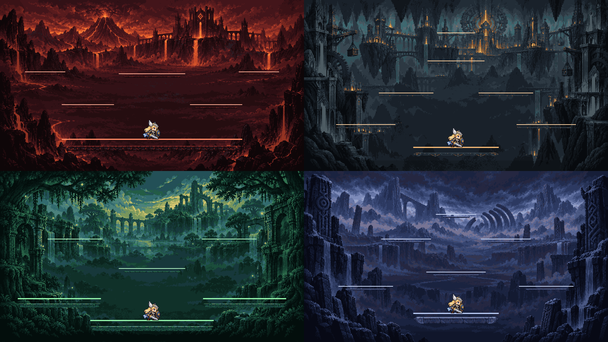

# CODEX-ART-04B 결과 보고

## 완료

B 유닛 우선순위대로 무스펠하임, 스바르트알프하임, 바나하임, 요툰하임 4개 렐름을 모두 완성했다. 각 렐름은 `bg_far.png`, `bg_mid.png`, `platform_main.png`, `platform_sub.png`, `README.md`를 가진다. 제품 소스는 수정하지 않았다.



위 이미지는 `RealmCatalog.gd`의 실제 발판 사각형을 사용한 1280×720 합성 화면 4장을 2×2로 배치한 것이다. 좌상단부터 무스펠하임, 스바르트알프하임, 바나하임, 요툰하임이며, 프레이 원본 시트의 첫 프레임을 런타임 배율(128×128 캔버스)로 올려 캐릭터 스케일을 표시했다.

## 측정 사실

| 렐름 | 원경 | 중경 | 메인 스트립 | 메인 캡 | 보조 스트립 | 보조 캡 | 중경 투명 비율 |
|---|---:|---:|---:|---:|---:|---:|---:|
| Muspelheim | 1280×720 | 1280×720 | 200×52 | 52px | 160×32 | 32px | 70.3% |
| Svartalfheim | 1280×720 | 1280×720 | 184×44 | 44px | 160×32 | 32px | 70.3% |
| Vanaheim | 1280×720 | 1280×720 | 188×46 | 46px | 160×32 | 32px | 66.9% |
| Jotunheim | 1280×720 | 1280×720 | 188×46 | 46px | 160×32 | 32px | 70.3% |

- 네 `bg_far.png` 모두 투명 픽셀 0개다.
- 네 `bg_mid.png` 모두 절반 이상이 완전 투명하다.
- 모든 메인/보조 스트립의 96px 반복 중앙은 좌우 경계 픽셀 열이 일치한다.
- 모든 최종 이미지는 RGBA PNG다.
- `build_assets.gd` 실행 결과 `ART_BUILD_OK realms=4`, `verify_assets.gd` 실행 결과 `VERIFY_OK realms=4 files=16`을 확인했다.
- Godot가 출력한 유일한 `ERROR`는 카드에 알려진 샌드박스 인증서 저장소 오류(`Failed to read the root certificate store`)였다.

개별 1280×720 미리보기: [Muspelheim](muspelheim_preview.png), [Svartalfheim](svartalfheim_preview.png), [Vanaheim](vanaheim_preview.png), [Jotunheim](jotunheim_preview.png).

## 제작 방식

- 내장 `image_gen` 모드로 렐름마다 원경 1장과 투명 플랫폼 원본 시트 1장을 생성했다. `Concept2.png`는 스타일·세계관 참고로만 사용했고 레이아웃, UI, 로고, 글자, 캐릭터를 복제하지 않도록 제한했다.
- `tests/art_preview/realms_b/build_assets.gd`가 원경을 16:9 중앙 크롭 → 640×360 축소 → 렐름별 20색 팔레트 매핑 → 1280×720 최근접 확대 순서로 처리한다.
- 중경은 생성 원경의 가장자리 색을 어둡게 재매핑하고 중앙을 투명하게 만든 별도 레이어다.
- 플랫폼 원본 시트의 상·하단 스프라이트를 Godot `Image` API로 잘라 캡/96px 반복 중앙/캡 스트립으로 재구성했다. 반투명 알파는 0/0.5/1 단계로 정리했다.
- 최종 생성 프롬프트와 팔레트는 각 렐름의 `README.md`에 기록했다.

## 리드 통합 메모

각 렐름의 기존 사전에 아래 `art` 항목을 추가하면 `RealmWorld`가 원본 배경과 NinePatch 플랫폼을 사용한다.

```gdscript
# Muspelheim
"art": {"dir": "res://assets/art/realm_muspelheim", "cap_main": 52, "cap_sub": 32},
# Svartalfheim
"art": {"dir": "res://assets/art/realm_svartalfheim", "cap_main": 44, "cap_sub": 32},
# Vanaheim
"art": {"dir": "res://assets/art/realm_vanaheim", "cap_main": 46, "cap_sub": 32},
# Jotunheim
"art": {"dir": "res://assets/art/realm_jotunheim", "cap_main": 46, "cap_sub": 32},
```

`RealmWorld._paint_platform()`이 상단 강조선을 다시 그리므로 미리보기에도 같은 5px/3px 강조선을 합성했다. 무스펠하임 발판은 분출 경고를 가리지 않도록 균열 발광을 제한했고, 요툰하임은 지진 경고보다 룬 대비가 낮다. 카드에 없는 `portal.png`는 만들지 않았으므로 기존 프로토타입 포털 폴백이 유지된다.

## 사람이 판단할 항목

아래는 측정 사실이 아니라 취향·실플레이 판단 영역이다.

- 생성 원경의 밀도와 채도가 중앙 렐름의 채택된 아트 톤과 충분히 통일되어 보이는지
- 바나하임의 녹색 캐릭터/효과가 녹색 배경에서도 또렷한지
- 스바르트알프하임의 황동 강조선이 기계 도시의 작은 창 불빛과 혼동되지 않는지
- 무스펠하임의 적색 지형에서 분출 경고가 확실히 우선하는지
- 요툰하임의 청회색 발판과 지진 경고가 실제 흔들림 중에도 읽히는지
- 가장자리 중경 프레임의 존재감이 과한지, 혹은 2.5D 깊이를 충분히 주는지

## 남은 작업 / 하지 않은 일

- 제품 소스(`RealmCatalog.gd`) 통합은 리드 소유이므로 하지 않았다.
- 실제 매치 창에서 하자드·HUD·여러 캐릭터까지 겹친 사람 플레이테스트는 하지 않았다. 보고서 이미지는 검증 스크립트가 만든 정확 좌표 합성 이미지다.
- `.git`은 이 샌드박스에서 쓰기 불가이므로 커밋하지 않았다. `commit.ps1`이 이 유닛의 허용 경로만 스테이징하고 `Co-Authored-By: Codex <noreply@openai.com>` 트레일러가 붙은 커밋을 만든다.
