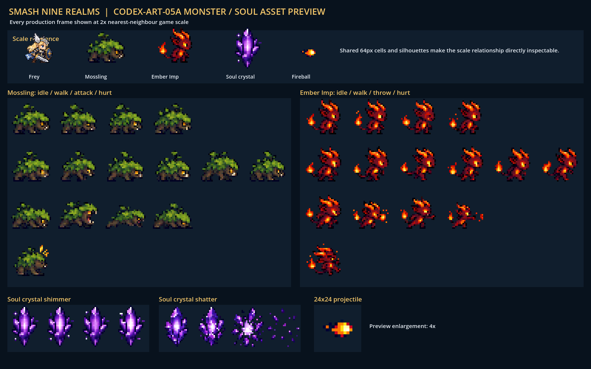

# CODEX-ART-05A 결과 보고서

## 완료

Unit A 우선순위 1–4를 모두 제작했다. 제품 소스(`scripts/`, `characters/`, `scenes/`, `project.godot`)와 기존 테스트는 수정하지 않았다. 내장 이미지 생성 도구로 원본을 만든 뒤 Godot `Image` API로 최종 픽셀 격자, 투명도, 정렬, 슬라이싱을 처리했다.

## 제작 파일

| 파일 | 실제 크기 | 내용 |
| --- | ---: | --- |
| `assets/art/monsters/mossling_sheet.png` | 384×256 | idle 4, walk 6, 돌진 물기/몸통 박치기 4, hurt 1 |
| `assets/art/monsters/ember_imp_sheet.png` | 384×256 | idle 4, walk 6, 화염구 투척 4, hurt 1 |
| `assets/art/monsters/ember_fireball.png` | 24×24 | 오른쪽 진행 화염구 |
| `assets/art/objects/soul_crystal.png` | 192×64 | 4프레임 반짝임 루프 |
| `assets/art/objects/soul_crystal_shatter.png` | 192×64 | 4프레임 파괴 애니메이션 |

생성 원본은 이 보고서 폴더의 `source_*.png`로 보존했다. 사용한 최종 프롬프트는 각 아트 폴더의 `README.md`에 기록했다.

## 측정 사실

- 다섯 최종 PNG는 모두 RGBA8이며 요구 크기와 일치한다.
- 투명/불투명 픽셀 수: Mossling 79,200/19,104, Ember Imp 82,780/15,524, fireball 436/140, crystal 8,048/4,240, shatter 9,020/3,268.
- 몬스터 시트의 계약 외 셀은 완전 투명하다.
- 모든 최종 프레임은 2×2 동일 픽셀 블록으로 구성되는 최근접 픽셀 격자를 통과했다.

### 몬스터 시트 정렬표

| 시트 | 행/동작 | 사용 프레임 | 측정 중심 x | 측정 발 하단 y |
| --- | --- | --- | ---: | ---: |
| Mossling | 0 / idle | 0–3 | 전부 32.0 | 전부 48 |
| Mossling | 1 / walk | 0–5 | 전부 32.0 | 전부 48 |
| Mossling | 2 / attack | 0–3 | 전부 32.0 | 전부 48 |
| Mossling | 3 / hurt | 0 | 32.0 | 48 |
| Ember Imp | 0 / idle | 0–3 | 전부 32.0 | 전부 48 |
| Ember Imp | 1 / walk | 0–5 | 전부 32.0 | 전부 48 |
| Ember Imp | 2 / attack | 0–3 | 전부 32.0 | 전부 48 |
| Ember Imp | 3 / hurt | 0 | 32.0 | 48 |

크리스털 두 시트의 8개 프레임은 모두 중심 x=24.0, 하단 y=56으로 측정됐다.

## 시각적 확인

위 이미지는 모든 사용 프레임을 게임용 2배 최근접 크기로 보여 주며, 위쪽의 Frey 프레임이 캐릭터 대비 크기 기준이다.

## 검증

- `build_assets.gd`: 종료 코드 0, `BUILD_OK all five Unit A assets saved`.
- `verify_assets.gd`: 종료 코드 0, `VERIFY_OK exact sizes, RGBA8, transparency, frame occupancy, alignment, and 2x pixel grid`.
- `preview.gd`: 창 모드 종료 코드 0, 1600×1000 `preview.png` 저장.
- 세 실행에서 공통으로 나온 `Failed to read the root certificate store`는 카드에 명시된 Windows 샌드박스 잡음이다.
- 프리뷰 실행의 `Loaded resource as image file` 경고는 검사 스크립트가 PNG를 직접 읽어 캡처하기 때문에 발생하며 제품 런타임 경고가 아니다.

## 리드 통합 메모

- 프레임 좌표는 `(열, 행)`이며 행은 idle/walk/attack/hurt 순서다. 좌향은 `flip_h`로 처리할 수 있다.
- 중앙 피벗 기준 몬스터 스프라이트를 y=-16에 두면 셀의 발 y=48이 노드 원점 y=0과 맞는다.
- 중앙 피벗 기준 크리스털은 y=-24에 두면 하단 y=56이 노드 원점과 맞는다.
- 임포트 필터는 nearest, repeat는 disabled가 적합하다.
- 실제 애니메이션 FPS와 타격 순간 프레임 선택은 제품 로직 소유자인 리드가 연결해야 한다.

## 사람이 판단할 부분 (취향)

- Mossling의 멧돼지형 실루엣이 세계관의 숲 몬스터로 적절한지.
- Ember Imp의 높은 채도와 꼬리 불꽃이 Muspelheim 배경에서 충분히 분리되는지.
- 크리스털 파괴 3프레임의 밝은 섬광과 파편량이 전투 중 과하거나 부족하지 않은지.
- Frey와 나란히 본 몬스터 체급이 의도한 위협도에 맞는지.

## 하지 않은 일

- 제품 소스 연결, 애니메이션 재생 속도 결정, 실제 전투 장면 통합은 이 유닛 권한 밖이라 수행하지 않았다.
- 전체 게임 테스트는 제품 소스 미연결 상태라 실행하지 않았고, 이 유닛 전용 빌드·정적 검증·창 모드 프리뷰만 실행했다.
- 샌드박스에서 `.git`이 쓰기 금지이므로 직접 커밋하지 못했다. `commit.ps1`을 저장했으며 샌드박스 밖에서 실행하면 이 유닛 허용 경로만 스테이징하고 커밋한다.
