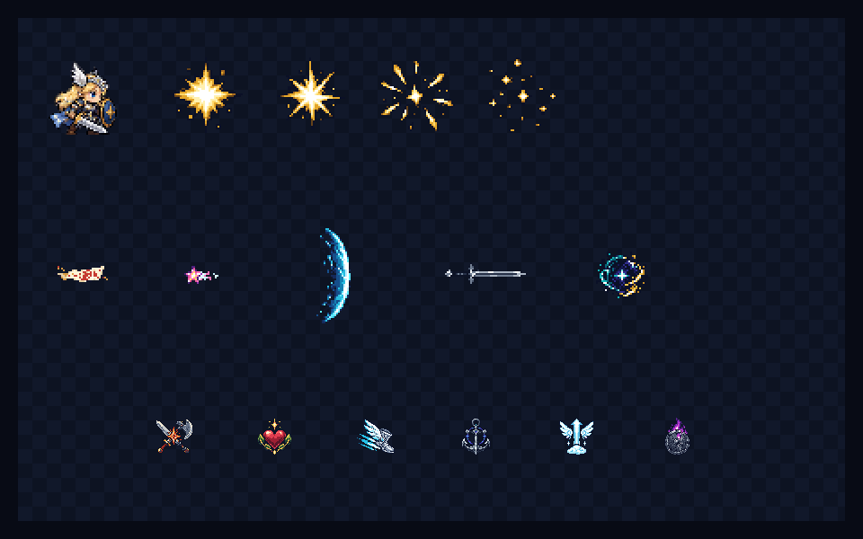

# CODEX-ART-05B 작업 보고

## 완료

유닛 B 범위의 원본 아트 12종을 모두 제작했다. 히트 스파크 1개(4프레임), 캐릭터 투사체 5개, 소울 카드 아이콘 6개를 지정 크기의 투명 RGBA PNG로 만들었고, Godot `Image` API 후처리 및 합성 프리뷰까지 완료했다.

위 그림의 위 행은 프레이 2배 표시와 히트 스파크 4프레임, 가운데 행은 투사체 5종을 게임 배율 2배로 표시한 결과, 아래 행은 카드 아이콘 6종을 UI 배율 1배로 표시한 결과다. 체크무늬 위에 알파 합성해 투명 배경도 함께 확인할 수 있다.

## 변경된 내용

### 효과 아트

| 파일 | 실제 크기 | 불투명 영역(좌상단, 크기) |
|---|---:|---|
| `assets/art/effects/hit_spark.png` | 192×48 | (3,3), 184×42 (48×48 4프레임 전체) |
| `assets/art/effects/yuki_talisman.png` | 32×16 | (1,3), 30×9 |
| `assets/art/effects/luna_star.png` | 24×24 | (1,7), 19×10 |
| `assets/art/effects/rio_mana_wave.png` | 24×56 | (2,1), 19×54 |
| `assets/art/effects/rio_gem_sword.png` | 48×16 | (1,1), 46×13 |
| `assets/art/effects/nova_gravity_orb.png` | 32×32 | (1,2), 29×27 |

### 소울 카드 아이콘

`card_power.png`, `card_vitality.png`, `card_swiftness.png`, `card_anchor.png`, `card_sky_step.png`, `card_last_stand.png`를 모두 48×48로 제작했다. 각 불투명 영역은 29~42px 폭, 39~42px 높이이며 최소 3px 이상의 외곽 투명 여백을 갖는다.

### 재현·검증 자료

- `tests/art_preview/effects_b/source_*.png`: 내장 ImageGen 원본 12개.
- `tests/art_preview/effects_b/build_assets.gd`: 알파 컷오프, 불투명 영역 크롭, 최근접 축소, 제한 팔레트 매핑, 중앙 정렬, 최종 저장, 크기·포맷·여백 검증 및 프리뷰 합성.
- `reports/codex-art-05b/preview.png`: 960×600 게임/UI 배율 합성 결과.
- 각 아트 폴더의 `README.md`: 프롬프트, 팔레트, 사용법, 리드 통합 메모.

## 확인 및 테스트 — 측정 사실

- Godot 4.7 콘솔에서 `tests/art_preview/effects_b/build_assets.gd`를 실행했고 종료 코드 0과 `[effects-b] PASS effects=6 cards=6 preview=960x600`을 확인했다.
- 모든 최종 PNG의 정확한 치수와 `Image.FORMAT_RGBA8`을 스크립트가 검사했다.
- 모든 최종 PNG에서 불투명 영역이 비어 있지 않고 캔버스 네 변에 최소 1px 이상의 투명 여백이 있음을 검사했다.
- 후처리는 알파를 0 또는 1로 정리하고 최근접 보간만 사용한다.
- 실행 로그의 유일한 `ERROR`는 작업 카드에 명시된 샌드박스 인증서 저장소 노이즈 `Failed to read the root certificate store`였다. 별도로 프리뷰에서 `Image.load_from_file`의 export 비권장 경고가 있었으나, 이는 빌드 도구의 로컬 PNG 합성 경로이며 결과 생성에는 영향을 주지 않았다.

## 사람이 판단해야 하는 부분 — 취향/미술 판단

- 히트 스파크가 프레이 2배 실루엣 대비 충분히 강하면서도 화면을 과하게 가리지 않는지.
- 루나 별 탄환의 가로 잔광 때문에 순수한 오각별보다 혜성처럼 읽히는 것이 적절한지.
- 카드 `power`의 검·도끼, `anchor`의 닻, `last_stand`의 금 간 방패가 48px UI에서 즉시 구분되는지.
- 기존 캐릭터 시트보다 효과의 흰색 하이라이트 대비가 조금 강한 편인데, 실제 렐름 배경에서 이 강조도가 원하는 타격감인지.

## 리드 통합 메모

- 제품 소스는 수정하지 않았다. 현재 `Projectile.gd`, 유키·루나의 전용 투사체, 리오의 `_spawn_projectile()` 및 보석 검 `Polygon2D`, 노바의 singularity `Polygon2D`, `PlayerBase._spawn_hit_effect()`는 색 도형을 사용한다.
- 물리 노드와 히트박스 크기는 유지하고 시각 자식만 `Sprite2D`/`AnimatedSprite2D`로 교체하는 방식이 안전하다.
- 유키·루나·리오 마력파는 발사 방향이 왼쪽일 때 `flip_h`가 필요하다. 리오 보석 검은 기존 회전값을 유지하고 흰색/회색 텍스처에 `GEM_COLORS`를 `modulate`로 적용한다.
- 노바 구체는 ultimate singularity 중심에 32×32 텍스처를 2배 표시하는 후보이며, 기존 궤도선은 그대로 병용할 수 있다.
- 카드 UI는 `SoulCards.gd`의 ID와 파일명이 일치하므로 `res://assets/art/ui/card_<id>.png` 규칙으로 연결할 수 있다.
- 히트 스파크는 48×48 4프레임을 약 0.09초 안에 순차 재생하고 강한 공격에서는 전체 노드 스케일만 조정하는 편이 원본 프레임을 보존한다.

## 남은 작업 / 하지 못한 것

- 작업 범위 제한 때문에 제품 코드 연결, 실제 전투 중 방향 반전·틴트·프레임 타이밍 검증은 수행하지 않았다.
- 전체 테스트 모음과 긴 봇 소크는 아트 산출물 전용 작업이므로 실행하지 않았다.
- `.git` 쓰기가 허용되지 않는 환경이므로 직접 커밋하지 않고 `commit.ps1`을 준비했다.

## 다음 권장 단계

리드가 위 통합 지점에 텍스처를 연결한 뒤, 중앙 렐름과 밝은 렐름 양쪽에서 8인 전투 캡처를 비교해 흰색 하이라이트 강도와 카드 아이콘의 1배 판독성을 최종 선택하면 된다.
