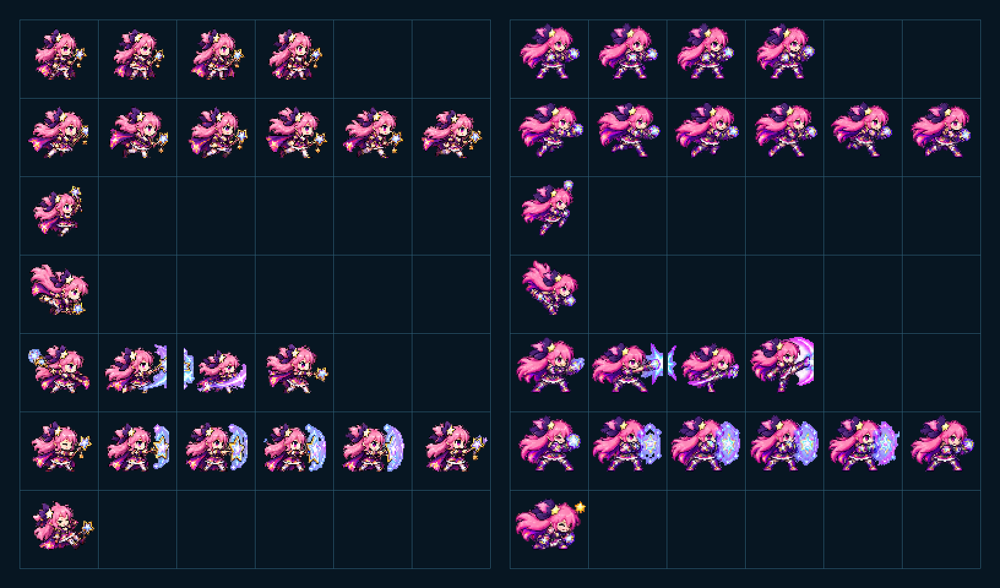
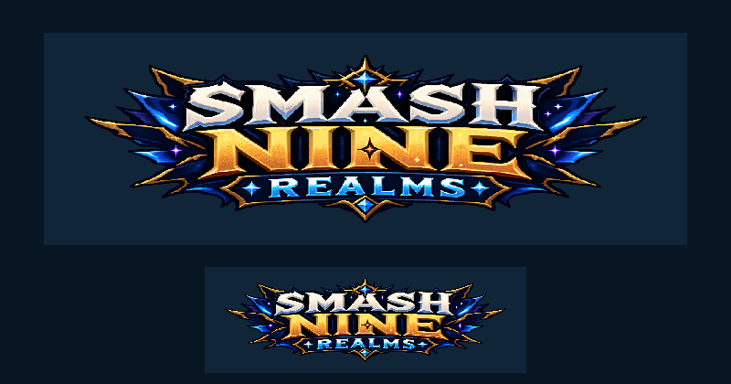

# CODEX-ART-06 결과 보고

## 완료

브레이브 루나 전용 6x7 스프라이트 시트와 시작 화면용 영문 타이틀 로고를 제작했다. 두 결과물 모두 내장 ImageGen으로 큰 투명 원본을 만든 뒤 Godot 4.7 `Image` API에서 최근접 축소, 하드 알파 정리, 정렬 및 합성을 수행했다. 제품 소스는 수정하지 않았다.

## 산출물

| 파일 | 크기 | 내용 |
| --- | ---: | --- |
| `smash-nine-prototype/assets/art/luna/luna_brave_sheet.png` | 384x448 | 64x64 셀, 6열 x 7행, 23프레임 Brave Luna 시트 |
| `smash-nine-prototype/assets/art/luna/luna_brave_generated_source.png` | 1161x1355 | ImageGen 투명 원본 |
| `smash-nine-prototype/assets/art/luna/luna_brave_README.md` | - | 시트 계약과 리드 통합 메모 |
| `smash-nine-prototype/assets/art/ui/title_logo.png` | 640x200 | 투명 배경 `SMASH NINE REALMS` 픽셀 로고 |
| `smash-nine-prototype/assets/art/ui/title_logo_generated_source.png` | 2018x779 | ImageGen 투명 원본 |
| `reports/codex-art-06/alignment_luna_brave.csv` | 23행 | 프레임별 경계, 발 위치, 중심, 픽셀 수 |
| `reports/codex-art-06/luna_normal_vs_brave_2x.png` | 1600x960 | 일반/Brave 시트 2배 비교판 |
| `reports/codex-art-06/title_logo_100_50.png` | 800x420 | 어두운 배경의 로고 100%/50% 비교판 |

## 측정된 사실

- Brave 시트는 RGBA8 384x448이며 사용 프레임 수는 정확히 23개다.
- 행 구성은 `idle 4 / walk 6 / jump 1 / fall 1 / attack 4 / shield 6 / hurt 1`이다.
- 23개 프레임의 발끝은 모두 셀 내부 y=48이다.
- 불투명 픽셀 중심 x 범위는 31.52..32.49다.
- 사용 프레임 경계는 최대 58x46이며 19개 미사용 셀은 완전 투명이다.
- Brave 시트와 로고는 0 또는 1의 하드 알파만 사용한다.
- 로고는 RGBA8 640x200이며, 50% 최근접 축소본에서도 세 단어의 철자를 확인할 수 있다.

## 시각적 확인



왼쪽은 채택된 일반 Luna, 오른쪽은 새 Brave Luna다. 핑크 머리·큰 리본·별 장식은 유지하고, 지팡이를 건틀릿과 부츠 중심의 격투 실루엣으로 바꿨다.



위는 640x200 원본 크기, 아래는 320x100 최근접 축소다. 실제 시작 화면과 비슷한 어두운 남색 배경에서 가독성을 비교한다.

## 확인 및 테스트

실행한 명령:

```powershell
godot --headless --path . -s tests/art_preview/luna_brave_a/build_assets.gd
godot --headless --path . -s tests/art_preview/luna_brave_a/verify_assets.gd
godot --headless --path . -s tests/art_preview/luna_brave_a/make_previews.gd
```

세 스크립트 모두 종료 코드 0이었다. 검증 결과는 `ART_06_VERIFY PASS`다. 모든 실행에서 샌드박스의 알려진 `Failed to read the root certificate store` 한 줄이 출력됐고, 그 외 `ERROR`, `SCRIPT ERROR`, `Parse Error`는 없었다. 프리뷰 스크립트에는 `Image.load_from_file`의 export 관련 경고 한 건이 있으며, 에디터/검증 전용 스크립트라 런타임 빌드에는 포함되지 않는다.

## 리드 통합 메모

- Brave 시트는 기존 Luna와 동일한 64x64/6x7 계약이므로 기존 그리드 애니메이션 구성 방식을 재사용할 수 있다.
- `Luna.gd`의 `_enter_transformation()`에서 Brave용 `SpriteFrames`로 교체하고 `_end_transformation()`에서 일반용으로 복원해야 실제 변신 중에 보인다. 이 유닛은 해당 제품 코드를 수정하지 않았다.
- 로고는 `MatchHud.gd` 시작 오버레이의 텍스트 제목을 `TextureRect`로 대체하거나 그 위에 배치하는 후보 자산이다. 640x200 원본 또는 320x100 축소 사용을 권장한다.
- 텍스처 필터는 nearest-neighbour를 유지해야 한다.

## 사람이 판단할 것

- 일반 Luna와 Brave Luna가 같은 인물로 충분히 읽히는지
- 공격 4프레임이 빠른 펀치/킥 콤보로 읽히는지, 특히 3번째 낮은 킥과 4번째 회전 킥의 구분
- 방어 6프레임의 팔 교차와 별빛 장벽이 전투 중 크기에서도 명확한지
- 로고가 게임 고유 브랜드로 충분히 느껴지는지, 금색 `NINE`의 비중과 좌우 장식 폭이 적절한지

이는 미감과 동작 의미에 대한 판단이며 자동 검증 통과와 별개다.

## 하지 않은 작업

- 제품 소스, 기존 테스트, 씬, `project.godot`은 수정하지 않았다.
- 실제 변신 상태의 스프라이트 교체 및 시작 화면 로고 연결은 하지 않았다.
- 전체 게임 실행/봇 소크는 동시 실행 중인 analyst 작업과 충돌을 피하기 위해 수행하지 않았다.

## 생성 프롬프트 요약

내장 ImageGen을 사용했다. Brave Luna에는 기존 `luna_sheet.png`를 동일 인물·픽셀 스타일 참고로 주고, 핑크 머리/자주색 리본/별 장식을 유지하면서 지팡이 없는 건틀릿·부츠 격투 형태와 정확한 6x7 행 구성을 요청했다. 로고에는 두 콘셉트 이미지를 넓은 3단 판타지 프레임 참고로 주고, 정확한 영문 `SMASH / NINE / REALMS`, 투명 배경, 은색/금색/청록 대비와 50% 가독성을 요청했다.
