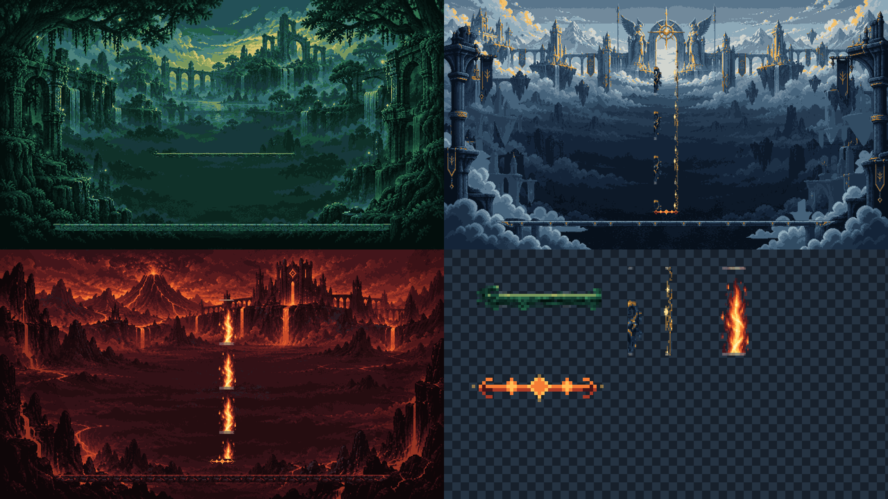

# CODEX-ART-07 결과 보고

## 완료

렐름 hazard 효과 4종을 투명 RGBA 픽셀 아트로 제작했다. 생성형 이미지 소스를 그대로 납품하지 않고 Godot 4.7 `Image` API로 잘라낸 뒤, 승인된 Vanaheim/Asgard/Muspelheim 팔레트에 맞춰 양자화하고 2 px 픽셀 격자, 투명도, 반복 경계를 고정했다.

| 파일 | 실제 크기 | 사용 방식 |
|---|---:|---|
| `vine_bridge.png` | 96x24 | 24 / 48 / 24 px 3-slice |
| `light_beam.png` | 64x128 | 세로 반복, 게임에서 70 px 폭 |
| `fire_pillar.png` | 64x128 | 세로 반복, 게임에서 80x460 px |
| `vent_glyph.png` | 80x16 | 경고 기둥 아래 플랫폼에 배치 |

## 시각적 확인

위 프리뷰는 2560x1440이며, 좌상단은 Vanaheim의 420 px 너비 임시 다리, 우상단은 Asgard의 70x460 px 빛기둥과 glyph, 좌하단은 Muspelheim의 80x460 px 불기둥과 glyph를 각각 1280x720 렐름 배경 위에 1:1 픽셀 크기로 합성했다. 우하단은 투명 배경에서 원본 납품 스프라이트를 정수 배율로 확대한 검사 패널이다.

## 측정된 사실

- 네 파일 모두 Godot에서 RGBA8로 읽히며 고정 크기와 투명/불투명 픽셀을 가진다.
- 모든 출력은 2x2 동일 픽셀 블록으로 구성된다.
- 덩굴 다리의 48 px 중앙 조각 좌우 열이 일치한다.
- 빛기둥과 불기둥의 첫 행/마지막 행이 일치해 세로 반복 경계가 닫힌다.
- 생성과 검증 명령의 최종 결과는 아래 `확인 및 테스트`에 기록한다.

## 사람의 판단이 필요한 부분

- 생성 소스의 장식 밀도를 유지해, 실제 난전에서 hazard 실루엣이 충분히 즉시 읽히는지는 플레이 화면에서 판단해야 한다.
- Asgard `vent_glyph.png`는 코드 tint를 전제로 한 주황 원본이다. 금색 tint 강도와 경고 타이밍 중 밝기 곡선은 리드의 연출 결정 사항이다.
- 덩굴 다리의 캡 장식과 불기둥의 화염 무늬는 미적 선택이며, 기능 검증 결과와 분리해서 평가해야 한다.

## 통합 메모

- `vine_bridge.png`: AtlasTexture/region으로 24/48/24를 분리하거나 NinePatchRect 계열 3-slice 로직에서 중앙만 반복한다. 중앙을 늘이지 말고 반복해야 무늬가 유지된다.
- `light_beam.png`, `fire_pillar.png`: nearest 필터로 폭을 각각 70/80 px로 맞춘 후 Y축 반복하고 마지막 타일을 필요한 높이에서 자른다.
- `vent_glyph.png`: hazard column의 바닥 중앙에 정수 좌표로 둔다. Asgard에서는 금색 modulate, Muspelheim에서는 원색 사용을 권장한다.
- product source는 수정하지 않았다.

## 확인 및 테스트

- 생성: `Godot --headless --path . -s tests/art_preview/hazards_a/build_assets.gd` → `HAZARD_BUILD_OK`, 종료 코드 0.
- 검증: `Godot --headless --path . -s tests/art_preview/hazards_a/verify_assets.gd` → `HAZARD_VERIFY_OK assets=4 sizes=96x24,64x128,64x128,80x16 seams=3 grid=2x preview=2560x1440`, 종료 코드 0.
- 출력 알파 픽셀 수: vine `1260/260/784`, light `6156/704/1332`, fire `4996/836/2360`, glyph `856/16/408` (투명/부분/불투명).
- 두 실행 모두 샌드박스에서 알려진 `Failed to read the root certificate store` 한 줄이 출력됐다. 카드에 명시된 환경 노이즈이며, 그 외 `SCRIPT ERROR`, `Parse Error`, 예상 밖 `ERROR`는 없었다.
- `git diff --check`는 오류 없이 통과했고, 변경 경로는 카드가 허용한 세 디렉터리뿐이다.
- 샌드박스에서 `.git/index.lock` 생성이 거부되어 직접 커밋하지 못했다. `reports/codex-art-07/commit.ps1`은 허용된 세 경로만 스테이징하고 `art: add realm hazard effects`로 커밋하도록 준비했다.

## 생성 프롬프트

프로젝트의 `assets/art/hazards/README.md`에 최종 프롬프트와 후처리 방식을 기록했다. 내장 ImageGen을 사용했으며 `Concept2.png`는 세계관과 큰 색감의 참고 이미지로만 사용했다.
