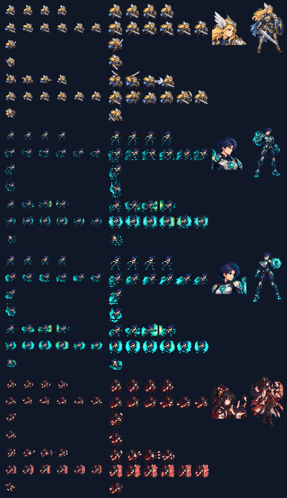

# CODEX-ART-08A 결과 보고

## 완료

유닛 A 범위인 Frey, Nova 남성, Nova 여성, Yuki를 카드 순서대로 제작했다. 각 변형마다 투명 배경 메인 일러스트, 그 일러스트에서 직접 자른 얼굴 초상화, 128px 셀 기반 v2 스프라이트 시트를 만들었다. 제품 소스(`scripts/`, `characters/`, `scenes/`, `project.godot`)는 수정하지 않았다.

## 산출물

| 캐릭터 | 메인 일러스트 | 얼굴 | v2 시트 |
|---|---|---|---|
| Frey | `assets/art/frey/frey_illustration.png` (1024×1536) | `frey_face.png` (256×256) | `frey_sheet.png` (768×896) |
| Nova 남성 | `assets/art/nova/nova_male_illustration.png` (1024×1536) | `nova_male_face.png` (256×256) | `nova_male_sheet.png` (768×896) |
| Nova 여성 | `assets/art/nova/nova_female_illustration.png` (1024×1536) | `nova_female_face.png` (256×256) | `nova_female_sheet.png` (768×896) |
| Yuki | `assets/art/yuki/yuki_illustration.png` (1024×1536) | `yuki_face.png` (256×256) | `yuki_sheet.png` (768×896) |

각 폴더의 `*_illustration_source.png`, `*_v2_source.png`는 built-in ImageGen 원본이다. 최종 PNG는 `tests/art_preview/hires_a/build_assets.gd`가 Godot `Image` API로 크기 정규화, 알파 정리, nearest-neighbour 축소, 색상 정리, 셀 격리, 중심 및 발선 정렬을 수행해 생성한다.

## 디자인 일치

- Frey: 금발, 날개 투구, 남청/은색/금색 갑옷, 푸른 망토, 장검과 별 문양 방패를 유지했다. 공격 행은 준비-올려베기-수평 활성타-회수, 방어 행은 방패를 전면에 둔다.
- Nova: 남녀 모두 남색 머리, 인디고/은색 슈트, 청록 장갑·부츠, 원형 중력 흉부 문양과 청록→금색 고속 효과를 공유한다. 여성형은 노출 변경 없이 어깨·허리·골반 실루엣만 구분했다.
- Yuki: 검보라 포니테일, 적백 끈과 금색 장식, 자주/주홍/아이보리 음양사 복식, 종이 부적과 적금색 결계를 유지했다.
- 얼굴 PNG는 별도 재생성이 아니라 각 메인 일러스트에서 직접 잘랐다.

## 정렬 및 높이 측정

`alignment.csv`는 모든 사용 프레임을 기록한다. `centroid_x`와 `opaque_height`는 최종 PNG의 불투명 픽셀을 직접 측정한 값이다. `configured_body_height`는 무기, 이펙트, 날개 장식과 머리 돌출부를 제외하기 위해 기준 idle 프레임에 적용한 카드 목표값이다.

| 시트 | 사용 프레임 | 발선 y | 불투명 중심 x 범위 | 불투명 전체 높이 범위 | 설정 신체 높이 | 카드 머리 비율 |
|---|---:|---:|---:|---:|---:|---:|
| Frey | 23 | 120 | 63.50–64.42 | 93–121 px | 100 px | 3 heads |
| Nova 남성 | 23 | 120 | 63.52–64.48 | 91–120 px | 92 px | 2.5 heads |
| Nova 여성 | 23 | 120 | 63.51–64.47 | 92–120 px | 90 px | 2.5 heads |
| Yuki | 23 | 120 | 63.51–64.49 | 88–120 px | 88 px | 2.5 heads |

불투명 전체 높이는 검, 투구 날개, 포니테일, 중력장과 결계까지 포함하므로 설정 신체 높이보다 클 수 있다. 동작 중 웅크림 때문에 더 작을 수도 있다.

## 시각적 확인

각 행은 왼쪽부터 기존 v1 시트 2배, 새 v2 시트 1배, 얼굴 초상화, 축소 일러스트 순서다. 새 시트는 같은 화면 크기에서 더 긴 팔다리와 세부 묘사를 보이며, 공격·방어 행의 실루엣이 분리된다.

## 확인 및 테스트

- `verify_assets.gd`: PASS
- 확인 항목: 일러스트 1024×1536, 얼굴 256×256, 시트 768×896, 6×7/128px 셀, 행별 4/6/1/1/4/6/1 프레임, 총 23프레임, 미사용 셀 완전 투명, 모든 사용 프레임 발선 y=120, 중심 x=63.5~64.5.
- Godot 출력의 `Failed to read the root certificate store` 한 줄은 작업 카드에 명시된 샌드박스 잡음이다. 그 외 Parse Error나 Script Error는 없었다.
- `Image.load_from_file()`의 export 경고는 에디터/빌드용 제품 코드가 아닌 오프라인 아트 빌더 스크립트에서 PNG를 직접 읽기 때문에 발생한다.

## 리드 통합 메모

- 기존 파일명은 유지했으므로 v2 계약의 6열×7행, 128px 셀, 1배 표시 설정으로 바로 연결할 수 있다.
- Nova는 남녀 파일이 분리되어 있으므로 리드의 체형 선택 로직이 `nova_male_sheet.png` 또는 `nova_female_sheet.png`를 명시적으로 선택해야 한다.
- 얼굴 파일은 HUD에서 64~96px로 축소해 사용하도록 256px 원본으로 제공했다.
- 새 PNG의 `.import` 갱신은 리드 환경에서 Godot가 수행하면 된다.

## 사람이 판단해야 하는 부분

- 메인 일러스트의 갑옷 복잡도와 게임 전체 아트 톤이 원하는 수준인지.
- Nova 남녀 체형 차이가 동일 장비를 유지하면서도 충분히 읽히는지.
- Yuki의 부적과 Frey의 방패/검이 1배 플레이 화면에서 과도하게 복잡하지 않은지.
- 공격 프레임의 속도감과 방어 프레임의 효과 크기가 실제 전투 타이밍에 어울리는지.

이는 수치 검증이 아니라 미감과 연출 판단이므로 최종 선택은 사용자와 리드가 해야 한다.

## 하지 않은 작업 / 남은 작업

- 제품 코드와 v2 런타임 계약은 리드가 전환 중이므로 수정하거나 플레이 통합 테스트하지 않았다.
- 실제 게임 창에서 네 캐릭터를 움직이는 캡처는 제품 통합 전이라 만들지 않았다.
- Git 메타데이터가 쓰기 금지이므로 직접 커밋하지 않았고, `commit.ps1`을 준비했다.

