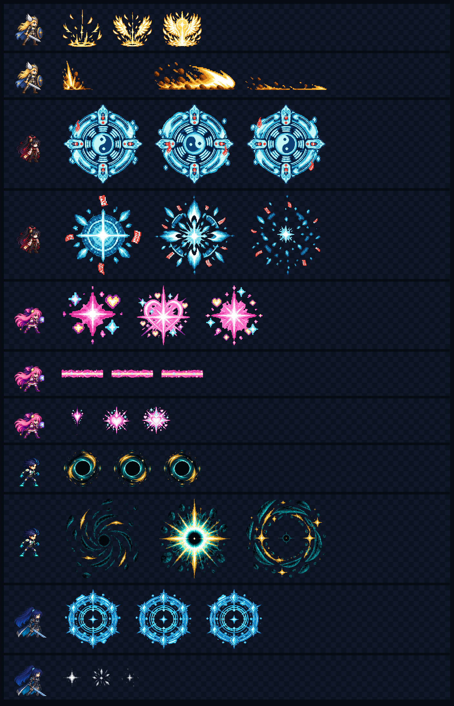

# CODEX-ART-10 결과 보고

## 완료

다섯 전투원의 궁극기용 필수 VFX 11종(70프레임)과 선택 항목인 궁극기 컷인 밴드 1종을 제작했습니다. 생성 원본은 내장 이미지 생성 도구로 만들고, 최종 스트립은 Godot 4.7 `Image` API로 분할·정렬·알파 정리·최근접 축소·팔레트 양자화했습니다. 제품 소스와 기존 테스트는 수정하지 않았습니다.

## 파일 표

| 파일 | 전체 크기 | 프레임 | 프레임 크기 | FPS | 앵커 | Additive |
|---|---:|---:|---:|---:|---|---|
| `frey_ult_charge.png` | 768x128 | 6 | 128x128 | 24 | 발 중앙 (64,124) | 예 |
| `frey_ult_wave.png` | 2048x96 | 8 | 256x96 | 30 | 좌하단 (0,96) | 예 |
| `yuki_ult_seal.png` | 2048x256 | 8 | 256x256 | 12 | 중앙 (128,128) | 아니오 |
| `yuki_ult_burst.png` | 1536x256 | 6 | 256x256 | 30 | 중앙 (128,128) | 예 |
| `luna_ult_transform.png` | 1536x192 | 8 | 192x192 | 24 | 가슴 중앙 (96,96) | 예 |
| `luna_ult_laser.png` | 512x96 | 4 | 128x96 | 24 | 좌중앙 (0,48) | 예 |
| `luna_ult_laser_head.png` | 384x96 | 4 | 96x96 | 24 | 중앙 (48,48) | 예 |
| `nova_ult_core.png` | 768x128 | 6 | 128x128 | 18 | 중앙 (64,64) | 아니오 |
| `nova_ult_burst.png` | 2048x256 | 8 | 256x256 | 48 | 중앙 (128,128) | 아니오 |
| `rio_ult_circle.png` | 1152x192 | 6 | 192x192 | 18 | 중앙 (96,96) | 예 |
| `rio_ult_impact.png` | 384x64 | 6 | 64x64 | 36 | 중앙 (32,32) | 예 |
| `ult_cutin_band.png` | 640x112 | 1 | 640x112 | - | 중앙 (320,56) | 예 |

## 시각적 확인

위 이미지는 각 VFX의 시작·중간·마지막 프레임을 해당 전투원의 128px 셀 스프라이트 옆에 1x 크기로 배치한 접촉 시트입니다. 위에서 아래 순서는 프레이 충전/파동, 유키 봉인/폭발, 루나 변신/레이저/레이저 헤드, 노바 코어/폭발, 리오 원형진/충돌입니다.

## 확인 및 테스트

- Godot 빌드 스크립트: PASS, 필수 11종과 선택 컷인 1종 생성.
- Godot 검증 스크립트: PASS, 필수 11종 70프레임 모두 정확한 전체/프레임 크기와 RGBA8 형식 확인.
- 투명 여백: 레이저를 제외한 모든 필수 프레임에서 좌·상·우·하 최소 3px 확인. 레이저는 타일 연결을 위해 좌우 0px, 상하 35px 이상이며 좌우 끝 픽셀이 동일함을 자동 검증.
- 최소 여백 측정값(L/T/R/B): 프레이 충전 4/8/4/4, 프레이 파동 3/3/3/3, 유키 봉인 5/5/5/5, 유키 폭발 5/5/5/5, 루나 변신 4/4/4/4, 루나 헤드 4/4/4/4, 노바 코어 4/5/4/5, 노바 폭발 5/5/5/5, 리오 원형진 9/4/10/4, 리오 충돌 4/4/4/4.
- 알려진 샌드박스 잡음인 `Failed to read the root certificate store` 외에 `SCRIPT ERROR`, `Parse Error`, 일반 `ERROR`는 최종 빌드/검증에서 발생하지 않았습니다.

## 눈으로 판단한 내용

- 캐릭터별 팔레트는 기존 시트와 즉시 구분됩니다: 프레이 금빛, 유키 얼음빛+붉은 부적, 루나 분홍+청록 별빛, 노바 청록+금빛, 리오 청색/무채색 틴트 소스.
- 프레이 날개는 6프레임 동안 펼쳐지고 파동은 오른쪽으로 이동하며 감쇠합니다.
- 유키 봉인은 8프레임에서 중앙 음양과 외곽 부적 위치 변화가 읽히고, 폭발은 확장 후 파편으로 수축합니다.
- 루나 레이저 세그먼트의 연결부는 눈에 띄는 단차가 없고, 헤드 실루엣은 작은 크기에서도 하트로 읽힙니다.
- 노바 폭발은 압축 소용돌이→백색 고리→잔류 링의 순서가 뚜렷하고, 리오 원형진의 여섯 소켓은 궤도 검 수와 대응합니다.

## 리드 통합 메모

- 제품 코드 연결은 범위 밖이므로 하지 않았습니다. `assets/art/vfx/README.md`의 FPS·앵커·블렌딩 표를 사용해 현재 사각형/선/폴리곤 표시를 Sprite2D 또는 AnimatedSprite2D로 교체하면 됩니다.
- 유키 봉인은 실제 반경 205px(지름 약 410px)에 nearest로 확대합니다.
- 루나 레이저는 128px 세그먼트를 반복하고 끝에 96px 헤드를 배치합니다. 세그먼트와 헤드의 중앙 Y는 동일합니다.
- 노바 코어/폭발은 검은 중심 때문에 normal alpha가 기본입니다. 광량이 부족하면 같은 텍스처의 밝은 링 패스를 additive로 한 번 더 겹칩니다.
- 리오 충돌은 각 검 색으로 modulate합니다.

## 사람이 반드시 판단할 부분

- 실제 페인트 배경 위 additive 광량과 흰 코어의 과노출 여부.
- 유키 봉인을 410px로 키웠을 때 문양이 지나치게 조밀하지 않은지.
- 프레이 파동 256px 길이가 실제 좌우 충격 판정과 맞는지.
- 루나 560px 레이저에 128px 세그먼트를 반복했을 때 반복 무늬가 거슬리지 않는지.
- 노바 검은 코어가 니플하임 등 어두운 렐름에서 충분히 구분되는지.
- 리오 원형진이 캐릭터 발밑 평면으로 보이도록 Y 스케일을 줄일지(예: 0.45~0.6).

## 미수행 / 남은 작업

- 제품 소스 연결 및 실제 전투 중 윈도우 캡처는 카드 범위 밖이라 수행하지 않았습니다.
- 애니메이션 GIF/MP4는 만들지 않았습니다. 대신 모든 프레임과 캐릭터 스케일을 한 번에 비교할 수 있는 접촉 시트와 재생성/검증 스크립트를 제공합니다.
- 선택 산출물 `ult_cutin_band.png`까지 완료했으므로 미완성 아트 파일은 없습니다.
