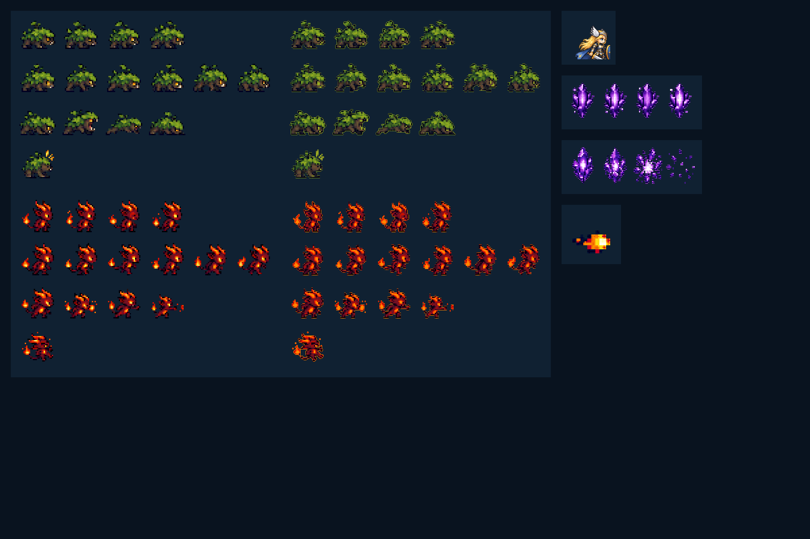

# CODEX-ART-11 결과 보고 — 몬스터 / 불덩이 / 소울 크리스탈 1x화

## 완료

기존 승인 디자인과 애니메이션 포즈를 유지하면서 몬스터 2종, 불덩이, 소울 크리스탈 2종을 새 1x 규격으로 교체했다. 출력은 1 화면 픽셀 = 1 아트 픽셀 기준이며, 셀별 Lanczos 재구성 뒤 기존 팔레트로 다시 양자화하고 알파 경계를 정리했다.

이미지 생성 도구의 built-in 모드로 모슬링, 엠버 임프, 크리스탈/파편/불덩이 원화를 새로 생성해 확대 육안 기준으로 삼았다. 생성기가 투명 배경 대신 어두운 그라데이션을 남긴 결과는 게임 파일에 직접 넣지 않았고, 승인된 기존 실루엣과 포즈를 보존하는 쪽을 우선했다. 생성 원화는 `generated_*_source.png`로 이 보고서 폴더에 보관했다.

## 변경된 게임 아트

| 파일 | 새 크기 | 셀 / 프레임 | 애니메이션 구성 |
| --- | ---: | --- | --- |
| `assets/art/monsters/mossling_sheet.png` | 576x384 | 96x96, 6x4 | idle 4 / walk 6 / attack 4 / hurt 1 |
| `assets/art/monsters/ember_imp_sheet.png` | 576x384 | 96x96, 6x4 | idle 4 / walk 6 / throw 4 / hurt 1 |
| `assets/art/monsters/ember_fireball.png` | 36x36 | 1 프레임 | 오른쪽 비행 |
| `assets/art/objects/soul_crystal.png` | 288x96 | 72x96, 4 프레임 | shimmer 4 |
| `assets/art/objects/soul_crystal_shatter.png` | 288x96 | 72x96, 4 프레임 | shatter 4 |

## 시각적 비교

왼쪽 열은 기존 64px 몬스터 시트를 1.5배 nearest-neighbor로 확대한 화면 크기 비교본이고, 가운데 열은 새 96px 1x 시트다. 오른쪽 위는 동일한 화면 픽셀 밀도의 Frey v2 기준 프레임이며, 그 아래는 새 크리스탈·파편·불덩이다. 배경 패널은 투명 경계 확인용이다.

## 측정 결과

`tests/art_preview/monsters_v2_b/audit_assets.gd`로 PNG 원본을 직접 측정했다.

| 대상 | 발/바닥 기준 | 중심 | 프레임 최소 여백 | 16px 이상 직선 절단선 |
| --- | --- | --- | ---: | --- |
| 모슬링 15프레임 | 마지막 불투명 픽셀 y=72 | bbox 중심 x=48 | 7px | 없음 |
| 엠버 임프 15프레임 | 마지막 불투명 픽셀 y=72 | bbox 중심 x=47.5~48 | 4px | 없음 |
| 불덩이 1프레임 | 해당 없음 | x=18 | 4px | 없음 |
| 소울 크리스탈 4프레임 | 마지막 불투명 픽셀 y=84 | x=35.5 | 4px | 없음 |
| 소울 크리스탈 파괴 4프레임 | 마지막 불투명 픽셀 y=84 | x=35.5 | 4px | 없음 |

모든 PNG의 실제 크기, 사용 프레임 수, 최소 4px 투명 여백, 셀 경계의 긴 직선 절단 여부가 통과했다. 빈 슬롯은 계약대로 투명하게 유지했다.

## 확대 육안 판단

- 모슬링은 낮은 멧돼지형 나무 몸통, 겹잎, 새싹, 호박색 눈과 엄니가 유지된다. 걷기와 물기 공격의 무게 중심 변화도 구분된다.
- 엠버 임프는 화염 뿔·꼬리 불꽃·가슴 코어가 유지되며, 공격 행은 불덩이 모으기에서 방출까지 오른쪽 방향으로 읽힌다.
- 크리스탈은 보라색 면 분할과 흰 중심광이 유지되고, 파괴 행은 균열 → 큰 파편 → 분산 순서가 읽힌다.
- 새 시트는 기존 1.5x 확대보다 1px 윤곽 계단과 작은 하이라이트가 더 촘촘하다. 다만 모슬링의 잎 가장자리와 임프의 주황 외곽 하이라이트가 실제 다채로운 렐름 배경에서도 과하지 않은지는 사람이 게임 화면에서 판단해야 한다.

## 생성 원화 프롬프트 세트

built-in image generation을 사용했다.

1. 모슬링: 승인 모슬링의 몸통·겹잎·새싹·눈·엄니를 보존하고, v2 파이터의 1px 밀도와 제한 팔레트로 idle 4 / walk 6 / attack 4 / hurt 1을 투명 4행 시트로 생성.
2. 엠버 임프: 승인 임프의 화염 뿔·꼬리·가슴 코어를 보존하고, idle 4 / walk 6 / fireball throw 4 / hurt 1을 오른쪽 방향 투명 4행 시트로 생성.
3. 오브젝트: 보라색 소울 크리스탈 shimmer 4, shatter 4, 오른쪽 비행 불덩이 1개를 v2 파이터와 같은 1px 밀도·제한 팔레트로 생성.

공통 금지 조건은 텍스트, 격자, 그림자, 배경, 블러, 안티앨리어싱, 잘린 가장자리, 워터마크였다.

## 확인 및 테스트

- Godot 4.7로 `build_assets.gd` 실행: 5개 PNG 생성 성공.
- Godot 4.7로 `audit_assets.gd` 실행: `AUDIT_RESULT failures=0`.
- `SCRIPT ERROR`, `Parse Error` 및 작업 관련 `ERROR` 없음.
- 샌드박스의 알려진 `Failed to read the root certificate store` 한 줄은 별도 환경 노이즈로만 발생했다.
- 확대된 `preview.png`와 개별 파괴 시트를 직접 열어 실루엣, 프레임 순서, 파편 분리 상태를 확인했다.

## 리드 통합 메모

- 경로와 행/열 배치는 유지했지만 셀은 64x64 → 96x96, 크리스탈은 48x64 → 72x96, 불덩이는 24x24 → 36x36으로 바뀌었다.
- 런타임이 이전 아트를 1.5배 확대하고 있다면 이 자산들만 스케일 1.0으로 전환해야 같은 화면 크기가 된다.
- 몬스터 스프라이트는 `hframes=6`, `vframes=4`; 크리스탈은 `hframes=4`, `vframes=1` 계약을 그대로 사용한다.
- 제품 소스, 씬, 기존 테스트는 수정하지 않았다.

## 사람이 최종 판단할 항목

1. 실제 렐름 배경에서 모슬링의 녹색 외곽과 임프의 주황 하이라이트가 충분히 분리되는지.
2. 60fps 재생 시 walk 6프레임과 throw/attack 4프레임의 박자가 자연스러운지.
3. 불덩이가 전투 중 36px 실루엣으로 충분히 빠르게 인지되는지.
4. 크리스탈 파괴 3~4프레임의 작은 파편이 과밀한 전투 화면에서 노이즈로 보이지 않는지.

## 남은 작업

이 유닛의 카드 범위 안 납품물과 기계 검증은 완료했다. 실제 게임 씬의 1.0 스케일 전환과 플레이 중 대비/타이밍 평가는 제품 소스를 소유한 리드가 통합 단계에서 진행해야 한다.
