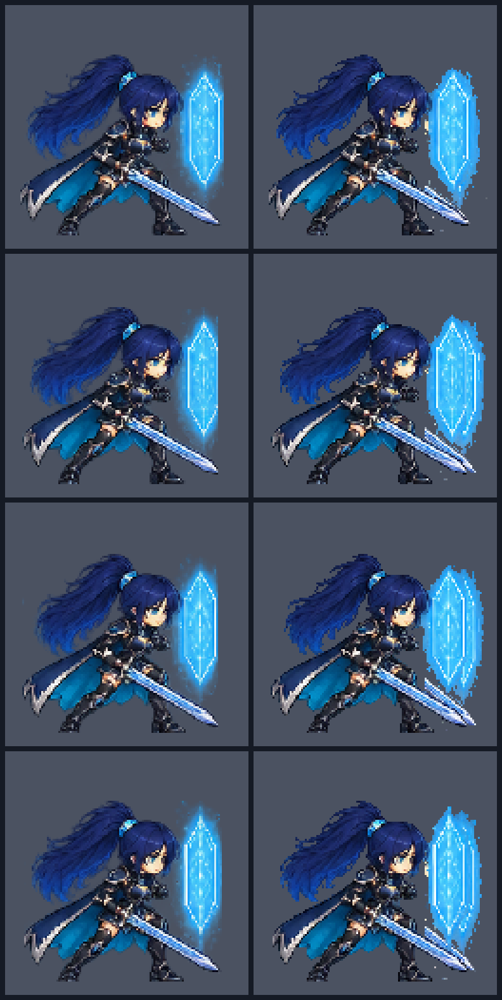
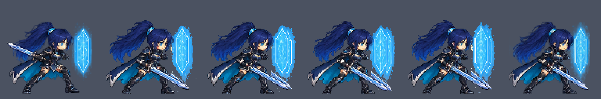

# CODEX-ART-12 결과

## 완료

시간 제한 내에서 가장 먼저 지정된 Rio 여성 방패 4프레임(`r5c1`~`r5c4`)을 완료했다. 나머지 7프레임은 겹친 포즈를 안전하게 분리하지 못해 시작 시트의 픽셀로 되돌렸으며, 불완전한 시도는 결과 시트에 남기지 않았다.

## 변경된 프레임

| 프레임 | 측정한 사실 | 눈으로 판정한 내용 | 적용 방식 |
|---|---|---|---|
| Rio female `r5c1` | 원본 창 `x=330..411`, `y=986..1165`; 기존 방패 마스크 `25x86` | 다음 포즈의 짙은 남색 머리카락과 수정 방패가 접촉 | 청록/흰 룬 팔레트만 수동 마스크로 분리하고, 몸체는 그대로 둔 채 투명 픽셀에만 완전한 방패를 합성 |
| Rio female `r5c2` | 원본 창 `x=520..601`, `y=986..1165`; 기존 방패 마스크 `22x87` | 오른쪽 수직 절단이 가장 뚜렷함 | 같은 방식으로 복원하고 효과 폭만 4px 여백 안으로 축소 |
| Rio female `r5c3` | 원본 창 `x=710..791`, `y=986..1165`; 기존 방패 마스크 `22x87` | 다음 포즈의 머리/검을 가져오지 않아야 함 | 어두운 머리 색은 제외하고 수정/룬 픽셀만 합성 |
| Rio female `r5c4` | 원본 창 `x=900..981`, `y=986..1165`; 기존 방패 마스크 `24x91` | 방패 오른쪽 광채가 잘린 상태 | 광채를 포함한 방패를 복원하고 몸체·검 위치는 유지 |

4프레임 모두 최종 알파를 0/255로 정리했다. 넓은 방패 효과만 가로로 좁혔고 캐릭터 몸체의 크기와 위치는 변경하지 않았다.

## 시각적 확인

각 줄의 왼쪽은 시작 프레임, 오른쪽은 수정 프레임이다. 잘렸던 오른쪽 수정 방패가 복원됐고 몸체와 검은 기존 위치를 유지한다.

수정 후 방패 행 전체를 2배로 확대한 모습이다. 앞뒤 포즈와 비교해 몸체 높이와 발 위치가 유지된다.

## 확인 및 테스트

- 전용 검증: `VERIFY PASS changed_frames=4 unchanged_cells=122 changed_pixels=30661`
- 세 대상 시트의 126개 셀을 시작 사본과 직접 비교했고, 허용한 4셀만 달라졌다.
- Git 차이는 `rio_female_sheet.png` 한 장뿐이다. 따라서 수정하지 않은 7개 대상 프레임과 나머지 캐릭터 시트 파일은 시작 상태와 동일하다. 전체 184개 사용 프레임 기준으로 이번에 수정하지 않은 180프레임은 픽셀 동일하다.
- lead `frame_audit.gd`: Rio 방패 `r5c1`~`r5c4`는 모두 플래그에서 사라졌다. Rio 공격 3개, Frey 공격 2개, Nova 여성 공격 2개는 미완료 상태로 기존 플래그가 남아 있다.
- Godot 실행 때 나온 루트 인증서 저장소 오류는 카드에 명시된 샌드박스 잡음뿐이며, 다른 `ERROR`, `SCRIPT ERROR`, `Parse Error`는 없었다.

## 미완료 프레임

- Rio female attack: `r4c0`, `r4c1`, `r4c2`
- Frey attack: `r4c2`, `r4c3`
- Nova female attack: `r4c1`, `r4c2`

이 7개는 원본에서 이웃 포즈와 몸체/효과가 맞닿아 첫 분리 시 이웃 조각이 섞였다. 품질 기준에 맞지 않아 모두 시작 픽셀로 복원했다.

## 사람이 판단할 부분

- 방패 광채를 셀 안에 넣기 위해 효과 폭만 줄인 정도가 연속 재생에서 자연스러운지 확인해야 한다.
- 이진 알파로 정리한 4프레임의 외곽이 같은 행의 `r5c0`, `r5c5`보다 약간 또렷해 보이는지 확인해야 한다.
- 미완료 7프레임은 몸체와 효과를 별도 레이어처럼 분리하는 추가 수동 마스크 작업이 필요하다.

