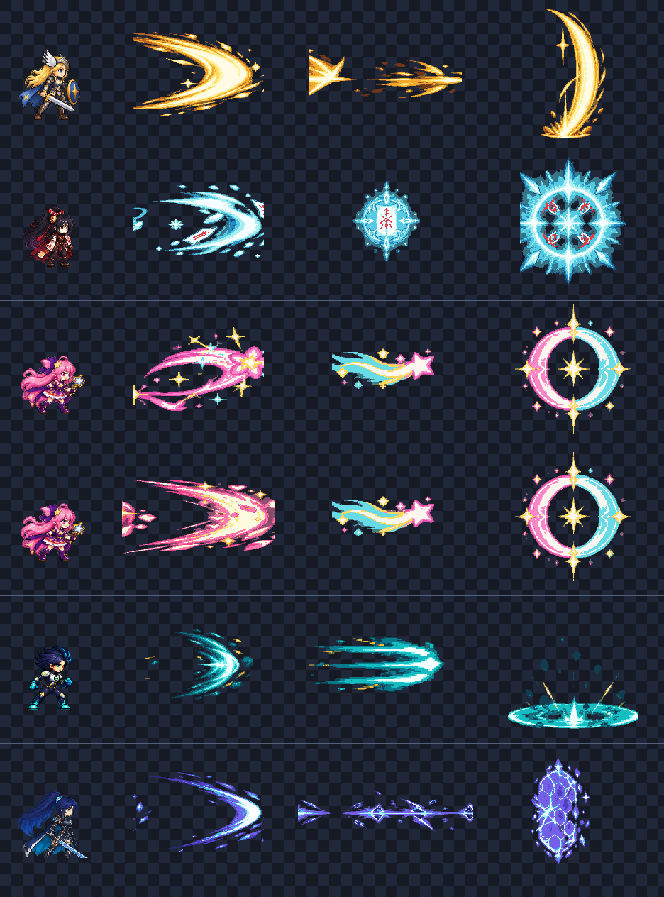

# CODEX-ART-13 결과 보고

## 완료

기본 공격 및 K/L 기술용 6프레임 VFX 스트립 16개를 제작했다. 생성형 이미지 원화를 Godot 4.7 `Image` API로 후처리해 1x 제한 팔레트 픽셀 아트로 만들었으며, 제품 코드·캐릭터 코드·씬·기존 테스트는 수정하지 않았다.

## 제작 파일

| 캐릭터 | 파일 | 프레임 크기 | 전체 PNG 크기 | 시각 역할 |
|---|---|---:|---:|---|
| Frey | `frey_slash.png` | 192x128 | 1152x128 | 금백색 검호 |
| Frey | `frey_k.png` | 224x96 | 1344x96 | 돌진 속도선·칼날 섬광 |
| Frey | `frey_l.png` | 128x192 | 768x192 | 아래에서 위로 솟는 베기 |
| Yuki | `yuki_slash.png` | 192x128 | 1152x128 | 설풍·종이부적 휩쓸기 |
| Yuki | `yuki_k.png` | 128x128 | 768x128 | 봉인부가 닫히는 결계 |
| Yuki | `yuki_l.png` | 192x192 | 1152x192 | 부적 4장과 빙결 폭발 고리 |
| Luna | `luna_slash.png` | 192x128 | 1152x128 | 별지팡이 분홍 리본 궤적 |
| Luna | `luna_k.png` | 160x96 | 960x96 | 별혜성 발사 섬광 |
| Luna | `luna_l.png` | 192x192 | 1152x192 | 분홍·청록 반원이 닫히는 달 고리 |
| Brave Luna | `luna_brave_slash.png` | 224x128 | 1344x128 | 분홍·금색 중량 돌진호 |
| Nova | `nova_slash.png` | 160x128 | 960x128 | 청록 중력 타격호 |
| Nova | `nova_k.png` | 224x96 | 1344x96 | 오른쪽 Vector Shift 잔상 |
| Nova | `nova_l.png` | 192x192 | 1152x192 | 측면 지면 타원형 중력 충격 |
| Rio | `rio_slash.png` | 192x128 | 1152x128 | 청자색 마력검호 |
| Rio | `rio_k.png` | 256x96 | 1536x96 | 얇은 차원 절단선과 균열 |
| Rio | `rio_l.png` | 128x160 | 768x160 | 육각 룬 방패의 조립·파열 |

모든 스트립은 6프레임, 오른쪽 기준, one-shot이다. FPS, 앵커, additive 여부는 `assets/art/attack_vfx/README.md`에 정리했다.

## 시각적 확인



위 접촉 시트는 각 캐릭터의 v2 128px 셀과 slash/K/L 최대 프레임을 동일한 1x 비율로 비교한다. 행 순서는 Frey, Yuki, Luna, Brave Luna, Nova, Rio이며, 열은 캐릭터 / slash / K / L이다. `inspection_4x.png`는 같은 시트를 nearest 4배로 확대한 눈검사용 이미지다.

## 측정 결과

- 파일 16개, 프레임 96개를 로드했다.
- 모든 PNG가 RGBA8이며 `전체 폭 = 프레임 폭 x 6`이다.
- 모든 프레임의 불투명 픽셀 경계가 상·하·좌·우 최소 4px 안쪽에 있어 카드의 최소 3px 투명 여백을 충족한다.
- 비투명 RGB는 파일당 6색 이하(15개 6색, `rio_l` 5색), 비투명 알파는 파일당 2단계로 측정됐다.
- 최대 프레임의 실제 불투명 폭: slash 152~216px, 가로 K 152~248px, 세로/원형 L 높이 149~182px.
- 앵커: slash와 가로 K는 `(0, height/2)`, 중심형은 프레임 중앙, Frey L과 Nova L은 하단 중앙, Rio L은 왼쪽 중앙이다.

이 항목은 `verify_attack_vfx.gd`가 실제 PNG 픽셀 경계를 측정한 결과다.

## 눈으로 판단한 결과

- Frey는 금백색의 무거운 검, Yuki는 청백색 설풍과 붉은 부적, Luna는 분홍·청록·금색 별빛, Nova는 청록 중력과 금색 고속점, Rio는 청자색 균열로 구분된다.
- 여섯 프레임에서 준비/성장 → 최대 타격 → 파편 소멸 순서가 읽힌다.
- 생성 원화에서 왼쪽을 보던 `nova_k`는 후처리 단계에서 수평 반전해 모든 납품 스트립을 오른쪽 기준으로 통일했다.
- `rio_k` 원화에 섞였던 보라색 배경은 밝기 경계 추출로 제거하고 절단선과 균열 파편만 남겼다.
- 1x 비교에서 기본 캐릭터보다 공격 실루엣이 충분히 크게 보이지만, 본체를 완전히 가리지 않도록 내부 음영과 빈 공간을 유지했다.

## 생성 및 후처리

- 이미지 생성: 내장 이미지 생성 도구, 실제 알파 투명 배경 요청.
- 공통 프롬프트: `2D pixel-art platform-brawler VFX`, `exactly six equal frames left-to-right`, `facing right`, `limited palette`, `bright core`, `effect only`, `no character/text/grid/watermark`, `genuine alpha transparency`.
- 개별 프롬프트는 카드의 16개 설명을 그대로 주제로 사용했다: Frey 금백색 검호/돌진/상승 베기, Yuki 설풍 부적/봉인/빙결 고리, Luna 별지팡이/혜성/달 고리/Brave 중량호, Nova 중력 타격/벡터 잔상/지면 타원, Rio 마력검/차원선/육각 룬 방패.
- 원화: `source/*_source.png` 16개. 납품 파일은 원화를 직접 쓰지 않고 Godot 빌더로 6등분, 배경 제거, nearest 축소, 6색 팔레트화, 공통 배율, 앵커 정렬을 거쳤다.

## 확인 및 테스트

아래 두 명령을 실행했고 최종 실행에서 `ATTACK_VFX_BUILD_OK count=16`, `ATTACK_VFX_VERIFY_OK files=16 frames=96`을 확인했다.

```powershell
& 'C:/Users/TH/Downloads/Godot_v4.7-stable_win64.exe/Godot_v4.7-stable_win64_console.exe' --headless --path . -s tests/art_preview/attack_vfx_a/build_attack_vfx.gd
& 'C:/Users/TH/Downloads/Godot_v4.7-stable_win64.exe/Godot_v4.7-stable_win64_console.exe' --headless --path . -s tests/art_preview/attack_vfx_a/verify_attack_vfx.gd
```

Godot가 출력한 `Failed to read the root certificate store` 한 줄은 카드에 명시된 샌드박스 소음이다. 빌더의 `Image.load_from_file` export 경고는 에디터/테스트용 재생성 스크립트가 원본 PNG를 직접 읽기 때문에 발생하며 납품 PNG에는 영향을 주지 않는다. 그 외 최종 실행의 parse/script 오류는 없다.

추가로 `tests/run_all.ps1`도 실행했다. 테스트 본문은 architecture, Frey sprite, hazards, soul crystals, art, sprite frames, restart 등에서 통과 문구를 출력했지만 전체 러너 결과는 실패였다. 원인은 (1) 카드에 명시된 인증서 저장소 오류를 러너가 각 프로세스 실패로 집계한 것, (2) 이 클론의 기존 `.godot/imported/`에 `frey_ult_charge`, `luna_ult_laser`, `nova_ult_core`, `rio_ult_*`, `yuki_ult_seal`용 `.ctex`가 없어 궁극기 리소스 로딩이 실패한 것이다. 새 `attack_vfx`는 아직 제품 코드에서 참조되지 않아 이 실패 경로에 등장하지 않았다. 허용 경로 밖 import 캐시는 수정하거나 재생성하지 않았다.

`commit.ps1`은 PowerShell 파서 구문 검사를 통과했다. 현재 샌드박스에서 `.git`은 쓰기 허용 경로가 아니므로 실제 stage/commit은 수행하지 않았다.

## 리드 통합 메모

1. 각 AnimatedSprite2D에 텍스처를 넣고 `hframes = 6`으로 one-shot 재생한다.
2. 캐릭터 위치에 README의 앵커를 맞춘다. 왼쪽은 미러링하고 위/아래 기본 공격은 몸 앵커를 회전 중심으로 사용한다.
3. 공격 액티브 프레임이 짧은 J는 30~36 FPS, 설치/방패/고리는 18~24 FPS부터 맞춘다.
4. 노바 K는 시각 잔상만 사용하고 공격 판정과 연결하지 않는다.
5. 실제 공격 사각형은 이펙트로 교체하거나 숨기고, 디버그 표시에서만 남긴다.

## 사람이 판단해야 할 것

- 리드가 두 배로 확장 중인 실제 히트박스와 최대 프레임의 끝점이 맞는지
- 8명 전투에서 additive 이펙트 2~3개가 겹칠 때 과포화·화면 가림이 없는지
- 실제 카메라 줌에서 Yuki 부적의 붉은 표식과 Rio 절단선이 너무 얇지 않은지
- 기술 선딜/액티브/후딜과 6프레임 재생 시점이 맞는지
- 캐릭터 본체보다 이펙트가 지나치게 앞에 그려지는 경우 z-index를 기술별로 조정할지

## 남은 작업 / 수행하지 못한 것

카드가 제품 소스 수정을 금지했고 리드가 전투 코드를 동시에 변경 중이므로, 실제 전투에 연결하거나 윈도우 실행 화면을 캡처하지 않았다. 따라서 현재 결과는 PNG 규격·투명 여백·1x 상대 크기까지 검증되었고, 실전 히트박스 정합과 다인전 가독성은 리드 통합 후 사람이 확인해야 한다.
