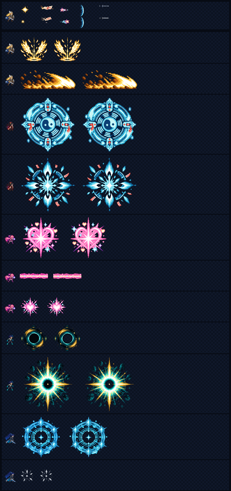

# CODEX-ART-14 결과 보고

## 완료

2배 전투 스케일에서 저해상도 원화가 확대되어 보이던 효과 16종을 실제 표시 크기의 1x 픽셀 밀도로 교체했다. 소형 효과 5종은 새 ImageGen 원화와 개별 고해상도 원화를 사용했고, 궁극기 11종은 보존된 고해상도 ImageGen 원본에서 다시 추출했다. 완성된 저해상도 PNG를 최근접 2배 확대하는 방식은 사용하지 않았다.

제품 소스, 캐릭터 스크립트, 장면, `project.godot`, 기존 테스트는 수정하지 않았다.

## 변경된 파일

### 일반 효과

| 파일 | 전체 크기 | 프레임 | 프레임 크기 | 앵커 |
|---|---:|---:|---:|---:|
| `effects/hit_spark.png` | 384×96 | 4 | 96×96 | (48,48) 중앙 |
| `effects/luna_star.png` | 96×96 | 1 | 96×96 | (48,48) 중앙 |
| `effects/yuki_talisman.png` | 128×64 | 1 | 128×64 | (64,32) 중앙 |
| `effects/rio_gem_sword.png` | 96×32 | 1 | 96×32 | (48,16) 중앙 |
| `effects/rio_mana_wave.png` | 48×112 | 1 | 48×112 | (24,56) 중앙 |

### 궁극기 VFX

| 파일 | 전체 크기 | 프레임 | 프레임 크기 | 앵커 | FPS | 블렌드 |
|---|---:|---:|---:|---:|---:|---|
| `vfx/frey_ult_charge.png` | 1536×256 | 6 | 256×256 | (128,248) 발 중앙 | 24 | Additive |
| `vfx/frey_ult_wave.png` | 4096×192 | 8 | 512×192 | (0,192) 좌하단 | 30 | Additive |
| `vfx/yuki_ult_seal.png` | 4096×512 | 8 | 512×512 | (256,256) 중앙 | 12 | Normal |
| `vfx/yuki_ult_burst.png` | 3072×512 | 6 | 512×512 | (256,256) 중앙 | 30 | Additive |
| `vfx/luna_ult_transform.png` | 3072×384 | 8 | 384×384 | (192,192) 중앙 | 24 | Additive |
| `vfx/luna_ult_laser.png` | 1024×192 | 4 | 256×192 | (0,96) 좌중앙 | 24 | Additive |
| `vfx/luna_ult_laser_head.png` | 768×192 | 4 | 192×192 | (96,96) 중앙 | 24 | Additive |
| `vfx/nova_ult_core.png` | 1536×256 | 6 | 256×256 | (128,128) 중앙 | 18 | Normal |
| `vfx/nova_ult_burst.png` | 4096×512 | 8 | 512×512 | (256,256) 중앙 | 48 | Normal |
| `vfx/rio_ult_circle.png` | 2304×384 | 6 | 384×384 | (192,192) 중앙 | 18 | Additive |
| `vfx/rio_ult_impact.png` | 768×128 | 6 | 128×128 | (64,64) 중앙 | 36 | Additive |

궁극기 70프레임과 일반 효과 8프레임, 합계 78프레임이다. `ult_cutin_band.png`와 `nova_gravity_orb.png`는 카드 범위 밖이므로 변경하지 않았다.

## 제작 방식

- 내장 ImageGen으로 투명 배경의 새 원화 2장을 생성했다: 4프레임 흰색·금색 피격 스파크 스트립, 유키 부적·루나 별·리오 검기·리오 보석검 2×2 원화.
- 리오 검기와 보석검은 새 복합 원화의 주변 발광이 실루엣을 지나치게 축소시키는 것을 육안으로 확인해, 기존 개별 고해상도 ImageGen 원본에서 목표 크기로 다시 추출했다.
- 궁극기는 `*_source.png` 고해상도 생성 원본에서 직접 다시 잘랐다. 기존 게임용 PNG를 확대하지 않았다.
- `tests/art_preview/fx_1x_b/build_fx.gd`에서 Godot `Image` API만 사용해 알파 정리, 크롭, 최근접 최종 샘플링, 제한 팔레트 양자화, 프레임 정렬, 레이저 타일 접합을 수행했다.
- 새 소형 효과 공통 프롬프트는 투명 배경, 손으로 군집화한 선명한 픽셀, 제한 팔레트, 오른쪽 진행, 8인 난전에서 읽히는 실루엣, 텍스트·로고·워터마크 금지였다.

## 시각적 확인



맨 위 일반 효과 행은 각 항목의 기존 확대본이 위, 새 1x 원화가 아래다. 이어지는 궁극기 각 행은 128px v2 전투원 프레임 옆에 기존 중간 프레임 확대본(왼쪽)과 새 중간 프레임(오른쪽)을 같은 화면 크기로 배치했다. 새 원화는 실루엣과 타이밍을 유지하면서 가장자리 계단과 내부 하이라이트의 픽셀 밀도가 높다.

## 측정 결과

- 모든 파일은 요구된 전체 크기, 프레임 수, 프레임 크기와 RGBA8 형식이다.
- 모든 픽셀의 알파는 0 또는 1이다.
- 레이저 외 최소 여백 실측 최솟값은 3px 이상이다. 일반 효과는 스파크 6/6/6/6, 별 5/25/5/25, 부적 17/4/17/5, 보석검 4/4/5/4, 검기 6/4/6/4(L/T/R/B)다.
- 궁극기 최소 여백은 프레이 충전 8/16/8/8, 파동 6/6/6/6, 유키 봉인·폭발 10/10/10/10, 루나 변신·헤드 8/8/8/8, 노바 코어 8/10/8/10, 노바 폭발 10/10/10/10, 리오 원형진 19/8/19/8, 충돌 8/8/8/8이다.
- 루나 레이저는 좌우 여백 0, 상하 71px이며 각 프레임의 좌우 끝 픽셀이 정확히 같다.
- 제한 팔레트의 실제 불투명 색 수는 자산당 6~10색이다.

## 눈으로 판단한 결과

- 스파크는 접촉광→최대 폭발→분리 광선→잔광의 순서와 중심 고정이 읽힌다.
- 유키 부적과 루나 별은 새 내부 문양이 추가됐지만 난전용 실루엣은 이전보다 굵고 분명하다.
- 리오 검기는 세로 초승달, 보석검은 오른쪽 진행과 무채색 틴트 소스가 유지된다.
- 프레이·루나·노바·리오 궁극기는 기존 연출과 색 정체성이 유지되면서 2×2 블록처럼 보이던 가장자리 계단이 줄었다.
- 유키 봉인·폭발은 청록·흰색·주홍 팔레트를 유지하며 중앙 음양, 외곽 부적, 폭발 꽃잎 진행이 보존됐다.

## 확인 및 테스트

```text
[fx-1x-build] PASS effects=5 vfx=11 frames=70
[fx-1x-verify] PASS assets=16 frames=78 rgba8=binary-alpha margins=PASS
```

최종 빌드와 검증에서 `SCRIPT ERROR`, `Parse Error`, 일반 오류는 없었다. 출력된 `Failed to read the root certificate store` 1건씩은 카드에 명시된 Codex 샌드박스 잡음이다. `Image.load_from_file`의 export 관련 경고는 에디터/검사용 스크립트에서만 발생하며 게임 런타임 코드는 아니다.

## 리드 통합 메모

- `scripts/Vfx.gd`의 11개 앵커를 새 README 표처럼 정확히 2배로 바꿔야 한다. 프레임 수와 FPS는 그대로 유지한다.
- 궁극기 VFX 호출부의 기존 표시 스케일을 0.5배로 보정하면 화면 점유 크기가 유지된다. 유키의 반경 기반 식은 분모 `256.0`을 `512.0`으로, 노바의 반경 기반 식도 같은 원칙으로 바꾸는 방식이 안전하다.
- 유키 부적과 루나 별은 기존 4x 표시를 1x로, 리오 검기와 보석검은 기존 2x 표시를 1x로 낮춰야 한다. 스파크는 96×96 프레임으로 자르고 기존 효과별 배율을 절반으로 낮춘다.
- 물리 히트박스, 피해량, 수명, 속도는 변경하지 않는다. 왼쪽 진행 시 기존처럼 수평 반전한다.
- `rio_gem_sword.png`와 `rio_ult_impact.png`의 런타임 색 틴트를 유지한다. 노바 코어/폭발은 검은 중심 때문에 normal alpha를 유지한다.
- 레이저 타일은 256px 단위, 헤드는 192px 프레임으로 갱신한다.

## 사람이 반드시 판단할 부분

- 실제 렐름 배경 위에서 additive 흰 코어가 과노출되지 않는지.
- 8인 난전에서 새 부적 문양과 별 꼬리가 정보량을 늘리지 않고 투사체 방향을 더 잘 보여주는지.
- 유키 512px 봉인의 문양 밀도와 경고 가독성이 적절한지.
- 루나 256px 레이저 타일의 반복 무늬와 192px 헤드 연결이 실제 길이에서 자연스러운지.
- 노바 검은 중심이 니플하임 같은 어두운 배경에서도 분리되는지.
- 리오 원형진이 실제 캐릭터 발밑에서 바닥 평면처럼 읽히는지.

## 미수행 / 남은 작업

- 제품 소스 연결과 실제 전투 실행 캡처는 카드의 쓰기 금지 범위라 수행하지 않았다.
- 애니메이션 전체 재생 속도와 additive/normal 합성의 최종 체감은 리드 통합 후 사람의 전투 플레이 검수가 필요하다.
- 샌드박스에서 `.git/index.lock` 생성 권한이 없어 직접 커밋하지 못했다. `commit.ps1`은 허용된 네 경로만 스테이징하고 `Redraw combat effects at 1x density` 메시지와 지정 공동 작성자 꼬리표로 커밋한다.
