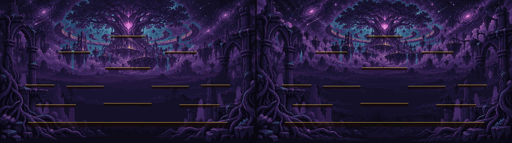
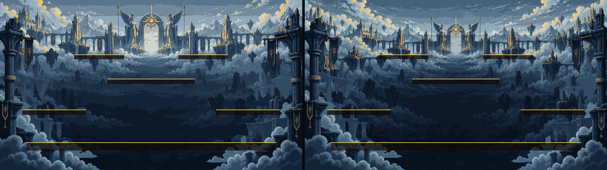
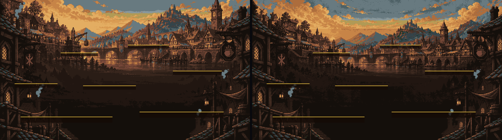
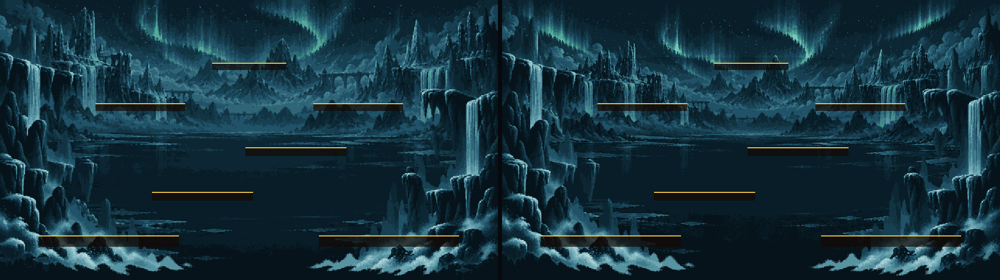
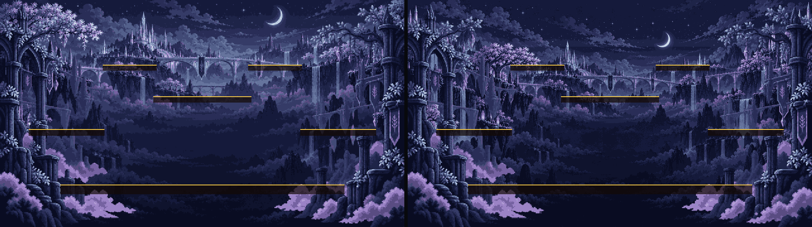
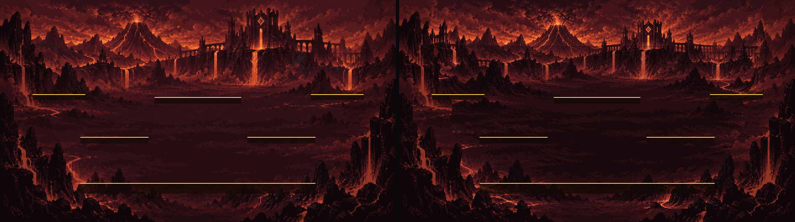
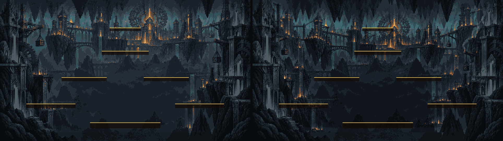
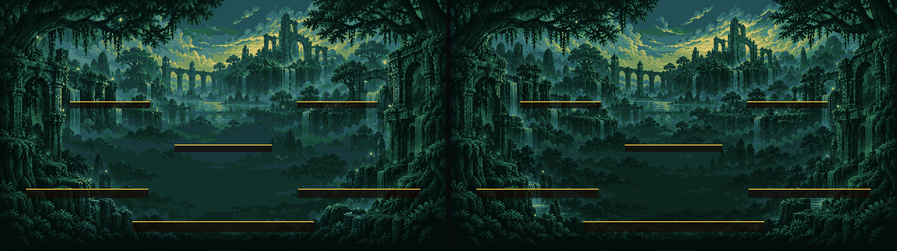
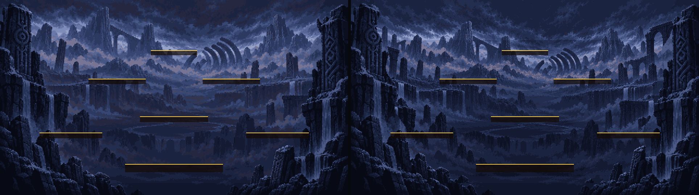

# CODEX-ART-15 결과 보고 — 1.5배 렐름 배경

## 완료

9개 렐름의 `bg_far.png`와 `bg_mid.png`를 모두 새 월드 크기에 맞췄다. 중앙은 2880×1620, 바깥 8개는 1920×1080이며, 모든 파일은 1 논리 픽셀을 정확히 2×2 화면 픽셀로 표시한다. 원경은 기존 장면을 참조해 카메라가 1.5배 멀어진 새 확장 장면을 이미지 생성 도구로 제작했고, Godot `Image` API에서 크롭·왕국별 팔레트 제한·전투 띠 명도 억제·최근접 2배 확대를 적용했다.

중경은 기존의 좋은 가장자리 실루엣을 보존하면서 새 논리 격자에서 다시 샘플링했다. 알파는 0 / 0.5 / 1 단계이며 중앙 시야는 96.81~100% 투명하다. 모든 배경의 좌표 기준점(anchor)은 렐름 좌상단 `(0, 0)`이고 애니메이션 프레임은 없다.

## 측정 결과

아래 수치는 `build_assets.gd`가 최종 PNG를 다시 읽어 측정한 결과다. 육안 평가는 다음 절에 분리했다.

| 렐름 | 최종 크기 (far/mid) | far 불투명 | 2×2 격자 | mid 전체 투명 | mid 중앙 투명 |
|---|---:|:---:|:---:|---:|---:|
| Yggdrasil Heart | 2880×1620 | 예 | 예 | 69.75% | 96.81% |
| Asgard | 1920×1080 | 예 | 예 | 75.67% | 99.66% |
| Midgard | 1920×1080 | 예 | 예 | 74.21% | 99.99% |
| Niflheim | 1920×1080 | 예 | 예 | 73.71% | 98.92% |
| Alfheim | 1920×1080 | 예 | 예 | 70.07% | 98.51% |
| Muspelheim | 1920×1080 | 예 | 예 | 70.32% | 100.00% |
| Svartalfheim | 1920×1080 | 예 | 예 | 70.32% | 100.00% |
| Vanaheim | 1920×1080 | 예 | 예 | 66.86% | 100.00% |
| Jotunheim | 1920×1080 | 예 | 예 | 70.32% | 100.00% |

원시 측정값: [`metrics.csv`](metrics.csv)

## 50% 비교와 육안 판단

모든 비교 이미지는 **왼쪽이 현재 게임식 1.5배 확대한 구 배경**, **오른쪽이 새 배경**이다. 노란 윗선과 검은 면은 `RealmCatalog.scaled_maps(1.5)`의 실제 플랫폼 사각형이다.

### Yggdrasil Heart

육안: 세계수와 심장 초점은 유지하면서 좌우 공중 신전과 성운이 확장되어 부분 카메라에서도 장면이 빈약하지 않다. 사람이 실제 전투에서 심장·별빛이 공격 이펙트보다 강하지 않은지 판단해야 한다.

### Asgard

육안: 관문과 설산의 층이 더 깊어졌고 중앙 전투 띠는 어둡다. 사람이 흰 구름이 캐릭터 실루엣과 광선 위험 예고를 씻어내지 않는지 판단해야 한다.

### Midgard

육안: 강변 시장의 비대칭성과 시계탑을 유지하며 외곽 마을·농지까지 보인다. 사람이 주황 하늘과 창문 불빛이 HUD/피격색과 경쟁하지 않는지, 수풀 은신이 읽히는지 판단해야 한다.

### Niflheim

육안: 오로라와 빙폭 층이 확장되었지만 얼어붙은 중앙 수면은 조용하다. 사람이 미끄럼 광택·청록 캐릭터·얼음 발판이 배경에서 분리되는지 판단해야 한다.

### Alfheim

육안: 달빛 교량과 은빛 숲이 좌우로 자연스럽게 이어지고 긴 시야가 유지된다. 사람이 니플하임과 즉시 구별되는 보라/라벤더 색감인지, 밝은 수목이 전투를 가리지 않는지 판단해야 한다.

### Muspelheim

육안: 외곽 칼데라와 용암 폭포를 늘리되 중앙 띠는 별도 감광해 플랫폼이 읽힌다. 사람이 실제 분출 경고와 배경 용암을 혼동하지 않는지 최우선으로 판단해야 한다.

### Svartalfheim

육안: 수직 도시·기어·승강기 층이 확장되고 중앙은 깊은 동굴로 남았다. 사람이 황동 기계선과 실제 플랫폼 윗선이 겹쳐 보이지 않는지 판단해야 한다.

### Vanaheim

육안: 숲과 침수 신전의 외곽 테라스가 늘었고 중앙에는 큰 나무 기둥이 없다. 사람이 녹색 캐릭터와 성장 덩굴을 배경 수풀에서 구분할 수 있는지 판단해야 한다.

### Jotunheim

육안: 갈비뼈·거석·협곡의 규모감이 커졌고 얇은 발판 배치 주변은 조용하다. 사람이 지진 경고와 어두운 하단 실루엣이 충돌하지 않는지 판단해야 한다.

## 검증

- `verify_assets.gd`: `REALM_BG_C_VERIFY PASS (9 realms, 18 PNGs)` — 크기, far 완전 불투명, mid 중앙 투명도 95% 이상, 모든 PNG의 엄격한 2×2 격자를 확인했다.
- 런타임 스모크: Godot `--headless --quit-after 2` 종료 코드 0, 카드에 명시된 인증서 저장소 잡음 외 오류 없음.
- 에디터 import는 18개 PNG 재가져오기까지 완료했지만, 샌드박스가 `AppData/Local/Godot` 쓰기를 막아 에디터 캐시/설정 저장 오류가 별도로 발생했다. 아트 import 오류는 출력되지 않았다.

## 구현·통합 메모

- 제품 소스, 씬, 캐릭터, 기존 테스트는 수정하지 않았다.
- 배경 파일명과 좌상단 기준점은 기존과 같아 리드가 코드 경로를 바꿀 필요가 없다.
- `platform_main.png`, `platform_sub.png`, 포털과 기타 오브젝트는 변경하지 않았다.
- Godot가 PNG import 메타를 다시 만들 수 있으므로 리드 브랜치 통합 후 한 번 에디터 import를 실행하는 것이 좋다.
- 이미지 생성 원본은 `raw/`, 재현·검수 스크립트는 `smash-nine-prototype/tests/art_preview/realm_bg_c/`에 있다.

## 미완료

없음. 9개 렐름 18개 배경과 9개 README를 모두 갱신했다. 실제 움직이는 캐릭터·공격 이펙트·위험 예고를 함께 둔 사람 플레이 판독성 평가는 리드 환경에서 남아 있다.
