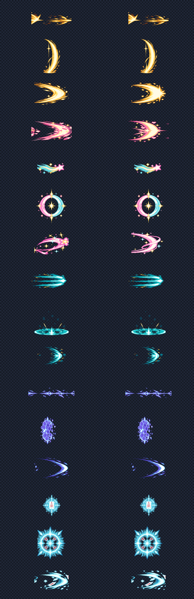
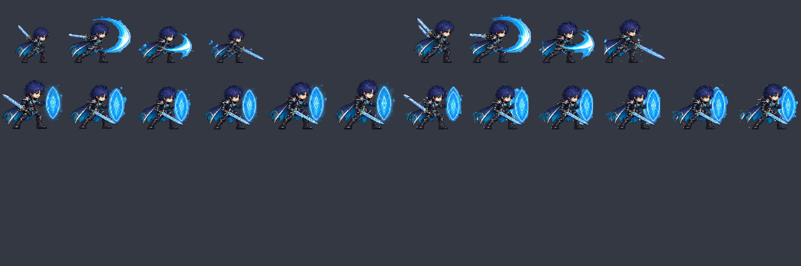
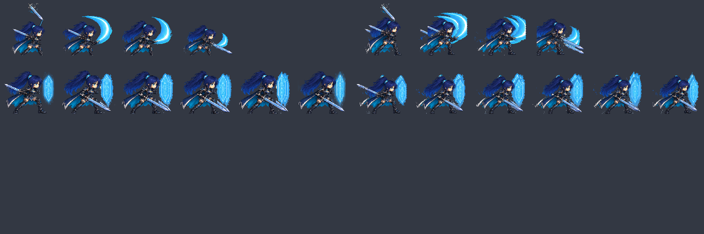
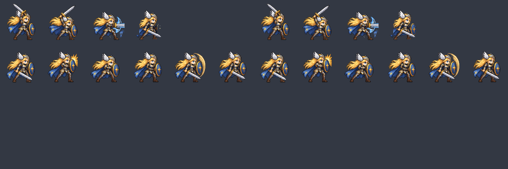

# CODEX-ART-16 결과 보고

## 완료

공격 VFX 16종을 기존 프레임의 가로·세로 2배 크기로 다시 만들고, 6프레임/오른쪽 방향/재생 속도/blend 계약을 유지했다. 기존 PNG를 단순 확대하지 않고 고해상도 원화를 Godot `Image` API로 다시 축소·양자화해 새 캔버스에서도 1px 디테일을 유지했다.

Rio 남/녀 시트의 공격 4프레임과 방패 6프레임은 idle 원본에서 측정한 고정 배율(남 0.5581, 여 0.4896)로 몸을 재추출하고 발을 y=120에 고정했다. 효과가 넓은 경우 몸은 축소하지 않고 기존 효과만 셀 안에 남겼다. Frey `r4c3`에는 원본의 파란 방패 면과 금색 테두리를 복원했다.

## 변경된 파일

- `smash-nine-prototype/assets/art/attack_vfx/*.png`: 16개, 각 6프레임(총 96프레임)
- `smash-nine-prototype/assets/art/attack_vfx/README.md`: 2배 프레임 크기·앵커·blend·통합 메모
- `smash-nine-prototype/assets/art/rio/rio_male_sheet.png`: r4 4셀 + r5 6셀
- `smash-nine-prototype/assets/art/rio/rio_female_sheet.png`: r4 4셀 + r5 6셀
- `smash-nine-prototype/assets/art/frey/frey_sheet.png`: r4c3 방패 면
- `smash-nine-prototype/tests/art_preview/attack_vfx_2x_a/`: 재생성·시트 보정·측정·검증 스크립트와 기준 PNG

제품 코드, 캐릭터 코드, 씬, `project.godot`, 기존 테스트는 수정하지 않았다.

## VFX 규격과 앵커

| 파일군 | 프레임 크기 | 전체 폭 | 앵커 |
|---|---:|---:|---|
| Frey slash / K / L | 384x256 / 448x192 / 256x384 | 2304 / 2688 / 1536 | (0,128) / (0,96) / (128,376) |
| Yuki slash / K / L | 384x256 / 256x256 / 384x384 | 2304 / 1536 / 2304 | (0,128) / (128,128) / (192,192) |
| Luna slash / K / L | 384x256 / 320x192 / 384x384 | 2304 / 1920 / 2304 | (0,128) / (0,96) / (192,192) |
| Brave Luna slash | 448x256 | 2688 | (0,128) |
| Nova slash / K / L | 320x256 / 448x192 / 384x384 | 1920 / 2688 / 2304 | (0,128) / (0,96) / (192,376) |
| Rio slash / K / L | 384x256 / 512x192 / 256x320 | 2304 / 3072 / 1536 | (0,128) / (0,96) / (0,160) |

모두 RGBA8, 6색 이하, 비투명 알파 2단계 이하, 프레임당 최소 8px 설계 여백(검증 계약은 6px 이상)이다. FPS와 additive/normal 구분은 자산 README에 기록했다.

## 시각적 확인

왼쪽은 기존 1배 프레임을 nearest 2배 한 비교 기준이고 오른쪽은 새 2배 원화 기반 프레임이다. 행은 파일명 알파벳 순서다. Frey·Luna·Brave Luna slash는 신규 생성 원화를 사용해 끝이 셀 경계에서 직선으로 잘리던 호를 다시 만들었다.

파일명 알파벳 순서로 16개 스트립의 96프레임을 실제 1px 밀도로 배열했다. 준비 → 최대 타격 → 파편 소멸이 각 행에서 이어지며, 최종 눈검수에서 새 slash 세 종의 직선 절단이나 프레임 간 이웃 그림 혼입은 보이지 않았다.

각 그림의 왼쪽 절반은 변경 전 r4/r5, 오른쪽 절반은 변경 후 r4/r5다. 몸은 idle 기준 고정 배율로 재추출했고, 방패와 검호는 128px 셀 안에서만 잘라냈다.

오른쪽 절반의 공격 4번째 셀에서 기존의 작은 금색 가장자리 대신 파란 방패 면과 금색 테두리가 보인다. 다른 Frey 셀은 픽셀 동일하다.

## 측정 결과

- VFX: 16파일, 96프레임, 모든 전체 폭 = 프레임 폭 × 6.
- Rio: 남/녀 각각 대상 10셀 변경, 각 32셀 픽셀 동일.
- Frey: r4c3 한 셀만 변경, 나머지 41셀 픽셀 동일.
- 전체 비대상 셀: 105셀 픽셀 동일.
- Rio 대상 셀: 불투명 경계의 발 y=120, 4px 바깥 여백 유지.
- `frame_audit` 최종 결과: Rio 여성 0/23 플래그, Rio 남성은 원본 허용 항목 r4c1 1/23만 남음. Frey의 5개 플래그는 공용 테스트의 기존 `SOURCE_EDGES`와 동일하며 이번에 수정하지 않은 셀이다.
- 상세 프레임별 수치는 `measurements.csv`, 감사 결과는 `audit_final/frame_audit.csv`에 있다.

## 눈으로 판단한 결과

- 새 slash는 2배 nearest 확대처럼 굵어진 블록이 아니라 1px 외곽선과 내부 하이라이트가 보인다.
- Luna 일반 slash에서 반복 지팡이가 보이던 첫 생성 후보는 폐기하고 순수 분홍 광원 리본으로 다시 생성했다.
- Brave Luna 최대 프레임은 수동 소스 분할선을 사용해 좌우 끝의 직선 절단을 없앴다.
- Rio 공격 자세가 idle보다 작아졌다 커지는 현상이 줄었고, 남성 방패 c1~c3도 주변 프레임과 같은 원본 배율로 보인다.
- 연결되지 않은 이웃 포즈 조각과 방패 림의 직선 단면은 연결요소 필터와 1px 테이퍼로 제거했다.
- Frey r4c3 방패는 몸·검·망토를 유지하면서 오른쪽에 얼굴이 보이며 셀 안에서 완결된다.

## 확인 및 테스트

- `build_attack_vfx.gd`: `ATTACK_VFX_2X_BUILD_OK count=16`
- `verify.gd`: `ART16_VERIFY_OK vfx_files=16 vfx_frames=96 untouched_cells=105 rio_target_cells=20 frey_target_cells=1`
- `tests/test_sprite_frames.gd`: `Sprite frame tests passed (8 sheets, 184 frames)`
- `tests/analysis/lead/frame_audit.gd`: 실행 완료, 결과는 위 측정 항목과 같음
- `git diff --check`: 출력 없음

모든 Godot 실행에서 카드에 명시된 `Failed to read the root certificate store` 한 줄만 발생했다. 그 외 최종 실행의 `SCRIPT ERROR`, `Parse Error`, 새 오류는 없다.

## 리드 통합 메모

1. 새 VFX는 기존 프레임의 정확히 2배이므로 `hframes = 6`은 유지하고, 기존과 같은 월드 크기에서는 표시 배율을 0.5 기준으로 맞춘다.
2. 앵커도 정확히 2배다. slash/가로 K는 왼쪽 중앙, 원형은 중앙, Frey/Nova L은 하단 중앙이다.
3. FPS와 additive 여부는 기존과 동일하다. `nova_l`, `rio_l`, `yuki_k`는 normal alpha 권장이다.
4. Rio/Frey 시트 크기, 6×7 셀 구조, 행 프레임 수는 변하지 않았다.
5. import는 filter off, mipmaps off를 유지한다.

## 사람이 판단해야 할 것

- 실제 공격 거리에서 새 2배 VFX를 0.5 표시 배율로 놓았을 때 히트박스 끝과 빛의 끝이 맞는지
- 8명 전투에서 additive VFX가 겹칠 때 과포화·화면 가림이 없는지
- Rio 공격 r4c1~c3의 큰 몸과 기존 검호가 실제 재생에서 자연스럽게 연결되는지
- Frey r4c3의 복원 방패가 4프레임 공격 모션에서 너무 짧게 번쩍이지 않는지

## 남은 작업

제품 소스 수정이 금지되어 새 텍스처 배율·앵커를 실제 전투 코드에 연결하거나 윈도우 게임 화면을 캡처하지 않았다. 실전 히트박스 정합, z-index, additive 과포화는 리드 통합 후 플레이 화면에서 확인해야 한다.

## 생성 정보

내장 이미지 생성 도구를 사용했다. 새로 생성한 원화는 Frey 금백색 검호, Luna 순수 분홍/청록/금색 광원 리본, Brave Luna 분홍/금색 중량 초승달의 “가로 6프레임, 오른쪽 방향, 투명 배경, 넓은 프레임 간 여백, 캐릭터·텍스트·그리드 없음” 프롬프트로 만들었다. 이 3종과 ART-13에서 재사용한 13종을 합친 최종 원화 16개를 모두 `source/`에 보관해 빌더가 다른 보고서에 의존하지 않게 했다.
