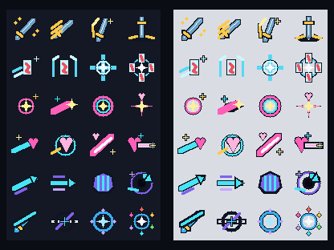

# CODEX-ART-18 결과 보고

## 완료

오른쪽 아래 스킬 바용 40×40 픽셀 아이콘 24개를 완성했다. 프레이, 유키, 루나, 브레이브 루나, 노바, 리오가 각각 J/K/L/I 네 개의 서로 다른 실루엣을 가지며, I 궁극기는 방사광·다중 요소로 한 단계 더 풍부하게 만들었다.

최종 파일은 `smash-nine-prototype/assets/art/skill_icons/`에 있다. 모든 파일은 정적 1프레임 RGBA8 PNG이며 투명 배경, 중앙 앵커 `(20, 20)`, 48×48 HUD 슬롯 중앙 배치(사방 4px 여백)를 전제로 한다.

## 시각적 확인

왼쪽은 실제 슬롯 색 `#141824`, 오른쪽은 밝은 회색이다. 각 행은 위부터 Frey, Yuki, Luna, Brave Luna, Nova, Rio이며, 열은 J/K/L/I 순서다.

위 이미지는 동일한 결과를 nearest 방식으로 4배 확대했다. 작은 화면에서 사라지는 1px 디테일을 추가하지 않고, 2px 이상 덩어리와 1px 외곽선이 유지되는지 확인하는 용도다.

## 아이콘별 의미

| 파일 | 보이는 상징 |
| --- | --- |
| `frey_j.png` | 금빛 불꽃과 사슬 고리를 두른 발키리 검 |
| `frey_k.png` | 세 줄 속도 궤적을 동반한 대각선 돌진검 |
| `frey_l.png` | 위로 솟는 금빛 베기 궤적과 검 |
| `frey_i.png` | 수직 낙하검과 좌우 지면 충격파 |
| `yuki_j.png` | 얼음 꼬리를 남기며 날아가는 설부 |
| `yuki_k.png` | 좌우 얼음 괄호에 고정된 봉인부 |
| `yuki_l.png` | 십자 방향으로 터지는 결계 핵 |
| `yuki_i.png` | 네 장의 부적이 둘러싼 사방봉진 |
| `luna_j.png` | 잔향 고리 안의 별 |
| `luna_k.png` | 분홍 꼬리와 금빛 핵의 별 혜성 |
| `luna_l.png` | 분홍·청록 이중 달 고리 |
| `luna_i.png` | 하트 관을 쓴 변신 별빛 |
| `luna_brave_j.png` | 하트 끝을 가진 청록 돌진광 |
| `luna_brave_k.png` | 공전 고리 속 하트 혜성 |
| `luna_brave_l.png` | 굵은 분홍 대각선 브레이커와 하트 |
| `luna_brave_i.png` | 하트 중심에서 좌우로 뻗는 백색 레이저 |
| `nova_j.png` | 청록·보라의 상승 벡터 타격 화살 |
| `nova_k.png` | 평행 속도선과 방향 전환 화살 |
| `nova_l.png` | 세로 중력선을 가둔 육각 브레이크 장벽 |
| `nova_i.png` | 보라 공전과 청록 슬링샷 화살을 가진 사건의 지평선 |
| `rio_j.png` | 청록 마력 검기와 검자루 |
| `rio_k.png` | 보라 차원 균열을 가로지르는 백색 참격선 |
| `rio_l.png` | 네 룬 보석과 별 핵을 가진 원형 룬 방패 |
| `rio_i.png` | 여섯 색 보석검이 둘러싼 무한 구동 핵 |

## 측정 및 검증

- `build_skill_icons.gd`를 Godot 4.7 headless로 실행해 24개 파일과 두 접촉 시트를 생성했다.
- 자동 측정: 24/24가 40×40, RGBA8, 가시 픽셀 존재, 캔버스 0px 외곽 접촉 0이다. 상세 수치는 `measurements.csv`, 요약은 `verification.txt`에 있다.
- 육안 판단: 1배에서 같은 캐릭터의 네 실루엣이 서로 구분되며, 어두운 슬롯과 밝은 배경 양쪽에서 윤곽이 보인다. 4배에서 가장자리 계단과 1px 외곽선이 의도대로 이어진다.
- Godot 실행의 유일한 `ERROR`는 카드에 명시된 샌드박스 인증서 저장소 경고였다. 첫 시도에서는 기본 `user://logs` 권한 때문에 Godot 4.7 자체 충돌이 있었고, 허용된 임시 APPDATA 경로로 재실행해 생성과 감사를 완료했다.

## 생성 및 후처리

내장 이미지 생성 도구로 24종 컨셉 시트 `source_concept.png`를 만들었다. 생성 원본은 배경 투명을 지키지 못해 게임 파일로 사용하지 않았고, 색·실루엣 참고 자료로만 보관했다. 최종 아이콘은 `build_skill_icons.gd`의 Godot `Image` API로 픽셀 단위 재구성·투명화·접촉 검사를 수행했다. 사용 프롬프트는 `generation_prompt.txt`에 있다.

## 리드 통합 메모

- HUD는 `<character_id>_<j|k|l|i>.png`를 로드하고 48×48 슬롯의 `(4, 4)`에 원본 크기로 배치하면 된다.
- 브레이브 루나 변신 중에는 `luna_brave_*` 네 파일로 교체한다.
- 필터는 nearest, mipmap은 끄는 것이 1:1 픽셀 가장자리를 보존한다.
- 슬롯 배경, 키 배지, 쿨다운 음영은 아이콘에 포함하지 않았다.

## 사람이 판단할 부분

- 실제 경기 HUD에서 48px 슬롯 네 개가 연속 배치됐을 때, 특히 유키 I의 네 부적이 너무 조밀하지 않은지 확인이 필요하다.
- 브레이브 루나 I의 하트+가로 레이저가 게임 내 실제 레이저 연출과 충분히 연결되어 보이는지 판단이 필요하다.
- 캐릭터 성별 변형과 무관하게 Nova/Rio 공용 아이콘으로 쓰는 것이 적절한지 최종 미술 판단이 필요하다.

## 남은 작업

아트 카드 범위의 24개 아이콘, 문서, 컨셉 원본, 생성/감사 스크립트와 접촉 시트는 완료했다. 제품 HUD 코드 연결과 실제 매치 화면 캡처는 리드의 통합 범위이므로 수행하지 않았다.
