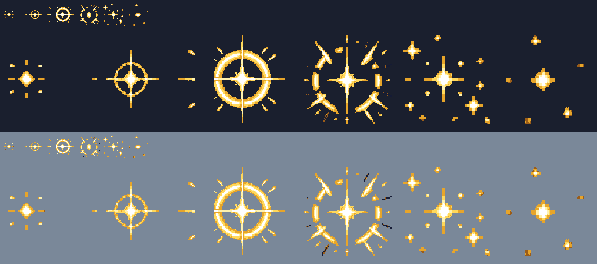
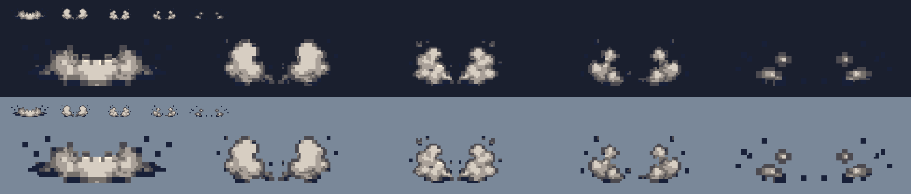
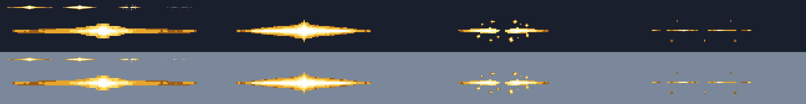
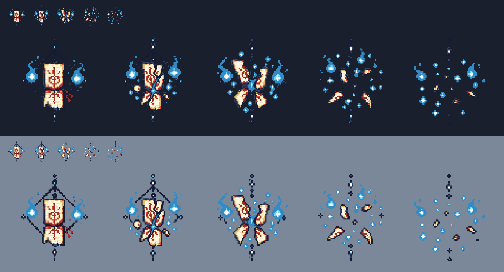

# CODEX-ART-20 결과 보고

## 완료

현재 메인의 짧은 섬광을 60fps 창 실행으로 다시 캡처했고, 남아 있는 단색 placeholder 네 종류를 확인했다. 이어서 내장 ImageGen 원화를 Godot `Image` API로 후처리해 요청된 네 스트립을 정확한 셀 규격·이진 알파·제한 팔레트로 만들었다. 제품 코드는 카드 범위 밖이라 수정하지 않았다.

## 화면 점검 — 남아 있는 placeholder

수치는 코드 상수를 옮긴 값이 아니라 `before/<효과>/`의 마지막 무효과 프레임과 각 PNG를 픽셀 비교한 결과다. 창 PNG는 1280×720, 테스트의 game viewport는 640×360이므로 표의 크기는 raw PNG 경계를 2로 나눈 game-screen px다. 회전한 streak는 축 정렬 bounding box라 세로값에 회전 여유가 포함된다.

| 효과 | 위치 | 캡처에서 측정한 표시 경계 | 캡처 지속 | 눈으로 본 판단 | 근거 프레임 |
|---|---|---:|---:|---|---|
| 패리 섬광 | `characters/common/PlayerBase.gd:_play_parry_effect` | 115×115 → 161×161px | 6프레임 / 0.100초 | 캐릭터 위에 반투명 노란 정사각형이 그대로 커진다. 가장 명백한 placeholder다. | `before/parry/parry_00.png`~`05.png` |
| 착지 puff | `PlayerBase._spawn_landing_puff` | 52×7 → 60.5×5.5px | 3프레임 / 0.050초 | 발밑의 평평한 주황/회색 막대로 읽히며 먼지 형태가 없다. | `before/landing/landing_00.png`~`02.png` |
| 피격 streak — light | `PlayerBase._spawn_hit_slash` | 회전 bbox 115×8 → 127×7px | 3프레임 / 0.050초 | hit spark 뒤에 균일 두께의 무질감 막대가 남는다. | `before/streak_light/streak_light_00.png`~`02.png` |
| 피격 streak — heavy | `PlayerBase._spawn_hit_slash` | 회전 bbox 154.5×25 → 170×25.5px | 3프레임 / 0.050초 | light와 같은 막대가 더 길어져 특히 눈에 띈다. | `before/streak_heavy/streak_heavy_00.png`~`02.png` |
| guard block pulse | `PlayerBase._play_guard_block_effect` | delta bbox 38×104 → 31×89px | 4프레임 / 0.067초 | 밝은 청록색의 굵은 `Line2D` 반원이다. 사각형은 아니지만 무텍스처 기하 도형이므로 후속 미술 후보로 기록한다. 이번 카드의 네 strip 범위에는 없다. | `before/guard_block/guard_block_00.png`~`03.png` |
| 유키 봉인 파괴 | `characters/yuki/YukiSeal.gd:_play_break_effect` | 44.5×31 → 57×17.5px | 5프레임 / 0.083초 | 대기 봉인 뒤에서 청색 사각형이 납작해진다. 일반 합성에서는 일부가 봉인 그림에 가려져 격리 프레임으로 경계를 쟀다. | `before/seal_break/seal_break_00.png`~`04.png` |

원시 측정 전체는 [`before/measurements.txt`](before/measurements.txt), 모든 짧은 효과의 축소 접촉 시트는 [`before/short_flashes_contact.png`](before/short_flashes_contact.png)다.

## 함께 확인한 항목

- Frey 궁극기 charge/release, Yuki grand ward 종료와 seal burst: 해당 ColorRect가 기존 이펙트 위에 다시 나타나지 않았다.
- 다섯 캐릭터의 J/K/L: 현재 그림 스트립이 보이며 새 단색 사각형은 발견하지 못했다. [`before/attacks_contact.png`](before/attacks_contact.png)
- 다섯 캐릭터 궁극기: 기존 궁극기 그림이 보이며 카드에서 이미 고친 네 사각형의 재등장은 발견하지 못했다. [`before/ultimates_contact.png`](before/ultimates_contact.png)
- Mossling bite: 공격 프레임 자체가 물기 동작을 그리며 hitbox 사각형은 보이지 않았다.
- Ember Imp fireball: 36px 불덩이 그림이 보이며 projectile 사각형은 보이지 않았다.
- beams/eruption/vines/quake 경고: beams·eruption의 넓은 반투명 band는 피격 범위를 미리 알리는 의도된 telegraph다. quake는 플랫폼 위 균열 그림, vines는 작은 초록 발아 입자로 보였다. 이번 placeholder 목록에는 넣지 않았다. [`before/support_contact.png`](before/support_contact.png)
- guard block은 방향 방어를 읽히게 하는 지속 UI이지만, 화면상 무텍스처 반원이라 위 placeholder 표에 후속 후보로 포함했다. 이번 네 스트립 교체 대상에서는 제외했다.

## 제작한 네 스트립

| 파일 | 전체 크기 | 셀/프레임 | 앵커 | 재생 | blend | 측정 검증 |
|---|---:|---:|---:|---:|---|---|
| `parry_flash.png` | 768×128 | 128×128 / 6 | (64,64) 중앙 | 0.15초 | additive | RGBA8, alpha {0,255}, 6색, 최소 가장자리 여백 6px |
| `landing_dust.png` | 480×32 | 96×32 / 5 | (48,31) 아래 중앙 | 0.12초 | normal | RGBA8, alpha {0,255}, 6색, 좌우 최소 6px·아래 1px(발 접점) |
| `hit_streak.png` | 640×24 | 160×24 / 4 | (80,12) 중앙 | 0.08초 | additive | RGBA8, alpha {0,255}, 5색, 최소 가장자리 여백 3px |
| `yuki_seal_break.png` | 480×96 | 96×96 / 5 | (48,48) 중앙 | 0.15초 | normal | RGBA8, alpha {0,255}, 10색, 최소 가장자리 여백 6px |

### 시각적 확인

위 그림은 패리 6프레임을 어두운/밝은 렐름색에서 각각 1x와 4x로 본 것이다. 원형 clang과 4방향 glint가 hit spark의 폭발형 실루엣과 구분된다.

위 그림은 착지 먼지가 중앙 접점에서 좌우 puff로 갈라지고 흩어지는 진행을 보여준다.

위 그림은 양끝이 가늘고 중심이 가장 밝은 streak가 두 조각과 잔광으로 사라지는 흐름이다.

위 그림은 상아색·주홍색 봉인이 4–6조각과 연청색 불꽃으로 분해되는 과정이다.

ImageGen 원화와 확대 점검용 큰 이미지는 `reports/codex-art-20/source/`에만 보존했고, 빌드 스크립트는 그 경로를 읽는다. 최종 생성 프롬프트는 `assets/art/effects/README.md`에 기록했다.

## 리드 통합 메모

`scripts/Vfx.gd`의 `EFFECTS_DIR` 스펙에 아래 규격을 추가하고 one-shot으로 재생하면 된다.

| effect key | frames / fps | anchor | blend | 호출 위치와 크기 |
|---|---:|---:|---|---|
| `parry_flash` | 6 / 40fps | (64,64) | additive | 패리 중심 `global_position + Vector2(0,-32)`, 1:1 |
| `landing_dust` | 5 / 41.667fps | (48,31) | normal | 발 위치 bottom-centre, 1:1 |
| `hit_streak` | 4 / 50fps | (80,12) | additive | hit point 중앙. 목표 길이 69–138px에 맞춰 `scale.x = target_length / 160.0`, 현재 각도 유지 |
| `yuki_seal_break` | 5 / 33.333fps | (48,48) | normal | seal global centre, 1:1 |

`PlayerBase`의 세 ColorRect 함수와 `YukiSeal._play_break_effect`의 ColorRect를 위 spawn으로 교체하되 물리 hitbox·damage·knockback은 바꾸지 않는다. `landing_dust`만 아래 중앙 앵커이므로 발 접점이 흔들리지 않게 하고, streak의 세로 scale은 1.0을 유지해야 taper가 납작해지지 않는다.

## 확인 및 테스트

- `build_effects.gd`: 네 PNG 생성 성공. 크기·프레임 수·RGBA8·이진 알파·색 수·프레임별 가장자리 여백을 `verification.txt`에 기록했다.
- 접촉 시트 네 장을 원본 배율로 직접 확대 확인했다. 셀 경계 침범, 반투명 alpha, 프레임 divider는 보이지 않았다.
- `capture_flashes.gd`: 실제 함수 호출 결과를 60fps로 프레임별 저장했다. Godot 오류는 알려진 certificate-store 한 줄뿐이었다.
- `capture_attacks.gd`, `capture_ultimates.gd`, `capture_support_checks.gd`: 창 실행 완료. 알려진 certificate-store 한 줄 외 새 오류가 없었다.
- `tests/test_flash_art.gd`: `Flash art tests passed`.
- 전체 bot soak는 동시 실행 중인 analyst 작업과 CPU 충돌을 피하기 위해 이 이미지 카드에서 다시 돌리지 않았다.
- `.git/index.lock` 생성 권한이 없어 직접 commit하지 못했다. `commit.ps1`이 이 카드의 허용 경로만 stage하고 `Co-Authored-By: Codex <noreply@openai.com>` 꼬리말로 commit한다.

## 사람이 판단할 항목

1. 패리 링이 additive 합성 및 캐릭터와 겹쳤을 때 hit spark와 충분히 다른지.
2. 착지 먼지가 밝은 Niflheim/Asgard 배경에서도 너무 흐리거나 너무 커 보이지 않는지.
3. streak를 69px까지 줄였을 때 중심광과 양끝 taper가 유지되고, 138px에서 hit spark를 과하게 덮지 않는지.
4. 유키 파괴의 청색 불꽃 밀도가 기존 `yuki_seal_idle`과 함께 재생될 때 과밀하지 않은지.
5. 리드 통합 후 실제 0.08–0.15초 타이밍에서 마지막 잔광 프레임이 한 프레임 이상 읽히는지.

## 남은 작업 / 하지 못한 것

- 제품 코드 연결과 통합 후 게임 화면 캡처는 리드 범위라 수행하지 않았다. 따라서 이 보고서의 `before/`는 현재 placeholder 확인이고, `contact/`는 납품 스트립 자체의 확인이다.
- 제품 연결 뒤 네 효과가 동시에 다른 VFX와 겹치는 실전 상황은 사람이 최종 판정해야 한다.
