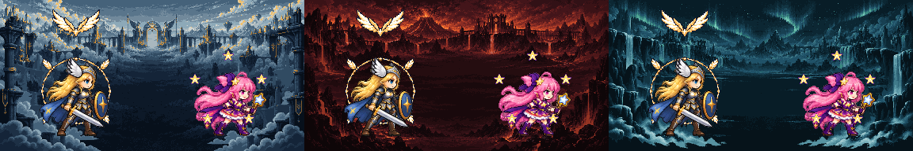

# CODEX-ART-22 결과 보고

내장 ImageGen으로 만든 세 원본을 `source/`에 보존하고, 최종 크기에서 최근접 샘플링·제한 팔레트·이진 알파로 정리해 Frey/Luna 패시브 표시 3장을 만들었다. 제품 코드와 기존 테스트는 수정하지 않았다.

## 결과 파일

| 파일 | 크기 | 1x에서 보이는 형태 |
| --- | ---: | --- |
| `smash-nine-prototype/assets/art/effects/passive/frey_pursuit_mark.png` | 64×40 | 좌우 흰금 날개가 아래의 금색 점으로 모이는 V자 표식. 대상 머리 위에서 추격 표식으로 읽힌다. |
| `smash-nine-prototype/assets/art/effects/passive/frey_spike_ring.png` | 96×96 | 가는 금백색 고리와 대각선 네 깃털. 중앙이 크게 비어 60px급 Frey를 가리지 않는다. |
| `smash-nine-prototype/assets/art/effects/passive/luna_star_charge.png` | 18×18 | 보라 1px풍 외곽, 금색 몸체, 흰색 중심의 작은 오각별. 분홍/청록 꼬리가 있는 `luna_star.png`와 구분된다. |

## 생성 원본과 프롬프트

도구는 내장 ImageGen이며 세 호출 모두 실제 투명 배경을 요청했다. 선택한 생성 원본은 다음 파일로 복사했다.

- `source/frey_pursuit_mark_imagegen.png`
- `source/frey_spike_ring_imagegen.png`
- `source/luna_star_charge_imagegen.png`

프롬프트 핵심:

- Pursuit: `downward-pointing valkyrie pursuit mark; two symmetrical white-gold feathered wings meeting in a V over one small gold point; #FFD27A/#FFB85C; dark navy outline; no full bird or red`.
- Spike ring: `thin circular gold-white timing ring; four tiny feathers at the diagonals; open center for a 60 px fighter; no filled disc or thick outline`.
- Star charge: `compact upright five-point magical star; white core, #FFE06B gold, #662A91 violet contour; no pink fill, cyan trail or blur`.

공통으로 `genuinely transparent background`, `crisp hand-clustered pixel art`, `intentional square pixels`, `no antialiasing`, `no text/logo/watermark`를 지정했다. 전체 프롬프트와 표시 계약은 게임 자산의 `passive/README.md`에도 남겼다.

## 객관 측정

`tests/art_preview/passive_marks_22/build_and_verify.ps1`로 원본 처리와 검증을 재현했다. 상세 수치는 `measurements.csv`, 판정은 `verification.txt`에 있다.

| 파일 | RGBA8 | 알파 | 보이는 픽셀 | 팔레트 | 테두리 픽셀 | 연결 성분 | 고립 픽셀 |
| --- | --- | --- | ---: | --- | ---: | ---: | ---: |
| pursuit | 예 | 0/255 | 862 | 6색: `151B35 8A541E FFB85C FFD27A FFF2C4 FFFFFF` | 0 | 1 | 0 |
| spike ring | 예 | 0/255 | 1,169 | 같은 Frey 6색 | 0 | 1 | 0 |
| star charge | 예 | 0/255 | 94 | 3색: `662A91 FFE06B FFFFFF` | 0 | 1 | 0 |

모든 파일은 지정 크기, RGBA8, 투명 배경, 이진 알파, 최소 2px 여백, 단일 연결 성분, 고립 픽셀 0을 통과했다. `verification.txt` 결과는 `failures=none`이다.

## 시각 판단

위 시트는 왼쪽부터 Asgard, Muspelheim, Niflheim이며, Frey/Luna의 실제 128px 셀과 자산을 1 art px = 1 screen px로 합성했다. 흰금 추격 표식은 세 배경 모두에서 강한 V 실루엣을 유지한다. 스파이크 고리는 Frey 윤곽을 덮지 않고 대각선 깃털까지 읽힌다. 18px 별은 분홍 머리 위에서도 금백색 중심과 보라 외곽이 분리되어 보인다.

4배 최근접 확대본은 `contact/passive_marks_contact_4x.png`다. 픽셀 계단, 외곽 단절, 반투명 번짐이 없는지 이 확대본에서도 확인했다.

## 리드 연결 메모

- 세 파일 모두 중심 앵커다: pursuit `(32,20)`, ring `(48,48)`, star `(9,9)`.
- pursuit는 현재 대상 기준 `(0,-118)` 위치와 알파 펄스를 유지하고 추가 배율 없이 표시한다.
- ring은 Frey 몸 중심에 두고 0.18초 동안 기존처럼 1.0→1.5 확대와 페이드를 적용한다. 접촉 시트처럼 캐릭터 뒤/둘레 레이어에 두면 중앙 가독성이 가장 좋다.
- star는 기존 반경 44px 궤도에 최대 5개를 추가 배율 없이 놓고, 색상 변조를 하지 않는다.
- 세 텍스처 모두 `NEAREST`, 밉맵 끔이 전제다.
- 샌드박스의 `.git`은 쓰기 대상이 아니므로 `commit.ps1`을 준비했다. 세 허용 경로만 stage하며 지정된 Co-Authored-By 꼬리표를 포함한다.

## Godot 실행 메모

요청대로 Godot는 한 프로세스만 짧게 시도했으나, 스크립트 실행 전 `user://logs` 파일을 열지 못한 뒤 엔진이 signal 11로 충돌했다(`godot-build.log`). 따라서 최종 생성·검증은 패키지 설치가 필요 없는 Windows `System.Drawing` 기반 PowerShell 스크립트로 수행했다. 최종 PNG 자체의 측정은 정상 통과했지만 실제 게임 런타임 배치는 리드 연결 후 확인이 필요하다.
