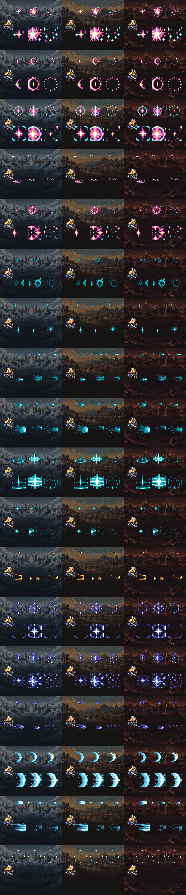
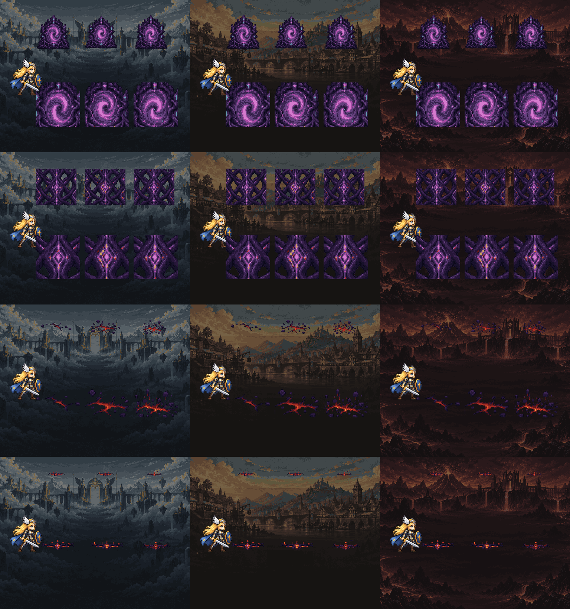

# CODEX-ART-24 결과 보고

## 완료

Part 1과 Part 2를 모두 완료했다. 스킬 도형 18종을 전용 스트립 또는 기존 `rio_gem_sword.png`로 교체했고, 포털 애니메이션과 렐름 경고·봉인·붕괴 마커 4종을 추가했다. 모든 배선은 원본 아트가 없거나 F2 프로토타입 모드일 때 기존 도형으로 되돌아간다. damage, hitbox, timing, input, match rule, bot 수치는 바꾸지 않았다.

Part 3은 카드에 별도 항목이 없어 수행 대상이 없었다.

## Part 1 — 만든 파일

| 묶음 | 결과 |
|---|---|
| Luna | `luna_star_bloom` 6×256², `luna_moon_ring` 6×320², `luna_brave_aura` 6×128², `luna_comet_trail` 4×48², `luna_comet_burst` 6×224² |
| Nova | `nova_gravity_burst` 6×512², `nova_momentum_trail` 4×64×32, `nova_vector_streak` 4×192×48, `nova_shift_dash` 4×96×40, `nova_shift_ready` 5×128², `nova_impact_star` 6×512², `nova_launch_flash` 5×256×64 |
| Rio | `rio_rune_guard` 6×128², `rio_rune_burst` 6×320², `rio_blink_trail` 5×256×64; orbit sword는 기존 `effects/rio_gem_sword.png` 배선 |
| Yuki | `yuki_grand_ward` 8×640² |
| Common | `guard_bubble` 3×128²(평상/block/parry-ready), `attack_afterimage` 4×160×64 |

ImageGen 원화 5장은 `assets/art/effects/skill/*_source.png`에 보존했다. 최종 프롬프트 요약은 [prompts.md](prompts.md)에 있다.

### 배선한 함수

- Luna: `Luna._play_star_bloom`, `_play_moon_ring_flash`, `_create_transformation_aura`; `LunaComet._spawn_trail`, `_spawn_bloom_flash`
- Nova: `Nova._spawn_gravity_burst`가 만드는 `NovaGravityBurst.configure` 시각층, `_update_momentum_visual`, `_play_vector_flash`, `_play_shift_flash`, `_play_shift_recharge_flash`, `_play_impact_flash`, `_play_launch_flash`
- Rio: `_show_rune`, `_play_rune_burst`, `_play_blink_trail`, `_make_gem_sword`
- Yuki: `YukiGrandWard._ready`
- Common: `PlayerBase._create_guard_visual`, `_update_guard_visual`; `Attack._spawn_trail_afterimage`

## Part 2 — 만든 파일과 배선

| 파일 | 규격 | 연결 |
|---|---:|---|
| `realm_center/portal_anim.png` | 6×96×96 | `RealmWorld._create_portal_visual`; 목적지 accent tint 유지, 실패 시 기존 still portal |
| `effects/realm/seal_barrier.png` | 6×256×256 loop | `RealmWorld._create_state_overlay`; locked 영역 타일 |
| `effects/realm/collapse_cracks.png` | 6×320×128 loop | collapsed 영역 균열 타일 |
| `effects/realm/warning_edge.png` | 6×320×48 loop | warning 영역 네 변 pulse |

렐름 원화는 `effects/realm/realm_markers_source.png`에 보존했다. 어두운 tint를 먼저 그리고 마커를 그 위에 놓았으며 `SEALED`, `REALM COLLAPSED`, 포털 안내 문자는 기존 코드 그대로 남겼다.

## 시각적 확인

위 시트는 모든 Part 1 스트립의 첫/중간/마지막 프레임을 Asgard·Midgard·Muspelheim 실제 배경에서 비교한다. 각 행 왼쪽에는 Frey의 실제 128px 셀을 두었고, 위는 한 화면에 맞춘 1차 표본, 아래는 같은 표본의 2배 최근접 확대다. 512/640px 셀은 시트 폭에 맞추기 위해 먼저 축소했다.

위 시트는 포털, 봉인 타일, 붕괴 균열, 경고 가장자리를 같은 세 실제 렐름 배경과 128px Frey 셀 옆에서 비교한다. 두 PNG는 모두 15MB 제한보다 작다.

## 측정 결과

- 최종 22개 신규 스트립 전부 RGBA8, alpha `{0,255}`다.
- 캐릭터별 색 수: Luna 10, Nova 6–9, Rio 8, Yuki 5, common 5–7, realm 9–12색이다.
- 최종 불투명 픽셀은 각 제한 팔레트의 정확한 멤버이므로 최종 팔레트 거리(RGB 최근접 제곱거리)는 `0`이다.
- 전체 치수·점유 픽셀 수는 `measurements_*.txt`에 저장했다.
- 원화를 확대하지 않았다. 큰 Yuki ward는 640px 목표 격자에 Godot `Image`로 1px 링과 부적을 직접 조립했다.

## 확인 및 테스트

- `tests/test_skill_fx_art.gd`: `Skill FX art tests passed`. Part 1의 모든 호출, Rio sword, Part 2 portal/세 상태 overlay를 original/prototype 양쪽에서 검사했다.
- `tests/run_all.ps1 -SkipSoak`: 기존 24개 스크립트가 모두 각자의 `... tests passed` 메시지를 출력했다. 샌드박스의 알려진 `Failed to read the root certificate store` 한 줄을 harness가 각 실행의 실패로 집계해 최종 프로세스는 exit 1이었다. 그 줄 외 `ERROR`, `SCRIPT ERROR`, `Parse Error`는 없었다.
- PNG import: 신규 최종 PNG와 원화에 `.import` 생성 확인. 첫 editor import는 샌드박스의 Godot editor-cache 쓰기 오류도 냈으나, 개별 headless 실행은 임시 APPDATA를 사용해 인증서 잡음 외 오류 없이 동작했다.
- `git diff --check`: 통과.

## 사람이 판단할 항목

1. Nova gravity/impact의 생성 원화가 암청색 바위 파편으로 읽혀, 순수 에너지 효과보다 무거워 보이는지.
2. Luna bloom과 Rio rune burst가 밝은 배경에서 다른 공격보다 시선을 과하게 끄는지.
3. 640px Yuki ward의 매우 얇은 1px 원이 실제 카메라 축소에서 충분히 읽히는지. 이 항목이 가장 약하다고 본다.
4. sealed realm의 256px 타일 반복이 넓은 렐름에서 지나치게 규칙적인 벽지처럼 보이는지.
5. warning edge가 위험 범위를 알리면서도 HUD·캐릭터보다 먼저 보이지 않는지.

## 남은 작업 / 하지 못한 것

- 카드가 금지한 windowed Godot 실행은 하지 않았다. 따라서 실제 플레이 화면 캡처 대신 headless 함수 회귀 테스트와 접촉 시트로 검증했다.
- 접촉 시트는 실제 세 렐름 배경을 사용했지만 전체 스트립을 가로로 나열하지 않고 첫/중간/마지막 대표 프레임만 담았다. 실제 인게임 카메라에서의 애니메이션 밝기·겹침은 리드의 창 실행 확인이 필요하다.
- `run_all.ps1`에는 카드 지시대로 새 테스트를 추가하지 않았다(리드가 추가).
- 샌드박스에서 `.git` 쓰기가 허용되지 않아 직접 commit하지 않았다. `commit.ps1`은 이 카드의 허용 경로만 stage하고 지정된 공동 작성자 꼬리말로 commit한다.

