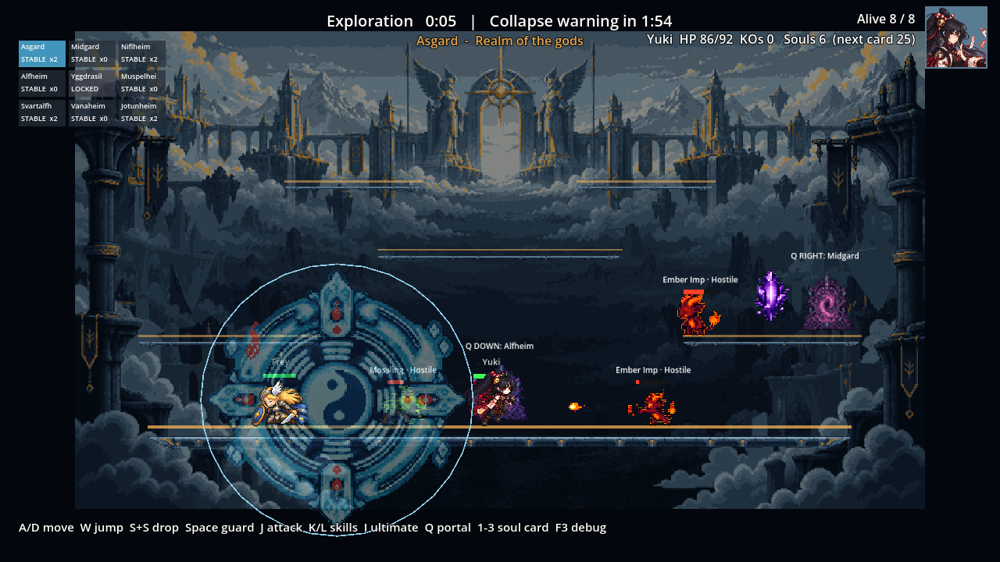
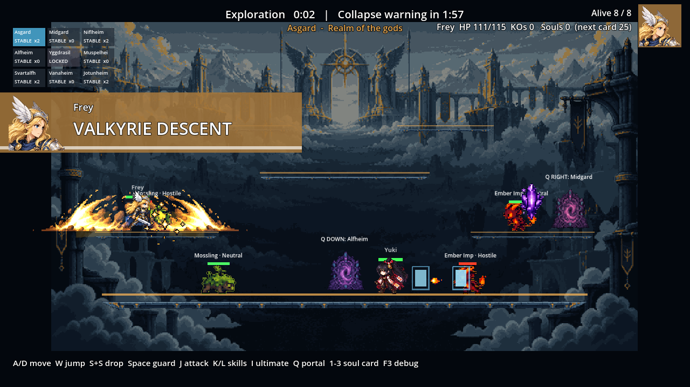

# CODEX-QA-12 — 궁극기 변경 독립 검토

검토일: 2026-10-08  
브랜치: `codex/ult-review-12`  
범위: `2a09dd8..HEAD` 궁극기 변경 코드 검토, seed 2001–2008 독립 측정, 기존 캡처 감상

## 결론

재현된 버그는 2건이다. 포털 이동·붕괴 강제 이동 후에도 궁극기 판정 창이 남아 다음 일반 타격이 2.2배 히트스톱과 `ultimate_hit`으로 처리되며, Yuki의 Grand Ward는 시전자가 패배해도 정리되지 않고 남은 펄스로 피해를 준다. 또한 Grand Ward의 실제 적중은 피해자 히트스톱은 늘리지만 시전자 적중 콜백을 호출하지 않아 궁극기 적중 화면 흔들림과 시전자 히트스톱이 빠진다.

seed 2001–2008의 실전 봇 표본에서는 Frey 8.0, Luna 10.6, Nova 7.6, Rio 10.0, Yuki 8.8 damage/cast였다. 약 12 목표와 비교하면 Frey와 Nova는 명확히 낮고 Yuki도 최신 상향 뒤 아직 낮다. 피해·KO 기준으로 명확한 지배 캐릭터는 없었다. 경기 길이 평균은 299.2초로 리드 최신 표본 303.6초와 거의 같았다.

## Findings — 버그

### P1 — Grand Ward가 시전자 패배 후에도 유효하며 피해를 준다 (재현)

- 코드 근거:
  - `characters/yuki/Yuki.gd:111-124`는 Ward를 로컬 변수로 생성하고 시전자 쪽에 보관하지 않는다.
  - `characters/yuki/Yuki.gd:37-41`의 패배/리스폰 정리는 `seals`만 비운다.
  - `characters/yuki/YukiGrandWard.gd:71-74`는 `owner_node`가 유효한지만 확인하며 `owner_node.is_defeated`는 확인하지 않는다.
  - `characters/yuki/YukiGrandWard.gd:106-119`는 그 상태에서도 펄스 피해를 적용한다.
- 재현: `tests/analysis/codex_qa_12/lifecycle_probe.gd`에서 Yuki를 환경 피해로 패배시킨 뒤 기존 Ward의 펄스를 직접 실행했다.
- 측정 결과: `owner_defeated=true`, `ward_valid_after_defeat=true`, 패배 후 Frey에게 **5.4915 피해**가 들어갔다.
- 영향: 시전자가 먼저 탈락해도 최대 약 3.05초(`0.7 + 2.35`) 동안 남은 장판이 타격·KO를 만들 수 있다. 붕괴 강제 이동 때도 Ward는 옛 realm에 남는다.
- 제안 수정: Yuki가 활성 Ward를 추적해 `character_cleanup()`/`character_on_respawn()`에서 해제하거나, Ward가 매 프레임 `owner_node.is_defeated` 및 시전자 realm 일치를 검사해 즉시 `queue_free()`하도록 한다.

### P1 — 맵 이동 후 궁극기 판정 창이 남아 일반 타격으로 누출된다 (재현)

- 코드 근거:
  - `characters/common/PlayerBase.gd:1356-1380`의 `reset_for_map()`은 공격 대기, 히트스턴, 히트스톱 등을 초기화하지만 `ultimate_window_timer`는 초기화하지 않는다.
  - 이 함수는 포털 이동 `scripts/Main.gd:452-456`과 붕괴 강제 이동 `scripts/match/MatchDirector.gd:193-207`에서 사용된다.
  - `characters/common/PlayerBase.gd:1047-1050`, `1446-1451`은 타격 종류가 아니라 남은 타이머만 보고 2.2배 히트스톱과 `ultimate_hit`을 적용한다.
- 재현: 궁극기 창 1.25초가 남은 Frey에게 `reset_for_map()`을 호출한 뒤 일반 `on_attack_landed()`를 호출했다.
- 측정 결과: 이동 뒤 타이머가 **1.25초 그대로**, 일반 타격이 `ultimate_hit`을 **1회 방출**, 공격자 히트스톱이 **0.045초 → 0.099초**로 증가했다.
- 영향: 특히 Luna의 7초 창에서 포털 이동/붕괴 직후 일반 공격까지 궁극기 피드백으로 오인될 수 있다. 이동이 공격 잠금도 0으로 만들기 때문에 즉시 재현 가능하다.
- 제안 수정: `reset_for_map()`, `_defeat()`, `_respawn()`에서 `ultimate_window_timer = 0.0`을 공통 초기화한다. 더 안전한 장기 해법은 시간창이 아니라 공격/투사체에 궁극기 태그를 붙여 해당 적중만 강화하는 것이다.

### P2 — Grand Ward 적중은 시전자 궁극기 적중 피드백을 발생시키지 않는다 (재현)

- 코드 근거: `characters/yuki/YukiGrandWard.gd:106-119`는 `apply_hit`/`apply_stun_hit`을 직접 호출하지만, 다른 공격 경로의 `owner_node.on_attack_landed()`를 호출하지 않는다.
- 재현 결과: 피해자의 히트스톱은 **0.143초**로 정확히 `0.065 × 2.2`가 됐지만, 시전자의 `ultimate_hit` 신호는 **0회**였다.
- 영향: Yuki 궁극기만 실제 적중 때 카메라 흔들림(`scripts/Main.gd:387-389`)과 시전자 쪽 강화 히트스톱이 빠져 타격감이 다른 궁극기보다 약하다.
- 제안 수정: 각 펄스에서 하나 이상의 타격이 성공했을 때 시전자 적중 콜백을 한 번 호출한다. 여러 대상을 맞혀도 펄스당 한 번만 호출하면 과도한 흔들림을 피할 수 있다.

## Findings — 밸런스 측정

리드의 최신 표본은 seed 1001–1007이고, QA 표본은 겹치지 않는 seed 2001–2008이다. 수치는 매치 피해 배율 0.26 적용 후 값이다.

| 캐릭터 | 리드 dmg/cast | QA casts | QA hit% | QA dmg/cast | normal DPS | gain/cast | KO/cast | 판정 |
|---|---:|---:|---:|---:|---:|---:|---:|---|
| Frey | 10.2 | 55 | 80% | **8.0** | 0.63 | 6.7 | 0.04 | 목표 12보다 33% 낮음 |
| Luna | 11.5 | 55 | 91% | **10.6** | 0.60 | 6.4 | 0.04 | 목표에 비교적 근접 |
| Nova | 10.0 | 42 | 69% | **7.6** | 0.43 | 6.2 | 0.02 | 목표 12보다 37% 낮음, 낮은 적중률 동반 |
| Rio | 11.1 | 54 | 76% | **10.0** | 0.37 | **9.3** | 0.04 | gain 최고지만 지배적이지 않음 |
| Yuki | 6.6(최신 상향 전) | 34 | 88% | **8.8** | 0.46 | 7.2 | **0.00** | 상향 신호는 있으나 목표보다 27% 낮음 |

판정:

- **명확히 낮음:** Frey와 Nova. 두 캐릭터 모두 목표 대비 30% 이상 낮고, Nova는 hit cast 비율도 69%로 최저다.
- **추가 관찰 필요:** Yuki. 상향 전 리드 6.6보다 이번 표본 8.8이 높지만 seed가 달라 상향 효과의 순수 인과값으로 보기는 어렵다. 그래도 34회 시전에서 KO가 0이고 목표에는 아직 못 미친다.
- **명확한 지배 없음:** Rio의 gain/cast 9.3이 가장 높지만 dmg/cast는 10.0, KO/cast는 0.04로 Luna와 같아서 지배적이라고 할 근거가 부족하다.
- **표본 변동성:** 리드와 QA 표본 사이 Frey/Nova 차이가 크므로 다음 조정 전 동일 빌드의 추가 8–16 seed가 유용하다. 다만 현재 표본만으로 약 12에 맞았다고 판정할 수는 없다.

### 경기 길이

| 표본 | 평균 | 중앙값 | 최소 | 최대 |
|---|---:|---:|---:|---:|
| 리드 최신 seed 1001–1007 | 303.6초 | 309.8초 | 197.0초 | 390.6초 |
| QA seed 2001–2008 | **299.2초** | **299.0초** | 260.3초 | 376.4초 |

독립 표본 평균은 리드 최신보다 4.4초 짧을 뿐이어서 최신 Yuki 상향 후 경기 길이가 더 움직였다는 증거는 없다. 평균 약 4분 59초로 목표 5–7분의 하한에 걸쳐 있다.

원자료: `reports/codex-qa-12/ult_probe_2001-2008.jsonl`  
요약: `reports/codex-qa-12/ult_summary.txt`

## Findings — 화면과 감각

### Feel P1 — Yuki 장판이 지형 정보를 과하게 가린다 (캡처 관찰)

활성 seal은 지름 약 410px, 알파 0.6(`YukiGrandWard.gd:3`, `9`, `40-45`, `83-85`)이다. 캐릭터 실루엣은 위에 남지만 원 안의 플랫폼 선, 포털, 몬스터/타격 이펙트가 큰 원화와 겹쳐 전투 위치를 읽기 어렵다.

- 제안 수정: 활성 알파를 0.35–0.45로 낮추고 중앙 문양을 비우거나 외곽 링 위주로 바꾼다. 플랫폼보다 아래 z에 두되 공격 반경 외곽선은 유지하는 편이 좋다.

### Feel P2 — 컷인이 시전자와 첫 타격을 가리는 경우가 있다 (캡처 관찰)

컷인은 1280px 기준 폭 560px(화면의 43.8%), 높이 112px이며 약 0.92초 유지된다(`scripts/ui/MatchHud.gd:220-268`). Frey 캡처에서는 왼쪽 플랫폼의 시전자와 첫 파동을 동시에 덮어, “공격 동작과 적중 순간이 읽혀야 한다”는 목표와 충돌한다.

- 제안 수정: 폭을 줄이거나 화면 상·하단 얇은 띠로 이동하고, 시전자가 위치한 좌/우 반대편에 표시하는 방식을 검토한다.

Luna 레이저는 매우 밝지만 이 캡처에서는 발사 방향과 범위가 명확했다. Nova/Rio 캡처만으로는 별도 차단 문제를 확정하지 않았다.

## 확인된 안전 경로

- Frey aftershock은 `action_epoch`와 패배 상태를 확인한다(`characters/frey/Frey.gd:257-260`).
- Rio overdrive의 두 await는 `_wait_action()` 결과를 확인하고 모든 이탈 경로에서 원형/검을 정리한다(`characters/rio/Rio.gd:335-356`, `414-421`).
- Luna laser는 cast id와 패배/피격을 확인하며 cleanup에서 laser/aura를 해제한다(`characters/luna/Luna.gd:326-355`, `379-404`).
- Nova collapse는 `ULTIMATE_ORBIT`에서 실제 launch로 전환될 때만 생성되고, 피격/패배 취소 경로 `_cancel_ultimate()`에는 collapse 생성이 없다(`characters/nova/Nova.gd:357-375`, `441-457`).
- 새 VFX는 prototype/F2 스타일에서 `null`을 반환하며 기존 `test_ultimates.gd`의 F2 검사가 통과했다(`scripts/Vfx.gd:80-92`).
- 오프스크린 컷인은 `player.is_human` 또는 현재 realm 조건으로 차단한다(`scripts/Main.gd:381-385`). 코드 경로상 오프스크린 봇 컷인 누출은 찾지 못했다.
- hitstop과 카메라 흔들림은 더하지 않고 `max`/대입하므로 누적 합산 경로는 찾지 못했다(`PlayerBase.gd:1047-1050`, `1446-1451`; `Main.gd:141-144`).

## 실행 및 검증

- `--import`: `LOCALAPPDATA`를 쓰기 가능한 임시 경로로 지정해 재실행했고, 알려진 인증서 저장소 ERROR 외 다른 ERROR/Parse Error 없이 종료 코드 0.
- `ult_probe.gd`: seed 2001–2008을 `--fixed-fps 60`으로 한 번에 하나씩 실행. 8/8 결과 확보, 알려진 인증서 ERROR 외 다른 오류 없음.
- `ult_summary.js`: 위 표와 동일한 집계 확인.
- `tests/test_ultimates.gd`: `Ultimate tests passed`, 종료 코드 0. 알려진 인증서 ERROR만 출력.
- `tests/analysis/codex_qa_12/lifecycle_probe.gd`: 초기 작성본의 typed Array 인자 오류를 수정한 뒤 재실행해 두 버그와 Yuki 적중 피드백 누락을 재현했다. 최종 실행에는 SCRIPT ERROR/Parse Error 없음.
- 최초 import는 샌드박스의 기본 `C:/Users/TH/AppData/Local/Godot` 캐시 생성 권한 때문에 추가 ERROR가 났다. 이후 `LOCALAPPDATA`를 허용 경로로 지정한 import를 다시 실행해 이 환경 오류를 제거했다.

## 확인하지 못한 것

- 별도 `soak_match.gd`는 실행하지 않았다. 경기 길이는 카드가 허용한 `ult_probe`의 8경기 시간으로 판단했다.
- 실제 사람 입력으로 Nova 취소 타이밍, Luna 레이저 조준 감각, Rio 연사 리듬을 플레이하지 못했다.
- 정지 캡처만 검토했으므로 흰색 flash, 화면 흔들림, 2.2배 hitstop의 시간적 체감은 영상으로 판정하지 못했다.
- 노드 수/메모리 장시간 계측은 하지 않았다. looping sprite 자체는 소유 노드와 함께 해제되는 코드를 확인했지만, 수백 회 반복 뒤 누수량은 측정하지 않았다.
- 매치 scene reload 도중 await 재개는 별도 스트레스 테스트하지 않았다. scene tree 해제 경로상 의심은 남기지 않았지만 실측 근거는 없다.
