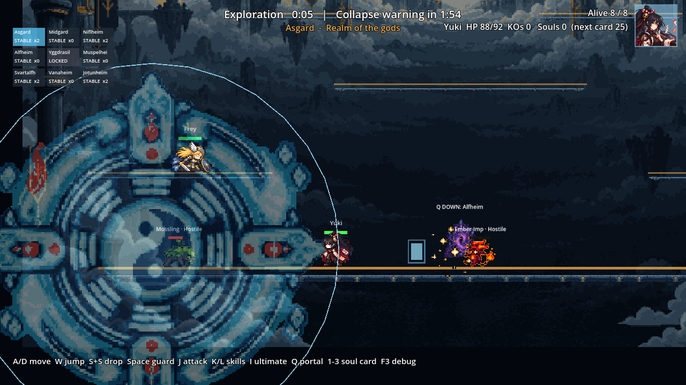
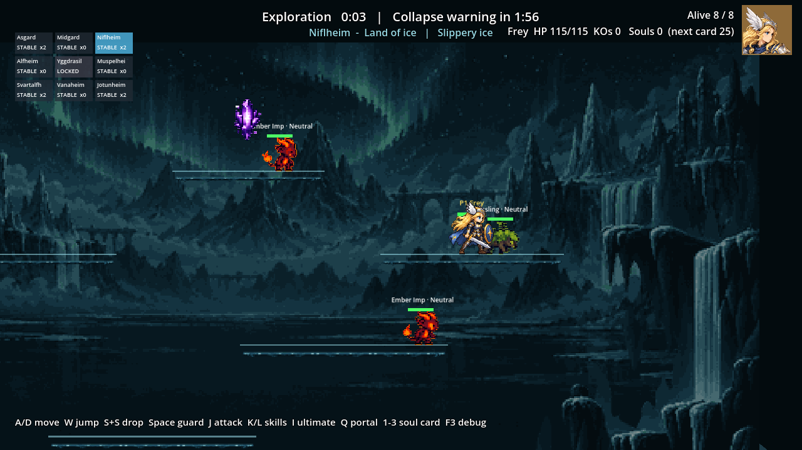

# CODEX-QA-13 — 전투·왕국 스케일 독립 검토

검토 기준: `9271339..baf1d55`, Godot 4.7, 2026-10-08. 제품 코드는 수정하지 않았다. 측정용 프로브만 `tests/analysis/codex_qa_13/`에 추가했다.

## 결론

- 플레이어는 기본 공중 점프까지 쓰면 **9개 왕국의 모든 플랫폼을 상호 이동할 수 있다.** 설계된 최소 계단 상승폭도 전부 봇의 `NAV_JUMP_RISE=277.5px` 이하다.
- 그러나 봇 경로 그래프는 그 277.5px을 허용하면서 일반 상향 이동 중 공중 점프를 전혀 누르지 않는다. 실제 지상 점프 최고점은 198.6–234.1px이므로 여러 왕국에서 계획과 실행이 불일치한다. Alfheim의 main `p0 → p1/p2` 263px 상승은 다섯 캐릭터 모두 단일 지상 점프로 불가능하다.
- seed 9–16의 경기 길이 중앙값은 **274초 → 393초(+119초, +43%)**로 늘었다. 첫 PvP는 5.9초 → 5.0초로 오히려 빨라졌고 링아웃은 74회 → 91회로 늘어, “전투를 못 만나서” 또는 “링아웃이 사라져서” 길어진 결과는 아니다.
- 스케일 누락은 스폰 간 최소 거리, 수풀 발견 거리, 일부 봇/몬스터 임계값, 지면 기준 앵커에서 재현했다. Rio 룬 반격은 히트 영역에 비해 보조 링 이펙트가 작다.

## 발견 사항 — 우선순위 순

### P1 · 버그 · 봇 경로 계획은 공중 점프 높이를 허용하지만 실행은 지상 점프 한 번뿐

**측정/재현**

- `scripts/EnemyAI.gd:41, 826-832`는 상승 링크를 `NAV_JUMP_RISE = 185 × 1.5 = 277.5px`까지 연결한다.
- `scripts/EnemyAI.gd:500-507`은 봇이 공중에 있으면 즉시 `_intent(direction, false)`를 반환한다. 공중 점프는 낙하 복귀 상태의 `scripts/EnemyAI.gd:613-628`에서만 사용한다.
- 실제 점프는 `characters/common/PlayerBase.gd:21, 268, 618-641`이다. 프로브 계산상 지상 점프 최고점은 Frey 198.6, Yuki 210.1, Luna 219.0, Nova 234.1, Rio 222.0px이다.
- 프로브가 찾은 대표적인 잘못된 계획 링크:

| 왕국 | 플랫폼 링크 | 상승/수평 틈 | 단일 지상 점프로 실패하는 캐릭터 |
|---|---:|---:|---|
| Asgard | p0 → p1/p2 | 208.5 / 0px | Frey |
| Midgard | p0 → p2 | 255.5 / 0px | Frey, Yuki, Luna |
| Alfheim | p0 → p1/p2 | 263.0 / 0px | 전원 |
| Muspelheim | p0 → p1/p2 | 222.5 / 0px | Frey, Yuki, Luna, Rio |
| Svartalfheim | p1/p2 → p3/p4 | 200.5 / 0–525px | Frey |
| Jotunheim | p0 → p3 | 263.0 / 0px | Frey(직접 링크); 우회도 일부 시작점에서 실패 |
| Yggdrasil Heart | p0 → p1/p2/p3 | 200–215 / 0px | Frey |

```text
경로 그래프: 상승 263px <= NAV 277.5px → “갈 수 있음”
                                ↓
실제 조작: 지상 점프 → 공중에서는 jump=false → 최고 198.6~234.1px
                                ↓
                         벽/단차에서 재계획 반복 가능
```

**제안 수정**: 경로 상승 중 정점 또는 하강 시작 시 공중 점프를 한 번 사용하게 하거나, 공중 점프를 쓰지 않을 정책이면 `NAV_JUMP_RISE`를 캐릭터별 실제 지상 점프 높이로 제한하고 263px 단차에 중간 경로를 둔다. 캐릭터별 높이와 실제 AI 입력을 함께 검증하는 회귀 테스트가 필요하다.

### P1 · 버그 위험/테스트 누락 · 스폰의 지면 상대 높이가 커져 소울 크리스탈 회귀 여유가 1px

**측정/재현**

- `scripts/realms/RealmCatalog.gd:239-247`은 플랫폼 중심 Y와 스폰 Y를 모두 1.5배하지만 플랫폼 두께는 1배로 둔다. 그 결과 스폰과 플랫폼 윗면의 실제 간격이 변경 전 42–58px에서 현재 **74–97px**로 커졌다.
- `scripts/SoulCrystal.gd:42-46`의 충돌체 하단은 크리스탈 원점에서 64px 아래다. 따라서 현재 모든 크리스탈 충돌체는 바닥까지 닿지 않고 10–33px 위에 끝난다.
- 기존 회귀 테스트 `tests/test_soul_crystals.gd:35-41`은 고정값 54px와 80px만 검사한다. 실제 최악 97px에서 “발보다 34px 높은 지상 타격점”은 크리스탈 기준 63px이고, 충돌체 하단 64px까지 **1px 여유**만 남는다.
- 현재 `test_soul_crystals`의 실제 공격 재현은 통과했으므로 “지금 모든 크리스탈이 안 맞는다”고 주장하지 않는다. 실제 레이아웃 최악 지점을 테스트하지 않는 회귀 위험이다.

**제안 수정**: 크리스탈은 스폰 좌표를 그대로 쓰지 말고 해당 X의 플랫폼 윗면에서 고정된 54–80px 위에 배치한다. 테스트도 고정 54/80 대신 모든 실제 스폰의 지면 간격을 순회해 지상 기본 공격 적중을 검증한다.

### P2 · 버그/밸런스 · 스케일되지 않은 AI·몬스터 거리

확정적으로 서로 다른 스케일 기준을 참조하는 항목이다.

| 위치 | 현재 | 일관된 값 | 근거/영향 |
|---|---:|---:|---|
| `scripts/EnemyAI.gd:72, 728` 수풀 발견 | 140px | 210px (`× WORLD`) | 카탈로그의 `notice_range`는 `RealmCatalog.gd:255`에서 210으로 변하지만 AI는 하드코딩 140을 사용한다. |
| `scripts/EnemyAI.gd:415` 전투 수직 판단 | 120px | 240px (`× COMBAT`) | 공격 수직 허용은 같은 파일 437에서 `115 × COMBAT=230px`; 120px부터 공격보다 접근/점프를 강제한다. |
| `scripts/EnemyAI.gd:445` 근접 기본기 분기 | 88px | 176px (`× COMBAT`) | 전투 프로필은 981에서 2배인데 이 분기만 그대로라 스킬 선택 분포가 바뀐다. |
| `scripts/EnemyAI.gd:58, 677` 저공격성 플레이어 페널티 | 거리 점수 900 | 1350 (`× WORLD`) | 실제 거리 항은 1.5배인데 의사 거리 페널티는 그대로라 초반 플레이어 표적이 상대적으로 유리해진다. |
| `scripts/RealmMonster.gd:220` 추적 해제 | x720/y360 | x1080/y540 (`× WORLD`) | 커진 왕국에서 더 가까운 상대도 일찍 포기한다. |
| `scripts/RealmMonster.gd:242` 근접 수직 범위 | 90px | 135px (`× WORLD`) | 같은 몬스터 공격 크기·사거리는 WORLD로 확장됐다. |
| `scripts/RealmMonster.gd:259` 원거리 추적 시작 | 260px | 390px (`× WORLD`) | 후퇴 임계값 145는 217.5로 바뀌었지만 추적 임계값만 260에 남았다. |

**제안 수정**: AI 전투 수치는 COMBAT, 지형·몬스터 수치는 WORLD라는 `GameScale.gd`의 소유 규칙대로 상수를 한 곳에서 파생한다. 수풀은 하드코딩 상수 대신 해당 왕국 hazard의 `notice_range`를 읽는 편이 안전하다.

### P2 · 밸런스 · 시작 스폰 최소 거리 320px이 월드 스케일을 따르지 않음

`scripts/Main.gd:343-357`의 두 번째 전투원 선택은 여전히 `distance < 320`만 거부한다. 원래 상대 배치 후보를 보존하려면 `320 × WORLD = 480px`이어야 한다.

프로브에서 “선택 가능한 두 스폰 조합 수”는 모든 왕국에서 480px을 쓰면 변경 전과 정확히 같았지만, 현재 320px은 다음처럼 더 가까운 조합을 추가했다.

| 왕국 | 변경 전 320px | 변경 후 현재 320px | 변경 후 480px |
|---|---:|---:|---:|
| Asgard | 17 | 26 | 17 |
| Midgard | 20 | 24 | 20 |
| Niflheim | 19 | 25 | 19 |
| Alfheim | 19 | 26 | 19 |
| Muspelheim | 10 | 21 | 10 |
| Svartalfheim | 15 | 25 | 15 |
| Vanaheim | 18 | 26 | 18 |
| Jotunheim | 16 | 28 | 16 |

공격 범위는 2배인데 시작 최소 거리는 그대로라, 맵이 커졌어도 첫 PvP가 5.9초에서 5.0초로 빨라진 결과와 방향이 맞는다. 인과 자체는 seed 집합이 달라 확정하지 않는다.

**제안 수정**: `320.0 * GAME_SCALE.WORLD`로 바꾸고, 변경 전/후 후보 쌍 수가 동일함을 테스트한다.

### P2 · 버그/시각 · 플랫폼 윗면에 붙어야 하는 앵커가 6.5–13.5px 뜸

플랫폼 중심 좌표는 1.5배하지만 두께는 1배인 반면 포털과 hazard 지점은 원점에서 단순 1.5배한다(`RealmCatalog.gd:239-247`). `RealmLayout.gd:151-152`는 포털 좌표를 명시적으로 “플랫폼 위에 서는 점”이라고 정의한다.

- 변경 전 포털의 지면 오차는 대부분 0px(중앙 UP만 3px)이었으나 현재 **6.5–13.5px 위**다.
- Midgard 수풀 bottom도 변경 전 0px에서 현재 **8–11.5px 위**다.
- 기능은 큰 포털 감지 사각형 덕분에 현재 작동하지만, 시각과 데이터 의미가 어긋났다.

**제안 수정**: 플랫폼 두께를 키우지 않을 방침은 유지하되, “플랫폼 윗면 기준” 포인트는 `scaled_top + 기존 상대 오프셋`으로 변환한다. 포털, 수풀 bottom, 다리 endpoint를 지면 앵커 유형으로 따로 스케일하는 편이 안전하다.

### P2 · 밸런스 · 경기 길이가 목표 상단으로 크게 이동

seed 9–16 중앙값 393초(6분 33초)는 최종 목표 5–7분 안이지만, 기준 274초보다 43% 길다. P90은 322 → 408초, 300초 미만은 5/8 → 3/8이다. seed 13은 420초 최종 판정까지 갔다.

첫 PvP는 더 빨라졌고 링아웃도 늘었으므로 단순 전투 부재가 원인은 아니다. 플레이어 처치가 47 → 42로 줄고 환경·몬스터 처치가 9 → 13으로 늘었다. 더 큰 회복 공간, 1.5배 넉백, 이동/공격 확장의 상호작용을 같은 seed A/B로 분해해야 한다.

**제안 수정**: 현재 수치는 “고장”은 아니지만 기준 대비 큰 이동이다. 동일 seed 1–16으로 변경 전/후 A/B를 돌린 뒤, 목표가 기존 밀도라면 후반 압박 또는 회복 여유를 조정한다.

### P3 · 느낌/시각 · Rio 룬 반격 링이 실제 공격 끝까지 표시하지 못함

- 공격은 `characters/rio/Rio.gd:287-291`에서 공용 helper를 타므로 크기와 점이 COMBAT 2배가 된다. 오른쪽 기준 중심 경로가 x=20→220px, 반폭 70px이므로 최대 x 약 290px이다.
- 보조 링은 `Rio.gd:317-330`에서 반지름 40px, 중심 x=40px으로 생성되고 COMBAT를 적용하지 않는다. 공격 lifetime 0.12초 시점의 보간 스케일을 약 2.05로 보면 오른쪽 끝은 약 122px로, 히트 영역 끝 290px의 절반에도 못 미친다.

**제안 수정**: 링의 중심은 `GAME_SCALE.attack_point(Vector2(40*facing, -36))`, 반지름은 `40 * COMBAT`에서 시작시키거나 실제 sweep bounds로부터 이펙트를 만든다.

### P3 · 느낌 · Yuki 궁극기 원형이 화면과 전투원을 크게 가림

캡처에서 지름 약 820px의 원형 문양이 화면 왼쪽 절반과 여러 전투원을 덮는다. 알파가 있어 플레이어 실루엣은 남지만, 최종 목표의 “effects should be clear … without covering important combat information” 기준에는 과하다. 히트 범위와 아트 크기는 서로 맞으므로 스케일 누락 버그가 아니라 가독성 문제다.



`원형 문양의 크기는 실제 410px 반경 필드와 맞지만, 화면 왼쪽의 플랫폼·몬스터·Frey를 한꺼번에 덮는다.`

## 도달성 표

`max rise`는 각 높은 플랫폼에 도달하는 가장 작은 유효 상승폭 중 최댓값이다. “플레이어”는 기본 공중 점프 포함, “NAV graph”는 현재 AI 경로 상수만 적용, 마지막 열은 실제 일반 이동이 공중 점프를 누르지 않는다고 가정한 지상 점프 그래프의 강연결 실패 캐릭터다.

| 왕국 | 플랫폼 | max rise | 플레이어 5명 | NAV graph | 실제 봇 지상 점프 불일치 |
|---|---:|---:|---|---|---|
| Asgard | 6 | 208.5 | 전원 가능 | 연결 | Frey |
| Midgard | 7 | 203.0 | 전원 가능 | 연결 | Frey, Yuki, Luna |
| Niflheim | 7 | 172.5 | 전원 가능 | 연결 | Frey, Yuki, Luna (일부 방향/수평 틈) |
| Alfheim | 6 | 263.0 | 전원 가능(공중 점프 필요) | 연결 | 전원 |
| Muspelheim | 6 | 222.5 | 전원 가능 | 연결 | Frey, Yuki, Luna, Rio |
| Svartalfheim | 7 | 202.5 | 전원 가능 | 연결 | Frey |
| Vanaheim | 6 | 191.0 | 전원 가능 | 연결 | 없음 |
| Jotunheim | 7 | 209.0 | 전원 가능 | 연결 | Frey |
| Yggdrasil Heart | 12 | 200.0 | 전원 가능 | 연결 | Frey |

캐릭터별 물리 높이:

| 캐릭터 | 지상 점프 | 기본 공중 점프 수 | 모두 쓴 최고 높이 |
|---|---:|---:|---:|
| Frey | 198.6 | 1 | 345.5 |
| Yuki | 210.1 | 1 | 365.6 |
| Luna | 219.0 | 1 | 381.0 |
| Nova | 234.1 | 1 | 407.3 |
| Rio | 222.0 | 2 | 550.3 |

계산은 상승 중 `GRAVITY=1850×1.2`, 공중 점프 속도 `jump×1.3416×0.86`, 하강 중 중력 1.18배, 캐릭터별 현재 이동 속도를 사용했다. 수평 도달은 플랫폼 가장자리 간 간격과 최대 속도의 비행 시간을 사용한 정적 상한이다.

## 독립 경기 측정

기준은 lead의 변경 전 seed 1–8, 검토값은 변경 후 seed 9–16이다. 서로 다른 seed 집합이므로 작은 캐릭터별 승률 차이는 추세로 단정하지 않는다.

| 지표 | 변경 전 | 변경 후 | 변화 |
|---|---:|---:|---:|
| 경기 길이 P10 / 중앙 / P90 | 255 / 274 / 322초 | 253 / 393 / 408초 | 중앙 +119초 (+43%) |
| 300초 미만 | 5/8 | 3/8 | -2경기 |
| 첫 PvP 중앙값 | 5.9초 | 5.0초 | -0.9초 |
| 종료 | 최후 생존 8 | 최후 생존 7, 최종 판정 1 | seed 13이 420초 도달 |
| 처치: 플레이어 / 환경 / 몬스터 | 47 / 3 / 6 | 42 / 6 / 7 | -5 / +3 / +1 |
| 총 링아웃 / 경기 중앙 | 74 / 9 | 91 / 14 | +17 / +5 |
| NaN 위치 | 0 | 0 | 동일 |
| 최종 노드 중앙 / 최대 노드 최댓값 | 1045 / 1269 | 1264 / 1457 | +21% / +15% |
| wall/sim 중앙 | 0.1489 | 0.1554 | 약 +4% |

| 캐릭터 | 변경 전 승률 | 변경 후 승률 | 변경 전 평균 피해 | 변경 후 평균 피해 |
|---|---:|---:|---:|---:|
| Frey | 50% | 38% | 198.4 | 216.6 |
| Nova | 38% | 0% | 120.9 | 151.9 |
| Rio | 13% | 25% | 146.4 | 176.1 |
| Luna | 0% | 25% | 134.4 | 92.1 |
| Yuki | 0% | 13% | 88.9 | 106.7 |

변경 후 개별 경기: 228.5, 252.8, 285.3, 315.5, 393.4, 405.5, 408.1, 420.0초. 타임아웃은 없고 420초는 설계된 최종 판정이다.

## 정상적으로 1배를 유지해야 하는 값

- 전투원 자체 크기: 42×64 hurtbox, `BODY_CENTRE=(0,-32)`, soft collision, 이름표/HP bar와 몸 기준 히트 피드백 오프셋.
- 가드 호, 포털 그림·감지 크기, 도착 시 발 오프셋처럼 전투원 한 명의 물리 크기에 맞춘 값. 단, 포털의 **월드 위치 앵커**는 플랫폼 윗면에 다시 맞춰야 한다.
- 카메라 edge padding과 off-screen marker inset은 화면 픽셀 값이므로 WORLD를 곱하지 않는 것이 맞다.
- 플랫폼 두께, 수풀 높이, 다리 두께는 캐릭터가 1배인 방침과 일치한다. 문제는 두께가 아니라 그 윗면에 붙는 좌표의 변환 방식이다.

## 시각 확인



`1.5배 왕국에서 카메라 추적과 플랫폼 표시가 동작하며, 전투원 크기는 유지됐다. 크리스탈은 스폰 좌표를 공유해 플랫폼 위 간격도 함께 커졌다.`

Frey, Luna, Nova, Rio, Yuki의 `ultimates_after1/*_1.png`를 모두 확인했다. Luna 레이저는 길지만 세로 폭이 좁고, Frey 파동과 Rio/Nova 궁극기는 중심 전투원 실루엣이 남았다. 가장 큰 가독성 위험은 위 Yuki 원형 필드였다.

## 확인 및 테스트

- `reachability_probe.gd`: parse/runtime 오류 없이 완료. 결과는 `raw/reachability.json`.
- `run_sweep.ps1 -FirstSeed 9 -SeedCount 8`: 8개 결과 모두 생성. 각 run은 알려진 sandbox 인증서 오류 1줄 때문에 러너상 `pass=False`; 그 외 `SCRIPT ERROR`, `Parse Error`, NaN, 결과 누락은 없었다.
- `tests/run_all.ps1 -SoakRuns 1`: 캐릭터 구조, Frey sprite, Luna/Nova/Rio, 궁극기, 매치 규칙(13), hazard(7), soul crystal, art, sprite frame(184), off-screen marker, restart(10) 테스트가 모두 자체 통과 문구와 exit 0을 냈다. 러너 최종 상태는 각 프로세스의 알려진 인증서 `ERROR` 때문에 실패다. visual preview와 soak도 exit 0이며 soak의 유일한 engine error가 같은 인증서 줄이었다.
- import 단계에서는 인증서 오류 외에 sandbox에서 `C:/Users/TH/AppData/Local/Godot` editor cache를 만들거나 저장할 수 없다는 오류도 발생했다. 이후 게임/테스트 실행에서는 이 추가 오류가 재발하지 않았다.

## 확인하지 못한 것 / 추측으로만 남긴 것

- 사람 조작 감각, 실제 봇이 각 문제 링크에서 몇 초 동안 반복하는지, 모든 공격 프레임의 시각 정합성은 자동 측정만으로 확정하지 못했다.
- 변경 전과 변경 후를 동일 seed 9–16으로 실행하지 못했다. 경기 길이·승률 변화에는 seed 차이가 섞여 있다.
- Frey 궁극기 낙하 속도(`Frey.gd:234`), Nova 코어/궤도 거리(`Nova.gd:14, 22-25`), 각 기본기의 자체 이동 impulse가 1배인 것은 누락 후보지만 “공격 이동도 COMBAT/WORLD로 늘린다”는 명시가 없어 버그로 주장하지 않았다.
- Vanaheim vine rect는 플랫폼 사이 임시 다리라 단순 “가장 가까운 플랫폼 top” 비교가 의미 없었다. 실제 endpoint 접합은 별도 장면 충돌 검사로 확인해야 한다.

## 산출물

- `smash-nine-prototype/tests/analysis/codex_qa_13/reachability_probe.gd`
- `reports/codex-qa-13/raw/reachability.json`
- `reports/codex-qa-13/raw/reachability_probe.log`
- `reports/codex-qa-13/raw/sweep_9_16.jsonl`
- `reports/codex-qa-13/raw/sweep_9_16.log`
- `reports/codex-qa-13/raw/sweep_9_16_summary.txt`

