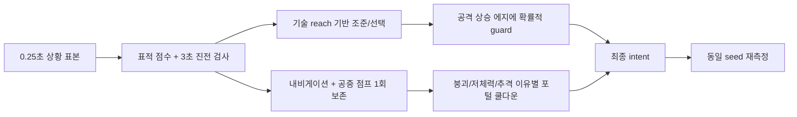

# CODEX-QA-14 — 봇 행동 데이터와 개선안 토론

## 데이터

### 측정 조건과 판정 기준

- Godot 4.7, `--headless --fixed-fps 60`, 봇 8명, seed 101~112의 12경기.
- 최대 480초로 실행했으며 12경기 모두 자연 종료했다. 결과 원본은 `results.json`이다.
- `EnemyAI.debug_snapshot(player)`를 0.25초마다 표본화했다. 공격 시작과 피해, 링아웃, 처치는 매 물리 프레임/신호로 관측했다.
- 적중은 카드 요구대로 **공격 시작 후 0.4초 안에 피해가 확인된 공격**이다. 즉 Rio의 지속 강화형 궁극기와 Yuki의 지연형 궁극기는 실제 기여보다 낮게 잡힐 수 있다.
- `진전 없음`은 표적 유지 3초 이상이면서 추격 상태 또는 높이 차 240px 이상이 3초 이상이고, 최초 거리에서 `max(100px, 10%)` 이상 좁히지 못한 에피소드다.
- `stuck`은 이동 명령 중 `stuck_timer >= 0.5초`다. 위치는 영역 로컬 좌표를 100px 단위로 묶었다.
- 회복 성공은 `recover` 상태에서 링아웃 없이 이탈한 횟수다. 같은 낙하에서 상태가 짧게 끊겼다 재진입하면 여러 회로 셀 수 있으므로 절대 횟수보다 실패율과 링아웃 당시 자원에 무게를 둔다.

### 경기 단위 결과

| seed | 길이(초) | 승자 | 링아웃 | 포털 | 붕괴 재배치 | 회복 성공/실패 | 20초+ 대치 |
|---:|---:|---|---:|---:|---:|---:|---:|
| 101 | 313.2 | Luna | 8 | 78 | 2 | 98 / 8 | 0 |
| 102 | 313.5 | Nova | 6 | 108 | 0 | 91 / 7 | 1 |
| 103 | 303.4 | Yuki | 8 | 77 | 2 | 130 / 5 | 1 |
| 104 | 291.3 | Yuki | 14 | 69 | 1 | 66 / 14 | 0 |
| 105 | 332.1 | Frey | 16 | 99 | 0 | 82 / 16 | 1 |
| 106 | 381.7 | Yuki | 15 | 106 | 0 | 202 / 16 | 1 |
| 107 | 340.1 | Rio | 9 | 136 | 0 | 68 / 9 | 0 |
| 108 | 205.7 | Rio | 16 | 96 | 0 | 99 / 17 | 0 |
| 109 | 285.2 | Frey | 18 | 105 | 1 | 113 / 21 | 0 |
| 110 | 308.0 | Frey | 5 | 91 | 1 | 108 / 5 | 1 |
| 111 | 259.9 | Frey | 15 | 76 | 0 | 167 / 16 | 0 |
| 112 | 301.4 | Frey | 13 | 90 | 0 | 118 / 12 | 0 |

중앙값은 **305.7초**, 범위는 205.7~381.7초다. 총 링아웃은 **143회, 경기당 11.9회**다. 승수는 Frey 5, Yuki 3, Rio 2, Luna 1, Nova 1이다. 12경기 표본이므로 승률은 밸런스 확정값이 아니라 이상 신호로만 사용한다.

### 상태·교전 행동·표적 — 캐릭터별

아래 비율은 살아 있는 봇 시간 기준이다. 행동 비율은 `engage` 상태 안에서만 계산했다.

| 캐릭터 | wander | pursue | engage | portal | recover | engage 행동(approach / cross / hold / jump_in / retreat) | 표적 player / monster / crystal |
|---|---:|---:|---:|---:|---:|---|---|
| Frey | 0.2% | 13.0% | 82.0% | 1.6% | 3.1% | 30.4 / 22.2 / 27.2 / 20.1 / 0% | 50.4 / 36.0 / 11.6% |
| Luna | 0.4% | 9.5% | 78.7% | 5.0% | 6.4% | 30.3 / 24.9 / 30.2 / 14.7 / 0% | 44.5 / 41.3 / 11.4% |
| Nova | 0.2% | 9.2% | 82.6% | 3.5% | 4.5% | 28.8 / 23.9 / 30.1 / 17.2 / 0% | 44.9 / 42.4 / 9.5% |
| Rio | 0.2% | 11.2% | 77.7% | 4.4% | 6.5% | 29.4 / 23.3 / 29.4 / 17.9 / 0% | 48.1 / 39.7 / 10.0% |
| Yuki | 0.4% | 8.3% | 81.2% | 2.7% | 7.5% | 9.5 / 5.0 / 36.8 / 10.2 / 38.4% | 38.5 / 48.0 / 11.1% |

### 상태·표적 — 경기 단계별

| 단계 | 상태 wander / pursue / engage / portal / recover | 표적 player / monster / crystal / none |
|---|---|---|
| Exploration | 0.2 / 11.4 / 80.9 / 2.3 / 5.2% | 32.3 / 52.2 / 12.7 / 2.8% |
| Corner warning | 0.5 / 10.5 / 74.9 / 7.5 / 6.7% | 56.5 / 31.9 / 7.6 / 4.0% |
| Convergence | 0.5 / 9.1 / 80.0 / 5.2 / 5.2% | 53.1 / 33.0 / 11.7 / 2.2% |
| Central brawl | 0.0 / 7.0 / 87.2 / 0.1 / 5.7% | 86.5 / 11.8 / 1.3 / 0.4% |
| Sudden death* | 0.0 / 8.0 / 50.0 / 0.0 / 42.0% | 0.0 / 100.0 / 0.0 / 0.0% |

`*` Sudden death는 seed 106의 43.5 bot-seconds뿐이라 일반화하지 않는다. 다만 마지막 국면에서도 몬스터 표적이 남는다는 재현 사례다.

### 표적 전환과 도달 실패

| 캐릭터 | 표적 전환/분 | 진전 없음 에피소드 | 진전 없음 시간 | 활성 시간 대비 |
|---|---:|---:|---:|---:|
| Frey | 13.8 | 32 | 363.0초 | 8.1% |
| Luna | 13.3 | 30 | 312.2초 | 7.3% |
| Nova | 15.1 | 25 | 292.0초 | 6.7% |
| Rio | 13.6 | 22 | 233.0초 | 6.0% |
| Yuki | 15.0 | 25 | 242.8초 | 6.5% |
| **합계** | — | **134** | **1,443.0초** | **7.0%** |

진전 없음 시간 중 **975.25초(67.6%)**는 표적과 높이 차가 240px보다 큰 시간이었다. 측정값은 “추격이 오래 걸렸다”는 사실이고, 정말 길이 없는지는 프로브가 내비게이션 그래프의 실패 이유까지 기록하지 않으므로 추정하지 않았다.

### 공격 사용과 적중률

| 캐릭터 | 전체 공격 | 전체 적중률 | basic side | basic air-side | skill 1 | skill 2 | ultimate |
|---|---:|---:|---:|---:|---:|---:|---:|
| Frey | 4,701 | 37.0% | 36.8% (3425) | 25.1% (718) | **72.6%** (296) | 14.9% (161) | 58.4% (101) |
| Luna | 3,574 | 39.1% | 44.3% (2075) | 37.9% (443) | 29.6% (787) | 18.7% (182) | 48.3% (87) |
| Nova | 3,900 | 40.1% | **48.0%** (2686) | 35.4% (611) | **2.4%** (294) | 11.7% (222) | 29.9% (87) |
| Rio | 4,043 | 32.7% | 45.2% (2207) | 30.8% (584) | 15.0% (966) | **1.0%** (196) | 0.0%* (90) |
| Yuki | 3,476 | 32.5% | 46.8% (1943) | 29.6% (416) | **5.7%** (794) | 21.1% (247) | 1.3%* (76) |

괄호는 사용 횟수다. 모든 기본 공격은 코드상 `side` 또는 `air_side`였고 **up/down/air-up/air-down은 0회**다. 유형 합계는 basic side 12,336회(43.6%), air-side 2,772회(31.3%), skill 1 3,137회(20.6%), skill 2 1,008회(13.7%), ultimate 441회(29.0%)다. `*` 지속/지연형 궁극기는 0.4초 판정 창 때문에 과소계측된다.

| 캐릭터 | PvP 피해/활성 분 | 관측된 몬스터 피해/활성 분 |
|---|---:|---:|
| Frey | **53.0** | 72.7 |
| Luna | 32.2 | 59.3 |
| Nova | 41.0 | **83.1** |
| Rio | 39.3 | 69.0 |
| Yuki | 35.3 | 55.9 |

### 링아웃과 회복

| 캐릭터 | 링아웃 | 공중 점프 0인 링아웃 | recover 중 링아웃 | recover 성공 / 실패 | 성공률* |
|---|---:|---:|---:|---:|---:|
| Frey | 18 | 15 (83.3%) | 16 | 188 / 16 | 92.2% |
| Luna | 27 | 22 (81.5%) | 25 | 311 / 25 | 92.6% |
| Nova | 34 | 25 (73.5%) | 29 | 206 / 29 | 87.7% |
| Rio | 14 | 5 (35.7%) | 12 | 330 / 12 | **96.5%** |
| Yuki | 50 | 45 (90.0%) | 47 | 307 / 47 | **86.7%** |
| **합계** | **143** | **112 (78.3%)** | **129 (90.2%)** | **1,342 / 129** | **91.2%** |

`*` 끝나지 않은 회복 17회는 성공률 분모에서 제외했다. Rio가 점프 0 상태에서도 상대적으로 잘 산 것은 회복 스킬을 쓰는 현재 정책과 일치하지만 인과를 증명한 값은 아니다.

### 포털·붕괴·저체력 이탈

- 포털 이동 **1,131회, 경기당 94.3회**.
- 붕괴 경고 영역에서 포털로 탈출 **190회**, 붕괴 강제 재배치 **7회**.
- 저체력 이유의 포털 이동 **303회(전체 포털의 26.8%)**.
- 저체력 이동 후 10초 관측: 303건 중 **302건(99.7%)이 다시 engage**, **270건(89.1%)이 다시 피해**, 271건은 10초 생존, 32건은 10초 전에 처치됐다. 평균 HP 변화는 **-0.24**로 사실상 회복 이득이 없었다.
- 저체력 이탈 외 포털이 638회(56.4%)다. 여기에는 일반 로밍과 화면 밖 추격이 섞여 있다.

### 정지·대치 위치

`stuck` 총량은 **26.5초 / 20,707.5 bot-seconds = 0.128%**로 작았다. 최악 지점도 개별 누적 1.5초였다.

| 영역(인덱스) | 로컬 위치(약) | stuck 시간 |
|---|---:|---:|
| Niflheim (2) | (700, 700) | 1.50초 |
| Muspelheim (4) | (1100, 700) | 1.50초 |
| Yggdrasil Heart (8) | (1300, 1200) | 1.25초 |
| Jotunheim (7) | (800, 900) | 1.25초 |
| Svartalfheim (5) | (1200, 600) | 1.25초 |

20초 이상 같은 영역에 2명 이상 있으면서 상호 피해가 없던 대치는 5건(20.3, 21.2, 22.0, 32.2, **90.9초**)이었다. 최장 건은 seed 106, 중앙 영역에서 290.9~381.7초였다.

## 7개 제안 판정

아래에서 **측정**은 이 프로브의 수치, **코드**는 정적 추적, **추정**은 변경 후 기대 효과다.

| # | 판정 | 근거 | 권장 변경과 기대 효과 |
|---:|---|---|---|
| 1 | **찬성, 구현 방식 변경** | **측정:** 기본 공격 15,108회가 side/air-side뿐이며 수직형 0회. air-side 적중률 31.3%는 지상 side 43.6%보다 낮다. **코드:** `PlayerBase.gd:805-828`은 봇 y를 0으로 고정하고, 스킬 조준은 `:910-920`의 `ai_controller.aim_direction`을 읽는다. AI는 회복 스킬 때만 aim을 쓴다(`EnemyAI.gd:647-650`). | 매 공격 프레임에 무조건 정규화 벡터를 주기보다, 표적 오프셋과 **그 기술의 실제 세로/가로 reach**로 cardinal 방향을 고른다. `PlayerBase._get_attack_direction()`도 봇이면 AI aim을 읽게 한다. 수직 추격과 플랫폼 상하 견제가 생길 것으로 예상한다. |
| 2 | **찬성, 제한적 반응형** | **코드:** AI intent에는 move/jump/attack만 있고(`EnemyAI.gd:292-314`) guard 경로가 없다. guard/parry는 `PlayerBase.gd:443-465`, parry 창은 `:59`의 0.1초다. `attack_lock_timer`는 startup+recovery 전체이므로 단순 `>0`은 공격 시작 시점을 뜻하지 않는다(`:838-847`). | 표적 lock timer의 **상승 에지**를 기억하고, 지상·정면·공격 도달 범위일 때 30~40% 확률, 0.08~0.18초 반응 지연, 0.18~0.35초 유지로 guard한다. 공중/후방/먼 거리에서는 금지한다. 완벽 parry 봇이 아니라 읽을 수 있는 방어와 헛가드가 함께 생긴다. |
| 3 | **강한 찬성** | **측정:** 링아웃 143회 중 112회(78.3%)가 공중 점프 0, 129회(90.2%)가 recover 중이었다. Yuki는 90.0%가 점프 0, 회복 성공률 86.7%로 최저다. **코드:** 일반 등반도 `air_jumps_left > 0`이면 마지막 점프를 쓴다(`EnemyAI.gd:518-529`). | 안정 지형의 등반은 `air_jumps_left > 1`일 때만 추가 점프. 마지막 1회는 “지상 점프로 불가능하지만 다음 착지점은 공중 점프로 도달 가능”이 확인될 때만 허용한다. `recover`에서는 지금처럼 마지막 점프를 즉시 쓴다. 특히 Yuki/Nova 링아웃 감소가 기대된다. |
| 4 | **찬성** | **측정:** 진전 없는 표적 134건, 1,443초(활성 시간 7.0%); 그중 67.6%가 큰 높이 차였다. **코드:** 표적은 1.6초마다 재선정하지만(`EnemyAI.gd:681-685`) 무효 조건은 사망/영역/최대 거리뿐이다(`:738-759`). 점수는 거리와 초기 플레이어 페널티만 쓴다(`:687-727`). | 표적별 최근 최단거리를 저장해 **3초 동안 100px 또는 10%도 개선하지 못하면 해제, 6초 blacklist**. path가 비고 높이 차 >240px면 즉시 같은 판정 후보로 둔다. 생존자 ≤4 또는 Central부터 monster/crystal 점수에 +1200px, player에 -300px를 적용한다. |
| 5 | **찬성** | **측정:** Nova 궁극기 87회 중 0.4초 적중 26회(29.9%). **코드:** AI 후속 입력은 정해진 시간에 `ultimate()`만 누른다(`EnemyAI.gd:316-329`). Nova는 두 번째 궁극기 입력 시 현재 접선으로 발사(`Nova.gd:103-108, 361-375`)하고, 발사 중 skill 1만 표적 방향 재지정이 가능하다(`:96-100, 381-393`). | orbit에서 `tangent.dot(target_direction) >= cos(20°)`가 될 때 발사하되 최대 대기는 0.7초. 각도가 나쁘면 발사 직후 한 번만 skill 1 redirect하고 aim을 최신 표적 위치로 준다. 가장자리 쪽 발사는 안전 검사로 보류한다. |
| 6 | **변경** | **측정:** 즉시 적중률은 Frey 58.4%, Luna 48.3%, Nova 29.9%, Yuki 1.3%, Rio 0%. 뒤의 둘은 지연/강화형이라 0.4초 수치 자체가 전부는 아니다. **코드:** 현재는 준비 완료+플레이어 표적이면 일률적으로 45% 랜덤이다(`EnemyAI.gd:57, 451-460`). | “범위/다수/저체력” 한 규칙 대신 캐릭터 정책을 둔다. Frey/Luna는 실제 영역·세로 밴드, Nova는 pull 반경+발사 각, Yuki는 봉인 영역에 잡힐 플레이어, Rio는 **즉시 적중이 아니라 앞으로 교전할 시간**을 조건으로 한다. 준비된 궁극기를 무작위 basic 대체로 소비하지 않는다. |
| 7 | **반대 — 그대로 두지 말 것** | **측정:** 저체력 포털 303회 뒤 99.7%가 10초 안에 재교전, 89.1%가 다시 피해, 평균 HP 변화 -0.24. 경기 길이 중앙값은 305.7초라 “매치를 길게 끈다”는 증거는 약하지만, 이탈 목적에는 거의 실패했다. **코드:** HP <35%면 aggression <0.9인 동안 포털을 찾는다(`EnemyAI.gd:223-229, 732-736`). 회복은 무피해 4초 뒤 시작한다(`PlayerBase.gd:76, 359-370`). | 저체력 포털은 목적지에 적이 0명이고 stable일 때만, 성공 후 전용 8초 쿨다운. 그런 포털이 없으면 현 영역에서 표적을 끊고 안전 지점으로 4초 후퇴한다. 성공 기준은 “포털 사용”이 아니라 **4초 무피해 달성**으로 둔다. |

## 추가 발견 — 영향도 순

1. **P0 — 포털 이동 자체가 과다하다.** 1,131회, 경기당 94.3회다. 붕괴 탈출 190회와 저체력 303회를 빼도 638회가 남는다. 화면 내 무표적 로밍 10%(`EnemyAI.gd:242-248`)와 화면 밖 추격/방랑 확률(`:933-949`)에 공통 **영역 이동 쿨다운 8~12초**와 명시적 이유를 요구할 것을 권한다.
2. **P1 — 캐릭터 공통 랜덤 공격표가 기술별 실패를 만든다.** Nova skill 1은 294회 중 2.4%, Yuki skill 1은 794회 중 5.7%, Rio skill 2는 196회 중 1.0%인데 Frey skill 1은 72.6%다. `_choose_attack`(`EnemyAI.gd:451-480`)을 캐릭터별 사거리·용도·지형 조건 표로 바꾸고, 2라운드에서 기술별 적중률을 비교한다.
3. **P1 — 회복 능력 격차가 크다.** Rio는 링아웃 때 공중 점프 0이 35.7%, 회복 성공률 96.5%인 반면 Yuki는 90.0%, 86.7%다. 공통 점프 보존 외에 Yuki/Nova도 캐릭터별 회복 기술/공중 제어를 AI가 인식하도록 해야 한다.
4. **P1 — 최종 영역 몬스터가 결승 집중을 깨는 재현 사례가 있다.** Central에서도 표적 11.8%가 몬스터였고, seed 106은 중앙에서 90.9초 무피해 대치 후 381.7초에 끝났다. Central 진입 시 몬스터 AI 표적 가중치를 0에 가깝게 하거나 몬스터를 정리하는 규칙을 검토한다.
5. **P2 — Frey AI 효율이 다시 높다.** PvP 피해/분 53.0으로 다음 Nova 41.0보다 29% 높고, 12승 중 5승이었다. 특히 skill 1 적중률 72.6%가 다른 캐릭터 기술과 동떨어진다. 수치 너프 전에 캐릭터별 기술 선택기를 먼저 고친 뒤 동일 seed로 재측정한다.

## 권장 구조



위 구조는 표적·전투·이동·포털의 실패 원인을 따로 측정하게 해, 한 변경이 다른 행동을 가리는 일을 줄인다.

## 확인 및 재실행

최종 실행은 12/12 자연 종료했고, seed 101~112를 두 번 실행했을 때 경기 길이·링아웃·포털 수가 동일했다. 최종 실행의 Godot 출력에는 알려진 `Failed to read the root certificate store` 외 `SCRIPT ERROR`, `Parse Error`, 다른 `ERROR`가 없었다. 전체 게임 테스트 스위트는 카드 범위가 아니어서 실행하지 않았다.

프로젝트 루트 `smash-nine-prototype/`에서 다음 한 명령으로 동일 요약과 `reports/codex-qa-14/results.json`을 다시 만든다.

```powershell
powershell -ExecutionPolicy Bypass -File tests/analysis/codex_qa_14/run_probe.ps1
```
