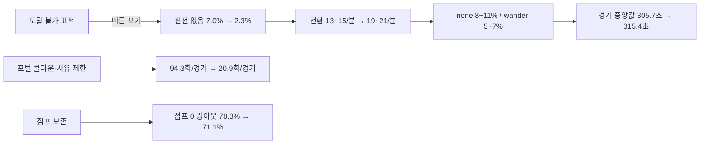

# CODEX-QA-14 Round 2 — 봇 변경 전/후 재측정

## 결론 먼저

동일 seed 101~112의 12경기에서 **포털 이동(1,131→251), 진전 없는 표적 시간(1,443.0→494.0초), 20초+ 대치(5→1건), 총 링아웃(143→135)**은 개선됐다. 반면 경기 길이 중앙값은 **305.7→315.4초(+9.7초)**로 늘었고, seed 108은 +152.2초, seed 111은 +74.8초였다. 표적 포기 기능은 막힌 추격을 줄였지만 `wander`/무표적 시간과 표적 전환을 크게 늘렸고, 중앙전 몬스터 표적 비율도 11.8→17.1%로 악화됐다.

아래 수치는 측정값이다. 마지막의 원인 해석과 수정 우선순위는 측정값에 근거한 제안이며, 인과가 입증된 사실과 구분했다.

## 핵심 전후표

| 지표 | Round 1 | Round 2 | 변화 |
|---|---:|---:|---:|
| 경기 길이 중앙값 | 305.7초 | 315.4초 | **+9.7초 (+3.2%)** |
| 경기 길이 범위 | 205.7~381.7초 | 253.1~357.9초 | 최단 경기 +47.4초 |
| 링아웃 | 143 (11.9/경기) | 135 (11.3/경기) | -8 (-5.6%) |
| 공중 점프 0 링아웃 | 112/143 (78.3%) | 96/135 (71.1%) | -7.2%p |
| 회복 성공률 | 1,342/1,471 (91.2%) | 1,587/1,713 (92.6%) | +1.4%p |
| 포털 이동 | 1,131 (94.3/경기) | 251 (20.9/경기) | **-77.8%** |
| 붕괴 탈출 / 강제 재배치 | 190 / 7 | 110 / 9 | 탈출 -80, 재배치 +2 |
| 저체력 포털 | 303 | 15 | -95.0% |
| 진전 없음 에피소드 | 134 | 54 | -59.7% |
| 진전 없음 시간 | 1,443.0초 (7.0%) | 494.0초 (2.3%) | **-65.8%, -4.7%p** |
| 큰 높이 차가 포함된 진전 없음 | 975.25초 (67.6%) | 258.0초 (52.2%) | -717.25초 |
| `stuck` | 26.5초 (0.128%) | 37.0초 (0.170%) | **+10.5초, +0.042%p** |
| 20초+ 대치 | 5건 (최장 90.9초) | 1건 | -4건 |
| 총 공격 / 전체 적중 | 19,694 / 36.3% | 20,080 / 38.4% | +386 / +2.1%p |

## 경기별 동일 seed 비교

| seed | 길이 전→후 (증감) | 승자 전→후 | 링아웃 전→후 | 포털 전→후 | 재배치 전→후 | 대치 전→후 |
|---:|---:|---|---:|---:|---:|---:|
| 101 | 313.2→253.1 (-60.1) | Luna→Nova | 8→11 | 78→22 | 2→2 | 0→0 |
| 102 | 313.5→281.8 (-31.7) | Nova→Frey | 6→10 | 108→19 | 0→0 | 1→0 |
| 103 | 303.4→305.1 (+1.7) | Yuki→Yuki | 8→12 | 77→23 | 2→1 | 1→0 |
| 104 | 291.3→340.3 (+49.0) | Yuki→Frey | 14→11 | 69→20 | 1→1 | 0→0 |
| 105 | 332.1→267.3 (-64.8) | Frey→Yuki | 16→8 | 99→19 | 0→0 | 1→0 |
| 106 | 381.7→327.5 (-54.2) | Yuki→Nova | 15→13 | 106→21 | 0→1 | 1→0 |
| 107 | 340.1→329.7 (-10.4) | Rio→Frey | 9→11 | 136→19 | 0→1 | 0→0 |
| 108 | 205.7→357.9 (**+152.2**) | Rio→Nova | 16→14 | 96→17 | 0→1 | 0→0 |
| 109 | 285.2→256.0 (-29.2) | Frey→Yuki | 18→12 | 105→18 | 1→1 | 0→0 |
| 110 | 308.0→281.3 (-26.7) | Frey→Luna | 5→12 | 91→22 | 1→0 | 1→1 |
| 111 | 259.9→334.7 (**+74.8**) | Frey→Nova | 15→10 | 76→29 | 0→0 | 0→0 |
| 112 | 301.4→325.7 (+24.3) | Frey→Frey | 13→11 | 90→22 | 0→1 | 0→0 |

승수는 Frey 5→4, Yuki 3→3, Rio 2→0, Luna 1→1, Nova 1→4다. 12경기 표본이므로 밸런스 확정값이 아니라 변화 신호다.

## 상태·교전 행동·표적 — 캐릭터별

표기는 모두 `Round 1→Round 2`이며 살아 있는 봇 시간 기준이다. 행동 비율은 `engage` 안에서만 계산했다.

| 캐릭터 | wander / pursue / engage / portal / recover | 행동 approach / cross / hold / jump / retreat | 표적 player / monster / crystal / none |
|---|---|---|---|
| Frey | 0.2→7.2 / 13.0→17.7 / 82.0→68.8 / 1.6→2.1 / 3.1→4.2% | 30.4→28.6 / 22.2→21.8 / 27.2→27.4 / 20.1→20.4 / 0→1.8% | 50.4→40.7 / 36.0→40.1 / 11.6→7.8 / 2.0→11.4% |
| Luna | 0.4→6.0 / 9.5→10.8 / 78.7→75.5 / 5.0→3.1 / 6.4→4.5% | 30.3→27.8 / 24.9→24.2 / 30.2→30.9 / 14.7→14.1 / 0→2.9% | 44.5→39.2 / 41.3→44.2 / 11.4→6.8 / 2.8→9.8% |
| Nova | 0.2→5.2 / 9.2→13.2 / 82.6→72.5 / 3.5→2.5 / 4.5→6.6% | 28.8→28.2 / 23.9→23.0 / 30.1→29.0 / 17.2→17.2 / 0→2.6% | 44.9→39.7 / 42.4→42.4 / 9.5→9.2 / 3.2→8.7% |
| Rio | 0.2→4.9 / 11.2→12.3 / 77.7→71.9 / 4.4→2.3 / 6.5→8.5% | 29.4→28.5 / 23.3→21.1 / 29.4→28.8 / 17.9→18.0 / 0→3.5% | 48.1→36.8 / 39.7→46.0 / 10.0→9.2 / 2.2→8.0% |
| Yuki | 0.4→5.6 / 8.3→9.7 / 81.2→77.9 / 2.7→0.8 / 7.5→6.0% | 9.5→10.2 / 5.0→7.3 / 36.8→34.3 / 10.2→10.3 / 38.4→37.8% | 38.5→40.3 / 48.0→45.3 / 11.1→6.8 / 2.4→7.7% |

`none`의 Round 1 값은 원자료에서 계산했다. 모든 캐릭터에서 `wander`와 무표적 시간이 증가했고, Frey/Rio의 플레이어 표적 비중이 각각 -9.7%p/-11.3%p였다.

## 상태·표적 — 경기 단계별

| 단계 | 상태 W/P/E/O/R 전→후 | 표적 player / monster / crystal / none 전→후 |
|---|---|---|
| Exploration | 0.2/11.4/80.9/2.3/5.2 → 7.2/12.6/72.5/0.2/7.5% | 32.3/52.2/12.7/2.8 → 28.8/52.0/8.8/10.4% |
| Corner warning | 0.5/10.5/74.9/7.5/6.7 → 4.9/11.0/71.1/7.9/5.1% | 56.5/31.9/7.6/4.0 → 36.5/43.6/9.4/10.4% |
| Convergence | 0.5/9.1/80.0/5.2/5.2 → 5.0/13.6/72.5/4.3/4.6% | 53.1/33.0/11.7/2.2 → 48.1/36.1/7.2/8.7% |
| Central brawl | 0.0/7.0/87.2/0.1/5.7 → 2.2/16.7/79.7/0.0/1.4% | 86.5/11.8/1.3/0.4 → **75.2/17.1/4.3/3.4%** |
| Sudden death | seed 106의 43.5 bot-sec | 표본 없음 | Round 2는 모두 360초 전에 종료 |

## 표적 전환·도달 실패

| 캐릭터 | 전환/분 전→후 | 에피소드 전→후 | 시간 전→후 | 활성 시간 대비 전→후 |
|---|---:|---:|---:|---:|
| Frey | 13.8→20.1 | 32→17 | 363.0→122.5초 | 8.1→2.4% |
| Luna | 13.3→20.9 | 30→12 | 312.2→68.0초 | 7.3→1.7% |
| Nova | 15.1→19.0 | 25→7 | 292.0→104.8초 | 6.7→2.1% |
| Rio | 13.6→19.1 | 22→9 | 233.0→129.0초 | 6.0→3.6% |
| Yuki | 15.0→19.3 | 25→9 | 242.8→69.8초 | 6.5→1.8% |

도달 실패 시간은 크게 줄었지만, 전환 빈도는 모든 캐릭터에서 27~57% 늘었다. 이것은 “더 빨리 포기한다”는 측정 결과이며, 경기 길이 증가의 단독 원인이라고 단정할 수는 없다.

## 공격 사용·적중률

| 캐릭터 | 전체 공격 전→후 | 전체 적중 전→후 | basic side | air-side | skill 1 | skill 2 | ultimate (0.4초 창) |
|---|---:|---:|---:|---:|---:|---:|---:|
| Frey | 4,701→3,868 | 37.0→48.8% | 36.8→61.0% | 25.1→29.9% | 72.6→68.3% | 14.9→11.8% | 58.4→39.6% |
| Luna | 3,574→3,326 | 39.1→46.9% | 44.3→51.4% | 37.9→39.6% | 29.6→50.1% | 18.7→24.0% | 48.3→36.1% |
| Nova | 3,900→3,915 | 40.1→42.2% | 48.0→55.1% | 35.4→25.2% | 2.4→**0.0%** | 11.7→8.4% | 29.9→25.0% |
| Rio | 4,043→5,156 | 32.7→**26.7%** | 45.2→27.4% | 30.8→34.5% | 15.0→15.6% | 1.0→1.3% | 0→0%* |
| Yuki | 3,476→3,815 | 32.5→32.3% | 46.8→50.1% | 29.6→29.4% | 5.7→5.7% | 21.1→10.2% | 1.3→0%* |

`*` Rio/Yuki 궁극기는 강화/지연형이므로 기존 0.4초 판정이 실제 기여를 과소계측한다.

### 새 수직 기본 공격

Round 1은 다섯 캐릭터 모두 네 방향 사용이 0회였다. 괄호는 `적중/사용(적중률)`이다.

| 공격자 | up | down | air-up | air-down | air-down 후 2초 내 자가 링아웃 |
|---|---:|---:|---:|---:|---:|
| Frey | 104/232 (44.8%) | 38/252 (15.1%) | 93/200 (46.5%) | 77/201 (38.3%) | 0 |
| Luna | 65/138 (47.1%) | 23/138 (16.7%) | 50/85 (58.8%) | 62/114 (54.4%) | 0 |
| Nova | 97/320 (30.3%) | 36/232 (15.5%) | 81/151 (53.6%) | 109/141 (**77.3%**) | 0 |
| Rio | 75/166 (45.2%) | 18/129 (14.0%) | 59/119 (49.6%) | 134/227 (59.0%) | **1** |
| Yuki | 38/132 (28.8%) | 37/179 (20.7%) | 35/92 (38.0%) | 13/51 (25.5%) | 0 |

수직 공격은 총 3,299회 발생했다. 지상 `down`은 전 캐릭터 14.0~20.7%로 낮은 반면 `air-up`은 38.0~58.8%, Nova/Rio `air-down`은 77.3%/59.0%였다. 안전 가드가 대체로 작동했지만 Rio에서 자가 링아웃 1건이 남았다.

### 피해/활성 분

| 캐릭터 | PvP 전→후 | 관측 몬스터 피해 전→후 |
|---|---:|---:|
| Frey | 53.0→37.3 | 72.7→110.7 |
| Luna | 32.2→34.6 | 59.3→110.2 |
| Nova | 41.0→41.3 | 83.1→102.3 |
| Rio | 39.3→37.5 | 69.0→107.1 |
| Yuki | 35.3→34.6 | 55.9→66.3 |

PvE 피해/분은 전 캐릭터에서 증가했다. 중앙전 몬스터 표적 증가와 함께 보면, 후반 플레이어 집중 규칙이 충분히 강하지 않다는 측정 신호다.

## 링아웃·회복

| 캐릭터 | 링아웃 전→후 | 점프 0 전→후 | recover 중 링아웃 전→후 | 성공/실패/미완료 (후) | 성공률 전→후 |
|---|---:|---:|---:|---:|---:|
| Frey | 18→**25** | 15→15 (60.0%) | 16→22 | 299/22/1 | 92.2→93.1% |
| Luna | 27→24 | 22→18 (75.0%) | 25→22 | 224/22/1 | 92.6→91.1% |
| Nova | 34→28 | 25→19 (67.9%) | 29→27 | 436/27/1 | 87.7→**94.2%** |
| Rio | 14→14 | 5→5 (35.7%) | 12→11 | 370/11/2 | 96.5→97.1% |
| Yuki | 50→44 | 45→39 (88.6%) | 47→44 | 258/44/7 | 86.7→**85.4%** |

공중 점프 보존은 전체적으로 개선됐지만 Yuki는 여전히 링아웃 44회 중 39회가 점프 0이었고 회복 성공률도 최저이자 -1.3%p 회귀했다. Frey는 점프 0 횟수는 그대로인데 총 링아웃이 18→25로 증가했다.

## D3 가드 계측 — 공격자별

`반응 감지`는 상대 공격 lock의 상승을 보고 반응 타이머를 건 횟수, `가드 상승`은 반응형+예측형을 합쳐 실제 방패가 올라간 횟수다. 블록은 피해 신호 시점에 방패가 유지된 경우, 패링은 제품이 생성한 92×92 패링 효과를 직접 관측했다.

| 공격자 | 반응 감지 | 가드 상승 | 블록 | 패링 | 블록+패링 / 상승 | 반응을 처음 잡았을 때 이미 recovery* |
|---|---:|---:|---:|---:|---:|---:|
| Frey | 545 | 422 | 93 | 38 | 131/422 (31.0%) | 0 |
| Luna | 518 | 398 | 40 | 41 | 81/398 (20.4%) | **9** |
| Nova | 595 | 458 | 73 | 16 | 89/458 (19.4%) | **3** |
| Rio | 396 | 300 | 74 | 11 | 85/300 (28.3%) | **3** |
| Yuki | 589 | 430 | 47 | 30 | 77/430 (17.9%) | **11** |
| **합계** | **2,643** | **2,008** | **327** | **136** | **463/2,008 (23.1%)** | **26** |

`*` 측정과 추측을 섞지 않기 위해 basic 공격만 판정했고, 캐릭터별 가능한 startup 중 가장 긴 값을 넘은 경우만 recovery로 셌다. 따라서 26회는 보수적 하한이며 스킬/궁극기는 추정하지 않았다. D3 우려는 실제로 발생했고 특히 Yuki/Luna 공격에서 많았다.

## Nova 궁극기

| 지표 | 값 |
|---|---:|
| 관측 launch | 56 |
| 각도/안전 중심 조준 launch | **56** |
| 0.8초 제한 강제 launch | **0** |
| launch 후 redirect | 10 |
| launch 뒤 3.2초 내 PvP 피해 | 42/56 (**75.0%**) |

기존 공격표의 Nova `ultimate` 0.4초 적중률은 25.0%지만, launch 기준 창으로 보면 75.0%다. 이는 조준 launch가 작동한다는 측정이며, 피해가 launch 자체인지 collapse인지까지 분리하지는 않았다.

## 포털·저체력 이탈

| 사유 | 총 횟수 | 경기당 |
|---|---:|---:|
| 붕괴 탈출 | 112 | 9.3 |
| 일반 로밍 | 11 | 0.9 |
| 저체력 후퇴 | 15 | 1.3 |
| 화면 밖 realm hop | 113 | 9.4 |
| **합계** | **251** | **20.9** |

저체력 후퇴 15건은 **15/15가 10초 안에 다시 engage, 15/15가 다시 피해**, 14/15가 10초 생존했으며 평균 HP 변화는 -1.75였다. 횟수는 크게 줄었지만, 발생한 후퇴의 회복 목적은 여전히 달성하지 못했다.

## `stuck`·대치 위치

`stuck`은 37.0초 / 21,719.5 bot-sec = 0.170%였다. 비율은 작지만 Round 1보다 39.6% 늘었다.

| 영역 인덱스 | 로컬 위치(약) | 누적 |
|---:|---:|---:|
| 7 | (1100, 900) | 2.25초 |
| 3 | (1500, 600) | 2.25초 |
| 7 | (900, 600) | 1.50초 |
| 0 | (1000, 900) | 1.50초 |
| 8 | (2100, 1200) | 1.50초 |

20초+ 대치는 seed 110의 1건뿐이다. Round 1 seed 106 중앙의 90.9초 대치는 사라졌다.

## 회귀와 해석

### 측정된 회귀

1. 경기 길이 중앙값 +9.7초. seed 108 +152.2초, seed 111 +74.8초, seed 104 +49.0초.
2. `wander`가 캐릭터별 0.2~0.4%에서 4.9~7.2%로, 무표적이 약 2~3%에서 7.7~11.4%로 증가했다. 표적 전환도 13.3~15.1회/분에서 19.0~20.9회/분으로 증가했다.
3. 중앙전 플레이어 표적 86.5→75.2%, 몬스터 11.8→17.1%; 모든 캐릭터의 PvE 피해/분 증가.
4. `stuck` 26.5→37.0초. 절대 비율은 0.170%로 작다.
5. Frey 링아웃 18→25, Yuki 회복 성공률 86.7→85.4%, Luna 92.6→91.1%.
6. Rio 전체 공격 적중률 32.7→26.7%, Nova skill 1 2.4→0%, Yuki skill 2 21.1→10.2%.

### 인과가 아직 확정되지 않은 해석

- 표적 blacklist와 플레이어 우선 조건이 막힌 추격은 줄였지만, 빈 표적 시간과 잦은 재선정을 만들었을 가능성이 높다.
- 경기 길이 회귀는 가드, 플레이어 표적 감소, 후반 몬스터 교전, 링아웃 감소가 함께 작용했을 수 있다. 이 12경기만으로 어느 하나를 단독 원인으로 확정할 수 없다.
- Nova 승수가 1→4, Rio가 2→0으로 변했지만 표본이 작아 밸런스 결론은 보류한다.

## 다음 수정 우선순위 Top 3

1. **후반 표적 정책과 blacklist 공백을 함께 고친다.** Central 또는 생존자 ≤4에서는 monster/crystal을 표적 후보에서 제외하고, 도달 불가 표적을 버릴 때 같은 프레임에 대체 플레이어를 선정한다. 목표 계측치는 Central player ≥90%, none ≤1%, 전환 ≤16회/분이며, seed 108/111 길이 회귀가 줄어드는지 본다.
2. **Yuki 전용 회복 판단을 추가하고 Rio air-down 안전 조건을 강화한다.** Yuki는 점프 0 링아웃 88.6%, 성공률 85.4%로 여전히 최악이다. Yuki의 공중 제어/회복 가능한 기술을 AI profile에 명시하고, 마지막 점프 사용 시 예상 착지 가능성을 확인한다. Rio는 air-down 후 자가 링아웃 1건의 trace를 회귀 테스트로 고정한다.
3. **가드는 `attack_lock_timer`가 아니라 관측 가능한 공격 단계에 반응시킨다.** 보수적으로도 26회가 이미 recovery에서 처음 감지됐고 공격자별 방어 성과가 17.9~31.0%로 벌어졌다. `attack_started`와 `became_active` 같은 현재 프레임 신호를 공통 전투 소유자에서 노출하되 미래의 startup을 미리 읽지는 않게 하고, 반응형/예측형을 별도 카운터로 조정한다.

## 한눈에 보기



위 도식의 실선은 측정된 수치 흐름을 나열한 것이며, B→C→D→E의 인과는 다음 A/B 실험에서 검증해야 한다.

## 실행·검증

- Godot 4.7, `--headless --fixed-fps 60`, 봇 8명, seed 101~112, 최대 480초.
- 사용자 지시대로 `--import`를 먼저 1회 실행하고, 프로브는 한 경기씩 순차 실행했다.
- 최종 12/12경기는 모두 자연 종료했다. 최종 실행을 한 번 더 반복했을 때 경기 길이·링아웃·포털·재배치·회복·대치가 seed별로 동일했다.
- 최종 로그에는 알려진 `Failed to read the root certificate store` 외 `SCRIPT ERROR`, `Parse Error`, 다른 `ERROR`가 없었다.
- 원자료: `round2-results.json`; 최종 콘솔 로그: `probe-round2-final.log`.
- 전체 게임 테스트 스위트는 이번 카드 범위가 아니어서 실행하지 않았다.

프로젝트 루트 `smash-nine-prototype/`에서 재실행:

```powershell
powershell -ExecutionPolicy Bypass -File tests/analysis/codex_qa_14/run_probe.ps1
```
