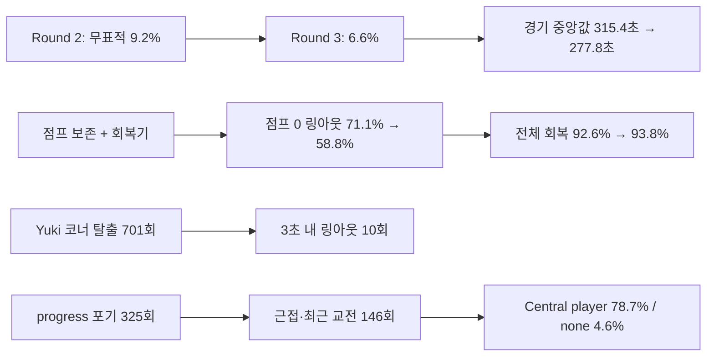

# CODEX-QA-14 Round 3 — 봇 변경 3차 재측정

## 핵심 전후표

동일 seed 101~112, 봇 8명, `--headless --fixed-fps 60`, 경기당 최대 480초 조건이다. Round 3은 12/12경기 모두 자연 종료했다.

| 지표 | Round 1 | Round 2 | Round 3 | R2→R3 |
|---|---:|---:|---:|---:|
| 경기 길이 중앙값 | 305.7초 | 315.4초 | **277.8초** | **-37.6초 (-11.9%)** |
| 경기 길이 범위 | 205.7~381.7초 | 253.1~357.9초 | 250.2~351.4초 | 최대 -6.5초 |
| 링아웃 | 143 (11.9/경기) | 135 (11.3/경기) | **114 (9.5/경기)** | -21 (-15.6%) |
| 공중 점프 0 링아웃 | 112/143 (78.3%) | 96/135 (71.1%) | **67/114 (58.8%)** | -12.3%p |
| 회복 성공률 | 1,342/1,471 (91.2%) | 1,587/1,713 (92.6%) | **1,417/1,511 (93.8%)** | +1.2%p |
| 포털 이동 | 1,131 (94.3/경기) | 251 (20.9/경기) | 252 (21.0/경기) | +1 |
| 붕괴 탈출 / 강제 재배치 | 190 / 7 | 110 / 9 | 95 / 13 | 탈출 -15, 재배치 +4 |
| 저체력 포털 | 303 | 15 | 22 | +7 |
| 무표적 시간 | 2.5% | 9.2% | **6.6%** | -2.6%p, 목표 1% 미달 |
| `wander` | 0.3% | 5.9% | **3.6%** | -2.3%p |
| 표적 전환/생존 분 | 14.1 | 17.9 | **15.2** | -2.7 |
| progress-rule 표적 포기 | 미계측 | 미계측 | **325** | 신규 정확 계측 |
| 진전 없음 에피소드 | 134 | 54 | 53 | -1 |
| 진전 없음 시간 | 1,443.0초 (7.0%) | 494.0초 (2.3%) | **647.5초 (3.4%)** | **+153.5초, +1.1%p** |
| Central 표적 player / none | 86.5 / 0.4% | 75.2 / 3.4% | **78.7 / 4.6%** | player +3.5%p, none +1.2%p |
| `stuck` | 26.5초 (0.128%) | 37.0초 (0.170%) | 36.5초 (0.192%) | 시간 -0.5초, 비율 +0.022%p |
| 20초+ 대치 | 5건 (최장 90.9초) | 1건 (56.6초) | **3건 (42.0초)** | +2건 |
| 공격 intent / 0.4초 적중률 | 19,694 / 36.3% | 20,080 / 38.4% | 17,045 / **41.6%** | -3,035 / +3.2%p |

큰 개선은 경기 길이, 링아웃, 점프 0 링아웃, 전체 회복 성공률이다. Round 2의 표적 공백도 줄었지만 목표였던 Central player ≥90%, none ≤1%는 달성하지 못했다. 독립 프로브 정의의 `진전 없음` 시간과 20초+ 대치는 Round 2보다 악화됐다.

## 경기별 동일 seed

| seed | 길이 R1 / R2 / R3 | 승자 R1 / R2 / R3 | 링아웃 R1 / R2 / R3 | 포털 R1 / R2 / R3 |
|---:|---:|---|---:|---:|
| 101 | 313.2 / 253.1 / 283.3 | Luna / Nova / Rio | 8 / 11 / 10 | 78 / 22 / 18 |
| 102 | 313.5 / 281.8 / 277.4 | Nova / Frey / Rio | 6 / 10 / 6 | 108 / 19 / 16 |
| 103 | 303.4 / 305.1 / 297.2 | Yuki / Yuki / Rio | 8 / 12 / 10 | 77 / 23 / 17 |
| 104 | 291.3 / 340.3 / 351.4 | Yuki / Frey / Frey | 14 / 11 / 12 | 69 / 20 / 17 |
| 105 | 332.1 / 267.3 / 253.8 | Frey / Yuki / Nova | 16 / 8 / 6 | 99 / 19 / 21 |
| 106 | 381.7 / 327.5 / 282.8 | Yuki / Nova / Rio | 15 / 13 / 8 | 106 / 21 / 26 |
| 107 | 340.1 / 329.7 / 266.5 | Rio / Frey / Frey | 9 / 11 / 9 | 136 / 19 / 22 |
| 108 | 205.7 / 357.9 / 278.2 | Rio / Nova / Rio | 16 / 14 / 11 | 96 / 17 / 26 |
| 109 | 285.2 / 256.0 / 264.8 | Frey / Yuki / Frey | 18 / 12 / 11 | 105 / 18 / 22 |
| 110 | 308.0 / 281.3 / 295.2 | Frey / Luna / Frey | 5 / 12 / 10 | 91 / 22 / 16 |
| 111 | 259.9 / 334.7 / 275.2 | Frey / Nova / Luna | 15 / 10 / 11 | 76 / 29 / 29 |
| 112 | 301.4 / 325.7 / 250.2 | Frey / Frey / Luna | 13 / 11 / 10 | 90 / 22 / 22 |

Round 3 승수는 Rio 5, Frey 4, Luna 2, Nova 1, Yuki 0이다. 12경기 표본이므로 밸런스 확정값이 아니라 변화 신호다.

## 상태·표적 — 캐릭터별

각 셀은 `R1→R2→R3`이다. 상태 순서는 wander / pursue / engage / portal / recover, 표적 순서는 player / monster / crystal / none이다.

| 캐릭터 | 상태 비율 | 표적 비율 | 전환/표적 보유 분 | 진전 없음 에피소드/초 |
|---|---|---|---:|---:|
| Frey | 0.2/13.0/82.0/1.6/3.1 → 7.2/17.7/68.8/2.1/4.2 → **5.2/14.4/67.2/1.0/12.2%** | 50.4/36.0/11.6/2.1 → 40.7/40.1/7.8/11.4 → **52.0/33.6/6.3/8.1%** | 14.1→20.1→15.7 | 32/363.0→17/122.5→16/127.8 |
| Luna | 0.4/9.5/78.7/5.0/6.4 → 6.0/10.8/75.5/3.1/4.5 → **3.9/11.1/75.7/4.5/4.8%** | 44.5/41.3/11.4/2.8 → 39.2/44.2/6.8/9.8 → **48.7/38.6/5.3/7.4%** | 13.6→20.9→17.2 | 30/312.2→12/68.0→5/70.8 |
| Nova | 0.2/9.2/82.6/3.5/4.5 → 5.2/13.2/72.5/2.5/6.6 → **3.9/12.7/73.2/3.4/6.7%** | 44.9/42.4/9.5/3.2 → 39.7/42.4/9.2/8.7 → **44.7/40.2/7.4/7.6%** | 15.6→19.0→16.2 | 25/292.0→7/104.8→16/248.8 |
| Rio | 0.2/11.2/77.7/4.4/6.5 → 4.9/12.3/71.9/2.3/8.5 → **2.6/14.7/73.8/1.6/7.2%** | 48.1/39.7/10.0/2.2 → 36.8/46.0/9.2/8.0 → **41.7/44.1/8.7/5.5%** | 13.9→19.1→16.6 | 22/233.0→9/129.0→11/138.5 |
| Yuki | 0.4/8.3/81.2/2.7/7.5 → 5.6/9.7/77.9/0.8/6.0 → **1.8/9.8/83.7/0.5/4.1%** | 38.5/48.0/11.1/2.4 → 40.3/45.3/6.8/7.7 → **45.7/44.2/6.7/3.4%** | 15.4→19.3→15.7 | 25/242.8→9/69.8→5/61.8 |

Round 3의 전체 전환은 표적 보유 분당 16.2회(생존 분당 15.2회)다. 목표 16회에 거의 도달했지만 Luna 17.2, Rio 16.6은 넘었다.

교전 행동에서 새 `escape`가 차지한 비율은 Frey 0.8%, Luna 1.0%, Nova 1.4%, Rio 0.9%, **Yuki 22.9%**였다. Yuki의 retreat는 38.4→37.8→32.9%다.

## 경기 단계별 상태·표적

각 셀은 Round 1 → Round 2 → Round 3이고, 상태는 W/P/E/O/R, 표적은 player/monster/crystal/none 순서다.

| 단계 | 상태 비율 | 표적 비율 |
|---|---|---|
| Exploration | 0.2/11.4/80.9/2.3/5.2 → 7.2/12.6/72.5/0.2/7.5 → **3.3/13.1/76.2/0.2/7.2%** | 32.3/52.2/12.7/2.8 → 28.8/52.0/8.8/10.4 → **39.5/47.1/7.6/5.8%** |
| Corner warning | 0.5/10.5/74.9/7.5/6.7 → 4.9/11.0/71.1/7.9/5.1 → **4.5/9.4/71.1/9.1/5.8%** | 56.5/31.9/7.6/4.0 → 36.5/43.6/9.4/10.4 → **49.8/36.1/6.5/7.6%** |
| Convergence | 0.5/9.1/80.0/5.2/5.2 → 5.0/13.6/72.5/4.3/4.6 → **4.0/14.7/69.3/4.1/7.8%** | 53.1/33.0/11.7/2.2 → 48.1/36.1/7.2/8.7 → **52.9/31.7/6.9/8.4%** |
| Central brawl | 0.0/7.0/87.2/0.1/5.7 → 2.2/16.7/79.7/0.0/1.4 → **3.9/8.9/77.3/0.0/9.9%** | 86.5/11.8/1.3/0.4 → 75.2/17.1/4.3/3.4 → **78.7/14.5/2.2/4.6%** |

`players_first` 정렬은 Central player 비율을 +3.5%p 회복시켰지만 목표 90%에는 11.3%p 부족하다.

제품의 progress-rule로 `gave up: target out of reach`가 발생한 정확한 횟수는 **325회**다. 같은 프레임에 `_select_state()`가 debug reason을 덮어쓰므로, 직전 `progress_target/progress_timer`와 `ignored_targets` 신규 진입의 상승 에지를 교차해 셌다.

| 포기된 표적 | 전체 | 300px 이내 | 직전 3초 내 교전 | 둘 중 하나 |
|---|---:|---:|---:|---:|
| player | 15 | 9 | 0 | 9 |
| monster | 238 | 89 | 45 | 106 |
| crystal | 72 | 27 | 13 | 31 |
| **합계** | **325** | **125** | **58** | **146** |

플레이어 포기는 15회로 제한됐지만, 전체의 95.4%가 PvE 표적이고 146/325회는 가깝거나 최근 공격이 오간 표적이었다. 프로브의 독립적인 진전 없음 시간도 494.0→647.5초로 늘었고, 큰 높이 차 시간은 258.0→264.0초였다. 측정상 새 바닥 판정은 점프 중 플레이어를 버리는 문제를 크게 줄였지만, PvE 표적에 대한 progress 판정과 route 후보 제외에는 여전히 공백이 있다.

## 공격 사용·적중

### 캐릭터 총계와 피해/분

| 캐릭터 | 공격 intent/적중률 R1→R2→R3 | PvP 피해/분 R1→R2→R3 | PvE 피해/분 R1→R2→R3 |
|---|---:|---:|---:|
| Frey | 4,701/37.0 → 3,868/48.8 → **4,245/40.7%** | 53.0→37.3→47.4 | 72.7→110.7→101.2 |
| Luna | 3,574/39.1 → 3,326/46.9 → **2,547/50.3%** | 32.2→34.6→35.8 | 59.3→110.2→103.0 |
| Nova | 3,900/40.1 → 3,915/42.2 → **3,765/42.5%** | 41.0→41.3→42.6 | 83.1→102.3→100.3 |
| Rio | 4,043/32.7 → 5,156/26.7 → **3,402/46.7%** | 39.3→37.5→41.8 | 69.0→107.1→115.5 |
| Yuki | 3,476/32.5 → 3,815/32.3 → **3,086/29.2%** | 35.3→34.6→32.7 | 55.9→66.3→70.5 |

Rio side basic은 **45.2→27.4→56.3%**로 Round 2 회귀를 넘어서 회복했다. 이 지표는 현재 충분히 좋으므로 Rio side basic의 사거리/빈도 수정은 권하지 않는다. 반대로 Yuki side basic은 46.8→50.1→33.4%로 악화됐다.

### Round 3 공격 유형 — 적중/intent (적중률)

| 캐릭터 | side | air-side | up / down | air-up / air-down | skill 1 / skill 2 | ultimate |
|---|---:|---:|---:|---:|---:|---:|
| Frey | 999/1580 (63.2%) | 109/318 (34.3%) | 102/270 (37.8%) / 36/224 (16.1%) | 76/166 (45.8%) / 75/192 (39.1%) | 257/1221 (21.0%) / 25/165 (15.2%) | 48/109 (44.0%) |
| Luna | 651/1107 (58.8%) | 94/215 (43.7%) | 57/146 (39.0%) / 36/123 (29.3%) | 57/83 (68.7%) / 49/106 (46.2%) | 268/545 (49.2%) / 35/150 (23.3%) | 33/72 (45.8%) |
| Nova | 1109/1914 (57.9%) | 80/316 (25.3%) | 90/221 (40.7%) / 34/289 (11.8%) | 95/171 (55.6%) / 145/203 (71.4%) | 0/312 (0%*) / 20/254 (7.9%) | 28/85 (32.9%) |
| Rio | 888/1577 (56.3%) | 108/338 (32.0%) | 93/190 (48.9%) / 24/242 (9.9%) | 71/147 (48.3%) / 190/312 (60.9%) | 213/336 (63.4%*) / 2/166 (1.2%) | 0/94 (0%*) |
| Yuki | 471/1409 (33.4%) | 107/364 (29.4%) | 16/107 (15.0%) / 25/136 (18.4%) | 44/99 (44.4%) / 177/396 (44.7%) | 28/322 (8.7%) / 32/183 (17.5%) | 0/70 (0%*) |

`*` 기존 0.4초 창은 Nova 이동기, Rio 강화형 궁극기, Yuki 지연형 궁극기의 실제 기여를 과소계측한다. 또한 기존 공격 표는 AI가 낸 intent를 세므로 Frey 회복 skill 1처럼 lock 중 반복 intent도 포함한다. 그래서 회복 skill 1은 아래의 실제 활성화 상승 에지 표를 사용해야 한다. air-down 후 2초 내 자가 링아웃은 Round 2 Rio 1회에서 Round 3 **Luna 1회**로 바뀌었다.

## 공격 시작 거리별 미스

아래는 `attack_serial` 상승과 이동형 skill 1의 실제 활성화를 기준으로 한 Round 3의 정확한 공격 시작 표다. `미스/시도(미스율)`이다.

| 캐릭터 | 0–120px | 120–240px | 240–360px | 360px+ |
|---|---:|---:|---:|---:|
| Frey | 230/1065 (21.6%) | 354/864 (41.0%) | 449/512 (87.7%) | 316/326 (96.9%) |
| Luna | 168/728 (23.1%) | 190/647 (29.4%) | 283/445 (63.6%) | 488/543 (89.9%) |
| Nova | 181/1152 (15.7%) | 398/914 (43.5%) | 446/492 (90.7%) | 404/412 (98.1%) |
| Rio | 160/914 (17.5%) | 269/613 (43.9%) | 453/504 (89.9%) | 349/376 (92.8%) |
| Yuki | 217/396 (54.8%) | 435/825 (52.7%) | 411/559 (73.5%) | 631/812 (77.7%) |

표적 종류별 미스율(player / monster / crystal)은 Frey 51.0 / 44.9 / 53.7%, Luna 53.6 / 42.0 / 51.5%, Nova 51.4 / 43.8 / 52.3%, Rio 53.5 / 47.6 / 60.3%, Yuki 69.1 / 62.7 / 60.7%였다.

### Rio side basic — 우선 확인 항목

| 구간/표적 | 미스/시도 | 미스율 |
|---|---:|---:|
| 0–120px | 135/785 | 17.2% |
| 120–240px | 35/223 | **15.7%** |
| 240–360px | 207/234 | **88.5%** |
| 360px+ | 245/267 | **91.8%** |
| player | 287/606 | 47.4% |
| monster | 270/800 | 33.8% |
| crystal | 65/102 | 63.7% |

측정상 Rio side basic 전체 적중은 이미 56.3%로 좋아졌다. 240px 밖 시도만 비효율적이지만, 이를 즉시 줄이면 현재의 압박감도 줄 수 있으므로 전체 수치 변경보다 **side basic만 실제 slash reach 약 240px 안에서 선택**하는 조건을 별도 A/B 측정하는 편이 안전하다.

## 가드 — 공격자별

열은 반응 감지 / `too late to block` / 가드 상승 / 블록 / 패링 / 반응 최초 감지가 이미 recovery 순서다. Round 1은 모두 0이었다.

| 공격자 | Round 2 | Round 3 | R3 블록+패링/상승 |
|---|---:|---:|---:|
| Frey | 545 / 미계측 / 422 / 93 / 38 / 0 | **589 / 465 / 156 / 27 / 18 / 5** | 45/156 (28.8%) |
| Luna | 518 / 미계측 / 398 / 40 / 41 / 9 | **429 / 247 / 172 / 17 / 21 / 14** | 38/172 (22.1%) |
| Nova | 595 / 미계측 / 458 / 73 / 16 / 3 | **576 / 490 / 119 / 15 / 13 / 8** | 28/119 (23.5%) |
| Rio | 396 / 미계측 / 300 / 74 / 11 / 3 | **450 / 392 / 106 / 13 / 8 / 11** | 21/106 (19.8%) |
| Yuki | 589 / 미계측 / 430 / 47 / 30 / 11 | **376 / 179 / 156 / 12 / 11 / 9** | 23/156 (14.7%) |
| 합계 | 2,643 / — / 2,008 / 327 / 136 / 26 | **2,420 / 1,773 / 709 / 84 / 71 / 47** | 155/709 (21.9%) |

측정과 해석을 분리하면 다음과 같다.

- **측정:** 반응 73.3%가 지연 끝에 `too late to block`로 폐기됐고, 실제 가드 상승은 2,008→709로 줄었다. 다섯 공격자 모두 블록/패링을 당했으므로 “특정 캐릭터가 완전히 unblockable”인 결과는 아니다.
- **측정:** recovery에서 처음 포착된 반응은 Round 2의 보수적 하한 26회에서 Round 3 47회였다. 그러나 Round 3은 늦은 반응을 올리지 않고 폐기하므로 이것이 곧 늦은 가드를 뜻하지 않는다.
- **추정:** 매 프레임 watcher 수정은 늦은 방패 자체를 막았지만, 빠른 공격에 대해 성공할 수 없는 reaction timer를 많이 예약한다. 행동 결과는 현재 충분히 공정하며, 다음 수정은 밸런스보다 불필요한 예약 제거에 가깝다.

## 코너 탈출·Yuki 절벽

| 캐릭터 | `cornered: jumping past` | 3초 내 링아웃 |
|---|---:|---:|
| Frey | 34 | 0 |
| Luna | 35 | 0 |
| Nova | 63 | 0 |
| Rio | 38 | 1 |
| Yuki | **701** | **10** |

Yuki 링아웃은 50→44→31로 감소했지만, 31회 중 **8회(25.8%)**는 마지막 PvP 피격이 공격자 반대쪽 225px 안에 바닥이 없는 위치에서 발생했다. Yuki의 escape가 engage 표본의 22.9%를 차지하고 10회가 3초 내 링아웃으로 이어졌다는 것은 새 행동이 과도하게 반복되거나 착지 검증이 부족하다는 측정 신호다. 다만 총 링아웃 감소만으로 escape가 순손해라고 단정하지는 않는다.

## 링아웃·회복·회복 skill 1

| 캐릭터 | 링아웃 R1→R2→R3 | 점프 0 R1→R2→R3 | 회복 성공률 R1→R2→R3 |
|---|---:|---:|---:|
| Frey | 18→25→**14** | 15→15→**4** | 92.2→93.1→**97.0%** |
| Luna | 27→24→**26** | 22→18→**18** | 92.6→91.1→**90.0%** |
| Nova | 34→28→**30** | 25→19→**14** | 87.7→94.2→**93.4%** |
| Rio | 14→14→**13** | 5→5→**9** | 96.5→97.1→**96.9%** |
| Yuki | 50→44→**31** | 45→39→**22** | 86.7→85.4→**85.7%** |

| 실제 회복 skill 1 | 사용 | 이후 바닥 도달 | 비율 |
|---|---:|---:|---:|
| Frey dash strike | 19 | **18** | **94.7%** |
| Nova vector shift | 15 | 3 | 20.0% |
| Rio dimension slash | 10 | 2 | 20.0% |

Frey 회복기는 명확히 효과적이다. Nova/Rio는 “사용 후 같은 회복 episode가 링아웃 없이 바닥에 도달”한 비율이 20%라 추가 거리·방향 조건이 필요하다. 이것은 skill 자체가 실패 원인이라는 인과 증명은 아니며, 사용 시점이 이미 늦었을 가능성도 포함한다.

## Nova 궁극기

| 지표 | Round 2 | Round 3 |
|---|---:|---:|
| launch | 56 | 49 |
| 조준 / 제한시간 강제 | 56 / 0 | **49 / 0** |
| redirect | 10 | 9 |
| 3.2초 내 PvP 피해 | 42/56 (75.0%) | **42/49 (85.7%)** |

이 지표는 충분히 좋다. Nova launch/redirect에는 다음 수정이 필요하지 않다.

## 포털·저체력 이탈

| 사유 | Round 2 | Round 3 |
|---|---:|---:|
| 붕괴 탈출로 분류 | 112 | 102 |
| 일반 로밍 | 11 | 4 |
| 저체력 후퇴 | 15 | 22 |
| 화면 밖 hop | 113 | 124 |
| 합계 | 251 | 252 |

저체력 22건 중 22/22가 10초 안에 다시 engage, 19/22가 다시 피해, 20/22가 10초 생존했고 평균 HP 변화는 **+1.80**이었다. Round 1 -0.24, Round 2 -1.75보다 나아졌지만 “안전하게 회복”에는 여전히 약하다. 포털 총량은 안정됐으나 off-screen hop은 113→124로 소폭 늘었다.

## 정지·대치

Round 3 `stuck`은 36.5초 / 전체 19,011.5 bot-seconds = 0.192%였다. 최악 지점은 realm 3의 로컬 (1100, 900) 2.50초, (1200, 900) 1.75초, realm 6의 (900, 700) 1.50초였다. 절대량은 작아 이 지표는 현재 충분히 좋다.

20초+ 대치는 seed 102 realm 1의 32.5초, seed 107 realm 5의 26.1초, seed 109 realm 6의 42.0초로 3건이었다. Round 1의 90.9초 장기 대치는 재발하지 않았다.

## 측정된 회귀

1. 진전 없음 시간이 494.0→647.5초, 활성 시간 비율이 2.3→3.4%로 늘었다. 특히 Nova가 104.8→248.8초로 증가했고 progress-rule 포기 325회 중 146회는 300px 이내 또는 최근 3초 교전 표적이었다.
2. Central `none`이 3.4→4.6%, 20초+ 대치가 1→3건으로 늘었다. Central player 78.7%도 목표 90%에 못 미쳤다.
3. Yuki side basic 적중률이 50.1→33.4%, 전체 적중률이 32.3→29.2%로 낮아졌다.
4. Luna/Nova 링아웃은 각각 24→26, 28→30으로 소폭 늘었고 Luna 회복 성공률은 91.1→90.0%로 하락했다.
5. 붕괴 강제 재배치가 9→13, off-screen hop이 113→124로 늘었다.

경기 중앙값, 전체 링아웃, 점프 0 링아웃, 전체 회복률, Rio 공격, Yuki 총 링아웃은 이 회귀보다 더 크게 개선됐다.

## 다음 수정 우선순위 Top 3

1. **Progress 판정과 late player fallback을 함께 고친다.** 325회 포기 중 238회가 monster, 72회가 crystal이며 58회는 직전 3초에 실제 공격이 오갔다. 모든 target kind에 대해 “내가 준 피해”도 3초간 progress로 인정하고, 300px 이내 표적은 route 재검사 전에는 버리지 않는다. `_find_target()`은 Central/생존자 ≤4에서 route 실패 player를 blacklist하지 않고 non-player보다 먼저 fallback한다. 목표는 progress-drop의 근접/최근교전 146회 감소, Central player ≥90%, none ≤1%, 진전 없음 ≤2.3%다.
2. **Yuki escape에 착지 검증과 쿨다운을 넣는다.** `_cornered()`만으로 즉시 `escape`를 고르지 말고 상대를 지난 예상 x 위치에 바닥이 있는지 확인하고, 2~3초 cooldown을 둔다. 701회/12경기와 3초 내 링아웃 10회를 낮추되 Yuki 총 링아웃 31 이하를 유지해야 한다.
3. **Nova/Rio 회복 skill 1을 도달 가능할 때만 쓴다.** 실제 바닥 도달은 각각 3/15, 2/10이었다. 회복점까지의 벡터가 각 기술의 실제 이동 거리 안이고 위쪽 성분이 충분할 때만 사용하며, 너무 늦은 낙하에서는 남은 회복 수단을 낭비하지 않는다. Frey 18/19는 현재 충분히 좋아 유지한다.

가드는 늦은 방패가 실제로 올라가는 문제는 해결됐고 모든 공격자에 블록/패링이 있어 행동 지표는 충분히 공정하다. 후속 정리는 `attack_elapsed + reaction_min > attack_startup + 0.1`이면 애초에 반응 timer를 예약하지 않는 최적화 정도가 적절하다. Rio side basic과 Nova 궁극기도 현재 지표상 추가 수정 우선순위가 아니다.

## 흐름 한눈에 보기



위 화살표는 동시 변화와 코드 경로를 정리한 것이며, 원인 효과를 확정한 실험 결과는 아니다.

## 실행·검증

- 제품 소스와 기존 제품 테스트는 수정하지 않았다. 프로브와 실행기만 writable path 안에서 확장했다.
- import를 임시 APPDATA/LOCALAPPDATA로 1회 수행했다. 알려진 `Failed to read the root certificate store` 외 import 오류는 없었다.
- 최종 12경기를 세 번 순차 실행했고, seed별 길이·승자·링아웃·포털·재배치·회복·대치가 모두 같았다. 마지막 실행은 보완된 progress-drop 계측을 포함한다.
- 최종 실행 종료 코드 0. 저장 로그에서 `SCRIPT ERROR`, `Parse Error`, 다른 `ERROR`는 없었다. 콘솔에는 알려진 인증서-store 오류만 별도로 관측됐다.
- 원자료: `round3-results.json`; 최종 로그: `probe-round3-final.log`; JSON SHA-256: `045FCDF4A4A5C03236E28A5F8C86EE5B581C6EC83AC56281DB4F21848AAF2967`.
- 전체 게임 테스트 스위트는 카드 범위가 아니어서 실행하지 않았다.

프로젝트 루트 `smash-nine-prototype/`에서 동일 프로브 재실행:

```powershell
powershell -ExecutionPolicy Bypass -File tests/analysis/codex_qa_14/run_probe.ps1
```
