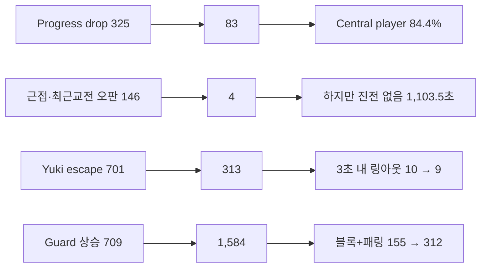

# CODEX-QA-14 Round 4 — 최종 재측정

## 핵심 전후표

동일 seed 101–112, 8봇, `--fixed-fps 60`, 경기당 480초 상한이다. 수치는 측정값이며 원인 설명은 별도로 표시한다.

| 지표 | Round 1 | Round 2 | Round 3 | Round 4 | R3→R4 |
|---|---:|---:|---:|---:|---:|
| 경기 길이 중앙값 | 305.7초 | 315.4초 | 277.8초 | **293.1초** | +15.3초 (+5.5%) |
| 경기 길이 범위 | 205.7–381.7 | 253.1–357.9 | 250.2–351.4 | **259.1–319.0초** | 범위 축소 |
| 링아웃 | 143 (11.9/경기) | 135 (11.3) | 114 (9.5) | **117 (9.8)** | +3 |
| 공중 점프 0 링아웃 | 112/143 (78.3%) | 96/135 (71.1%) | 67/114 (58.8%) | **77/117 (65.8%)** | +7.0%p |
| 회복 성공률 | 1,342/1,471 (91.2%) | 1,587/1,713 (92.6%) | 1,417/1,511 (93.8%) | **1,551/1,675 (92.6%)** | -1.2%p |
| 포털 이동 | 1,131 (94.3/경기) | 251 (20.9) | 252 (21.0) | **236 (19.7)** | -16 |
| 붕괴 탈출 / 강제 재배치 | 190 / 7 | 110 / 9 | 95 / 13 | **109 / 10** | +14 / -3 |
| 저체력 포털 | 303 | 15 | 22 | **8** | -14 |
| 무표적 시간 | 2.5% | 9.2% | 6.6% | **5.5%** | -1.1%p |
| `wander` | 0.3% | 5.9% | 3.6% | **2.9%** | -0.7%p |
| 표적 전환/표적 보유 분 | 14.1 | 17.9 | 15.2 | **14.3** | -0.9 |
| progress-rule 표적 포기 | 미계측 | 미계측 | 325 | **83** | -242 (-74.5%) |
| 진전 없음 에피소드 | 134 | 54 | 53 | **89** | +36 |
| 진전 없음 시간 | 1,443.0초 (7.0%) | 494.0초 (2.3%) | 647.5초 (3.4%) | **1,103.5초 (5.4%)** | +456.0초 |
| Central player / none | 86.5 / 0.4% | 75.2 / 3.4% | 78.7 / 4.6% | **84.4 / 2.0%** | +5.7 / -2.6%p |
| Central recover | 미집계 | 1.4% | 9.9% | **1.9%** | -8.0%p |
| `stuck` | 26.5초 (0.128%) | 37.0초 (0.170%) | 36.5초 (0.192%) | **40.8초 (0.200%)** | +4.3초 |
| 20초+ 대치 | 5건 (최장 90.9초) | 1건 (56.6초) | 3건 (42.0초) | **2건 (최장 68.9초)** | 건수 -1, 최장 +26.9초 |
| 공격 intent / 0.4초 적중률 | 19,694 / 36.3% | 20,080 / 38.4% | 17,045 / 41.6% | **19,986 / 35.4%** | +2,941 / -6.2%p |

Round 4는 **표적 포기 정확도와 Central 표적 선택은 개선**됐지만, 보유한 표적에서 실제 거리를 좁히지 못한 시간과 0점프 링아웃은 악화됐다. 공격 intent 적중률 하락에는 Nova/Rio가 회복 skill 1을 실제 발동보다 훨씬 자주 요청한 현상이 크게 포함된다.

## 경기별 동일 seed

| seed | 길이 R1 / R2 / R3 / R4 | 승자 R1 / R2 / R3 / R4 | 링아웃 R1 / R2 / R3 / R4 | 포털 R1 / R2 / R3 / R4 |
|---:|---:|---|---:|---:|
| 101 | 313.2 / 253.1 / 283.3 / **293.6** | Luna / Nova / Rio / **Rio** | 8 / 11 / 10 / **11** | 78 / 22 / 18 / **21** |
| 102 | 313.5 / 281.8 / 277.4 / **311.6** | Nova / Frey / Rio / **Frey** | 6 / 10 / 6 / **10** | 108 / 19 / 16 / **20** |
| 103 | 303.4 / 305.1 / 297.2 / **259.1** | Yuki / Yuki / Rio / **Yuki** | 8 / 12 / 10 / **9** | 77 / 23 / 17 / **15** |
| 104 | 291.3 / 340.3 / 351.4 / **314.6** | Yuki / Frey / Frey / **Rio** | 14 / 11 / 12 / **10** | 69 / 20 / 17 / **23** |
| 105 | 332.1 / 267.3 / 253.8 / **319.0** | Frey / Yuki / Nova / **Yuki** | 16 / 8 / 6 / **7** | 99 / 19 / 21 / **20** |
| 106 | 381.7 / 327.5 / 282.8 / **292.7** | Yuki / Nova / Rio / **Rio** | 15 / 13 / 8 / **15** | 106 / 21 / 26 / **15** |
| 107 | 340.1 / 329.7 / 266.5 / **261.2** | Rio / Frey / Frey / **Luna** | 9 / 11 / 9 / **6** | 136 / 19 / 22 / **20** |
| 108 | 205.7 / 357.9 / 278.2 / **289.6** | Rio / Nova / Rio / **Frey** | 16 / 14 / 11 / **12** | 96 / 17 / 26 / **23** |
| 109 | 285.2 / 256.0 / 264.8 / **316.2** | Frey / Yuki / Frey / **Rio** | 18 / 12 / 11 / **5** | 105 / 18 / 22 / **18** |
| 110 | 308.0 / 281.3 / 295.2 / **271.4** | Frey / Luna / Frey / **Yuki** | 5 / 12 / 10 / **11** | 91 / 22 / 16 / **26** |
| 111 | 259.9 / 334.7 / 275.2 / **261.4** | Frey / Nova / Luna / **Rio** | 15 / 10 / 11 / **11** | 76 / 29 / 29 / **15** |
| 112 | 301.4 / 325.7 / 250.2 / **297.8** | Frey / Frey / Luna / **Rio** | 13 / 11 / 10 / **10** | 90 / 22 / 22 / **20** |

Round 4 승수는 Rio 6, Yuki 3, Frey 2, Luna 1, Nova 0이다. 표본 12판이므로 승률 균형의 확정 판정은 하지 않지만 Rio 50%는 다음 스윕에서 재확인이 필요하다.

## 상태·표적

상태 순서는 `wander / pursue / engage / portal / recover`, 표적은 `player / monster / crystal / none`이다.

| 캐릭터 | 상태 비율 R4 | 표적 비율 R4 | 전환/분 R1→R2→R3→R4 | 진전 없음 에피소드/초 R1→R2→R3→R4 |
|---|---|---|---:|---:|
| Frey | 2.6 / 15.1 / 71.1 / 0.3 / **10.8%** | 49.5 / 36.3 / 7.6 / 6.5% | 14.1→20.1→15.7→**14.8** | 32/363.0→17/122.5→16/127.8→**21/214.5** |
| Luna | 3.6 / 13.1 / 74.2 / 3.5 / 5.6% | 46.4 / 40.3 / 7.4 / 6.0% | 13.6→20.9→17.2→**14.6** | 30/312.2→12/68.0→5/70.8→**24/317.3** |
| Nova | 3.5 / 10.8 / 76.6 / 2.0 / 7.0% | 44.8 / 42.2 / 7.2 / 5.8% | 15.6→19.0→16.2→**16.1** | 25/292.0→7/104.8→16/248.8→**17/150.3** |
| Rio | 2.1 / 13.5 / 74.0 / 1.9 / 8.6% | 41.6 / 40.9 / 12.6 / 4.9% | 13.9→19.1→16.6→**13.6** | 22/233.0→9/129.0→11/138.5→**21/340.3** |
| Yuki | 3.1 / 6.9 / 83.0 / 2.5 / 4.5% | 51.2 / 36.5 / 7.9 / 4.4% | 15.4→19.3→15.7→**12.6** | 25/242.8→9/69.8→5/61.8→**6/81.3** |

| 단계 | 상태 비율 R4 | 표적 비율 R4 |
|---|---|---|
| Exploration | 3.3 / 12.0 / 76.3 / 0.2 / 8.3% | 36.4 / 47.7 / 9.6 / 6.3% |
| Corner warning | 2.8 / 9.9 / 72.5 / 8.8 / 6.1% | 48.5 / 39.2 / 6.7 / 5.7% |
| Convergence | 2.8 / 13.1 / 72.7 / 3.4 / 7.9% | 54.7 / 30.3 / 10.0 / 5.1% |
| Central brawl | 1.4 / 12.3 / 84.4 / 0.0 / **1.9%** | **84.4 / 12.2 / 1.5 / 2.0%** |

Central 목표(player ≥90%, none ≤1%)에는 아직 못 미치지만 두 지표 모두 Round 3보다 개선됐다.

## Progress 포기

| 포기 표적 | R3 전체 / 300px 이내 / 최근 3초 교전 / 둘 중 하나 | R4 전체 / 300px 이내 / 최근 3초 교전 / 둘 중 하나 |
|---|---:|---:|
| player | 15 / 9 / 0 / 9 | **4 / 0 / 0 / 0** |
| monster | 238 / 89 / 45 / 106 | **60 / 1 / 2 / 3** |
| crystal | 72 / 27 / 13 / 31 | **19 / 0 / 1 / 1** |
| **합계** | **325 / 125 / 58 / 146** | **83 / 1 / 3 / 4** |

근접·최근교전 오판은 146→4로 사실상 해결됐다. 반면 별도 지표인 “3초 이상 표적을 보유했지만 100px 또는 시작 거리 10% 이상 가까워지지 못한 episode”는 53/647.5초→89/1,103.5초로 늘었다. **측정상** 포기는 정확해졌지만 장기 추격은 악화됐다. “가까운 route 표적을 계속 보유하는 변경이 그 원인”은 가능한 설명이지 이 데이터만의 인과 증명은 아니다.

## 공격과 Rio·Yuki

| 캐릭터 | 공격 intent/적중률 R1→R2→R3→R4 | PvP 피해/분 R1→R2→R3→R4 | PvE 피해/분 R1→R2→R3→R4 |
|---|---:|---:|---:|
| Frey | 4,701/37.0→3,868/48.8→4,245/40.7→**4,059/39.2%** | 53.0→37.3→47.4→**41.2** | 72.7→110.7→101.2→**96.2** |
| Luna | 3,574/39.1→3,326/46.9→2,547/50.3→**3,123/45.3%** | 32.2→34.6→35.8→**37.9** | 59.3→110.2→103.0→**79.4** |
| Nova | 3,900/40.1→3,915/42.2→3,765/42.5→**5,330/27.5%** | 41.0→41.3→42.6→**47.6** | 83.1→102.3→100.3→**107.7** |
| Rio | 4,043/32.7→5,156/26.7→3,402/46.7→**3,824/40.0%** | 39.3→37.5→41.8→**35.9** | 69.0→107.1→115.5→**98.3** |
| Yuki | 3,476/32.5→3,815/32.3→3,086/29.2→**3,650/29.5%** | 35.3→34.6→32.7→**35.7** | 55.9→66.3→70.5→**45.7** |

Nova skill-1 intent는 2,200회였지만 실제 recover skill 활성은 21회, Rio는 intent 1,148회 대비 실제 활성 4회였다. 이 때문에 intent 기반 전체 적중률은 실제 휘두르기보다 낮게 보인다. 다만 “사용 불가능한 기술을 계속 요청”하는 행동 자체는 측정된 회귀다.

### Rio side basic — 공격 시작 거리

| 거리 | R3 미스/시도 (미스율) | R4 미스/시도 (미스율) |
|---|---:|---:|
| 0–120px | 135/785 (17.2%) | **135/867 (15.6%)** |
| 120–240px | 35/223 (15.7%) | **28/222 (12.6%)** |
| 240–360px | 207/234 (88.5%) | **21/21 (100%)** |
| 360px+ | 245/267 (91.8%) | **0/0** |

Rio side-basic intent 총계는 1,242회 중 931회 적중(75.0%; R3 1,577회 중 888회, 56.3%)이다. 정확한 `attack_serial` 시작 거리 표본에서는 240px 밖 시도가 501→21로 95.8% 감소했다. PvP 피해/분은 41.8→35.9(-14.2%)지만 승수는 5→6으로 늘었다.

### Yuki side basic

Yuki side-basic intent 적중률은 471/1,409(33.4%)→**683/1,615(42.3%)**로 회복했다. 시작 거리별 미스율은 0–120px 27.2%, 120–240px 19.1%, 240–360px 63.1%, 360px+ 70.7%다. 먼 거리 시도는 여전히 많다(240px+ 1,102회).

## 가드 — 공격자별

순서는 `반응 / too late / 방패 상승 / 블록 / 패링 / recovery에서 최초 감지 / 콤보 2타 블록 / 콤보 3타 블록`이다.

| 공격자 | Round 3 | Round 4 |
|---|---:|---:|
| Frey | 589 / 465 / 156 / 27 / 18 / 5 | **472 / 64 / 351 / 64 / 17 / 5 / 0 / 1** |
| Luna | 429 / 247 / 172 / 17 / 21 / 14 | **499 / 34 / 369 / 39 / 34 / 20 / — / —** |
| Nova | 576 / 490 / 119 / 15 / 13 / 8 | **470 / 71 / 297 / 48 / 10 / 12 / — / —** |
| Rio | 450 / 392 / 106 / 13 / 8 / 11 | **355 / 66 / 235 / 41 / 9 / 12 / 0 / 1** |
| Yuki | 376 / 179 / 156 / 12 / 11 / 9 | **496 / 64 / 332 / 30 / 20 / 16 / — / —** |
| **합계** | **2,420 / 1,773 / 709 / 84 / 71 / 47** | **2,292 / 299 / 1,584 / 222 / 90 / 65 / 0 / 2** |

블록+패링은 155→312로 두 배가 됐고 `too late`는 1,773→299로 줄었다. 식별 가능한 Frey/Rio 콤보 후속타 블록은 3타 2건, 2타 0건이라 “후속 콤보 방어가 증가의 주원인”이라고 말할 근거는 부족하다. recovery 최초 감지 65건은 남았지만 가까이서 우리를 향한 공격자에 방패를 올리는 정책이 실제 방어로 이어진 것은 측정됐다.

## Escape·링아웃·회복기

| 캐릭터 | escape R3→R4 | 3초 내 링아웃 R3→R4 | 링아웃 R1→R2→R3→R4 | 0점프 R1→R2→R3→R4 | 회복 성공률 R1→R2→R3→R4 |
|---|---:|---:|---:|---:|---:|
| Frey | 34→**24** | 0→**1** | 18→25→14→**13** | 15→15→4→**4** | 92.2→93.1→97.0→**95.9%** |
| Luna | 35→**28** | 0→**0** | 27→24→26→**29** | 22→18→18→**25** | 92.6→91.1→90.0→**89.4%** |
| Nova | 63→**12** | 0→**1** | 34→28→30→**30** | 25→19→14→**20** | 87.7→94.2→93.4→**89.6%** |
| Rio | 38→**15** | 1→**0** | 14→14→13→**13** | 5→5→9→**2** | 96.5→97.1→96.9→**97.4%** |
| Yuki | 701→**313** | 10→**9** | 50→44→31→**32** | 45→39→22→**26** | 86.7→85.4→85.7→**84.9%** |

Yuki escape는 55.3% 감소했지만 3초 내 링아웃은 10→9에 그쳤고, 마지막 PvP 피격이 절벽 225px 안에서 발생한 링아웃은 8/31→**13/32**로 늘었다. escape 빈도 개선과 생존 개선을 구분해야 한다.

| recover skill 1 | R3 사용 / 바닥 도달 | R4 사용 / 바닥 도달 | 판정 |
|---|---:|---:|---|
| Frey dash strike | 19 / 18 (94.7%) | **19 / 18 (94.7%)** | 충분히 좋음, 유지 |
| Nova vector shift | 15 / 3 (20.0%) | **21 / 3 (14.3%)** | 악화, 현 트리거 되돌리거나 재설계 |
| Rio dimension slash | 10 / 2 (20.0%) | **4 / 2 (50.0%)** | 표본은 작지만 방향은 개선, 유지 |

Frey recover-state share는 12.2→10.8%다. 진입 337건을 관측 정의로 나누면 최근 3초 PvP 피격 82건, 피격 없이 옆 경계 밖/허공에서 시작 250건, 기타 5건이다. 두 번째 범주는 이동·대시 이탈뿐 아니라 정상적인 틈 점프 뒤 잠깐 recover가 된 경우도 포함하므로 **250건을 자기 실수나 낙사 원인으로 단정하지 않는다.**

## Nova 궁극기·포털

| Nova 궁극기 | R2 | R3 | R4 |
|---|---:|---:|---:|
| launch | 56 | 49 | **43** |
| 조준 / 제한시간 강제 | 56 / 0 | 49 / 0 | **43 / 0** |
| redirect | 10 | 9 | **8** |
| 3.2초 내 PvP 피해 | 42/56 (75.0%) | 42/49 (85.7%) | **38/43 (88.4%)** |

Nova 궁극기는 충분히 좋다.

| 포털 사유 | R2 | R3 | R4 |
|---|---:|---:|---:|
| 붕괴 탈출로 분류 | 112 | 102 | **117** |
| 일반 로밍 | 11 | 4 | **4** |
| 저체력 후퇴 | 15 | 22 | **8** |
| 화면 밖 hop | 113 | 124 | **107** |
| 합계 | 251 | 252 | **236** |

저체력 8건은 8/8이 10초 안에 다시 engage, 8/8 재피격, 8/8 10초 생존, 평균 HP 변화 **-10.01**이었다. Round 3의 +1.80보다 나빠 “안전한 회복”으로는 작동하지 않았다. 다만 발생량은 22→8로 줄었다.

## Round 4 변경별 판정

| 리드 변경 | 판정 | 측정 근거 |
|---|---|---|
| `2811081`: 다른 층 상대에게 코너 kiter가 절벽을 지킴 | **KEEP** | escape 871→392 전체, Yuki 701→313. 단, 같은 라운드의 cooldown/착지 검증과 함께 바뀌어 이 커밋만의 인과는 분리할 수 없다. |
| monster/crystal의 `last_attacker` / `last_hit_frame`을 progress로 인정 | **KEEP** | progress drop 325→83, 최근 교전 오판 58→3. monster/crystal의 근접·최근교전 오판은 137→4. |
| 300px 안 route 있는 표적 유지 | **KEEP, 후속 제한 필요** | 근접 drop 125→1은 성공. 그러나 진전 없음은 647.5→1,103.5초로 악화되어 보유 시간 상한/경로 재평가가 필요하다. |
| escape 2.5초 cooldown + 상대 너머 바닥 필수 | **KEEP** | escape 871→392, Rio 3초 내 링아웃 1→0. Yuki 3초 내 링아웃 10→9로 생존 개선은 작아 추가 보완 필요. |
| Nova/Rio 회복 skill은 reach 안에서만 | **Rio KEEP / Nova REVERT·재설계** | Rio 2/10→2/4, Nova 3/15→3/21. Nova는 성공 수가 그대로인데 시도와 반복 intent만 늘었다. |
| 가까이서 우리를 보는 공격자면 늦어도 guard 상승 | **KEEP** | 상승 709→1,584, 블록+패링 155→312, too-late 1,773→299. 콤보 2/3타 블록은 0/2라 효과의 대부분을 콤보라고 단정할 수는 없다. |
| Rio basic은 240px 안에서만 | **KEEP** | 240px+ 실제 시작 501→21, side hit 56.3→75.0%. PvP DPM 41.8→35.9는 손실이나 승수 5→6; 다음 대규모 스윕에서 피해만 재확인한다. |

## 측정된 회귀

1. 진전 없음이 647.5초(3.4%)→1,103.5초(5.4%)로 증가했다. drop은 정확해졌지만 보유 중인 표적에 접근하지 못하는 시간이 늘었다.
2. 0점프 링아웃 58.8→65.8%, 회복 성공률 93.8→92.6%로 악화했다. Luna는 25/29가 0점프, Nova는 회복 93.4→89.6%, Yuki는 85.7→84.9%다.
3. Nova/Rio recovery skill intent 반복이 각각 2,200/1,148회였으나 실제 활성은 21/4회였다. 전체 intent 적중률 하락(41.6→35.4%)의 큰 부분이다.
4. Yuki 절벽 근처 마지막 피격 링아웃이 8→13, 전체 링아웃이 31→32였다. escape 횟수 감소만으로 생존이 해결되지는 않았다.
5. 저체력 후퇴 뒤 평균 HP가 +1.80→-10.01로 악화했다. 8/8이 10초 안에 다시 engage하고 재피격됐다.
6. 20초+ 대치는 3→2건이지만 최장은 42.0→68.9초로 길어졌다. `stuck`도 36.5→40.8초로 소폭 증가했다.

## 다음 수정 우선순위 Top 3

1. **회복 skill intent를 실제 사용 가능성과 episode당 1회로 gate한다.** Nova 2,200 intent/21 활성/3 도달, Rio 1,148/4/2다. cooldown 또는 이미 시도한 episode에서는 `attack="skill_1"`을 내지 말고 이동·점프 intent를 유지한다. Nova의 현재 reach/last-chance 조건은 되돌리거나 실제 이동 가능 벡터를 검사한다.
2. **가까운 route 표적 유지에 진행 재검사 상한을 둔다.** false drop은 146→4로 충분히 좋아졌다. 이 장점은 유지하면서, route가 있어도 3–5초 동안 실제 수평/경로 진전이 없으면 새 route를 만들거나 다른 player로 전환해 진전 없음 5.4%를 Round 2의 2.3% 이하로 낮춘다.
3. **Yuki 절벽 생존과 Luna의 점프 보존을 직접 고친다.** Yuki는 escape 313·3초 내 링아웃 9·절벽 근처 피격 링아웃 13/32, Luna는 0점프 링아웃 25/29·회복 89.4%다. Yuki는 착지 후 짧은 재탈출 금지/안쪽 이동, Luna는 마지막 공중 점프를 recovery 전용으로 보존하는 조건을 우선 검증한다.

Rio의 240px basic 제한, guard, Nova 궁극기, progress-drop의 근접/최근교전 오판은 현재 지표상 충분히 좋아 추가 우선 수정 대상이 아니다.

## 흐름 한눈에 보기



위 화살표는 같은 코드 변경 전후의 동시 변화를 요약한다. 단독 A/B 실험이 아니므로 원인 효과를 확정하지 않는다.

## 실행·검증

- 제품 소스와 기존 테스트는 수정하지 않았다. 변경은 카드 writable path의 프로브·실행기·Round 4 산출물뿐이다.
- import 1회 후 동일 seeds 101–112를 한 경기씩 순차 실행했다. 12/12 종료, 12/12 승자 1명, 각 Godot 종료 코드 0이다.
- 처음의 장시간 12경기 단일 프로세스는 동시 실행 환경에서 로그 없이 종료되어, 완료 seed를 즉시 보존하는 개별 프로세스로 바꿨다. 게임 결과에는 불완전 실행을 섞지 않았다.
- 모든 완주 로그에서 알려진 `Failed to read the root certificate store` 외 `SCRIPT ERROR`, `Parse Error`, 다른 `ERROR`는 없었다.
- 원자료: `round4-results.json`; 계산 요약: `round4-summary.json`; seed별 원자료와 로그: `round4-seed-*.json`, `probe-round4-seed-*.log`.
- `round4-results.json` SHA-256: `60E9EA3CEF3FB80829F3F0E32A5A9011B03AD794705285F4DE323EE9700EE912`.
- 전체 게임 테스트 스위트는 카드 범위가 아니어서 실행하지 않았다.

프로젝트 루트 `smash-nine-prototype/`에서 재실행:

```powershell
powershell -ExecutionPolicy Bypass -File tests/analysis/codex_qa_14/run_probe.ps1
```
