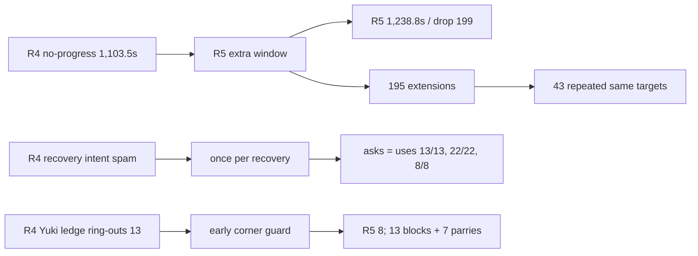

# CODEX-QA-14 Round 5 · 확인 측정

## 결론 먼저

동일 seeds 101–112, 8봇, `--headless --fixed-fps 60`, 경기당 최대 480초 조건으로 12/12경기를 한 프로세스씩 다시 측정했다. 모든 경기는 마지막 생존자로 자연 종료했다.

- **KEEP:** recovery skill을 recovery당 한 번만 요청하는 gate. 정확한 요청/실사용이 Frey `13/13`, Nova `22/22`, Rio `8/8`로 일치해 프레임별 intent 스팸은 사라졌다.
- **KEEP:** 코너 hold 중 선제 guard. Yuki의 ledge 근처 피격 후 링아웃이 `13/32 → 8/27`로 회복됐고, 새 계측으로 Yuki 코너 guard에서 block 13 + parry 7을 확인했다.
- **REVERT/REDESIGN:** 가까운 route target에 추가 progress window를 주는 현재 구현. no-progress가 `1,103.5 → 1,238.8초`, drop이 `83 → 199`로 늘었다. 195회 extension 중 동일 seed·봇·target 반복이 43회여서 “target당 한 번”도 지켜지지 않았다.
- **REVERT/REDESIGN:** Nova recovery skill을 거리 제한 없이 쓰는 변경. 바닥 도달이 `3/21 → 0/22`; 260px 밖 사용 8회도 `0/8` 성공이었다.

아래 표는 모두 **측정값**이다. 원인 설명과 수정 제안은 별도 “해석”으로 구분한다.

## R3–R5 핵심 전후표

| 지표 | R3 | R4 | R5 | R4→R5 |
|---|---:|---:|---:|---:|
| 경기 길이 중앙값 | 277.8초 | 293.1초 | **285.9초** | -7.2초 |
| 경기 길이 범위 | 250.2–351.4 | 259.1–319.0 | **192.7–411.1초** | 범위 크게 확대 |
| 링아웃 | 114 (9.5/경기) | 117 (9.8) | **123 (10.3)** | +6 |
| 공중 점프 0 링아웃 | 67/114 (58.8%) | 77/117 (65.8%) | **76/123 (61.8%)** | -4.0%p |
| recovery 성공 | 1,417/1,525 (92.9%) | 1,551/1,675 (92.6%) | **1,384/1,520 (91.1%)** | -1.5%p |
| 포털 이동 | 252 | 236 | **231** | -5 |
| 붕괴 탈출 / 강제 재배치 | 95 / 13 | 109 / 10 | **106 / 11** | -3 / +1 |
| 저체력 포털 | 22 | 8 | **21** | +13 |
| 무표적 시간 | 6.6% | 5.5% | **6.2%** | +0.7%p |
| `wander` | 3.6% | 2.9% | **3.5%** | +0.6%p |
| 표적 전환/표적 보유 분 | 16.2 | 14.3 | **14.6** | +0.3 |
| progress-rule drop | 325 | 83 | **199** | +116 |
| 진전 없음 episode | 53 | 89 | **106** | +17 |
| 진전 없음 시간 | 647.5초 (3.41%) | 1,103.5초 (5.40%) | **1,238.8초 (6.05%)** | +135.3초, +0.65%p |
| Central player / none | 78.7 / 4.6% | 84.4 / 2.0% | **85.5 / 0.9%** | +1.1 / -1.1%p |
| Central recover | 9.9% | 1.9% | **1.0%** | -0.9%p |
| `stuck` | 36.5초 (0.19%) | 40.8초 (0.20%) | **28.3초 (0.14%)** | 개선 |
| 20초+ 대치 | 3건, 최장 42.0초 | 2건, 최장 68.9초 | **6건, 최장 171.1초** | 악화 |
| 공격 intent / 0.4초 적중률 | 17,045 / 41.6% | 19,986 / 35.4% | **16,536 / 42.9%** | -3,450 / +7.5%p |

recovery 성공률은 세 round 모두 unfinished를 포함한 동일 분모로 원자료에서 다시 계산했다. R3 기존 보고의 `1,417/1,511 (93.8%)`는 unfinished 14건을 분모에서 제외한 값이다.

## seed별 경기

| seed | 길이 R3 / R4 / R5 | 승자 R3 / R4 / R5 | 링아웃 R3 / R4 / R5 | 포털 R3 / R4 / R5 |
|---:|---:|---|---:|---:|
| 101 | 283.3 / 293.6 / **240.0** | Rio / Rio / **Rio** | 10 / 11 / **15** | 18 / 21 / **17** |
| 102 | 277.4 / 311.6 / **290.2** | Rio / Frey / **Luna** | 6 / 10 / **7** | 16 / 20 / **23** |
| 103 | 297.2 / 259.1 / **407.5** | Rio / Yuki / **Rio** | 10 / 9 / **12** | 17 / 15 / **22** |
| 104 | 351.4 / 314.6 / **267.3** | Frey / Rio / **Yuki** | 12 / 10 / **9** | 17 / 23 / **18** |
| 105 | 253.8 / 319.0 / **302.9** | Nova / Yuki / **Yuki** | 6 / 7 / **7** | 21 / 20 / **17** |
| 106 | 282.8 / 292.7 / **411.1** | Rio / Rio / **Nova** | 8 / 15 / **15** | 26 / 15 / **20** |
| 107 | 266.5 / 261.2 / **281.6** | Frey / Luna / **Frey** | 9 / 6 / **8** | 22 / 20 / **21** |
| 108 | 278.2 / 289.6 / **341.9** | Rio / Frey / **Yuki** | 11 / 12 / **7** | 26 / 23 / **17** |
| 109 | 264.8 / 316.2 / **260.3** | Frey / Rio / **Yuki** | 11 / 5 / **10** | 22 / 18 / **19** |
| 110 | 295.2 / 271.4 / **255.9** | Frey / Yuki / **Frey** | 10 / 11 / **15** | 16 / 26 / **23** |
| 111 | 275.2 / 261.4 / **192.7** | Luna / Rio / **Nova** | 11 / 11 / **6** | 29 / 15 / **14** |
| 112 | 250.2 / 297.8 / **397.0** | Luna / Rio / **Frey** | 10 / 10 / **12** | 22 / 20 / **20** |

승수는 R3 `Frey 4 / Luna 2 / Nova 1 / Rio 5 / Yuki 0`, R4 `2 / 1 / 0 / 6 / 3`, R5 **`3 / 1 / 2 / 2 / 4`**다. 12경기 표본이므로 승률 균형의 확정값으로 보지 않는다. 다만 관찰값으로 Rio는 `6 → 2승`이다.

## 캐릭터별 상태·표적·진전 없음

각 상태 셀은 `wander / pursue / engage / portal / recover`, 표적 셀은 `player / monster / crystal / none` 순서다.

| 캐릭터 | Round | 상태 비율(%) | 표적 비율(%) | 전환/분 | 진전 없음 episode / 초 |
|---|---:|---|---|---:|---:|
| Frey | R3 | 5.2 / 14.4 / 67.2 / 1.0 / 12.2 | 52.0 / 33.6 / 6.3 / 8.1 | 15.7 | 16 / 127.8 |
|  | R4 | 2.6 / 15.1 / 71.1 / 0.3 / 10.8 | 49.5 / 36.3 / 7.6 / 6.5 | 14.8 | 21 / 214.5 |
|  | **R5** | **4.4 / 18.3 / 72.0 / 0.5 / 4.8** | **53.3 / 33.4 / 6.2 / 7.0** | **15.1** | **30 / 438.0** |
| Luna | R3 | 3.9 / 11.1 / 75.7 / 4.5 / 4.8 | 48.7 / 38.6 / 5.3 / 7.4 | 17.2 | 5 / 70.8 |
|  | R4 | 3.6 / 13.1 / 74.2 / 3.5 / 5.6 | 46.4 / 40.3 / 7.4 / 6.0 | 14.6 | 24 / 317.3 |
|  | **R5** | **5.1 / 12.7 / 73.0 / 4.2 / 5.0** | **46.0 / 37.6 / 7.4 / 9.1** | **15.2** | **32 / 226.5** |
| Nova | R3 | 3.9 / 12.7 / 73.2 / 3.4 / 6.7 | 44.7 / 40.2 / 7.4 / 7.6 | 16.2 | 16 / 248.8 |
|  | R4 | 3.5 / 10.8 / 76.6 / 2.0 / 7.0 | 44.8 / 42.2 / 7.2 / 5.8 | 16.1 | 17 / 150.3 |
|  | **R5** | **3.6 / 12.5 / 73.5 / 4.0 / 6.5** | **51.3 / 37.4 / 5.1 / 6.2** | **14.2** | **17 / 155.8** |
| Rio | R3 | 2.6 / 14.7 / 73.8 / 1.6 / 7.2 | 41.7 / 44.1 / 8.7 / 5.5 | 16.6 | 11 / 138.5 |
|  | R4 | 2.1 / 13.5 / 74.0 / 1.9 / 8.6 | 41.6 / 40.9 / 12.6 / 4.9 | 13.6 | 21 / 340.3 |
|  | **R5** | **3.0 / 12.4 / 75.2 / 1.5 / 8.0** | **47.0 / 40.1 / 6.8 / 6.1** | **14.3** | **12 / 230.0** |
| Yuki | R3 | 1.8 / 9.8 / 83.7 / 0.5 / 4.1 | 45.7 / 44.2 / 6.7 / 3.4 | 15.7 | 5 / 61.8 |
|  | R4 | 3.1 / 6.9 / 83.0 / 2.5 / 4.5 | 51.2 / 36.5 / 7.9 / 4.4 | 12.6 | 6 / 81.3 |
|  | **R5** | **1.5 / 5.8 / 87.1 / 1.4 / 4.2** | **52.1 / 38.1 / 7.1 / 2.7** | **14.1** | **15 / 188.5** |

Frey의 진전 없음이 `214.5 → 438.0초`로 가장 크게 악화됐다. 반면 Nova와 Rio의 진전 없음은 R4보다 거의 같거나 감소했다. 즉 전역 평균의 악화는 모든 캐릭터에 균등하지 않다.

## 단계별 상태·표적

셀 순서는 위와 같다.

| 단계 | Round | 상태 비율 W/P/E/O/R(%) | 표적 P/M/C/N(%) |
|---|---:|---|---|
| Exploration | R3 | 3.3 / 13.1 / 76.2 / 0.2 / 7.2 | 39.5 / 47.1 / 7.6 / 5.8 |
|  | R4 | 3.3 / 12.0 / 76.3 / 0.2 / 8.3 | 36.4 / 47.7 / 9.6 / 6.3 |
|  | **R5** | **3.3 / 11.8 / 77.5 / 0.2 / 7.2** | **39.3 / 47.1 / 7.9 / 5.7** |
| Corner warning | R3 | 4.5 / 9.4 / 71.1 / 9.1 / 5.8 | 49.8 / 36.1 / 6.5 / 7.6 |
|  | R4 | 2.8 / 9.9 / 72.5 / 8.8 / 6.1 | 48.5 / 39.2 / 6.7 / 5.7 |
|  | **R5** | **3.9 / 10.1 / 70.1 / 10.8 / 5.1** | **52.7 / 34.7 / 5.5 / 7.1** |
| Convergence | R3 | 4.0 / 14.7 / 69.3 / 4.1 / 7.8 | 52.9 / 31.7 / 6.9 / 8.4 |
|  | R4 | 2.8 / 13.1 / 72.7 / 3.4 / 7.9 | 54.7 / 30.3 / 10.0 / 5.1 |
|  | **R5** | **5.1 / 11.1 / 76.4 / 3.2 / 4.3** | **61.7 / 24.4 / 5.1 / 8.9** |
| Central brawl | R3 | 3.9 / 8.9 / 77.3 / 0.0 / 9.9 | 78.7 / 14.5 / 2.2 / 4.6 |
|  | R4 | 1.4 / 12.3 / 84.4 / 0.0 / 1.9 | 84.4 / 12.2 / 1.5 / 2.0 |
|  | **R5** | **0.3 / 27.4 / 71.3 / 0.0 / 1.0** | **85.5 / 11.4 / 2.2 / 0.9** |

Central 표적은 목표(player 약 90%, none 약 1%)에 거의 도달했다. 이 지표는 **현재 충분히 좋으며 별도 우선 수정 대상이 아니다.** 다만 Central pursue가 `12.3 → 27.4%`로 늘어난 것은 긴 대치와 함께 추적할 가치가 있다.

## 공격·승패

| 캐릭터 | intent/적중률 R3 → R4 → R5 | PvP 피해/분 R3 → R4 → R5 | PvE 피해/분 R3 → R4 → R5 | 승수 R3 → R4 → R5 |
|---|---|---|---|---|
| Frey | 4,245/40.7 → 4,059/39.2 → **3,611/50.2%** | 47.4 → 41.2 → **44.2** | 101.2 → 96.2 → **91.8** | 4 → 2 → **3** |
| Luna | 2,547/50.3 → 3,123/45.3 → **2,929/45.1%** | 35.8 → 37.9 → **32.4** | 103.0 → 79.4 → **80.1** | 2 → 1 → **1** |
| Nova | 3,765/42.5 → 5,330/27.5 → **3,344/42.6%** | 42.6 → 47.6 → **44.4** | 100.3 → 107.7 → **84.5** | 1 → 0 → **2** |
| Rio | 3,402/46.7 → 3,824/40.0 → **3,065/46.5%** | 41.8 → 35.9 → **38.4** | 115.5 → 98.3 → **88.7** | 5 → 6 → **2** |
| Yuki | 3,086/29.2 → 3,650/29.5 → **3,587/31.1%** | 32.7 → 35.7 → **35.4** | 70.5 → 45.7 → **53.2** | 0 → 3 → **4** |

전체 intent 적중률은 R4의 recovery intent 반복이 사라지며 `35.4 → 42.9%`로 정상화됐다. 캐릭터별로는 Yuki가 여전히 31.1%로 낮다.

### Rio side basic

| 지표 | R3 | R4 | R5 |
|---|---:|---:|---:|
| intent 적중/시도 | 888/1,577 (56.3%) | 931/1,242 (75.0%) | **843/1,639 (51.4%)** |
| 0–120px miss | 135/785 (17.2%) | 135/867 (15.6%) | **117/789 (14.8%)** |
| 120–240px miss | 35/223 (15.7%) | 28/222 (12.6%) | **30/197 (15.2%)** |
| 240–360px miss | 207/234 (88.5%) | 21/21 (100%) | **40/41 (97.6%)** |
| 360px+ miss | 245/267 (91.8%) | 0/0 | **0/0** |
| PvP 피해/분 | 41.8 | 35.9 | **38.4** |
| 승수 | 5 | 6 | **2** |

240px 제한 자체는 360px+ 시도 0으로 계속 작동한다. 다만 경계 bucket의 시도가 21→41로 늘고 총 side hit가 75.0→51.4%로 하락했다. PvP DPM은 회복했으므로 제한을 되돌릴 근거는 아니며, 다음 대규모 sweep에서 재확인이 필요하다.

### Yuki side basic·ledge

| 지표 | R3 | R4 | R5 |
|---|---:|---:|---:|
| intent 적중/시도 | 471/1,409 (33.4%) | 683/1,615 (42.3%) | **703/1,593 (44.1%)** |
| 360px+ exact-swing miss | 358/494 (72.5%) | 505/714 (70.7%) | **503/718 (70.1%)** |
| 전체 링아웃 | 31 | 32 | **27** |
| ledge 근처 마지막 피격 후 링아웃 | 8 | 13 | **8** |
| escape / 3초 내 링아웃 | 701 / 10 | 313 / 9 | **324 / 10** |

side basic 전체 적중은 개선됐지만 360px+ 시도 718회의 miss 70.1%는 여전히 가장 큰 공격 선택 낭비다.

## Guard

각 셀은 `반응 / too late / 상승 / block / parry / recovery에서 최초 감지` 순서다.

| 공격자 | R3 | R4 | R5 |
|---|---|---|---|
| Frey | 589 / 465 / 156 / 27 / 18 / 5 | 472 / 64 / 351 / 64 / 17 / 5 | **593 / 84 / 447 / 84 / 42 / 8** |
| Luna | 429 / 247 / 172 / 17 / 21 / 14 | 499 / 34 / 369 / 39 / 34 / 20 | **468 / 49 / 392 / 52 / 48 / 8** |
| Nova | 576 / 490 / 119 / 15 / 13 / 8 | 470 / 71 / 297 / 48 / 10 / 12 | **577 / 104 / 364 / 48 / 8 / 8** |
| Rio | 450 / 392 / 106 / 13 / 8 / 11 | 355 / 66 / 235 / 41 / 9 / 12 | **361 / 62 / 258 / 46 / 7 / 6** |
| Yuki | 376 / 179 / 156 / 12 / 11 / 9 | 496 / 64 / 332 / 30 / 20 / 16 | **530 / 66 / 357 / 55 / 21 / 18** |
| **합계** | **2,420 / 1,773 / 709 / 84 / 71 / 47** | **2,292 / 299 / 1,584 / 222 / 90 / 65** | **2,529 / 365 / 1,818 / 285 / 126 / 48** |

block+parry는 `155 → 312 → 411`로 증가했다. combo 2/3타 block은 R4 `0/2`, R5 `0/1`이라 combo 연속 방어 증가를 확정할 표본은 여전히 부족하다.

### 새 코너 guard 직접 계측

| 수비 캐릭터 | 넓은 기회 조건 | guard 상승 | block | parry | guard 후 3초 내 링아웃 |
|---|---:|---:|---:|---:|---:|
| Yuki | 440 | **64** | **13** | **7** | **2** |
| 기타 합계 | 67 | 5 | 0 | 0 | 0 |

여기서 “기회 조건”은 새 hold decision + escape cooldown + `_cornered()`인 넓은 분모다. 실제 함수는 추가로 바닥 위, 공격 중 아님, 상대가 사거리 안에서 나를 향함을 요구하므로 `64/440=14.5%`를 코드의 50% 확률 실패로 해석하면 안 된다. 직접 관측된 사실은 Yuki 방어 성공 20회와 ledge-ringout `13→8`이다.

## Progress extension과 drop

| drop 표적 | R3 전체 / 300px / 최근 교전 / 둘 중 하나 | R4 | R5 |
|---|---:|---:|---:|
| player | 15 / 9 / 0 / 9 | 4 / 0 / 0 / 0 | **12 / 3 / 0 / 3** |
| monster | 238 / 89 / 45 / 106 | 60 / 1 / 2 / 3 | **126 / 37 / 3 / 39** |
| crystal | 72 / 27 / 13 / 31 | 19 / 0 / 1 / 1 | **61 / 16 / 1 / 17** |
| **합계** | **325 / 125 / 58 / 146** | **83 / 1 / 3 / 4** | **199 / 56 / 4 / 59** |

새 직접 계측:

- extension 관측 195회, 동일 `(seed, bot, target_id)` 고유 조합 152개, **반복 extension 43회**.
- 계측 totals 기준 extension 후 drop 전이 136회.
- 캐릭터별 extension/drop-after-extension: Frey `39/28`, Luna `33/24`, Nova `27/13`, Rio `26/21`, Yuki `70/50`.

**측정:** 추가 window 뒤에도 no-progress와 drop이 모두 늘었다.

**코드 추적에 근거한 해석:** `progress_extended`가 “이미 extension한 target들의 집합”이 아니라 Node 하나만 저장한다. A를 연장한 뒤 B를 연장하면 다시 A를 연장할 수 있어, 주석의 “target당 한 번”과 실제 상태가 다르다. 반복 43회가 이 경로와 일치한다.

## Recovery skill: 요청·실사용·바닥 도달

| 캐릭터 | R3 사용/도달 | R4 사용/도달 | R5 요청 / 사용 / 도달 | R5 260px+ 요청 / 도달 |
|---|---:|---:|---:|---:|
| Frey | 19 / 18 (94.7%) | 19 / 18 (94.7%) | **13 / 13 / 6 (46.2%)** | **5 / 1** |
| Nova | 15 / 3 (20.0%) | 21 / 3 (14.3%) | **22 / 22 / 0 (0%)** | **8 / 0** |
| Rio | 10 / 2 (20.0%) | 4 / 2 (50.0%) | **8 / 8 / 4 (50.0%)** | **4 / 3** |

R4의 Nova 2,200/Rio 1,148은 매 프레임 보인 intent 수였고, R5의 “요청”은 `recovery_skill_asked` rising edge다. 정의가 다르므로 숫자 크기 자체를 직접 비율 비교하지 않는다. 다만 R5에서는 세 캐릭터 모두 **정확한 요청 수와 실제 발동 수가 일치**한다.

`attack_locked`는 프로브가 AI intent 적용 뒤 같은 physics frame에서 읽기 때문에 요청 event 43개 모두 true로 기록된다. 이는 요청 시점에 lock이 있었다는 뜻이 아니며, 제품 조건은 intent 생성 직전에 `attack_lock_timer <= 0`을 확인한다.

## 기타 R3–R5

| 항목 | R3 | R4 | R5 |
|---|---:|---:|---:|
| Nova launch / aimed / forced / redirect / 3.2초 PvP hit | 49 / 49 / 0 / 9 / 42 (85.7%) | 43 / 43 / 0 / 8 / 38 (88.4%) | **52 / 52 / 0 / 14 / 46 (88.5%)** |
| 포털: 붕괴 escape / roam / retreat / off-screen | 102 / 4 / 22 / 124 | 117 / 4 / 8 / 107 | **109 / 5 / 21 / 96** |
| air-down 직후 self ring-out | Luna 1 | Rio 1, Nova 2, Yuki 1 | **Luna 1, Frey 1, Nova 1, Rio 1** |
| Frey recover 진입: 피격 / 스스로 이탈 / 기타 | 미계측 | 82 / 250 / 5 | **101 / 226 / 4** |

Nova 궁극기 조준은 적중률 88.5%, forced 0으로 **현재 충분히 좋다.** 포털 총량과 off-screen hop도 계속 감소했다. 저체력 retreat는 `8→21`로 늘었으나 전체 경기 수명·조우 구성도 달라 단독 원인으로 판정하지 않는다.

## Round 5 변경별 판정

| 리드 변경 | 판정 | 측정 근거 |
|---|---|---|
| 가까운 route target에 fresh route로 한 번 더 progress window | **REVERT / REDESIGN** | no-progress `1,103.5→1,238.8초`, episode `89→106`, drop `83→199`. extension 195회 중 동일 target 반복 43회. 단일 `progress_extended` 대신 target별 1회 기록이 필요하다. |
| Nova recovery skill을 거리 무관으로 복귀 | **REVERT / REDESIGN** | 바닥 도달 `3/21→0/22`; 새로 허용된 260px+ 8회도 0회 도달. 거리보다 회복 궤적/aim 조건을 먼저 고쳐야 한다. |
| recovery skill을 recovery당 한 번, lock이 없을 때만 요청 | **KEEP** | 요청=실사용: Frey `13=13`, Nova `22=22`, Rio `8=8`. 전체 intent 적중률 `35.4→42.9%`. 단, 사용 후 계속 추락할 때의 명시적 2차 구제 조건은 별도 검토가 필요하다. |
| escape cooldown 중 ledge hold가 절반 확률로 early guard | **KEEP** | Yuki ledge-hit 링아웃 `13→8`, 직접 관측 block 13 + parry 7. escape 후 3초 링아웃은 `9→10`이라 이동 자체는 해결되지 않았지만 hold 중 피격 방어에는 수치상 효과가 있다. |

## 회귀

1. no-progress `+135.3초`, drop `+116`, 20초+ 대치 `2→6`, 최장 `68.9→171.1초`로 target/path 장기 보유가 악화됐다.
2. Nova recovery skill 도달 `3/21→0/22`, Frey `18/19→6/13`; 전체 recovery 성공도 `92.6→91.1%`로 하락했다.
3. Rio side-basic hit `75.0→51.4%`, 승수 `6→2`. 다만 PvP DPM은 `35.9→38.4`이고 360px+ 시도는 0이라, 240px 제한 자체를 되돌릴 근거는 아니다.
4. 저체력 포털 `8→21`, 무표적 `5.5→6.2%`, wander `2.9→3.5%`가 증가했다.
5. 경기 중앙값은 개선됐지만 최대 길이가 `319.0→411.1초`로 늘었다.

## 다음 수정 우선순위 Top 3

1. **Progress extension을 target별 정확히 한 번으로 만들고 장기 보유를 끊는다.** `Dictionary[target]` 또는 target instance id+수명으로 extension 여부를 기록하고, 두 번째 window 끝에는 반드시 drop한다. 수정 후 목표는 no-progress를 R3 수준인 3.4% 이하, 20초+ 대치를 2건 이하로 되돌리는 것이다.
2. **Nova/Frey recovery skill을 “사용”이 아니라 착지 궤적으로 평가한다.** Nova의 260px+ 0/8, 전체 0/22와 Frey 6/13은 부족하다. aim point/속도 적용 직후 예상 궤적이 floor top을 교차하는지 확인하고, 실패가 확정된 경우에만 한 번의 2차 구제를 허용한다. Rio는 4/8, 먼 거리 3/4로 현재 변경을 유지한다.
3. **Yuki의 360px+ side basic을 줄인다.** 718회 중 503회 miss(70.1%)다. player/monster 실제 reach 또는 이동 예측점이 사거리 밖이면 side basic 대신 접근·seal·다른 skill을 고르게 한다. Central target(85.5% player, 0.9% none), Nova 궁극기(88.5%), global intent hit(42.9%)는 현재 우선 수정이 필요하지 않다.

## 한눈에 보기



위 그림은 같은 R5 변경 묶음 안에서 **progress extension은 악화**, **요청 gate와 코너 guard는 개선**으로 갈린 결과를 요약한다.

## 실행·검증

- import는 새 임시 APPDATA/LOCALAPPDATA에서 수행했다. 첫 시도는 Godot 엔진 signal 11로 로그 생성 전 crash했고, 새 임시 폴더로 재시도해 exit 0으로 완료했다.
- seed 101 smoke 10초 후, seed 101–112를 **각각 별도 Godot 프로세스**로 순차 실행했다.
- 12/12 exit 0, 12/12 자연 종료, 12개 로그 모두 `SCRIPT ERROR`, `Parse Error`, 알려진 인증서 오류 외 `ERROR` 0건이다.
- 모든 실행에서 알려진 sandbox noise `ERROR: Failed to read the root certificate store.` 1건씩은 별도로 관측됐다.
- 원자료: `round5-results.json`; 계산 요약: `round5-summary.json`; seed별 원자료/로그: `round5-seed-*.json`, `probe-round5-seed-*.log`.
- `round5-results.json` SHA-256: `E74A8343D66C778A49E08735428E99CE1D8E7229A418EC069D8394500CD2FCBA`.
- 전체 제품 테스트 suite는 카드 범위가 아니어서 실행하지 않았다.

재실행 명령(프로젝트 루트 `smash-nine-prototype/`):

```powershell
powershell -ExecutionPolicy Bypass -File tests/analysis/codex_qa_14/run_probe.ps1
```

위 한 명령이 12경기를 한 프로세스씩 실행하고 병합·요약까지 수행한다. 이미 생성된 원자료의 요약만 다시 계산할 때는 `node tests/analysis/codex_qa_14/summarize_round4.js round5`를 사용한다.
