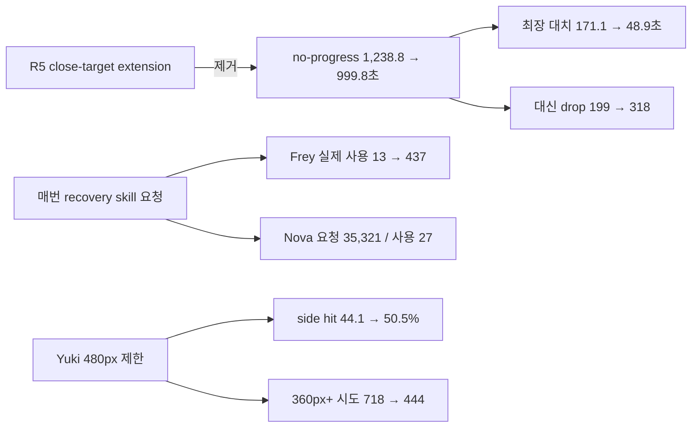

# CODEX-QA-14 Round 6 · 확인 측정

## 결론 먼저

동일 seeds 101–112, 8봇, `--headless --fixed-fps 60`, 경기당 최대 480초로 12/12경기를 한 프로세스씩 순차 실행했다. 모두 마지막 생존자로 자연 종료했다.

- **KEEP — close-target extension 제거:** no-progress `1,238.8→999.8초`, 20초+ 대치 최장 `171.1→48.9초`, Central player target `85.5→88.9%`로 좋아졌다. 다만 drop `199→318`, 근접·최근교전 drop `59→98`, 대치 건수 `6→5`이므로 R3 목표 수준에는 아직 못 미친다.
- **REVERT / REDESIGN — recovery skill을 사용 가능할 때마다 요청:** 전체 recovery는 `91.1→92.4%`로 회복했지만 Frey는 실제 사용 `13→437`, Nova는 요청 frame `35,321`에 실제 사용 27회뿐이었다. Rio 분기만 `8/8 요청=사용, 4회 도달`로 유지할 근거가 있다.
- **KEEP — Yuki basic 480px 제한:** side intent 적중률 `44.1→50.5%`, 360px+ exact 시도 `718→444`, PvP 피해/분 `35.4→36.3`이다. 12판 승수 `4→0`은 나빠졌지만 공격 효율·링아웃은 악화하지 않아 제한을 되돌릴 근거는 없다.

수치는 측정값이다. 원인 해석과 수정 제안은 별도 표시한다.

## R3–R6 핵심 전후표

| 지표 | R3 | R4 | R5 | R6 |
|---|---:|---:|---:|---:|
| 경기 길이 중앙값 | 277.8초 | 293.1초 | 285.9초 | **290.1초** |
| 경기 길이 범위 | 250.2–351.4 | 259.1–319.0 | 192.7–411.1 | **191.7–335.3초** |
| 링아웃 | 114 (9.5/경기) | 117 (9.8) | 123 (10.3) | **122 (10.2)** |
| 공중 점프 0 링아웃 | 67/114 (58.8%) | 77/117 (65.8%) | 76/123 (61.8%) | **80/122 (65.6%)** |
| recovery 성공 | 1,417/1,525 (92.9%) | 1,551/1,675 (92.6%) | 1,384/1,520 (91.1%) | **1,510/1,635 (92.4%)** |
| 포털 이동 | 252 | 236 | 231 | **244** |
| 붕괴 탈출 / 강제 재배치 | 95 / 13 | 109 / 10 | 106 / 11 | **106 / 10** |
| 저체력 포털 | 22 | 8 | 21 | **13** |
| 무표적 시간 | 6.60% | 5.54% | 6.20% | **6.18%** |
| `wander` | 3.64% | 2.94% | 3.51% | **3.73%** |
| 표적 전환/표적 보유 분 | 16.23 | 14.31 | 14.58 | **15.57** |
| progress-rule drop | 325 | 83 | 199 | **318** |
| 진전 없음 episode | 53 | 89 | 106 | **73** |
| 진전 없음 시간 | 647.5초 (3.41%) | 1,103.5초 (5.40%) | 1,238.8초 (6.05%) | **999.8초 (4.85%)** |
| Central player / none | 78.7 / 4.6% | 84.4 / 2.0% | 85.5 / 0.9% | **88.9 / 1.6%** |
| Central recover | 9.9% | 1.9% | 1.0% | **1.7%** |
| `stuck` | 36.5초 (0.19%) | 40.8초 (0.20%) | 28.3초 (0.14%) | **33.0초 (0.16%)** |
| 20초+ 대치 | 3건, 최장 42.0초 | 2건, 최장 68.9초 | 6건, 최장 171.1초 | **5건, 최장 48.9초** |
| 공격 intent / 0.4초 적중률 | 17,045 / 41.6% | 19,986 / 35.4% | 16,536 / 42.9% | **19,401 / 37.9%** |

R6 no-progress는 R5보다 19.3% 줄었지만 R3보다 54.4% 많고, 대치 건수도 목표인 R3 수준(약 3.4%, 2건 이하)에 도달하지 못했다. 반면 최장 대치는 48.9초로 크게 줄어 R5의 171.1초 장기 정체는 재발하지 않았다.

목표 경기 길이 5–7분과 비교하면 중앙값 290.1초는 9.9초 짧고, 12경기 중 8경기가 300초 전에 끝났다. 최대 411.1초였던 R5의 긴 꼬리는 335.3초로 줄었지만 짧은 경기 쪽은 해결되지 않았다.

## seed별 경기

| seed | 길이 R3 / R4 / R5 / R6 | 승자 R3 / R4 / R5 / R6 | 링아웃 R3 / R4 / R5 / R6 | 포털 R3 / R4 / R5 / R6 |
|---:|---:|---|---:|---:|
| 101 | 283.3 / 293.6 / 240.0 / **335.3** | Rio / Rio / Rio / **Frey** | 10 / 11 / 15 / **13** | 18 / 21 / 17 / **17** |
| 102 | 277.4 / 311.6 / 290.2 / **297.7** | Rio / Frey / Luna / **Luna** | 6 / 10 / 7 / **11** | 16 / 20 / 23 / **15** |
| 103 | 297.2 / 259.1 / 407.5 / **307.5** | Rio / Yuki / Rio / **Luna** | 10 / 9 / 12 / **11** | 17 / 15 / 22 / **24** |
| 104 | 351.4 / 314.6 / 267.3 / **314.3** | Frey / Rio / Yuki / **Frey** | 12 / 10 / 9 / **8** | 17 / 23 / 18 / **16** |
| 105 | 253.8 / 319.0 / 302.9 / **274.8** | Nova / Yuki / Yuki / **Luna** | 6 / 7 / 7 / **12** | 21 / 20 / 17 / **22** |
| 106 | 282.8 / 292.7 / 411.1 / **279.9** | Rio / Rio / Nova / **Rio** | 8 / 15 / 15 / **13** | 26 / 15 / 20 / **28** |
| 107 | 266.5 / 261.2 / 281.6 / **275.7** | Frey / Luna / Frey / **Nova** | 9 / 6 / 8 / **8** | 22 / 20 / 21 / **28** |
| 108 | 278.2 / 289.6 / 341.9 / **284.8** | Rio / Frey / Yuki / **Rio** | 11 / 12 / 7 / **6** | 26 / 23 / 17 / **22** |
| 109 | 264.8 / 316.2 / 260.3 / **295.4** | Frey / Rio / Yuki / **Nova** | 11 / 5 / 10 / **12** | 22 / 18 / 19 / **22** |
| 110 | 295.2 / 271.4 / 255.9 / **264.7** | Frey / Yuki / Frey / **Frey** | 10 / 11 / 15 / **11** | 16 / 26 / 23 / **16** |
| 111 | 275.2 / 261.4 / 192.7 / **191.7** | Luna / Rio / Nova / **Luna** | 11 / 11 / 6 / **9** | 29 / 15 / 14 / **18** |
| 112 | 250.2 / 297.8 / 397.0 / **307.7** | Luna / Rio / Frey / **Rio** | 10 / 10 / 12 / **8** | 22 / 20 / 20 / **16** |

승수는 R3 `Frey 4 / Luna 2 / Nova 1 / Rio 5 / Yuki 0`, R4 `2 / 1 / 0 / 6 / 3`, R5 `3 / 1 / 2 / 2 / 4`, R6 **`3 / 4 / 2 / 3 / 0`**이다. 12판 승수는 변화 신호이지 캐릭터 밸런스 확정값이 아니다.

## 캐릭터별 상태·표적·진전 없음

상태는 `wander / pursue / engage / portal / recover`, 표적은 `player / monster / crystal / none` 순서다.

| 캐릭터 | R3→R4→R5→R6 상태 비율(%) | R3→R4→R5→R6 표적 비율(%) | 진전 없음 초 R3→R4→R5→R6 |
|---|---|---|---:|
| Frey | 5.2/14.4/67.2/1.0/12.2 → 2.6/15.1/71.1/0.3/10.8 → 4.4/18.3/72.0/0.5/4.8 → **4.3/14.0/71.3/1.6/8.8** | 52.0/33.6/6.3/8.1 → 49.5/36.3/7.6/6.5 → 53.3/33.4/6.2/7.0 → **57.9/30.6/5.4/6.1** | 127.8→214.5→438.0→**274.3** |
| Luna | 3.9/11.1/75.7/4.5/4.8 → 3.6/13.1/74.2/3.5/5.6 → 5.1/12.7/73.0/4.2/5.0 → **4.3/11.4/76.3/2.5/5.5** | 48.7/38.6/5.3/7.4 → 46.4/40.3/7.4/6.0 → 46.0/37.6/7.4/9.1 → **43.6/42.6/5.7/8.1** | 70.8→317.3→226.5→**225.3** |
| Nova | 3.9/12.7/73.2/3.4/6.7 → 3.5/10.8/76.6/2.0/7.0 → 3.6/12.5/73.5/4.0/6.5 → **4.4/10.7/76.0/1.6/7.4** | 44.7/40.2/7.4/7.6 → 44.8/42.2/7.2/5.8 → 51.3/37.4/5.1/6.2 → **45.1/40.6/7.3/7.0** | 248.8→150.3→155.8→**130.0** |
| Rio | 2.6/14.7/73.8/1.6/7.2 → 2.1/13.5/74.0/1.9/8.6 → 3.0/12.4/75.2/1.5/8.0 → **3.2/13.8/72.3/2.7/8.0** | 41.7/44.1/8.7/5.5 → 41.6/40.9/12.6/4.9 → 47.0/40.1/6.8/6.1 → **42.3/44.4/7.3/6.0** | 138.5→340.3→230.0→**231.3** |
| Yuki | 1.8/9.8/83.7/0.5/4.1 → 3.1/6.9/83.0/2.5/4.5 → 1.5/5.8/87.1/1.4/4.2 → **2.4/7.9/84.6/1.4/3.8** | 45.7/44.2/6.7/3.4 → 51.2/36.5/7.9/4.4 → 52.1/38.1/7.1/2.7 → **53.5/37.6/5.2/3.7** | 61.8→81.3→188.5→**139.0** |

R6 Central은 상태 `1.1 / 10.2 / 87.0 / 0 / 1.7%`, 표적 `88.9 / 7.9 / 1.6 / 1.6%`다. R5보다 pursue가 `27.4→10.2%`, engage가 `71.3→87.0%`로 개선됐다. 목표 player 약 90%, none 약 1%에는 각각 1.1%p, 0.6%p 부족하다.

## 공격·생존

| 캐릭터 | intent/적중률 R3→R4→R5→R6 | PvP 피해/분 R3→R4→R5→R6 | 링아웃 R3→R4→R5→R6 | recovery 성공률 R3→R4→R5→R6 |
|---|---|---|---|---|
| Frey | 4,245/40.7→4,059/39.2→3,611/50.2→**4,124/41.9%** | 47.4→41.2→44.2→**44.7** | 14→13→18→**15** | 97.0→95.9→94.3→**97.0%** |
| Luna | 2,547/50.3→3,123/45.3→2,929/45.1→**3,109/49.3%** | 35.8→37.9→32.4→**33.1** | 26→29→31→**29** | 88.5→89.4→86.6→**89.4%** |
| Nova | 3,765/42.5→5,330/27.5→3,344/42.6→**6,209/24.1%** | 42.6→47.6→44.4→**47.2** | 30→30→32→**35** | 93.2→89.6→90.2→**89.5%** |
| Rio | 3,402/46.7→3,824/40.0→3,065/46.5→**2,588/56.5%** | 41.8→35.9→38.4→**37.8** | 13→13→15→**17** | 96.2→97.4→94.9→**95.9%** |
| Yuki | 3,086/29.2→3,650/29.5→3,587/31.1→**3,371/33.6%** | 32.7→35.7→35.4→**36.3** | 31→32→27→**26** | 82.6→84.9→86.1→**87.5%** |

Nova intent 적중률 하락은 실제 공격 성능보다 recovery `skill_1` 무효 요청을 공격 intent로 반복 관측한 영향이 크다. 이것은 계측 노이즈이면서 동시에 실제 AI 요청 낭비다.

### Yuki side basic

| 지표 | R3 | R4 | R5 | R6 |
|---|---:|---:|---:|---:|
| intent 적중/시도 | 471/1,409 (33.4%) | 683/1,615 (42.3%) | 703/1,593 (44.1%) | **704/1,393 (50.5%)** |
| exact swing 적중/시도 | 470/1,002 (46.9%) | 675/1,523 (44.3%) | 695/1,457 (47.7%) | **697/1,245 (56.0%)** |
| 360px+ exact miss/시도 | 358/494 (72.5%) | 505/714 (70.7%) | 503/718 (70.1%) | **312/444 (70.3%)** |
| PvP 피해/분 | 32.7 | 35.7 | 35.4 | **36.3** |
| 링아웃 / ledge-hit 링아웃 | 31 / 8 | 32 / 13 | 27 / 8 | **26 / 10** |
| 승수 | 0 | 3 | 4 | **0** |

480px 제한은 먼 거리 시도 수를 38.2% 줄였고 전체 side 적중률을 +6.4%p 높였다. 360px+로 분류된 남은 swing의 miss율 자체는 그대로라, 수직 거리·발사 후 표적 이동·거리 bucket 정의의 차이는 후속 분석 대상이다.

## Progress drop과 대치

| drop 표적 | R3 전체 / 300px / 최근 교전 / 둘 중 하나 | R4 | R5 | R6 |
|---|---:|---:|---:|---:|
| player | 15 / 9 / 0 / 9 | 4 / 0 / 0 / 0 | 12 / 3 / 0 / 3 | **39 / 5 / 0 / 5** |
| monster | 238 / 89 / 45 / 106 | 60 / 1 / 2 / 3 | 126 / 37 / 3 / 39 | **228 / 74 / 4 / 78** |
| crystal | 72 / 27 / 13 / 31 | 19 / 0 / 1 / 1 | 61 / 16 / 1 / 17 | **51 / 14 / 1 / 15** |
| **합계** | **325 / 125 / 58 / 146** | **83 / 1 / 3 / 4** | **199 / 56 / 4 / 59** | **318 / 93 / 5 / 98** |

**측정:** extension 제거 후 장기 no-progress와 최장 대치는 개선됐지만 drop과 근접 drop은 늘었다. **해석:** R5 extension을 되살리기보다, `(bot,target)`별 1회만 허용하는 persistent retry와 실제 route 개선 확인을 결합하는 편이 두 지표의 장점을 함께 보존할 가능성이 높다.

## Recovery skill — 요청·실사용·바닥 도달

`도달`은 해당 사용이 속한 recovery episode가 이후 링아웃 없이 바닥에 도달했다는 기존 정의다. 같은 episode의 반복 사용은 각각 한 건으로 세므로, R6 Frey의 437 도달은 437개의 서로 다른 착지를 뜻하지 않는다.

| 캐릭터 | R3 사용/도달 | R4 사용/도달 | R5 요청/사용/도달 | R6 요청 frame / 사용 / 도달 |
|---|---:|---:|---:|---:|
| Frey | 19 / 18 | 19 / 18 | 13 / 13 / 6 | **437 / 437 / 437** |
| Nova | 15 / 3 | 21 / 3 | 22 / 22 / 0 | **35,321 / 27 / 2** |
| Rio | 10 / 2 | 4 / 2 | 8 / 8 / 4 | **8 / 8 / 4** |

- **측정 — Frey:** 요청 437회가 모두 실제 dash strike로 시작됐다. recovery 성공은 `94.3→97.0%`, 링아웃은 `18→15`로 좋아졌지만 사용량이 R3의 23배라 행동 자연스러움과 공격 intent를 훼손한다.
- **측정 — Nova:** 35,321 intent frame 중 실제 vector shift 시작은 27회뿐이다. 코드 추적상 `PlayerBase.can_use_skill_one()`은 Nova의 `air_vector_shift_available`을 모르지만 `_start_vector_shift()`는 이를 검사해 거부한다. 요청 gate와 실제 사용 조건이 불일치한다.
- **측정 — Rio:** 요청=사용 8회, 바닥 도달 4회로 R5와 동일하다. `Rio.can_use_skill_one()`의 airtime 제한이 의도대로 작동했다.
- **판정:** 변경 전체는 **REVERT / REDESIGN**, Rio 전용 gate는 **KEEP**. Frey는 recovery당 2회 같은 명시적 상한, Nova는 `can_use_skill_one()` override가 필요하다.

과다 요청은 전체 seed에 균등하지 않았다. Frey 사용은 seed 103에서 217회, 112에서 199회로 95.2%가 두 경기에 몰렸고, Nova 요청 frame은 seed 102/105/112에서 각각 7,643/12,188/14,794회로 전체의 98.0%였다. 즉 평상시 작은 낭비가 아니라 특정 긴 recovery가 열린 채 지속되는 꼬리 문제다.

## Guard·기타 지표

| 지표 | R3 | R4 | R5 | R6 |
|---|---:|---:|---:|---:|
| guard 반응 / too late / 상승 | 2,420 / 1,773 / 709 | 2,292 / 299 / 1,584 | 2,529 / 365 / 1,818 | **2,426 / 303 / 1,761** |
| block / parry | 84 / 71 | 222 / 90 | 285 / 126 | **272 / 134** |
| Nova launch / aimed / forced / redirect / hit | 49/49/0/9/42 | 43/43/0/8/38 | 52/52/0/14/46 | **54/54/0/8/46** |
| 포털 escape / roam / retreat / off-screen | 102/4/22/124 | 117/4/8/107 | 109/5/21/96 | **118/7/13/106** |
| Yuki escape / 3초 내 링아웃 | 701 / 10 | 313 / 9 | 324 / 10 | **385 / 8** |
| Yuki corner guard 상승 / block / parry | 미계측 | 미계측 | 64 / 13 / 7 | **66 / 16 / 11** |

Guard와 Nova 궁극기는 충분히 좋다. Yuki corner guard도 방어 성공이 `20→27`로 유지됐고, escape 직후 링아웃은 `10→8`로 줄었다.

## Round 6 변경별 판정

| 리드 변경 | 판정 | 측정 근거 |
|---|---|---|
| close-target extra progress window 제거 | **KEEP** | no-progress `1,238.8→999.8초`, episode `106→73`, 최장 대치 `171.1→48.9초`, Central player `85.5→88.9%`. drop `199→318`과 대치 5건은 별도 제한형 retry로 보완한다. |
| recovery skill을 `can_use_skill_one()`일 때마다 요청 | **REVERT / REDESIGN** | Frey `437/437/437` 과다 연속 사용, Nova `35,321 요청 frame/27 사용/2 도달`; 전체 recovery 개선만으로 이 행동 회귀를 정당화하기 어렵다. Rio의 8/8/4 gate만 유지한다. |
| Yuki basic을 480px 안에서만 선택 | **KEEP** | side intent hit `44.1→50.5%`, exact hit `47.7→56.0%`, 먼 시도 `718→444`, PvP DPM `35.4→36.3`, 링아웃 `27→26`. |

## 측정된 회귀

1. Nova recovery intent가 35,321 frame으로 폭증했고 전체 intent hit가 `42.9→37.9%`, Nova는 `42.6→24.1%`로 내려갔다. 실제 사용 27회와의 차이가 명확하다.
2. Frey recovery skill 실제 사용이 `13→437`로 과도해졌다. 생존률은 개선됐지만 한 recovery에서 연속 dash를 반복하는 동작은 플레이어가 보기에도 부자연스러울 가능성이 높다(이 문장은 데이터에 근거한 UX 추정).
3. progress drop이 `199→318`, 근접·최근교전 drop이 `59→98`로 늘었다. no-progress 개선의 반대 비용이다.
4. 0점프 링아웃이 `61.8→65.6%`, Nova 링아웃이 `32→35`, Rio가 `15→17`로 늘었다.
5. Yuki 승수는 `4→0`이다. 공격 효율과 생존 지표는 개선됐으므로 12판만으로 range 제한의 인과로 단정하지 않는다.

## 다음 수정 우선순위 Top 3

1. **Nova의 사용 가능 조건을 실제 스킬 조건과 일치시킨다.** `Nova.can_use_skill_one()`이 `super()`와 `(is_on_floor() or air_vector_shift_available)`을 함께 확인하도록 해 요청/사용 격차 `35,321/27`을 없앤다. 목표는 무효 요청 0, 실제 사용 후 바닥 도달률을 R3의 20% 이상으로 회복하는 것이다.
2. **Frey 연속 recovery dash를 제한한다.** recovery당 최대 2회 또는 첫 dash 뒤 플랫폼까지 거리가 실제로 줄지 않았을 때만 한 번 더 허용한다. 목표는 사용량을 R3 수준에 가깝게 낮추면서 recovery 성공률 95% 이상을 유지하는 것이다. Rio는 현재 `8/8/4`라 이 metric에서는 충분히 좋다.
3. **progress extension 대신 persistent target별 제한 retry를 도입한다.** fresh route가 실제 경로 길이를 줄였을 때만 `(bot,target)`당 1회 재시도하고, 3–5초 상한 뒤 전환한다. 목표는 no-progress `≤3.4%`, 20초+ 대치 `≤2건`, 근접·최근교전 drop `≤20`이다.

Yuki 480px 기본 공격 제한, guard, Nova 궁극기, stuck는 현재 수치상 추가 우선 수정 대상이 아니다.

## 한눈에 보기



위 그림은 같은 seeds의 변경 전후 동시 변화를 요약한다. 단독 A/B가 아니므로 코드 변경 하나의 순수 인과량으로 해석하지 않는다.

## 실행·검증

- import는 임시 APPDATA/LOCALAPPDATA에서 실행했다. 첫 시도는 Godot 엔진 signal 11로 로그 생성 전 crash했고, 같은 환경에서 재시도해 exit 0으로 완료했다.
- seed 101 스모크로 새 계측을 확인한 뒤, seeds 101–112를 각각 별도 Godot 프로세스로 순차 실행했다.
- 12/12 exit 0, 12/12 자연 종료, 12개 로그 모두 `SCRIPT ERROR`, `Parse Error`, 알려진 인증서 오류 외 `ERROR` 0건이다.
- 모든 실행에서 sandbox noise `ERROR: Failed to read the root certificate store.` 1건씩은 별도로 관측됐다.
- 요청 totals는 모든 physics frame을 정확히 세며, 원자료의 요청 event row는 파일 크기를 줄이기 위해 성공으로 보이는 frame과 seed·캐릭터별 첫/마지막 거부 frame만 보존했다.
- 원자료: `round6-results.json`; 계산 요약: `round6-summary.json`; seed별 원자료/로그: `round6-seed-*.json`, `probe-round6-seed-*.log`.
- `round6-results.json` SHA-256: `7B3E9B4F548FE1DB4653098649DE1F343321E53A127903E628C0F30EE9328EF3`.
- 제품 소스와 기존 제품 테스트는 수정하지 않았고 전체 제품 test suite는 카드 범위가 아니어서 실행하지 않았다.

프로젝트 루트 `smash-nine-prototype/`에서 재실행:

```powershell
powershell -ExecutionPolicy Bypass -File tests/analysis/codex_qa_14/run_round6.ps1
```

이 한 명령이 12경기를 한 프로세스씩 실행하고 병합·요약까지 수행한다.
