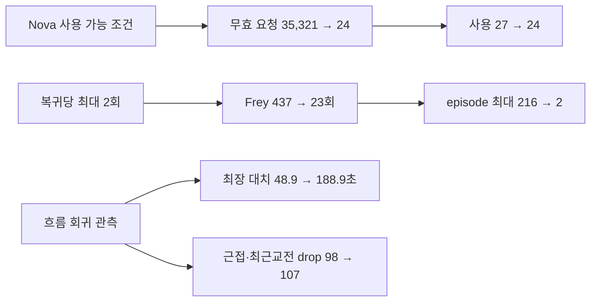

# CODEX-QA-14 Round 7 — 마지막 측정

## 결론 먼저

동일 seeds 101–112, 8 bots, `--fixed-fps 60`으로 12경기를 다시 측정했다. **Nova의 실제 사용 가능 조건 반영은 KEEP**, **모든 캐릭터의 복귀당 skill-1 최대 2회 제한도 KEEP**이다. Nova의 복귀 skill 요청은 `35,321 frame / 27회 사용`에서 `24 frame / 24회 사용`으로 정상화됐고, Frey의 한 복귀 최대 사용은 `216→2회`, 전체 사용은 `437→23회`로 줄었다. R7에서 3회 이상 사용한 복귀 episode는 0건이다.

생존 비용은 작지만 0은 아니다. 전체 recovery 성공률은 `92.35→91.26%`, 링아웃은 `122→128`, Frey 링아웃은 `15→19`였다. 반면 경기 중앙값은 `290.1→286.1초`, no-progress 시간은 `999.8→845.5초`로 악화되지 않았다. 다만 최장 대치는 seed 112에서 `188.9초`, 최대 경기 길이는 `415.9초`로 크게 튀었고, 근접 또는 직전 교전 표적 drop도 `98→107`로 늘었다. seed 112는 추가 trace로 원인을 좁혔고, 나머지는 다음 세션의 우선 분석 대상이다.

## R5–R7 핵심 전후표

| 지표 | R5 | R6 | R7 |
|---|---:|---:|---:|
| 경기 길이 중앙값 (범위), 초 | 285.9 (192.7–411.1) | 290.1 (191.7–335.3) | **286.1 (191.7–415.9)** |
| 링아웃 / 경기당 | 123 / 10.25 | 122 / 10.17 | **128 / 10.67** |
| 공중 점프 0 링아웃 | 76 (61.8%) | 80 (65.6%) | **85 (66.4%)** |
| recovery 성공 / 전체 | 1,384/1,520 (91.05%) | 1,510/1,635 (92.35%) | **1,367/1,498 (91.26%)** |
| 포털 이동 | 231 | 244 | **240** |
| 표적 없음 / wander | 6.20% / 3.51% | 6.18% / 3.73% | **5.81% / 3.62%** |
| 표적 전환/분 | 14.58 | 15.57 | **15.49** |
| progress drop 전체 | 199 | 318 | **329** |
| 그중 300px 이내 또는 최근 3초 교전 | 59 | 98 | **107** |
| no-progress episode / 시간 / active 비율 | 106 / 1,238.8초 / 6.05% | 73 / 999.8초 / 4.85% | **69 / 845.5초 / 4.12%** |
| 20초+ 대치 수 / 최장 | 6 / 171.1초 | 5 / 48.9초 | **4 / 188.9초** |
| stuck 시간 / active 비율 | 28.3초 / 0.14% | 33.0초 / 0.16% | **31.3초 / 0.15%** |
| 공격 intent / 적중 / 적중률 | 16,536 / 7,098 / 42.92% | 19,401 / 7,351 / 37.89% | **16,056 / 7,285 / 45.37%** |
| Central player / monster / crystal / none | 85.49 / 11.40 / 2.24 / 0.87% | 88.91 / 7.87 / 1.61 / 1.61% | **84.27 / 13.30 / 0.99 / 1.44%** |
| 승수 Frey/Luna/Nova/Rio/Yuki | 3/1/2/2/4 | 3/4/2/3/0 | **2/4/2/3/1** |

R7 공격 적중률 상승은 대부분 실제 명중 증가가 아니라 R6의 Frey 연속 dash와 Nova 무효 요청이 intent 분모에서 제거된 결과다. 실제 적중 수는 `7,351→7,285`로 거의 같으므로 공격 판단 자체가 7.5%p 좋아졌다고 해석하지 않는다.

## seed별 경기

각 셀은 `길이초 / 승자 / 링아웃 / 포털`이다.

| seed | R5 | R6 | R7 |
|---:|---|---|---|
| 101 | 240.0 / Rio / 15 / 17 | 335.3 / Frey / 13 / 17 | **290.4 / Luna / 13 / 18** |
| 102 | 290.2 / Luna / 7 / 23 | 297.7 / Luna / 11 / 15 | **297.7 / Luna / 11 / 15** |
| 103 | 407.5 / Rio / 12 / 22 | 307.5 / Luna / 11 / 24 | **336.0 / Yuki / 12 / 16** |
| 104 | 267.3 / Yuki / 9 / 18 | 314.3 / Frey / 8 / 16 | **277.0 / Rio / 11 / 15** |
| 105 | 302.9 / Yuki / 7 / 17 | 274.8 / Luna / 12 / 22 | **274.8 / Luna / 12 / 22** |
| 106 | 411.1 / Nova / 15 / 20 | 279.9 / Rio / 13 / 28 | **287.5 / Rio / 12 / 22** |
| 107 | 281.6 / Frey / 8 / 21 | 275.7 / Nova / 8 / 28 | **275.7 / Nova / 8 / 28** |
| 108 | 341.9 / Yuki / 7 / 17 | 284.8 / Rio / 6 / 22 | **284.8 / Rio / 6 / 22** |
| 109 | 260.3 / Yuki / 10 / 19 | 295.4 / Nova / 12 / 22 | **295.4 / Nova / 12 / 22** |
| 110 | 255.9 / Frey / 15 / 23 | 264.7 / Frey / 11 / 16 | **264.7 / Frey / 11 / 16** |
| 111 | 192.7 / Nova / 6 / 14 | 191.7 / Luna / 9 / 18 | **191.7 / Luna / 9 / 18** |
| 112 | 397.0 / Frey / 12 / 20 | 307.7 / Rio / 8 / 16 | **415.9 / Frey / 11 / 26** |

seeds 102, 105, 107–111의 일곱 경기는 R6와 길이·승자가 정확히 같았다. R7 변경이 발동하지 않거나 경기 결과까지 전파되지 않은 seed가 많다는 뜻이다. seed 112의 188.9초 대치는 227초에 시작했고, 그 경기의 유일한 Frey recovery skill 두 번은 20.83/21.37초에 끝났으므로 시간 순서상 그 장기 대치를 복귀 상한의 직접 결과로 볼 근거는 없다.

## 캐릭터별 상태·표적·진전 없음

상태는 `wander/pursue/engage/portal/recover`, 표적은 `player/monster/crystal/none` 순서다.

| 캐릭터 | Round | 상태 비율(%) | 표적 비율(%) | 전환/분 | no-progress episode / 초 |
|---|---:|---|---|---:|---:|
| Frey | R5 | 4.42/18.29/71.97/0.50/4.82 | 53.34/33.39/6.23/7.04 | 15.07 | 30 / 438.0 |
|  | R6 | 4.29/14.01/71.29/1.59/8.80 | 57.87/30.57/5.44/6.12 | 14.08 | 15 / 274.25 |
|  | **R7** | **4.38/14.98/74.20/2.06/4.38** | **56.70/31.34/5.91/6.05** | **13.86** | **16 / 143.75** |
| Luna | R5 | 5.09/12.69/73.00/4.22/4.99 | 45.98/37.61/7.36/9.05 | 15.19 | 32 / 226.5 |
|  | R6 | 4.32/11.41/76.26/2.54/5.47 | 43.61/42.56/5.70/8.12 | 16.82 | 12 / 225.25 |
|  | **R7** | **4.42/11.88/76.03/1.52/6.15** | **44.95/41.79/5.95/7.32** | **17.07** | **10 / 199.25** |
| Nova | R5 | 3.61/12.45/73.46/3.97/6.50 | 51.34/37.36/5.13/6.17 | 14.19 | 17 / 155.75 |
|  | R6 | 4.38/10.65/76.01/1.55/7.41 | 45.13/40.55/7.29/7.03 | 16.60 | 14 / 130.0 |
|  | **R7** | **4.20/11.32/76.61/1.41/6.45** | **45.21/40.43/7.54/6.82** | **16.83** | **15 / 177.5** |
| Rio | R5 | 2.96/12.40/75.18/1.51/7.96 | 46.99/40.07/6.79/6.14 | 14.30 | 12 / 230.0 |
|  | R6 | 3.19/13.81/72.33/2.71/7.95 | 42.27/44.43/7.29/6.01 | 16.13 | 21 / 231.25 |
|  | **R7** | **3.54/12.92/73.53/3.43/6.59** | **45.06/41.75/7.06/6.14** | **15.84** | **19 / 224.25** |
| Yuki | R5 | 1.49/5.82/87.13/1.37/4.20 | 52.11/38.06/7.08/2.74 | 14.08 | 15 / 188.5 |
|  | R6 | 2.37/7.86/84.61/1.35/3.81 | 53.51/37.58/5.21/3.70 | 14.65 | 11 / 139.0 |
|  | **R7** | **1.62/7.29/85.68/1.71/3.70** | **52.67/38.85/5.41/3.07** | **14.54** | **9 / 100.75** |

Engage action 전체 비율 `approach/cross/hold/jump_in/retreat/escape`는 R5 `24.18/18.35/32.84/15.47/7.01/2.14%`, R6 `23.43/18.93/33.26/14.66/7.29/2.44%`, R7 `23.69/18.41/32.13/15.59/7.74/2.44%`로 안정적이다.

## 공격·생존

| 캐릭터 | intent / 적중률 R5 → R6 → R7 | PvP 피해/분 R5 → R6 → R7 | 링아웃(0점프) R5 → R6 → R7 | recovery 성공률 R5 → R6 → R7 |
|---|---|---|---|---|
| Frey | 3,611/50.18% → 4,124/41.88% → **3,667/47.01%** | 44.15 → 44.66 → **41.44** | 18(8) → 15(3) → **19(7)** | 94.26 → 96.95 → **95.33%** |
| Luna | 2,929/45.07% → 3,109/49.28% → **2,809/48.17%** | 32.40 → 33.06 → **33.84** | 31(21) → 29(22) → **30(24)** | 86.59 → 89.44 → **88.19%** |
| Nova | 3,344/42.58% → 6,209/24.13% → **3,542/45.00%** | 44.38 → 47.16 → **46.29** | 32(23) → 35(27) → **34(24)** | 90.17 → 89.53 → **89.94%** |
| Rio | 3,065/46.53% → 2,588/56.45% → **2,511/56.07%** | 38.39 → 37.75 → **38.42** | 15(4) → 17(6) → **15(5)** | 94.92 → 95.92 → **94.85%** |
| Yuki | 3,587/31.11% → 3,371/33.61% → **3,527/34.19%** | 35.40 → 36.25 → **36.35** | 27(20) → 26(22) → **30(25)** | 86.06 → 87.50 → **85.97%** |

- PvE 피해/분 R5→R6→R7은 Frey `91.78→82.57→82.13`, Luna `80.14→107.23→98.52`, Nova `84.49→103.16→109.14`, Rio `88.65→98.56→98.15`, Yuki `53.20→52.02→55.97`이다.
- Yuki side basic: 시도/적중/정확 적중률 `1,457/695/47.70% → 1,245/697/55.98% → 1,302/736/56.53%`. 360px+ 시도는 `718→444→483`; PvP DPM은 유지됐다. 이 metric은 **충분히 좋음**이다.
- Rio side basic의 0–240px miss는 R7 `14.75%/16.37%`, PvP DPM `38.42`, 3승으로 R6와 동등하다. **충분히 좋음**이다.
- Nova 궁극기 launch/aimed/forced/redirect/hit은 `52/52/0/14/46 → 54/54/0/8/46 → 51/51/0/8/46`; **충분히 좋음**이다.
- air-down 뒤 자기 링아웃은 R5 Frey/Luna/Nova/Rio 각 1, R6 전원 합계 8, R7 전원 각 2로 합계 10이었다. 빈도는 낮지만 사라지지는 않았다.

### 공격 종류별 intent / 적중률

| 종류 | R5 | R6 | R7 |
|---|---:|---:|---:|
| ground side | 8,127 / 52.37% | 7,651 / 57.73% | **7,505 / 58.48%** |
| ground up | 934 / 45.72% | 967 / 42.61% | **947 / 42.66%** |
| ground down | 1,265 / 13.04% | 1,180 / 13.98% | **1,240 / 13.23%** |
| air side | 1,338 / 35.50% | 1,289 / 34.37% | **1,313 / 33.51%** |
| air up | 639 / 48.98% | 577 / 53.03% | **632 / 52.06%** |
| air down | 1,013 / 55.18% | 1,121 / 54.50% | **1,116 / 54.03%** |
| skill 1 | 1,681 / 40.21% | 5,082 / 15.09% | **1,797 / 40.01%** |
| skill 2 | 1,027 / 11.49% | 1,024 / 11.72% | **990 / 12.02%** |
| ultimate intent | 512 / 21.29% | 510 / 21.57% | **516 / 22.87%** |

R6→R7 전체 적중률 변화가 skill-1 spam 제거에서 왔다는 것을 이 표가 직접 보여 준다. 기본 공격과 다른 skill의 사용·적중은 같은 범위다.

### 휘두를 때 거리별 miss 비율

각 셀은 `0–120 / 120–240 / 240–360 / 360+ px` 순서다.

| 캐릭터 | R5 | R6 | R7 |
|---|---|---|---|
| Frey | 21.95/37.91/87.57/96.88% | 21.51/46.21/88.29/97.48% | **21.00/47.51/87.38/94.25%** |
| Luna | 23.88/30.89/63.71/91.40% | 20.89/30.82/61.45/90.74% | **21.86/30.86/61.01/91.38%** |
| Nova | 14.91/42.55/88.86/97.93% | 12.96/39.62/85.37/96.71% | **13.45/41.84/84.22/95.66%** |
| Rio | 17.21/44.60/88.68/83.33% | 16.88/43.36/93.75/100% | **16.51/43.02/95.65/100%** |
| Yuki | 53.35/54.91/73.63/75.75% | 48.62/51.23/71.31/79.22% | **49.09/51.65/71.12/77.37%** |

## 단계별 상태·표적

각 셀은 R5 → R6 → R7이다. 상태는 `wander/pursue/engage/portal/recover`, 표적은 `player/monster/crystal/none` 순서다.

| Phase | 상태 비율(%) | 표적 비율(%) |
|---|---|---|
| Exploration | 3.28/11.83/77.52/0.22/7.15 → 3.72/12.29/75.61/0.19/8.18 → **3.82/12.38/76.41/0.25/7.14** | 39.28/47.09/7.92/5.71 → 38.85/47.81/6.93/6.41 → **39.97/46.79/6.83/6.41** |
| Corner warning | 3.86/10.12/70.12/10.81/5.09 → 4.38/10.05/70.65/8.06/6.86 → **4.55/10.03/72.84/8.45/4.13** | 52.67/34.67/5.54/7.12 → 49.65/34.97/7.93/7.45 → **51.89/33.25/7.76/7.10** |
| Convergence | 5.08/11.05/76.43/3.17/4.27 → 4.27/11.64/75.24/3.27/5.58 → **3.58/12.11/77.68/3.26/3.37** | 61.67/24.40/5.08/8.86 → 56.28/31.93/5.23/6.57 → **57.76/30.63/6.28/5.33** |
| Central brawl | 0.28/27.41/71.31/0/0.99 → 1.12/10.21/87.02/0/1.65 → **1.02/9.26/87.98/0/1.73** | 85.49/11.40/2.24/0.87 → 88.91/7.87/1.61/1.61 → **84.27/13.30/0.99/1.44** |

## 복귀 skill — 직접 변경 지표

`도달`은 해당 사용이 포함된 recovery episode가 링아웃 없이 종료됐을 때 사용 건마다 세므로, 아래에 성공 episode도 따로 적었다.

| 캐릭터 | R5 요청/사용/도달 | R6 요청 frame/사용/도달 | R7 요청 frame/사용/도달 | R7 사용 episode(1회/2회/3+) | R7 성공 episode |
|---|---:|---:|---:|---:|---:|
| Frey | 13/13/6 | 437/437/437 | **23/23/15** | **16 (9/7/0), max 2** | **12/16** |
| Nova | 22/22/0 | 35,321/27/2 | **24/24/1** | **23 (22/1/0), max 2** | **1/23** |
| Rio | 8/8/4 | 8/8/4 | **8/8/4** | **8 (8/0/0), max 1** | **4/8** |

R6 Frey의 437회 중 415회는 세 episode(216/151/48회)에 몰렸다. R7의 복귀 skill 사용 fighter(Frey/Nova/Rio)는 모두 3회 이상 episode 0건이다. Nova는 R6에서 실제 사용 27회와 별도로 무효 요청 streak 시작 22건·총 35,321 frame이 있었지만, R7에서는 무효 streak 0건이고 요청 frame과 사용이 모두 24로 일치했다.

## Progress drop·대치

| 표적 kind | R5 전체 / 근접·최근교전 | R6 전체 / 근접·최근교전 | R7 전체 / 근접·최근교전 |
|---|---:|---:|---:|
| Monster | 126 / 39 | 228 / 78 | **235 / 84** |
| Player | 12 / 3 | 39 / 5 | **41 / 9** |
| Crystal | 61 / 17 | 51 / 15 | **53 / 14** |
| 합계 | 199 / 59 | 318 / 98 | **329 / 107** |

R7 대치 4건은 seed 104 `31.9초`, seed 109 `29.6초`, seed 111 `30.2초`, seed 112 `188.9초`다. 건수는 R5 6→R6 5→R7 4로 감소했지만 최장값이 목표 `≤2건`과 체감 품질 양쪽에서 실패한다. no-progress active 비율도 `4.12%`로 R3 수준 목표 `≤3.4%`에 아직 못 미친다.

seed 112를 추가 trace한 결과 원인을 더 좁혔다. 247.3–414.8초의 33개 시점, 66 fighter-samples 전부 realm 8의 Frey 둘이었다. 두 위치는 `(6266.6,3967.9)`와 `(6667.5,3983.0)`로 한 픽셀도 변하지 않았고 거리도 항상 `401.2px`였다. 상태는 engage 66/66, action은 approach 24·jump_in 42였지만 move intent와 attack intent는 모두 0이었다.

코드 trace상 Frey의 scale 적용 attack range는 `200×2=400px`, engage band는 scaled max range `170×2=340px`에 여유 `70×2=140px`를 더한 `480px`다. 따라서 401.2px가 engage에는 들어오지만 공격은 1.2px 차이로 거부된다. 동시에 두 발판 사이 틈은 길찾기의 최대 landing probe `160×1.5=240px`보다 커 `_terrain_move_intent()`도 이동을 0으로 만든다. 따라서 이 188.9초 대치는 **복귀 상한 때문이 아니라 engage band·공격 상한·gap traversal 사이의 dead band**다.

## Guard·포털·기타 안정성

| 지표 | R5 | R6 | R7 |
|---|---:|---:|---:|
| guard 반응 / too late / 상승 | 2,529 / 365 / 1,818 | 2,426 / 303 / 1,761 | **2,375 / 328 / 1,742** |
| block / parry | 285 / 126 | 272 / 134 | **288 / 130** |
| 포털 escape / roam / retreat / off-screen | 109/5/21/96 | 118/7/13/106 | **110/9/17/104** |
| collapse escape / relocation | 106 / 11 | 106 / 10 | **107 / 9** |
| corner escape 전체 / 3초 내 링아웃 | 399 / 14 | 457 / 10 | **466 / 12** |
| Yuki escape / 3초 내 링아웃 | 324 / 10 | 385 / 8 | **385 / 9** |
| Yuki 절벽 근처 피격 뒤 링아웃 | 8/27 | 10/26 | **13/30** |

Guard, 포털, Nova 궁극기, stuck는 R7 변경 뒤 큰 회귀가 없다. Yuki 절벽 지표는 `10→13`으로 나빠졌으나 side-basic 효율과 DPM은 유지됐으므로 다음 세션에서 위치 행동을 별도로 다룬다.

### 공격자별 guard

각 셀은 `반응/too late/상승/block/parry` 순서다.

| 공격자 | R5 | R6 | R7 |
|---|---|---|---|
| Frey | 593/84/447/84/42 | 590/77/419/73/48 | **580/71/438/79/48** |
| Luna | 468/49/392/52/48 | 434/31/340/51/37 | **414/37/325/47/39** |
| Nova | 577/104/364/48/8 | 543/81/358/65/16 | **522/85/342/61/13** |
| Rio | 361/62/258/46/7 | 365/55/264/59/8 | **370/62/273/64/8** |
| Yuki | 530/66/357/55/21 | 494/59/380/24/25 | **489/73/364/37/22** |

## Round 7 변경별 판정

| 리드 변경 | 판정 | 측정 근거 |
|---|---|---|
| Nova `can_use_skill_one()`이 공중 vector shift 잔여를 확인 | **KEEP** | 요청 `35,321→24 frame`, 사용 `27→24`, 무효 streak `22→0`. Nova recovery 성공률 `89.53→89.94%`, 링아웃 `35→34`, PvP DPM `47.16→46.29`로 생존·전투 손실이 없다. |
| 모든 fighter가 한 recovery에서 skill-1 최대 2회 | **KEEP** | Frey 사용 `437→23`, episode 최대 `216→2`, 3회 이상 위반 0. Frey recovery 성공률은 `96.95→95.33%`(-1.62%p), 링아웃은 `15→19`(+4)로 비용이 있으나 R6의 수십~수백 회 연속 dash는 명백한 행동 결함이다. Rio는 `8/8/4` 그대로다. 상한은 유지하되 Frey 실패 episode의 두 사용 간 거리 개선 여부를 다음 세션에서 본다. |

두 변경이 같은 commit에 있으므로 위 수치는 완전한 독립 A/B가 아니다. 다만 Nova의 `35,321→24`는 새 `can_use_skill_one()` 조건에 직접 대응하고, Frey의 `216→2`는 새 상수와 직접 대응한다. 반면 승자·장기 대치 같은 downstream 차이는 어느 변경의 인과인지 단정하지 않는다.

## 측정된 회귀

1. **장기 대치 tail:** 대치 수는 5→4지만 최장이 `48.9→188.9초`, 최대 경기 길이가 `335.3→415.9초`가 됐다. seed 112 trace에서 Frey 둘이 401.2px 간격의 서로 다른 발판 끝에서 engage 100%, move/attack 0으로 고정된 원인을 확인했다.
2. **progress drop:** 전체 `318→329`, 근접·최근교전 `98→107`; 특히 player가 `39/5→41/9`다. no-progress 시간은 줄었으므로 빠른 포기의 반대 비용이 계속 남아 있다.
3. **링아웃·점프:** 링아웃 `122→128`, 0점프 비중 `65.6→66.4%`; Frey `15→19`, Yuki `26→30`이다. 복귀 상한의 비용일 가능성은 있지만 캐릭터별로 분리 재현하지 않아 추정으로만 남긴다.
4. **중앙 표적:** player `88.91→84.27%`, monster `7.87→13.30%`. 목표 player ≥90%에서 더 멀어졌다.
5. **Yuki 절벽:** 근처 피격 뒤 링아웃 `10→13`. 공격 효율은 유지됐으므로 480px 공격 제한을 되돌릴 근거는 아니고, ledge hold/escape 문제다.

## 다음 세션 handoff

1. **리드 수정 후보:** `_engage_intent()`에서 `distance > attack_range`이고 target 방향의 `_terrain_move_intent()`가 0이면 engage를 계속 굴리지 말고, 대체 route/portal/target drop 중 하나로 빠지게 한다. 단순 공격 사거리 +2px는 이 seed만 가리는 보정이므로 우선하지 않는다. seed 112 회귀 테스트 목표는 20초+ 대치 ≤2건, 최장 <60초다.
2. progress drop 329건 중 근접·최근교전 107건을 `route 없음 / route 길이 미개선 / 수직층 / target 이동`으로 분해한다. 무제한 extension은 되돌리지 말고, 실제 route 길이가 줄 때 target별 1회만 retry하는 안을 검증한다.
3. Frey의 R7 skill 사용 episode 16건을 성공 12/실패 4로 나누고 1회차·2회차 뒤 플랫폼 거리 변화를 기록한다. 두 번째 dash가 거리 개선 없이 소모되는 경우에만 조건을 보강한다. 현재 **2회 상한 자체는 유지**한다.
4. 링아웃 128건에서 0점프 85건을 `공격적 climb 소비 / 피격 후 소비 / 복귀 중 잘못된 소비`로 분해한다. 전체 비율 66.4%는 아직 충분히 좋지 않다.
5. Yuki 절벽 링아웃 13건과 Central monster 표적 13.30%를 별도 추적한다. Yuki 480px 제한, Rio 근거리 제한, guard, Nova 궁극기는 현재 metric상 **충분히 좋아 추가 조정 우선순위가 아니다**.

## 한눈에 보기



위 그림의 위쪽 두 흐름은 코드 변경과 직접 대응하는 측정이며, 아래쪽 회귀는 같은 빌드에서 함께 관측된 상관관계다. 아래쪽을 R7 복귀 변경의 인과로 확정하지 않았다.

## 실행·검증

- import를 먼저 두 번 시도했으나 둘 다 Godot 엔진 signal 11로 종료됐다. 이는 R6 import 첫 시도에서도 관측된 엔진 crash이며 스크립트 parse 오류는 출력되지 않았다. 기존 import cache로 실제 probe를 실행했다.
- seeds 101–112를 각각 별도 Godot 프로세스로 순차 실행했다. canonical 12/12 exit 0, 12/12 자연 종료다.
- 12개 로그 모두 `SCRIPT ERROR`, `Parse Error`, 알려진 인증서 오류 외 `ERROR` 0건이다. 모든 프로세스에서 sandbox noise `ERROR: Failed to read the root certificate store.` 1건은 별도 관측됐다.
- 보고서 작성 중 seed 112 standoff trace를 처음 추가했을 때 선택적 `target_name` 키를 필수 키처럼 읽어 프로브 `SCRIPT ERROR`가 발생했다. 즉시 중단하고 안전한 `.get()`으로 고쳤으며, seed 112를 처음부터 재실행해 415.9초·동일 결과·오류 0으로 교체했다. 실패 로그/결과는 최종 산출물에 사용하지 않았다.
- 마지막 0경기 parse smoke는 exit 0이었지만 `--log-file ../...` 상대경로를 Godot가 예약 Windows pipe `user://..`로 해석해 `ERROR: Could not create directory: 'user://..'.`를 console에 출력했다. 제품·프로브 런타임 오류가 아니라 보조 smoke 호출의 로그 경로 오류이며, canonical 결과는 즉시 seed별 JSON에서 재병합해 아래 SHA로 복원했다.
- 병합 검증에서 한 건 배열을 PowerShell이 단일 객체로 풀던 문제를 발견해 `merge_round7.ps1`이 배열을 보존하도록 수정하고 seed별 원자료에서 재병합했다.
- 원자료 `round7-results.json`, 계산 요약 `round7-summary.json`, seed별 JSON/로그 12쌍을 남겼다.
- `round7-results.json` SHA-256: `EEA1A9A6D654B3A9E401E6A1EEDD426782E15F0A408614354F2DB72818BC93F6`.
- 제품 소스와 기존 제품 테스트는 수정하지 않았다. 전체 제품 test suite는 카드 범위가 아니어서 실행하지 않았다.

프로젝트 루트 `smash-nine-prototype/`에서 재실행:

```powershell
powershell -ExecutionPolicy Bypass -File tests/analysis/codex_qa_14/run_round7.ps1
```

이 한 명령이 12경기를 한 프로세스씩 실행하고 병합·요약까지 수행한다.
