# CODEX-QA-15 · 실제 게임 화면 아트 QA

## 결론

1280×720 창 모드의 실제 게임 화면 **71장**을 직접 열어 확인했다. 즉시 눈에 걸리는 P1은 5건이다: 기본 표시 봇 패널, 상단 HUD 충돌, 유키 봉인의 사각 플레이스홀더, 요툰하임 지진의 평면 막대, 결과 화면에 남는 경기 HUD/봇 패널. 배경·캐릭터·대부분의 공격/궁극기 VFX는 현재 스케일에서 선명하고 정렬도 좋으므로 아래 `looks good` 항목은 불필요하게 다시 손대지 않는 편이 좋다.

## 순위별 발견 사항

`측정 사실`은 캡처 픽셀 또는 현재 레이아웃/에셋 수치이고, `육안 판단`은 플레이어 관점의 평가다.

| 순위 | 심각도 | 화면 / 증거 | 측정 사실 | 육안 판단 문제 | 소유 파일 | 권장 수정 |
|---:|:---:|---|---|---|---|---|
| 1 | **P1** | F4 봇 패널, [2× 확대](evidence/01_bot_panel_2x.png) | 패널 폭 352px = 화면 폭의 **27.5%**. 캡처에서 x=922~1274, y≈96~477을 차지한다. | 개발 패널이 시작부터 켜져 전투·포털·공격 이펙트를 계속 가린다. 디버그 도구임을 감안해도 공개 빌드 기본 화면으로는 가장 큰 시야 방해다. | `scripts/ui/MatchHud.gd`의 `BOT_PANEL_SHOWN_AT_START`, `_build_bot_panel()` | 공개/일반 실행에서는 기본값 `false`; 테스트 전용 플래그나 `OS.is_debug_build()`일 때만 자동 표시. F4 수동 토글은 유지한다. |
| 2 | **P1** | 바나하임/요툰하임 상단 HUD, [2× 확대](evidence/02_top_hud_overlap_2x.png) | `realm_label` x=390~890, `status_label` x=782~1172로 **108px 겹친다**. | 긴 기믹명 뒤에 캐릭터 HP가 붙어 `Growing vinesHP 114/115`, `EarthquakesFrey...`처럼 읽힌다. 중요한 현재 렐름과 HP가 동시에 깨진다. | `scripts/ui/MatchHud.gd::_ready()`; `scripts/Main.gd::_update_hud()` | 렐름 라벨 폭을 약 380px로 제한하고 기믹은 별도 3번째 줄/작은 배지로 이동한다. 또는 상태 라벨을 초상화 아래 세로 블록으로 내린다. |
| 3 | **P1** | 유키 설치 봉인, [3× 확대](evidence/03_yuki_seal_placeholder_3x.png) | 원본 사각형 24×36px, 외곽선 36×50px. `yuki_k` 6프레임 연출이 끝난 뒤 5초 설치물에는 이 도형만 남는다. | 완성된 캐릭터/포털 사이에 에디터 충돌 박스 같은 하늘색 사각형이 떠서 명백한 플레이스홀더로 보인다. 여러 일반/궁극기 캡처에도 반복 노출된다. | `characters/yuki/YukiSeal.gd::_ready()`, `_play_seal_art()`; `assets/art/attack_vfx/yuki_k.png` | 원본 아트 모드에서는 `ColorRect`/`Line2D`를 숨기고 `yuki_k` 마지막 프레임을 고정하거나 별도 `yuki_seal_idle.png` 64×64(1×)를 사용한다. 프로토타입 모드에서만 사각형 fallback을 유지한다. |
| 4 | **P1** | 요툰하임 지진 경고/발동, [2× 확대](evidence/04_quake_bars_2x.png) | 경고는 모든 발판 위에 높이 **10px** 단색 `ColorRect`; 발동은 0.7초짜리 2~4px 먼지 입자뿐이다. | 화면 전체에 매끈한 황색 막대가 생겨 픽셀 아트 위의 디버그 표시처럼 보인다. 발동 직후는 반대로 너무 약해 지진 충격이 사라진다. | `scripts/realms/RealmHazards.gd::_start_warning()`, `_start_active()` | `assets/art/hazards/quake_warning.png` 96×16(1×, 반복 가능한 균열/맥동)과 `quake_impact.png` 4×128×64 스트립을 추가하고, 평면 막대 대신 타일링·충격 프레임을 쓴다. |
| 5 | **P1** | 결과 화면, [2× 확대](evidence/05_results_hud_2x.png) | 결과 배경 알파는 0.78이고 `show_results()`는 경기 HUD 전체를 숨기지 않는다. 상단 상태, 초상화, 미니맵, 봇 패널이 그대로 남는다. | 순위표 위·뒤에 `Alive 3/8`, HP, 봇 계획, 월드 이름/몬스터가 겹쳐 종료 화면이 중간 디버그 상태처럼 보인다. | `scripts/ui/MatchHud.gd::show_results()`, `_set_match_hud_visible()` | 결과 진입 시 clock/realm/status/minimap/focus/bot/debug/offscreen marker를 모두 숨긴다. 결과 패널은 표 영역에 0.9 이상 불투명한 단일 배경을 둔다. |
| 6 | **P2** | 바나하임 덩굴 경고→활성, [비교 확대](evidence/06_vine_warning_active.png) | 후보 다리는 225×24 또는 600×24px. 경고는 양 끝의 작은 초록 입자, 활성은 기존 초록 발판과 거의 같은 명도다. | “새 길” 경고 후 무엇이 생겼는지 한눈에 찾기 어렵다. 전술적으로 중요한 새 발판이 배경·기존 발판에 묻힌다. | `assets/art/hazards/vine_bridge.png` (96×24); `scripts/realms/RealmHazards.gd::_start_warning()`, `_vine_bridge()` | 기존 96×24 파일의 상단에 밝은 황록 1~2px 림과 꽃/새순 실루엣을 추가하고, 0.35초 성장 동안 백색/연두 outline 또는 잎 파동을 준다. |
| 7 | **P2** | 아스가르드 빛기둥 / 무스펠 불기둥, [비교 확대](evidence/07_stretched_hazards.png) | 두 원본은 각각 64×128px. 빛은 105×1080 월드 rect 3개(합계 315px = 화면 폭 24.6%), 불은 120×690 rect 2개(합계 240px = 18.8%)로 세로 stretch된다. | 한 장의 작은 픽셀 텍스처가 매우 길게 늘어나 정적인 벽지처럼 보이며, 기둥 안 전투자는 회색/주황 막에 묻힌다. 위험 범위는 명확하지만 완성도와 전투 가독성이 같이 떨어진다. | `assets/art/hazards/light_beam.png`, `fire_pillar.png`; `scripts/realms/RealmHazards.gd::_art_node()`, `_start_active()` | 바닥 cap + 반복 가능한 middle + head로 세로 3-slice/tile 처리한다. 가능하면 각 6×96×256 스트립(576×256)로 약한 애니메이션을 주고, 범위용 반투명 rect 알파는 0.2→0.10~0.12로 낮춘다. |
| 8 | **P2** | 결과 `Cards` 열, [2× 확대](evidence/10_results_card_ids_2x.png) | `player.upgrades` 내부 ID를 그대로 출력해 `sky_step`, `last_stand`, `anchor`가 노출된다. | 다른 UI는 `Sky Step`, `Last Stand`처럼 표시명을 쓰는데 결과만 개발용 식별자라 미완성으로 보인다. | `scripts/ui/MatchHud.gd::show_results()` 583~584행; 카드 카탈로그/플레이어 업그레이드 데이터 | ID→표시 제목 매핑을 거쳐 Title Case를 출력한다. 카드가 여러 장이면 쉼표 뒤 줄바꿈 또는 폭 제한을 둔다. |
| 9 | **P2** | 화면 하단 조작 안내, [1.5× 확대](evidence/08_control_hint_overlap.png) | `info_label`은 x=24, y=664, 1232×48px, 15px 폰트로 경기 내내 유지된다. | 발판·캐릭터·피격 입자 위를 800px 이상 가로지른다. 밝은 흰 문장이 하단 전투를 가리고 스크린샷마다 가장 먼저 눈에 들어온다. | `scripts/ui/MatchHud.gd`의 `CONTROLS_HINT`, `info_label`, `show_message()` | 시작 후 6~8초에 페이드하고, 이후 `? Help` 한 줄로 축약한다. 유지해야 한다면 0.65 알파의 작은 배경 패널과 두 줄 배치를 사용한다. |
| 10 | **P2** | 바나하임 Mossling / 무스펠 Ember Imp, [비교 확대](evidence/09_monster_camouflage.png) | 두 시트는 576×384, 96px 셀로 1× 표시된다. | 크기·픽셀 밀도는 좋지만 초록 몬스터가 초록 숲에, 주황 몬스터가 주황 화염 배경에 섞인다. 이름/HP가 없으면 몸 윤곽의 첫 인지가 늦다. | `assets/art/monsters/mossling_sheet.png`, `ember_imp_sheet.png`; `scripts/RealmMonster.gd::_build_art_sprite()` | 시트 크기는 유지하고 전 프레임에 1~2px 반대 온도의 외곽 림(모슬링 청록/크림, 임프 보라/황백)을 추가한다. 월드별 tint보다 원본 시트 실루엣 보강이 안전하다. |
| 11 | **P3** | 미니맵, [3× 확대](evidence/11_minimap_3x.png) | 셀 60×34px, 폰트 9px, 이름을 `left(9)`로 잘라 `Svartalfh`, `Muspelhei`가 된다. | 상태/인원은 구분되지만 렐름명이 조용히 잘려 작은 화면에서는 고유명 식별이 어렵다. | `scripts/ui/MatchHud.gd::rebuild_minimap()` | 셀을 68×36, 폰트를 10~11px로 키우거나 공식 짧은 이름을 데이터로 제공한다. 임의 9자 절단은 제거한다. |

## 확대 증거

### 1. 기본 봇 패널

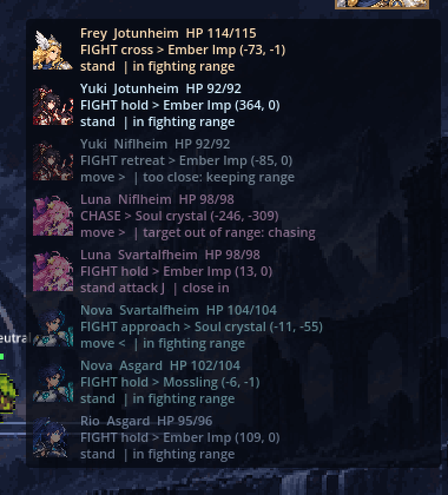

폭 352px 패널이 화면 오른쪽의 전투 정보를 지속적으로 덮는다. 흐리게 표시된 다른 렐름 전투원도 8행 모두 공간을 차지한다.

### 2. 상단 HUD 충돌

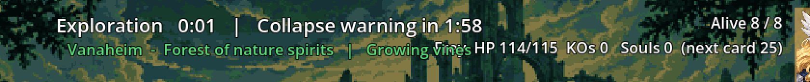

렐름/기믹 문자열 끝과 HP 상태 문자열 시작이 같은 좌표 구간을 사용한다.

### 3. 유키 봉인 플레이스홀더

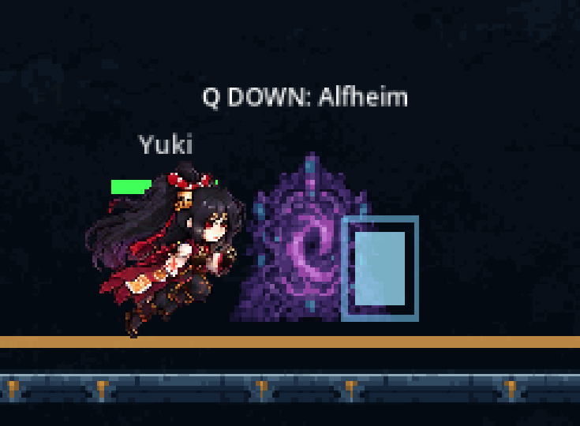

포털 왼쪽의 하늘색 사각형이 5초간 유지되는 실제 설치 봉인이다. 일시적인 `yuki_k` 아트가 끝난 뒤 fallback 도형만 남는다.

### 4. 지진 경고 막대

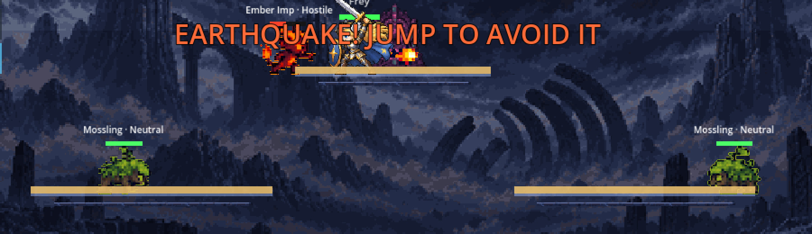

모든 발판 상단의 동일한 황색 직사각형이 월드 아트와 다른 재질로 보인다.

### 5. 결과 화면에 남은 경기 HUD

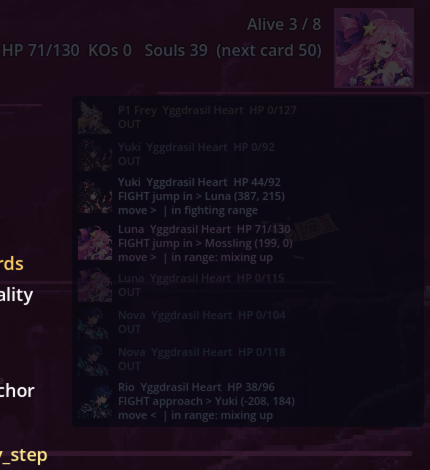

결과 오버레이 뒤에 상단 상태와 전체 봇 패널이 계속 보인다.

### 6. 덩굴 다리 가시성

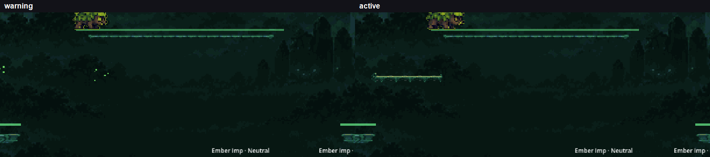

왼쪽 경고의 작은 점과 오른쪽 활성 다리 모두 같은 초록 배경에 섞인다. 활성 장면의 새 짧은 다리는 중앙 상단에 있지만 기존 발판과 거의 같은 값이다.

### 7. 세로로 늘어난 렐름 기둥

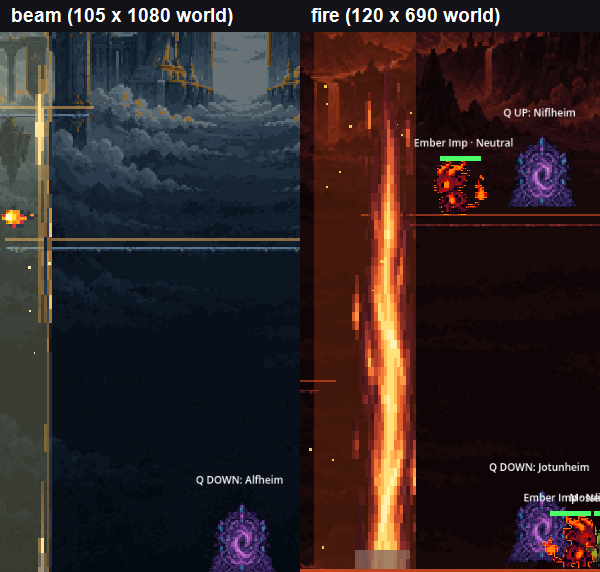

64×128 원본 하나가 각각 1080/690 월드 px 높이로 늘어나며 중간 무늬가 길게 당겨진다.

### 8. 결과 카드 내부 ID

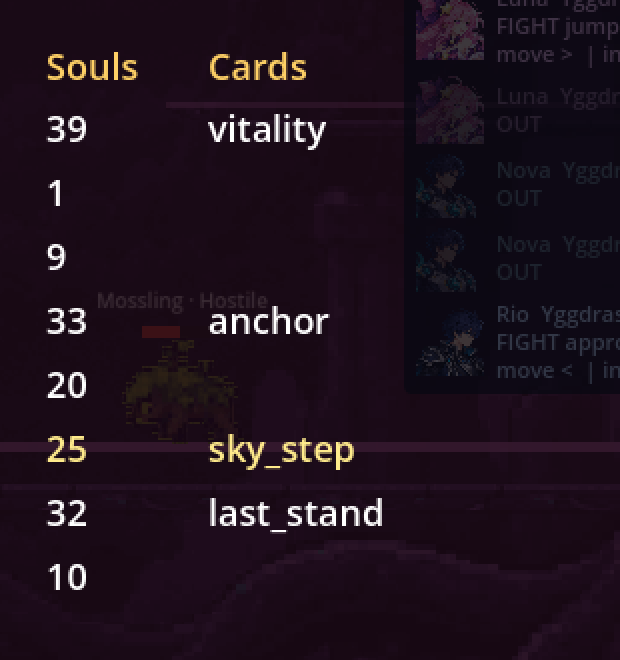

`sky_step`, `last_stand`가 플레이어용 표시명 대신 그대로 노출된다.

### 9. 하단 조작 안내와 전투 겹침

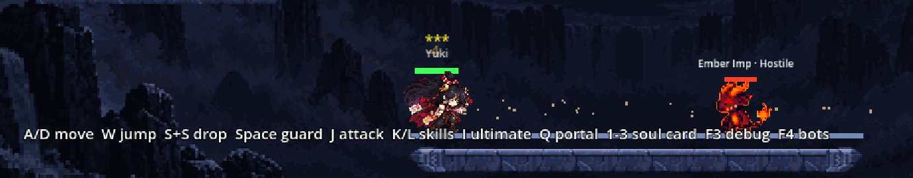

유키와 임프가 싸우는 높이에 조작 문장이 겹친다.

### 10. 몬스터와 고유 렐름의 동색 문제

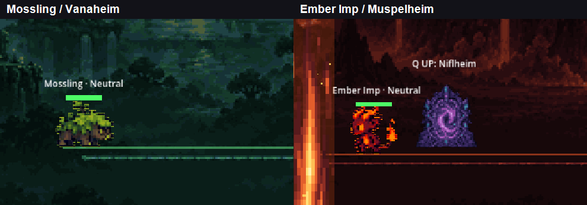

픽셀 크기는 맞지만 몸의 큰 색면이 각 배경의 주조색과 같다.

### 11. 9px 미니맵과 이름 절단

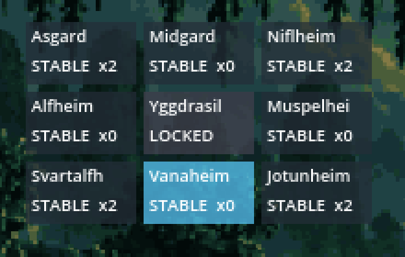

3× 확대에서도 `Svartalfh`, `Muspelhei`처럼 끝이 잘린 것을 확인할 수 있다.

## Looks good — 유지 권장

- **9개 렐름 배경**: 27개 렐름 위치 캡처에서 배경이 잘리거나 선형 보간으로 흐려진 흔적은 없었다. 아스가르드·미드가르드·니플하임·알프하임·무스펠하임·스바르트알프하임·바나하임·요툰하임·중앙의 색과 실루엣이 서로 분명하다.
- **캐릭터 1× 스케일**: Frey, Yuki, Luna, Nova, Rio의 몸 비율과 픽셀 밀도는 새 월드 스케일과 어울린다. 발 위치도 캡처에서 발판 상단과 일치한다.
- **기본 공격/스킬 VFX**: Frey 검광, Luna 별/쌍월, Nova 중력 효과, Rio 검광/방패, Yuki 부적 발동은 중심이 캐릭터·피격 지점과 크게 어긋나지 않는다. 유키의 **설치 후 idle 사각형만 예외**다.
- **궁극기 컷인**: 초상화, 이름, 기술명이 캐릭터 색으로 통일되고 화면 좌우를 완전히 막지 않는다. Frey·Luna·Nova·Rio 컷인과 Yuki 후반 폭발은 선명하다.
- **포털과 소울 크리스털**: 포털의 보라 실루엣, 목적지 라벨, 72×96 프레임의 소울 크리스털은 어두운 배경에서도 잘 보이며 크기도 과하지 않다.
- **소울 카드 선택 UI**: 3장 카드, 아이콘, 번호, 제한시간이 한눈에 읽힌다. 캐릭터·월드와 분리되는 패널 대비도 충분하다.
- **시작 화면/로고**: 로고, 캐릭터 초상화 열, 조작 설명의 계층이 명확하고 잘림이 없다.
- **붕괴/서든데스 색 처리**: 주황 붕괴 경고와 보라/적색 서든데스 영역은 렐름 배경과 구분되며 위험 상태가 즉시 읽힌다.

## 캡처 범위와 검증

- 창 모드, 1280×720, 원본 아트, 한 번에 Godot 창 하나만 실행했다.
- 기존 캡처: `capture_screens.gd` 7장, `capture_ultimates.gd` 10장, `capture_attacks.gd` 15장.
- 보완 캡처: 9개 렐름 × 3개 카메라 위치 27장, 봇 패널 1장, 포털/크리스털/몬스터 3장, 4개 시간형 기믹 경고·활성 8장. 합계 39장.
- 총 **71장**을 접촉 시트로 전수 확인하고, 발견 후보는 원본 1280×720로 다시 열었다. 모든 PNG는 `System.Drawing`으로 열어 크기 1280×720을 확인했다.
- 최종 산출물을 만든 4종 창 모드 캡처 스크립트는 마지막 실행에서 `SCRIPT ERROR`, `Parse Error` 없이 종료했고, 알려진 `Failed to read the root certificate store`만 출력됐다.
- 최초 `--import`는 파일 스캔을 완료했지만 샌드박스가 `C:/Users/TH/AppData/Local/Godot`에 쓰지 못해 editor cache 생성/저장 ERROR가 추가로 발생했다. 제품 런타임 오류가 아니라 이 클론의 샌드박스 경로 제한이지만, 규칙상 **깨끗한 import 통과로 판정하지 않는다**.

## 산출물

- 원본 화면: `reports/codex-qa-15/screens/`
- 전수 확인용 접촉 시트: `reports/codex-qa-15/contact_sheets/`
- 확대 증거: `reports/codex-qa-15/evidence/`
- 보완 캡처: `smash-nine-prototype/tests/analysis/codex_qa_15/capture_art_qa.gd`
- 증거 재생성: `smash-nine-prototype/tests/analysis/codex_qa_15/make_evidence.ps1`

## 남은 작업

이 유닛의 범위(관찰·측정·보고)는 완료했다. 제품 소스와 아트는 수정하지 않았다. 다음 단계는 리드가 P1 5건을 코드/UI 카드와 아트 카드로 나누고, ART-16 결과가 들어온 뒤 공격 VFX 15장을 같은 시점으로 재캡처하는 것이다.
