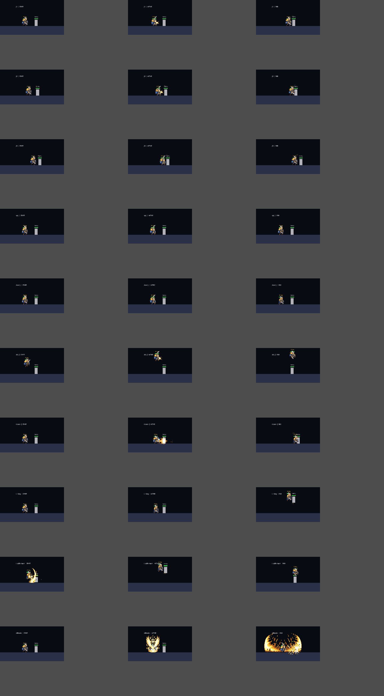
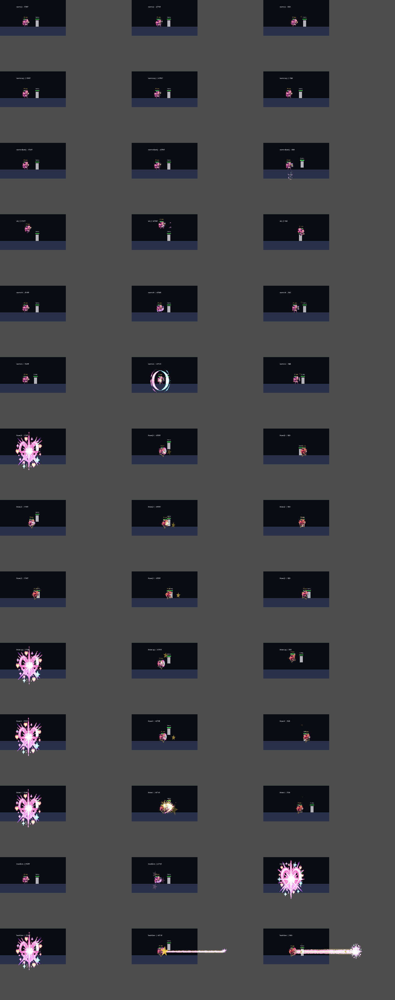

# CODEX-QA-17 Round 1 · Frey / Luna 완성도 진단

측정 시각: 2026-10-10 03:12–03:59 KST  
브랜치: `codex/char-qa-17`  
역할: 측정·제안·보고만 수행. 제품 소스와 기존 테스트는 수정하지 않았다.

## 결론

Frey는 **강한 근접 브루저라는 수치 정체성은 선명하지만, 문서가 약속한 띄우기→공중 추격 루트와 L 재입력은 현재 실전 연결성이 낮다.** 고정 더미에서 J 3타는 45/60/120px 모두 8/8 들어갔지만 타 사이에 각각 `+7~+9프레임` 탈출 틈이 있었고, 이동 봇에는 세 거리 모두 완주 0/4였다. 봇은 K는 333회 중 234 hit event를 냈지만 L은 116회 중 17회뿐이며, L 스파이크 재입력 로직 자체가 없다.

Luna는 **Normal 중거리 마법 ↔ Brave 근접 격투의 큰 차별화는 성공했지만, 각 형태의 핵심 콤보가 설계 문장대로 이어지지 않는다.** Normal J의 trail+bloom은 110px 고정 더미에서 두 타가 모두 맞은 경우가 1/8, J→K 전체는 2/8이었다. 반면 Brave 위 J→공중 위 J는 8/8, 두 번째 타가 경직 종료보다 7프레임 빨라 유일하게 안정적인 진콤보였다.

가장 먼저 고칠 것은 Frey의 L 후속 입력/추격, Luna의 trail→bloom 위치 보정, 두 캐릭터 J 단계별 몸동작이다. 패시브는 Frey에게 화력 대신 추격 가속을 주는 **`발키리의 추격선`**, Luna에게 정확한 두 박자 적중을 형태 전환으로 잇는 **`별의 박자`**를 1순위로 제안한다.

## 측정 방법과 경계

- Godot 4.7, `--fixed-fps 60`, headless. 공격자는 `InputEventAction`을 `PlayerBase._unhandled_input`에 넣어 J/K/L/I를 프레임별로 눌렀다. 공격 잠금·피격 상태·위치·속도는 전투 중 직접 설정하지 않았다.
- 고정 더미 8회, 실제 `EnemyAI`가 움직이고 가드/공격하는 Rio 봇 4회. 음수 gap은 다음 타가 기존 경직 종료 전에 활성화된 진콤보, 양수는 방어·이동 가능한 프레임이다.
- knockback distance는 마지막 적중 위치에서 관측 종료까지 목표가 이동한 최대 거리다. 절대 사거리나 순수 초기 넉백 속도가 아니다.
- 봇 사용량은 기존 Round 16 S0(현재 봇 선택 규칙), seeds 101–112, 12경기의 `totals.attacks`와 `ultimate_events`를 다시 합산했다. `hits`는 성공한 activation 수가 아니라 hit event 수라 Luna의 두 박자/다단 궁극기는 1회에 여러 hit를 낼 수 있다.
- 궁극기 중단 전용 새 probe는 12시드 90초 초기구간도 실행했다. 완주 480초 자료가 아니라 **초기전 표본**이며, `시전 후 1초 안 caster가 PvP 피해를 받음`과 `그 시전의 궁극기 window hit event가 0`을 분리했다. 후자는 `likely cancelled` 추정값이지 제품 내부 취소 신호가 아니다.
- 캡처는 창 하나를 잠깐 열어 각 기술의 START/ACTIVE/END를 실제 실행했다. 알려진 certificate-store ERROR만 발생했고, 이 환경에서 import 시 Godot editor cache 경로 쓰기 ERROR가 별도로 있었으나 게임 probe에는 나타나지 않았다.

원자료: `combo-raw.json`, `summary.json`, `match-raw.json`. 큰 기존 Round 16 원자료는 커밋 대상에 복사하지 않았다.

## 블라인드 제안 순위

세부 규칙·표시·봇 사용·대응법·위험은 [`blind-proposals.md`](blind-proposals.md)에 제안 시각과 함께 고정했다.

### Frey 패시브

1. **발키리의 추격선**: 위 J/L 띄우기 대상에 1.0초 표식. 그쪽 공중 수평 가속 +10~15%, 최고속도·피해·넉백 불변. K에는 미적용.
2. **검세**: 1.2초 안 서로 다른 검 공격 연속 적중 시 최대 2단, 다음 검 공격의 몸 전진만 단계당 +18px.
3. **선봉의 결의**: 지상 패링 뒤 1.5초 안 다음 J 선딜 2프레임 감소. Frey가 이미 강해 위험이 가장 크다.

### Frey 기술

1. L 올려치기 적중 후 재입력 가능 프레임을 링으로 표시하고 `스파이크 / 공중 J` 두 선택이 실제로 닿도록 궤적 조정.
2. J1 수평, J2 감아 올리기, J3 양손 마무리로 몸동작·검선·음향 분리. 수치는 먼저 유지.
3. K 0.13초 준비 중 방향 화살표, 발동 시 직선 날개 잔상. Nova 가속과 Rio 순간이동과 문법 분리.
4. 위/아래/공중 J의 수직·하강·수평 검선을 구분하고 위 J 추격은 화력보다 위치 이득을 보상.
5. 궁극기 지상 원형 균열/공중 수직 착지선, 첫 파동과 0.28초 여진을 서로 다른 링으로 표시.

### Luna 패시브

1. **별의 박자**: 같은 J의 trail+bloom이 모두 맞으면 최대 3별(5초). 다음 Brave 첫 공격의 몸 전진만 별당 +12px, 피해·판정·6초는 불변.
2. **별자리 잔향**: 서로 다른 방향 bloom 연속 적중 시 0.35초 별자리 선과 다음 K 궤도 예고. 피해 없음.
3. **Brave Heart**: 마지막 1초 근접 적중 때만 최소 0.35초 Heart Laser를 보장. 설명/봇 로직 복잡도가 커 3순위.

### Luna 기술

1. Normal J trail은 작은 틱, bloom은 4~5프레임 뒤 큰 별꽃/무거운 음향으로 두 박자 분리. 첫 타는 위치 고정, 두 번째는 넉백.
2. Normal은 몸 밖에 도형을 그리고 Brave는 주먹·발에 압축 폭발이 붙는 반대 문법으로 통일.
3. Brave J를 잽→낮은 보디 킥→큰 회전 킥의 서로 다른 몸동작으로 제작.
4. Normal K는 분리된 투사체+종점, Brave K는 몸에 붙은 짧은 혜성 꼬리로 구분.
5. Normal L의 몸 가까운 빈 원을 잠깐 어둡게 표시하고, Brave L은 몸에서 전방으로 터지는 굵은 발차기로 표시.
6. 오라의 별 6개를 1초마다 끄고, 재입력 시 남은 별이 레이저 마디로 바뀌게 해 시간 환전을 설명.

## 콤보 측정

### Frey

| 루트 | 고정 더미 | 다음 타 gap | 평균 knockback 거리 | 이동 봇 완주 |
|---|---:|---:|---:|---:|
| J1→J2→J3, 45px | 8/8 | `+7, +9f` | 70.9px | 0/4 (평균 1.75 hit) |
| J1→J2→J3, 60px | 8/8 | `+7, +9f` | 70.9px | 0/4 (평균 1.50 hit) |
| J1→J2→J3, 120px | 8/8 | `+6~+9f` | 70.9px | 0/4 (평균 1.75 hit) |
| L→스파이크 | 0/8 (L만 적중) | — | 113.9px | 0/4 |
| L→공중 J | 0/8 (L만 적중) | — | 113.9px | 0/4 |
| K→J, 150px | 8/8 | `+10f` | 83.1px | 0/4 (K만 적중) |
| 위 J→공중 위 J | 0/8 (위 J만 적중) | — | 20.0px | 0/4 |

해석: 고정 더미에 “들어가는 것”과 진콤보는 다르다. Frey J는 눈앞의 멈춘 상대에는 전진 덕분에 3타가 닿지만 모든 타 사이에 6~9프레임이 열린다. 이동 봇 완주 0%가 그 틈의 실전 비용을 보여 준다. K→J도 10프레임이 열려 거리 회수 후 압박 재개이지 확정 콤보가 아니다.

### Luna

| 루트 | 고정 더미 | gap | 평균 knockback 거리 | 이동 봇 완주 |
|---|---:|---:|---:|---:|
| Normal J trail→bloom, 110px | 1/8 | 성공 시 `-3f` | 8.2px | 0/4 |
| Normal J→K, 110px | 2/8 | `-3~+20f` | 58.0px | 0/4 |
| Normal L sweet spot, 135px | 8/8 | 단타 | 61.8px | 0/4 |
| Brave J1→J2→J3, 45px | 0/8 (평균 1 hit) | — | 69.6px | 1/4 |
| Brave 위 J→공중 위 J | **8/8** | **`-7f`** | 82.7px | 0/4 |
| Brave K→J, 120px | 0/8 (K만 적중) | — | 134.9px | 1/4 |
| Brave L, 100px | 8/8 | 단타 | **281.5px** | 2/4 |

해석: Normal J의 두 판정이 동시에 닿으면 -3f로 이어지지만, 첫 trail의 밀기와 고정 bloom 위치가 어긋나 실제 두 타 성공은 12.5%뿐이었다. Brave 위 J 루트는 현재 가장 완성된 Luna 콤보다. Brave J 지상 3연격은 첫 타 이후 밀려난 더미를 따라가지 못해 문서의 “빠른 3연속 콤보”와 충돌한다.

## 가독성 캡처

### Frey

각 행은 J1/J2/J3/방향 J/K/L/스파이크 입력/궁극기, 각 열은 START→ACTIVE→END다. J1·J2·J3와 방향 J가 모두 같은 4프레임 attack 행을 사용해 몸동작만 보고 단계를 구분하기 어렵다. K 직선 불꽃, L 상승호, 궁극기 거대 금빛 파동은 기술 단위 식별성이 상대적으로 좋다.

### Luna

Normal의 청록·분홍 외부 도형과 Brave의 금색 신체 타격은 형태 구분에 성공했다. 반면 같은 형태 안의 J 단계들은 동일 attack 행 때문에 잽/보디 킥/회전 킥의 차이가 별 이펙트 크기에 주로 의존한다. Heart Laser는 사거리와 방향이 매우 명료하지만, 남은 변신 시간을 얼마나 소비하는지는 화면만으로 수치화하기 어렵다.

## 봇 사용량

### Round 16 S0 12경기

| 캐릭터/입력 | uses | hit events | hit events/use | 피해/use |
|---|---:|---:|---:|---:|
| Frey 지상 옆 J | 1,572 | 1,012 | 0.644 | 3.605 |
| Frey 공중 옆 J | 260 | 102 | 0.392 | 1.753 |
| Frey 위 J / 공중 위 J | 159 / 130 | 86 / 63 | 0.541 / 0.485 | 0.988 / 2.723 |
| Frey K | 333 | 234 | **0.703** | **6.310** |
| Frey L | 116 | 17 | **0.147** | 1.168 |
| Luna 지상 옆 J | 2,099 | 812 | 0.387 | 1.873 |
| Luna 공중 옆 J | 239 | 87 | 0.364 | 1.672 |
| Luna K | 565 | 282 | 0.499 | **3.884** |
| Luna L | 130 | 33 | 0.254 | 2.489 |

- Frey K는 가장 효율적인 일반 선택이고 L은 최저다. AI는 `skill_2`를 다시 누르는 Frey 전용 후속 로직이 없어 스파이크를 0회 의도적으로 사용한다. 새 60초 pilot에서도 follow-up opportunity 1회, spike 0회였다.
- 궁극기 activation 기준 Frey `89회 중 74회` 하나 이상의 full-window hit(83.1%, 7.458 피해/cast), Luna `71회 중 63회`(88.7%, 8.715 피해/cast)였다.
- Luna 봇은 변신 시 무조건 4.4초 뒤 재입력을 한 번만 시도한다. 그 순간 경직/공격 잠금이면 `try_ultimate_followup()`가 입력을 소비하고 재시도하지 않는다. 따라서 이는 사람의 “계속 근접전 vs 지금 레이저” 판단과 같지 않다.

## 궁극기 중단 baseline

완료된 S0 12경기는 cast와 full-window hit는 있지만 caster 피격 시각을 저장하지 않아 중단 횟수를 소급 산출할 수 없다. 이를 섞어 추측하지 않고 별도 current-main probe를 seeds 301–312, 각 90초 초기전으로 실행했다.

| 캐릭터 | casts | 시전 후 1초 내 피격 | 비율 | ultimate hit 0 동반(`likely cancelled`) |
|---|---:|---:|---:|---:|
| Frey | 38 | 6 | 15.8% | 2 |
| Luna | 32 | 7 | 21.9% | 0 |
| Nova | 35 | 9 | 25.7% | 1 |
| Rio | 36 | 15 | **41.7%** | **9** |
| Yuki | 29 | 12 | 41.4% | 4 |

`likely cancelled`는 “1초 내 맞았고 그 시전의 궁극기 window hit가 0”인 보수적 추정이다. 원래 빗나간 시전도 섞일 수 있고 Yuki처럼 이미 생성된 효과는 시전자 피격 후에도 남을 수 있으므로 실제 취소 신호로 취급하지 않는다. 공통 슈퍼아머의 전후 비교 지표로는 같은 seeds에서 이 열이 줄어드는지 확인하면 된다.

- Luna: 32 casts 중 실제 Brave 진입 31회, 평균 form 관측 6.20초, Heart Laser 24회(진입 대비 77.4%). 명목 6초보다 긴 0.20초는 hitstop 중 `character_physics_process`가 멈춰 변신 타이머도 정지하기 때문이다. 4.4초 재입력 시도 1회가 경직/잠금에 막히거나 form이 먼저 끝난 사례가 7회였다.
- Frey: L 적중 후 follow-up opportunity 10회, 봇 spike 재입력 0회. 코드의 전용 follow-up 스케줄이 없다는 정적 확인과 일치한다.
- Frey 비용: 지상 0.22초 충전 또는 공중 dive 중 피격이면 `character_on_hit()`가 `ultimate_diving=false`로 만들어 착지 충격을 잃는다.
- Luna 비용: 0.26초 변신 충전 전 피격이면 변신 자체가 없고, 변신 후 피격은 해제되지 않지만 6초가 계속 소모된다.
- Nova 비용: 공전/돌진 중 피격 시 핵·예고선·공격이 정리된다. Rio는 남은 검이 사라지고, Yuki는 이미 생성된 결계라면 시전자 피격과 별개로 남는다.

## 다섯 캐릭터 차별화

| 캐릭터 | 속도 | 봇 공격 거리 | 이동/복귀 | 대표 콤보 루트 | 고유 규칙 | Frey/Luna와 겹침 |
|---|---:|---:|---|---|---|---|
| Frey | 305 | 300px | 8방향 K, 복귀 2회 | J 압박→L 띄움→공중 추격/스파이크 | 현재 지속 패시브 없음 | Brave Luna의 몸 돌진+3연격과 겹침 |
| Luna | 320, Brave +16% | 495px | Brave K, 전용 복귀 없음 | trail→bloom, Brave K→J→L/레이저 | 6초 형태 전환·시간 환전 | Normal 광역은 Yuki, Brave는 Frey와 일부 겹침 |
| Nova | 360 | 390px | 무공격 Vector Shift, 공중 1회 | K 가속→J/L로 관성 환전 | 현재 속도가 자원 | 몸 돌진처럼 보여도 K 자체 무공격이라 구별됨 |
| Rio | 350 | 345px | 200px 순간이동, 공중 1회, 2 air jumps | 위 진입→3연검/검기→룬 반격 | 흡수 방패·다중 점프 | Frey보다 짧은 암살, Brave보다 반격 중심 |
| Yuki | 330 | 705px | air jump만 | K 설치→J 유도→L 동시 폭발 | 파괴 가능한 봉인부 2개 | Luna Normal과 광역이 겹치나 지연 설치/준비로 구별 |

Frey와 Luna의 가장 큰 중복은 “몸이 이동하는 8방향 K + 근접 J 연속타”다. Frey는 느린 방향 선택·긴 직선·지속 압박, Brave Luna는 짧고 즉시·6초 제한·폭발적 마무리로 시각과 프레임을 더 벌려야 한다.

## 일곱 기준 점수표 (1–5)

### Frey — 20/35

| 기준 | 점수 | 근거 |
|---|---:|---|
| 컨셉이 외형·성능·스킬에 녹음 | 4 | 최고 HP/공격/방어/무게와 최저 속도가 무거운 발키리 브루저를 명확히 만든다. 금빛 검·날개도 일치. |
| 스프라이트 완성도 | 3 | 기본 실루엣은 좋지만 J1~J3·방향 J가 같은 attack 행이라 단계별 몸동작이 없다. 별도 ART-21 검토가 진행 중. |
| 스킬 인지성 | 3 | K/L/I 전용 효과는 읽히나 J 단계, L 후속 입력 가능 시점과 첫 파동/여진의 역할이 몸동작만으로 약하다. |
| 고유 움직임·콤보 손맛 | 2 | J는 더미에 닿아도 +6~9f, K→J +10f, L→air J와 위 J 추격 0/8. 문서의 핵심 루트가 실측에서 성립하지 않는다. |
| 다른 캐릭터와 차별화 | 3 | 가장 단단한 근접 기준 캐릭터는 선명하지만 지속 패시브가 없고 K/J 문법이 Brave Luna와 겹친다. |
| 봇이 특징대로 운용, 사람과 일치 | 2 | 봇은 K를 잘 쓰지만 L hit events/use 0.147, 스파이크 재입력 로직 0. 사람에게 약속한 L 선택 루트를 보여주지 못한다. |
| 강·약점과 실력 보완 | 3 | 느림/근접/빗나감 후딜은 명확하다. 다만 K가 진입·공격·복귀를 모두 해결하고 전체 봇 스윕 최강이라 약점 비용이 충분한지는 보류. |

### Luna — 22/35

| 기준 | 점수 | 근거 |
|---|---:|---|
| 컨셉이 외형·성능·스킬에 녹음 | 4 | 밝은 별꽃/하트와 Normal 중거리→Brave 근접 전환이 외형·수치·기술 모두에 나타난다. |
| 스프라이트 완성도 | 3 | Normal/Brave 시트 분리는 강점. 같은 형태 안 J1~J3/방향 공격은 동일 attack 행이라 동작 의미가 약하다. |
| 스킬 인지성 | 3 | L 고리·변신·레이저는 명료. Normal trail/bloom 4~5프레임 차이는 한 이펙트처럼 겹치고 남은 변신 시간 환전량은 직관적이지 않다. |
| 고유 움직임·콤보 손맛 | 2 | trail+bloom 1/8, J→K 2/8, Brave J 0/8. Brave 위 J 루트(-7f)만 확실히 살아 있다. |
| 다른 캐릭터와 차별화 | 4 | 로스터 유일의 시간제 형태 전환과 Heart Laser 환전. Normal 광역은 Yuki와, Brave K/J는 Frey와 일부 겹친다. |
| 봇이 특징대로 운용, 사람과 일치 | 3 | 중거리 J/K와 변신은 사용하지만 4.4초 고정 레이저 1회 시도는 사람의 상황 선택과 다르며 실패 재시도도 없다. |
| 강·약점과 실력 보완 | 3 | 낮은 HP/무게, Normal 근접 약점, Brave 시간 제한은 선명. 전용 복귀가 없어 낙하 대응을 실력으로 보완할 선택지가 공중 점프뿐이다. |

## Top 5 fixes

### Frey

1. **L 후속의 입력 창·추격 궤적을 보장하고 봇에도 재입력 판단 추가.** 적중 후 최소 6프레임의 `attack_lock=0` 구간, 화면 링, spike/air-J 양쪽 적중을 fixture로 고정.
2. **J1/J2/J3 전용 몸동작과 효과를 분리.** 같은 4프레임 행 재사용을 끝내고 단계가 숫자 없이 보여야 한다.
3. **핵심 콤보의 gap/궤적 재설계.** J는 매 타 확정일 필요는 없지만 이동 봇 완주 0%는 압박 캐릭터 목표와 충돌한다. L→air J와 위 J 추격은 최소 한 루트가 진콤보가 되게 한다.
4. **발키리의 추격선 패시브 도입.** 피해 없이 추격 조작성만 보강하고 K에는 미적용. Frey 밸런스 보류 원칙을 지킨다.
5. **K·궁극기 예고 강화 후 수치 유지.** 방향 화살표/착지선/두 파동 분리를 먼저 하고 추가 화력은 금지.

### Luna

1. **Normal trail이 bloom으로 목표를 보내도록 위치 보정.** 동일 대상 두 타 성공을 현재 12.5%에서 의도 범위로 올리되 설치 지속시간은 늘리지 않는다.
2. **Brave J 3단의 전진·넉백을 맞물리게 하고 전용 몸동작 제작.** 첫/둘째 타는 붙잡고 셋째만 강하게 밀어야 한다.
3. **별의 박자 패시브 도입.** Normal 정확타를 Brave 첫 진입으로 이어 형태 간 학습을 만든다. 피해 증가는 없다.
4. **6초/레이저 환전 UI와 봇 판단 개선.** 6개 별 타이머, 남은 별→레이저 마디, 피격/잠금으로 4.4초 입력 실패 시 짧은 재시도 또는 상황 조건.
5. **복귀 약점을 기술적 선택으로 바꿀 최소 보완.** 새 무료 복귀기보다 Brave K의 1회 공중 방향 선택 또는 별의 박자 이동 보상을 검토해 실력 보완 여지를 준다.

## 확인 및 현재 상태

- 완료: 블라인드 패시브/기술 제안, 실입력 고정 더미·이동 봇 콤보 probe, Round 16 S0 봇 사용량 재집계, 두 캐릭터 START/ACTIVE/END 접촉시트, 차별화표, 7기준 점수표.
- 현재 상태: 제품 소스는 변경하지 않았다. probe와 보고서만 카드 허용 경로에 있다.
- 제한: 12경기 기존 자료에는 궁극기 caster 피격 시각, 실제 Heart Laser 노드, Frey L 재입력이 없었다. 새 12시드 probe는 90초 초기구간이라 full-match 중단률로 일반화하면 안 된다.
- 환경: known certificate-store ERROR 외 combo/capture probe에 SCRIPT ERROR·Parse Error는 최종 실행에서 없었다. 최초 import의 editor cache ERROR는 sandbox의 AppData 쓰기 제한이며 이후 임시 writable AppData로 회피했다.

## 다음 권장 단계

1. 리드가 L/J를 고친 뒤 같은 `combo_probe.gd`로 Frey L→spike/L→air J와 Luna trail→bloom/Brave J를 우선 재측정한다.
2. 공통 궁극기 슈퍼아머 전후를 `match_probe.gd` 동일 seeds로 비교하되 다음 라운드는 480초 완주 12경기로 돌린다.
3. ART-21 새 시트가 합쳐지면 같은 캡처 스크립트로 contact sheet를 재생성해 J 단계 실루엣 차이를 판정한다.
