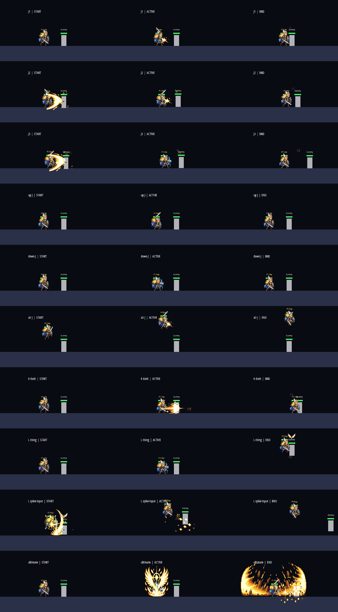
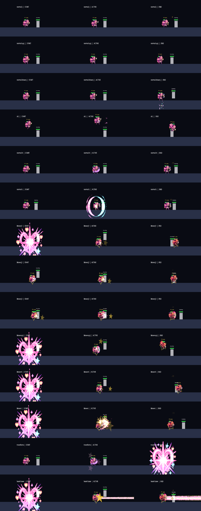

# CODEX-QA-17 Round 2b · Frey / Luna 독립 검증

측정: 2026-10-10 04:57–05:15 KST  
브랜치: `codex/char-qa-17-r2b` (`8246b6e` 위 최신 코드)  
역할: 제품 소스·기존 테스트는 수정하지 않고 새 `_r2b` 프로브, 원자료 분석, 보고만 수행했다.

## 결론

리드가 보고한 **고정 더미 콤보 개선은 독립 프로브에서도 거의 수치까지 그대로 재현됐다.** Frey J 3타는 타 사이 `+6~+9f` 틈이 `−4~−7f` 진콤보로, L→강스파이크는 0/8에서 8/8(`−19f`)로 바뀌었다. Luna의 궤적→별꽃, Brave 3연타, 최신 Brave K→J도 각각 8/8 진콤보다.

그러나 Frey의 정체성 문장 중 **L→공중 J와 위 J→공중 위 J는 여전히 0/8**이다. 추격 ×1.15는 공격 전 접근을 돕지만 다음 공격 시작 순간 끝나므로 이 두 루트를 연결하지 못했다. 매치에서는 Frey 봇이 스파이크 기회 3번 중 2번 재입력했고, Luna 봇은 변신 40회 중 35회 레이저를 실제 생성했다.

Nova 링아웃 29→42의 즉시 원인은 한 캐릭터의 긴 밀치기가 아니다. 궁극기 피격 3초 안 링아웃이 정확히 10→23으로 13건 늘었고 증가분은 Rio +4, Luna +4, Nova +4, Frey +1로 분산됐다. 특히 Nova 궁극기는 시전 79→59인데 실제 발사 단계는 52→58, 적중은 39→47로 늘었다. **오늘 밤의 공통 궁극기 아머가 여러 캐릭터의 궁극기 단계를 끝까지 나가게 만든 전장 전체 변화**가 가장 강한 설명이며, Frey/Luna 변경만의 직접 효과로 단정할 수 없다.

## 측정 경계

- 리드의 Round 2 README를 열기 전에 `blind-scores.md`에 점수를 고정했다.
- 콤보는 `InputEventAction`을 실제 입력 함수에 프레임별로 넣었다. 전투 중 상태를 직접 설정하지 않았다. Brave 루트는 변신 폭발·경직·착지가 끝난 뒤, **루트 시작 전 fixture setup으로만** 목표 위치를 다시 놓았다.
- 고정 더미 8회, 움직이는 Rio 봇 4회, 60fps. 음수 gap은 다음 타가 기존 경직 안에 활성화된 것이다.
- 매치 프로브는 같은 seeds 301–312, 8봇, 90초다. 최신 코드는 리드의 매치 측정 뒤 들어온 Brave K→J 변경을 포함하므로 전투 궤적과 시전 수가 조금 달라지는 것이 정상이다.
- `likely cancelled`는 내부 취소 신호가 아니라 `시전 뒤 1초 안 피격 + 해당 궁극기 적중 0`인 추정치다. 빗나간 궁극기도 포함될 수 있다.
- 대형 Round 16 원자료는 읽기만 했고 커밋 대상에 복사하지 않았다.

## 1. 블라인드 점수와 실측 후 판정

| 기준 | Frey 1차 → 블라인드 | Frey 실측 후 | Luna 1차 → 블라인드 | Luna 실측 후 |
|---|---:|---:|---:|---:|
| 컨셉이 외형·성능·스킬에 녹음 | 4→5 | **5** | 4→5 | **5** |
| 스프라이트 완성도 | 3→4 | **4** | 3→4 | **4** |
| 스킬 인지성 | 3→4 | **4** | 3→4 | **4** |
| 고유 움직임·콤보 손맛 | 2→4 | **3** | 2→4 | **4** |
| 다른 캐릭터와 차별화 | 3→4 | **4** | 4→5 | **5** |
| 봇이 특징대로 운용, 사람과 일치 | 2→4 | **3** | 3→4 | **3** |
| 강·약점과 실력 보완 | 3→3 | **3** | 3→3 | **3** |
| **합계** | **20→28** | **26/35** | **22→29** | **28/35** |

블라인드에서는 코드의 후딜 취소와 봇 재입력을 높게 봤다. 실측 뒤 Frey는 핵심 공중 추격 2개가 0/8이고 움직이는 봇에게 J3까지 완주하지 못해 콤보를 4→3, 낮은 L 적중 기회 때문에 봇 운용을 4→3으로 내렸다. Luna도 4.4초 고정 레이저가 사람의 상황 판단과 같지 않아 봇 운용을 4→3으로 내렸다.

리드보다 높게 보는 곳은 세 가지다.

1. **컨셉 5:** 두 패시브가 장식적 보너스가 아니라 Frey의 띄우기→추격, Luna의 Normal 정확타→Brave 빈도를 실제 규칙으로 묶는다.
2. **스프라이트 4:** ART-21이 69프레임을 4배로 검사하고 문제 프레임을 다시 그렸으며, 기술별 프레임 배정도 생겼다. 새 전용 행이 없다는 이유만으로 “완성도 향상”을 3에 묶는 것은 기준 문장보다 엄격하다.
3. **Luna 차별화 5:** 시간제 형태 전환, 남은 시간의 레이저 환전, Normal 정확타의 변신 쿨다운 환전이 동시에 있는 캐릭터는 로스터에 없다.

## 2. 콤보: 1차 → 최신 코드 독립 실측

### Frey

| 루트 | 1차 고정 더미 | 최신 R2b | gap 1차 → R2b | 마지막 적중 뒤 이동 1차 → R2b | 리드와 비교 |
|---|---:|---:|---:|---:|---|
| J1→J2→J3 45px | 8/8 | **8/8** | `+7,+9 → −5,−7f` | 70.9→200.6px | 일치 |
| J1→J2→J3 60px | 8/8 | **8/8** | `+7,+9 → −5,−7f` | 70.9→200.6px | 일치 |
| J1→J2→J3 120px | 8/8 | **8/8** | `+6,+9 → −4~−7f` | 70.9→187.1px | 리드 188px와 반올림 수준 |
| L→강스파이크 80px | 0/8 | **8/8** | `— → −19f` | 113.9→297.7px | 일치 |
| L→공중 J 80px | 0/8 | **0/8** | — | 113.9→113.9px | 일치, 미해결 |
| K→J 150px | 8/8 | **8/8** | `+10 → +10f` | 83.1→**21.5px** | 연결은 일치; 거리 표기 오류 발견 |
| 위 J→공중 위 J 45px | 0/8 | **0/8** | — | 20.0→20.0px | 일치, 미해결 |

`K→J`의 21.5px가 리드의 83.1px와 다른 이유는 제품 차이가 아니다. 1차/리드 프로브의 `max_after_hit_distance`는 새 타가 맞을 때 기준점을 바꾸면서 최대값을 초기화하지 않아, 첫 타 뒤 이동을 “마지막 타 뒤 밀린 거리”로 남긴다. R2b는 매 적중 때 최대값을 0으로 초기화했다. Frey J finisher는 그 자체가 가장 크게 밀어 리드의 200.6px 결론이 우연히도 그대로 검증됐다.

### Luna

| 루트 | 1차 고정 더미 | 최신 R2b | gap 1차 → R2b | 마지막 적중 뒤 이동 1차 → R2b | 리드와 비교 |
|---|---:|---:|---:|---:|---|
| 궤적→별꽃 110px | 1/8 | **8/8** | `−3 → −8f` | 8.2→60.0px | 일치 |
| J→K 110px | 2/8 | **8/8** | `−3~+20 → −8,+17f` | 58.0→58.5px | 일치; K는 진콤보 아님 |
| L sweet spot 135px | 8/8 | 8/8 | 단타 | 61.8→61.8px | 일치 |
| Brave J1→J2→J3 45px | 0/8 | **8/8** | `— → −10,−9f` | 69.6→223.1px | 일치 |
| Brave 위 J→공중 위 J | 8/8 | 8/8 | `−7 → −7f` | 82.7→75.5px | 연결 일치 |
| Brave K→J 120px | 0/8 | **8/8** | `— → −18f` | 134.9→124.9px | 리드의 후속 패치 결과와 일치 |
| Brave L 100px | 8/8 | 8/8 | 단타 | 281.5→192.7px | 최신/리드 재측정끼리 일치 |

움직이는 봇 결과는 방향만 본다. Frey J 3타는 독립 프로브도 0/4×3거리, Brave K→J는 3/4였다. 다만 이동 봇에서는 한 공격의 sweep hit event가 여러 번 잡힐 수 있어 `hits >= expected`가 각 단계 적중을 증명하지 않는다. 단계별 attack tag가 없는 현재 원자료로 “완주”를 정밀 판정하면 안 된다.

## 3. 스파이크·레이저·궁극기 아머

### 봇의 후속 입력

| 지표 | 1차 | 최신 R2b | 해석 |
|---|---:|---:|---|
| Frey L 적중 후 스파이크 | 잘못된 검출로 0/10 | **2/3 (66.7%)** | 설정 75%와 양립하지만 3회뿐이라 오차가 큼. 리드 480초 스윕 13/19(68.4%)가 더 유용 |
| Luna 변신→실제 레이저 노드 | 24/31 (77.4%) | **35/40 (87.5%)** | 실패 시 0.6초 재시도로 개선 |
| Luna 평균 form 관측 시간 | 6.20초 | **6.45초** | 공격 잠금/레이저 종료 대기까지 포함하므로 설계 상수 6초와 같은 뜻이 아님 |

### 같은 90초 12시드

| 캐릭터 | 시전 1차→R2b | 1초 안 피격 | 끊김 추정 | R2b 아머 흡수 |
|---|---:|---:|---:|---:|
| Frey | 38→38 | 6→16 | 2→1 | 21 |
| Luna | 32→40 | 7→18 | 0→1 | 23 |
| Nova | 35→32 | 9→14 | 1→0 | 24 |
| Rio | 36→37 | 15→20 | **9→2** | 22 |
| Yuki | 29→33 | 12→22 | 4→2 | 25 |
| **합계** | **170→180** | **49→90** | **16→6** | **115** |

슈퍼아머는 “안 맞음”이 아니라 **피해는 받고 넉백·경직·행동 취소를 막음**이다. 115회 흡수와 끊김 추정 16→6은 의도에 맞는다. 그러나 1초 안 피격 49→90 전체가 “밀리지 않아 그 자리에서 계속 맞았기 때문”이라는 리드 설명은 armor-only A/B가 없어 가설이다. 캐릭터 키트·전투 위치·시전 횟수도 함께 바뀌었다.

## 4. Nova 링아웃 29 → 42 원인

| Nova 지표 | Round 16 S0 | 현재 | 변화 |
|---|---:|---:|---:|
| 링아웃 | 29 | **42** | +13 |
| 궁극기 피격 3초 안 링아웃 | 10 | **23** | +13 |
| 그중 복귀 상태 | 9 | **19** | +10 |
| 그중 공중 점프 0 | 5 | **10** | +5 |
| 전체 링아웃 중 복귀 상태 | 28 | **38** | +10 |
| 환경 credit | 5 | 7 | +2 |

| 최근 궁극기 공격자 | S0 | 현재 | 증가 |
|---|---:|---:|---:|
| Rio | 8 | 12 | +4 |
| Luna | 0 | 4 | +4 |
| Nova | 1 | 5 | +4 |
| Frey | 1 | 2 | +1 |

판정은 다음과 같다.

1. **즉시 메커니즘은 궁극기 피격 뒤 복귀 실패 증가다.** 현재 23건 중 19건이 링아웃 시 복귀 상태였다.
2. **Frey/Luna의 길어진 일반 콤보가 단일 원인은 아니다.** 변경 캐릭터의 최근 궁극기 증가분은 Luna +4, Frey +1뿐이고 Rio+Nova가 +8이다.
3. **공통 아머가 궁극기 완료율을 올린 영향이 가장 강한 가설이다.** Nova 자신도 시전은 79→59로 줄었지만 orbit/launch 단계 완료는 52→58, 적중 39→47, 궁극기 피해 1037.6→1262.0으로 늘었다. 시전 대비 발사 완료가 약 66%→98%다. Rio도 hit event 310→490, 피해 930→1537로 크게 늘었다.
4. **Nova 자신의 slingshot이 자기 자신을 밖으로 보냈다고 원자료로 확정할 수 없다.** observer는 피해를 준 공격자의 캐릭터만 기록하고 victim 자신의 궁극기 이동 단계/instance id를 기록하지 않는다. `ultimate_attacker=nova` 5건은 최근 Nova 궁극기 피해를 뜻하며 자해 판정은 아니다. 환경 credit 증가는 +2뿐이어서 그것만으로 +13을 설명하지도 못한다.
5. 같은 seed라도 첫 변경 뒤 전투가 갈라지는 다자전이므로 위 수치는 연관이다. 확정에는 `victim_instance`, `attacker_instance`, Nova 자기 orbit/launch/redirect 시각, 링아웃 직전 위치를 한 이벤트로 묶은 armor-on/off A/B가 필요하다.

따라서 질문에 대한 짧은 답은: **오늘 밤 변경과 관련은 높지만, Frey/Luna의 밀치기 때문이라기보다 모든 캐릭터에 들어간 궁극기 슈퍼아머가 연쇄적으로 궁극기 완료·적중·복귀 실패를 늘린 결과에 가깝다.**

## 5. 리드 README red-team

### 동의하는 주장

- 고정 더미의 Frey J/L-spike와 Luna echo/Brave J/최신 Brave K 연결 수치.
- 추격 ×1.15만으로 Frey L→공중 J가 연결되지 않는다는 판정.
- Frey 움직이는 봇 3타와 Luna 고정 4.4초 레이저는 사람이 봐야 한다는 유보.
- Nova 29→42가 추가 조사가 필요하다는 경고 자체.

### 수정하거나 제한해야 할 주장

1. **“마지막 타 뒤 밀린 거리”는 프로브 정의와 다르다.** 누적 최대값을 새 적중 때 초기화하지 않는다. K→J가 83.1px로 보이지만 실제 두 번째 J 뒤 관측 이동은 21.5px다. J3 200.6px는 독립 초기화 측정으로 별도 확인됐으므로 결론은 유지된다.
2. **“1초 피격 증가가 아머 때문에 제자리에 남아서”는 인과 추정이다.** armor-only A/B 없이 49→85/90의 전부를 그 원인으로 배정할 수 없다.
3. **`likely cancelled`는 취소 검출이 아니다.** 피격 후 그냥 빗나간 시전도 포함한다. 감소 방향은 유용하지만 절대 취소율로 쓰면 안 된다.
4. **움직이는 봇 `hits >= expected`는 단계 완주 검출이 아니다.** attack stage tag가 없고 sweep hit event가 중복될 수 있다. 리드 원자료에서 Brave J가 3입력인데 5 hit인 trial이 그 증거다.
5. **최종 보고는 코드 snapshot이 섞였다.** 480초 스윕은 `9f782f9`(Brave K 취소 전), 콤보 표의 Brave K 8/8은 `4a45778` 이후다. README가 밝히고 있지만 “지금” 전체를 한 표본처럼 읽으면 안 된다.
6. **Frey 위 J→공중 위 J를 “probe가 점프를 누르지 않은 입력 문제”로만 돌릴 수 없다.** 카드가 지정한 두 입력은 위 J→공중 위 J이며, 별도 점프가 필요하면 현재 2-input route가 성립하지 않는 것이다.
7. **Nova 원인은 이제 ‘모름’보다 좁혀졌다.** 공격자 분해와 Nova 단계 완료율은 공통 궁극기 아머가 주된 후보임을 지지한다. 다만 자기 slingshot 여부는 telemetry 부족으로 미확정이다.

## 6. 시각적 확인

### Frey 최신 접촉시트

금빛 스파이크 입력 고리와 L 적중 대상 위의 추격 날개는 보인다. J1/J2/J3는 서로 다른 프레임을 쓰지만 실제 전투 크기에서 동작을 즉시 구분할 정도인지는 사람 판정이 남는다.

### Luna 최신 접촉시트

Normal의 외부 별마법과 Brave의 신체 타격, 하트 레이저는 선명하다. 별빛 충전 궤도는 이 fixture가 별을 쌓지 않아 접촉시트로 확인되지 않았다.

## 7. 사람이 실제로 볼 것

1. Frey J1→J2→J3를 **막 점프한 상대**에게 써서 J3 누락이 납득 가능한 대공 회피인지, 손맛이 끊기는 실패인지 본다.
2. Frey L 적중 뒤 0.18초 금빛 링이 사람 반응에 충분한지, 스파이크와 현재 0/8인 공중 J 중 실제로 선택이 느껴지는지 본다.
3. 추격 날개와 ×1.15 이동이 “표적을 쫓는다”로 느껴지는지, 단순 속도 흔들림으로 보이는지 본다.
4. Luna 75px 안쪽 별꽃 사각이 의도한 근접 약점으로 읽히는지, 버그처럼 보이는지 본다.
5. Brave 잽·보디 킥·회전 킥이 작은 게임 화면에서 손/발/회전으로 구별되는지, K→J가 지나치게 자동적인 확정 진입인지 본다.
6. 별 1~5개와 5개 소비가 전투 중 보이는지, 고정 4.4초 봇 레이저가 사람이 선택할 타이밍과 얼마나 다른지 본다.
7. seed 107처럼 Nova 링아웃이 많은 경기를 영상/instance telemetry로 보고, **상대 궁극기 피격→복귀 실패**와 **자기 slingshot 이동**을 분리한다.
8. 궁극기 금빛 아머 flash가 “무적”이 아니라 “피해는 받지만 버틴다”로 읽히는지 본다.

## 확인 및 현재 상태

- 완료: 블라인드 7기준 채점, 최신 코드 독립 실입력 콤보 168 trial(비교용 1차 168 trial), 같은 12시드 90초 매치, spike 전환 검출 수정, 레이저/아머 계수, 95MB 두 sweep의 Nova 링아웃 공격자·복귀 교차분석, 리드 보고 red-team.
- 테스트: Godot import와 두 probe가 끝까지 완료됐다. `SCRIPT ERROR`·`Parse Error`는 없었다. 로그의 `Failed to read the root certificate store`만 과제 카드에 적힌 sandbox known noise다.
- 제품 상태: 제품 소스는 바꾸지 않았다. Frey/Luna의 고정 더미 핵심 콤보 개선과 궁극기 아머 동작은 재현됐다.
- 남은 작업: 사람 플레이 감각 판정, Nova instance-level armor A/B, Frey 두 공중 추격 루트의 설계 결정이 남는다.
