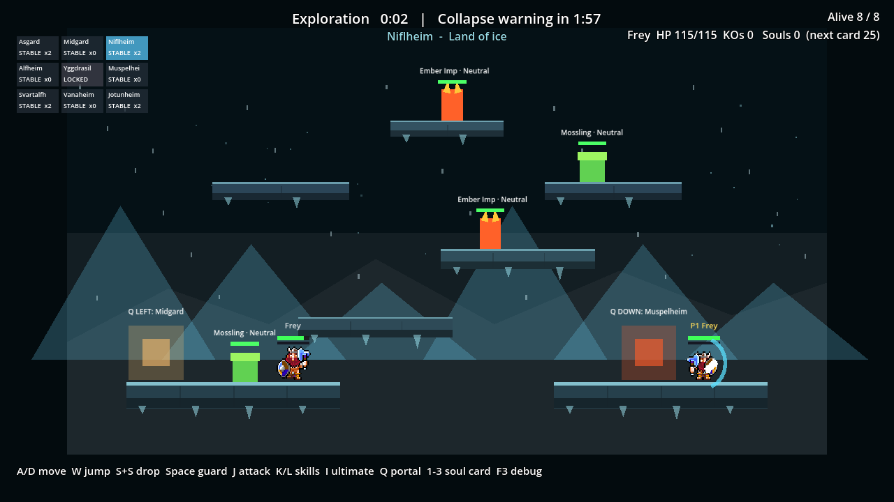
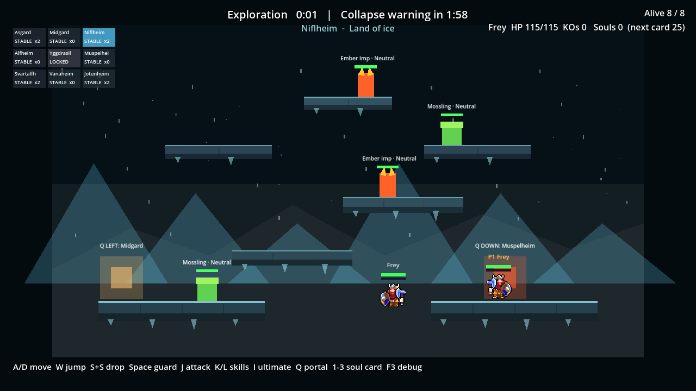
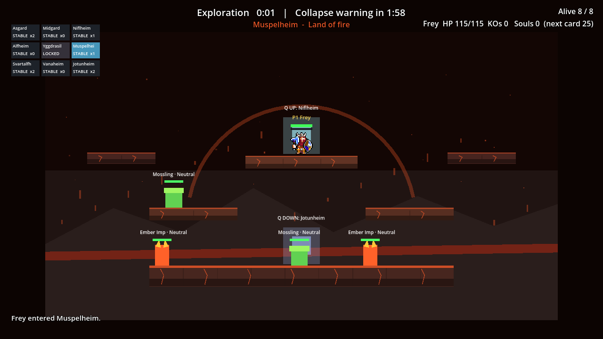
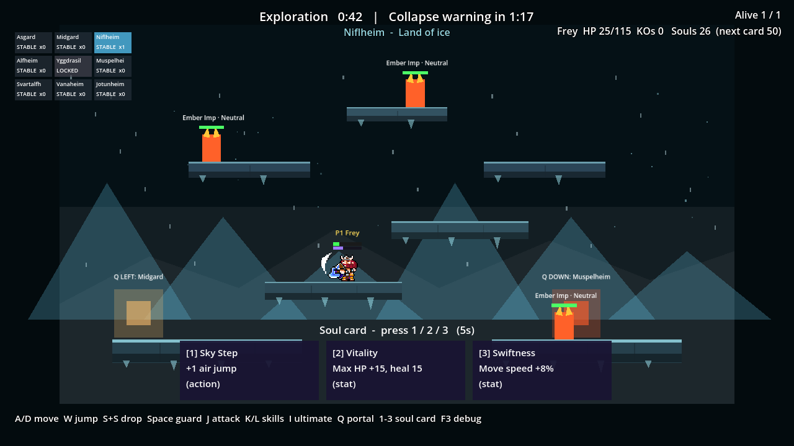
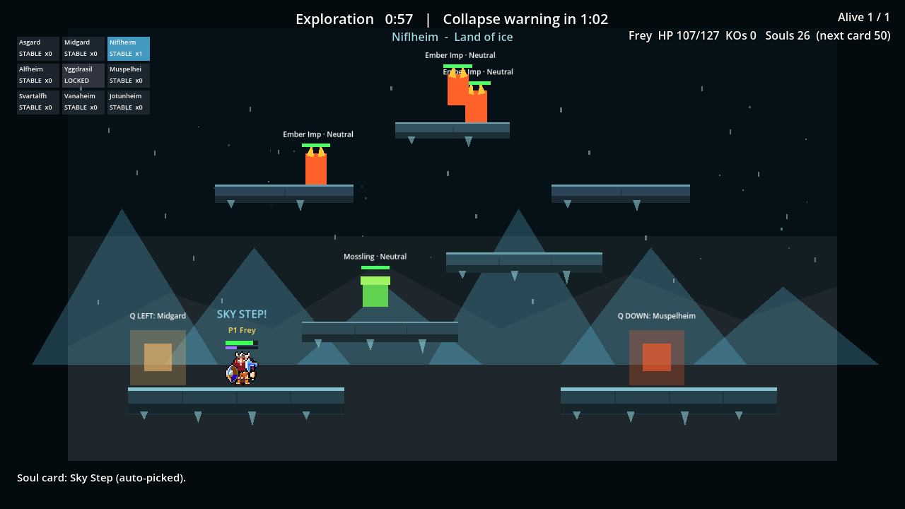
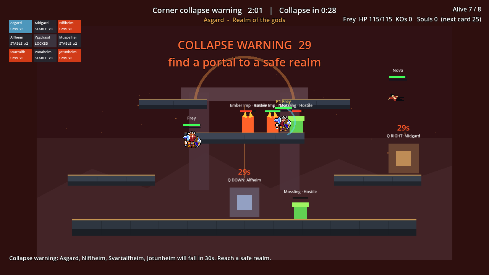
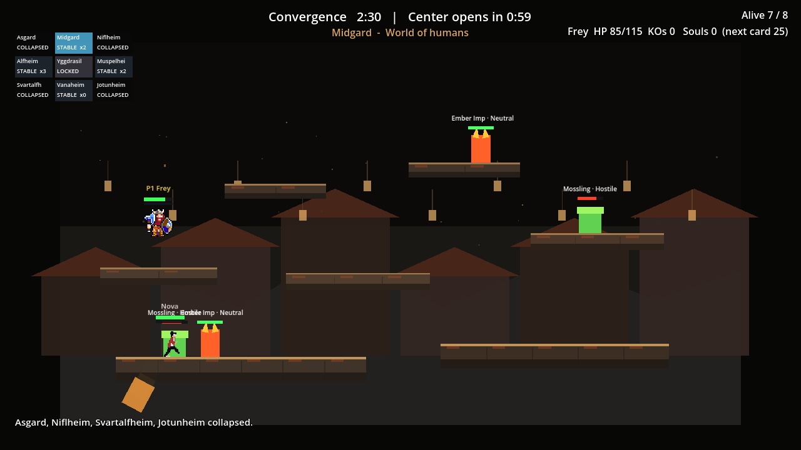
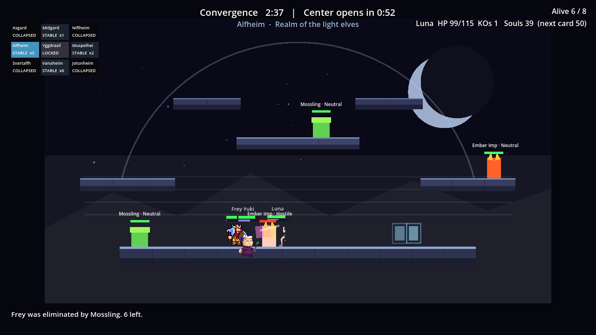

# CODEX-TESTER-01 결과 보고

## 결론

**전체 판정: FAIL.** 실제 `InputEventKey`를 눌렀다가 다음 프레임에 떼는 방식으로 M1 흐름을 검증했고, 시작·조작·포털·카드·붕괴·탈락 후 관전의 기능 판정은 통과했다. 그러나 결과 화면에서 `R`을 누를 때마다 제품 `SCRIPT ERROR`가 3/3회 발생해 재시작 과제는 실패했다. 또한 모든 창 모드 실행에서 Windows 루트 인증서 저장소 오류가 1회 발생했으므로, 카드의 엄격한 규칙상 실행 3개 모두 실패 실행으로 기록한다.

제품 소스는 수정하지 않았다. 추가한 것은 허용 경로의 실입력 드라이버, 측정 JSON, 스크린샷과 이 보고서뿐이다.

## 과제별 판정

| 과제 | 기능 판정 | 측정 결과 |
|---|---|---|
| 1. 시작 화면 1–4/B | **PASS** | 1/2/3/4가 Frey/Yuki/Luna/Nova를 각각 시작했다. 모두 P1 인간 표시, HUD, P1 렐름 카메라가 일치했다. B는 인간 0명, 생존 봇 관전, 관전 렐름 카메라가 일치했다. |
| 2. 실제 경기 조작 | **PASS** | D 30프레임 이동 `+141.3 px`, W 점프 상승 `138.3 px`, Space 가드 상태·아크 표시·해제 회복 확인. J/K/L 입력 후 공격 잠금 `0.197/0.453/0.567 s`. S+S 후 드롭 타이머 `0.287 s`, 아래로 `113.0 px`. I 첫 사용 `29.97 s`, 쿨다운 중 재입력은 `29.67→29.60 s`로 리셋되지 않았고 만료 후 `29.97 s`로 재사용됐다. |
| 3. 포털 | **PASS** | seed 4242, Niflheim→Muspelheim. A/D/W로 포털에 접근해 Q를 **1회** 누름. 예상 도착 `(9840.0, 3085.0)`, 측정 `(9840.0, 3088.4)`, 오차 `3.4 px`. 플레이어·카메라 모두 목적 렐름 4로 전환됐다. |
| 4. 소울 카드 | **PASS (격리 구성)** | `player_count=1`, seed 4242에서 몬스터를 A/D/W/S+S로 추적하고 J로 공격했다. 26소울에서 `[2] Vitality`가 즉시 적용됐다. 새 경기의 26소울 제안은 입력하지 않아 `4.94 s` 뒤 첫 카드 `Sky Step`이 자동 적용되고 메시지에 `(auto-picked)`가 표시됐다. 기본 8인 압박에서의 안정성은 사람 확인 필요. |
| 5. 붕괴·탈락·관전 | **PASS** | seed 6103, `Engine.time_scale=10`. Asgard에서 149.81초까지 머물렀고 150.12초에 HP `115→85`(정확히 30), Midgard로 강제 이동, 보호 `1.00 s`. 이후 A/D/W로 블래스트 라인을 넘는 실제 링아웃을 반복해 4회째 HP 0 탈락. 카메라는 생존 Luna(렐름 3)를 관전했다. |
| 6. 결과·R 재시작 3회 | **FAIL** | 초기 경기+재시작 3경기 모두 결과 도달(`409.4/402.9/420.9/420.1 s`, 30배 시간). 각 시작 화면 노드 수는 `751/751/751/751`로 누수 징후는 없었다. 하지만 R 직후 동일한 이전 장면 카메라 콜백 `SCRIPT ERROR`가 **3/3회** 발생했다. |
| 7. 단계별 캡처 | **PASS** | PNG 27장과 측정 JSON 3개를 저장했다. |

> 기능 PASS와 실행 게이트는 별개다. 모든 Godot 실행에 `ERROR: Failed to read the root certificate store.`가 있었으므로 “ERROR 문자열이 하나라도 있으면 실패”라는 카드 기준에서는 전체 FAIL이다.

## 주요 발견

### [높음] R 재시작마다 해제 중인 이전 Main이 null Viewport를 접근함

- 재현: 시작 화면에서 `B` → 결과까지 대기 → `R`. `Engine.time_scale=30`, 최초 seed 7301. 같은 절차를 3회 반복했다.
- 빈도: **3/3 R 입력**.
- 오류: `Cannot call method 'get_visible_rect' on a null value.`
- 스택: `Main._get_camera_target()` (`scripts/Main.gd:211`) ← `_update_camera_follow()` ← `_process()`.
- 수치: 새 시작 화면 노드 수는 매번 751로 복귀해 누수는 보이지 않지만, 이전 장면의 `_process`가 트리 이탈 중 한 프레임 실행된다.
- 스크린샷: [첫 결과](./21_restart_result_0.png), [오류 직후 다시 열린 시작 화면](./22_restart_start_1.png)
- 제안 수정: `Main`의 트리 이탈 시 처리를 즉시 중지하고, `_process`/`_get_camera_target`에서 `is_inside_tree()`와 null viewport를 방어한다. R 10회 회귀 테스트는 콘솔의 `SCRIPT ERROR/ERROR/Parse Error`도 함께 검사해야 한다.
- 소유 컴포넌트: `scripts/Main.gd`의 카메라·장면 생명주기.

### [중간] 결과 화면 뒤에서 승자까지 계속 전투해 표시가 모순됨

- 재현: `B` → 봇 경기 결과 도달 후 입력 없이 결과 화면을 관찰.
- 측정: 첫 경기는 409.4초에 `last survivor`로 Frey 승리 처리됐지만 캡처 시 HUD는 `Alive 0/8`, 승자 HP `0/115`, 하단 메시지는 `Frey was eliminated ... 0 left`였다.
- 스크린샷: [승자 표시와 Alive 0/8이 동시에 보이는 결과](./21_restart_result_0.png)
- 제안 수정: `_on_match_finished`에서 전투원 AI/물리, 몬스터 공격, 위험 지대를 정지하고 결과 HUD는 종료 순간 스냅샷을 유지한다. 전체 트리를 pause한다면 R 입력 UI만 `PROCESS_MODE_ALWAYS`로 유지한다.
- 소유 컴포넌트: `scripts/Main.gd`의 매치 종료 오케스트레이션(필요 시 `PlayerBase`/몬스터 활성화 API).

### [테스트 차단] 모든 창 모드 실행에서 루트 인증서 저장소 ERROR

- 재현: 아래 세 드라이버를 옵션 그대로 실행. 게임 장면 생성 전 각 1회 발생.
- 빈도: **3/3 프로세스**.
- 오류: `ERROR: Failed to read the root certificate store.` (`platform/windows/os_windows.cpp:2582`).
- 영향: 기능 측정은 계속됐지만 카드의 엄격한 실행 성공 조건을 충족하지 못한다.
- 스크린샷: 게임 화면에 표시되는 오류가 아니므로 없음. [오류 요약 로그](./engine-errors.log)에 원문을 남겼다.
- 제안 수정: 리드 환경에서 같은 Godot 바이너리의 Windows 인증서 저장소 접근 권한/정책을 확인하고, 깨끗한 사용자 세션에서도 재현되는지 분리한다. 게임 코드 수정 전 환경 오류로 분류한다.
- 소유 컴포넌트: Windows/Godot 4.7 실행 환경.

### [낮음] 시작 오버레이 아래에 인게임 HUD가 겹쳐 보임

- 재현: 프로젝트 실행 직후 또는 결과 화면에서 R.
- 관찰: 좌상단 미니맵과 하단 컨트롤 힌트가 오버레이 뒤에 남고, 컨트롤 문구는 중앙 본문과 화면 맨 아래에 중복되어 아래쪽 문구가 잘려 보인다.
- 스크린샷: [시작 오버레이](./01_start_overlay.png), [R 직후 시작 화면](./22_restart_start_1.png)
- 제안 수정: 시작/결과 오버레이 중 인게임 HUD 묶음(미니맵, 상태, info)을 숨기거나 오버레이 전용 컨트롤 안내만 남긴다.
- 소유 컴포넌트: `scripts/ui/MatchHud.gd`.

## 시각적 확인

### 실제 키 입력으로 가드



Space를 누른 상태에서 `is_guarding=true`와 파란 가드 아크를 함께 확인했고, 키를 떼자 가드가 종료되고 회복 타이머가 시작됐다.

### 포털 Q 1회 이동

| 접근 직전 | 이동 직후 |
|---|---|
|  |  |

Q를 두 번 누르지 않고 Niflheim에서 Muspelheim으로 전환됐다. 도착점 오차는 3.4px였다.

### 소울 카드 수동/자동 선택

| 3지선다 표시 | 5초 무입력 후 자동 적용 |
|---|---|
|  |  |

첫 경기에서는 2를 눌러 `Vitality`를 적용했다. 두 번째 경기에서는 아무 선택 키도 누르지 않아 4.94초 뒤 첫 카드 `Sky Step`이 적용됐다.

### 2:30 붕괴와 탈락 후 관전

| 붕괴 경고 | 강제 이동 | 탈락 후 관전 |
|---|---|---|
|  |  |  |

P1은 붕괴 직후 살아남았고 안전 렐름으로 이동했다. 이후 실제 방향/점프 입력으로 링아웃을 반복해 탈락시키자 카메라는 생존 전투원을 따라갔다.

## 실행 방법과 산출물

창 모드로 한 번에 하나씩 실행했다(`--headless` 미사용).

```powershell
<godot> --path . -s tests/playtest/real_input_core.gd
<godot> --path . -s tests/playtest/real_input_collapse.gd
<godot> --path . -s tests/playtest/real_input_restart.gd
```

- 드라이버: `smash-nine-prototype/tests/playtest/`
- 원시 측정: [핵심 흐름](./real_input_core.json), [붕괴/관전](./real_input_collapse.json), [재시작](./real_input_restart.json)
- 오류 요약: [engine-errors.log](./engine-errors.log)
- 스크린샷: 이 폴더의 `01_`–`27_` PNG

시간 가속은 상태를 직접 변경하지 않고 `Engine.time_scale`만 사용했다. 카드 전투 3배, 궁극기 쿨다운 대기 8배, 붕괴 대기 10배, 자가 링아웃 3배, 네 번의 봇 경기 30배다. 캐릭터 선택·이동·점프·드롭·가드·공격·포털·카드·재시작은 모두 `Input.parse_input_event(InputEventKey)`의 물리 키코드를 pressed/released 프레임으로 보냈다.

## 사람이 확인해야 할 것

- 4캐릭터 각 1판 이상, 총 6판의 1배속 조작감·재미·타격 명료성.
- 기본 8인 전투 압박 속에서 카드 선택 5초가 읽고 고르기에 충분한지. 자동 타이머의 기능 검증은 1인 몬스터 경기로 격리했다.
- 포털 접근 동선이 손으로 플레이할 때 자연스러운지. 자동 정책은 성공 여부와 도착점만 측정한다.
- 붕괴 경고의 가독성·공정성 및 30 피해가 체감상 과하거나 약하지 않은지.
- 중앙전/결과 표의 실제 가독성. 특히 결과 오버레이 뒤 전투 지속 수정 후 다시 확인해야 한다.

## 하지 못한 것과 남은 작업

- 모든 실행의 인증서 저장소 `ERROR` 때문에 엄격한 “엔진 오류 0” 성공 실행을 만들지 못했다.
- 로드맵의 10회 재시작 자동 기준은 이번 카드의 3회만 수행했다. 제품 오류를 수정한 뒤 10회로 확대해야 한다.
- 7분 실시간 1배속 네 경기는 수행하지 않았다. 30배 시간에서 결과·재시작 생명주기를 검증했다.
- 주관 평가(재미, 손맛, 공격 가독성)는 자동 입력으로 결론 내리지 않았다.
- `.git`이 이 유닛에서 쓰기 불가이므로 커밋하지 못했다. [commit.ps1](./commit.ps1)이 허용 경로만 stage하고 커밋하도록 준비돼 있다.

## 다음 권장 단계

1. `Main.gd` 재시작 시 null viewport 오류를 먼저 수정하고 R 10회 회귀 테스트를 추가한다.
2. 결과 화면 진입 시 전투 시뮬레이션을 동결해 승자/Alive 표시를 고정한다.
3. Windows 인증서 저장소 오류를 실행 환경에서 제거한 뒤 이 세 드라이버를 다시 실행한다.
4. 그 다음 사람 6판 평가로 조작감·카드 가독성·붕괴 공정성을 채점한다.
