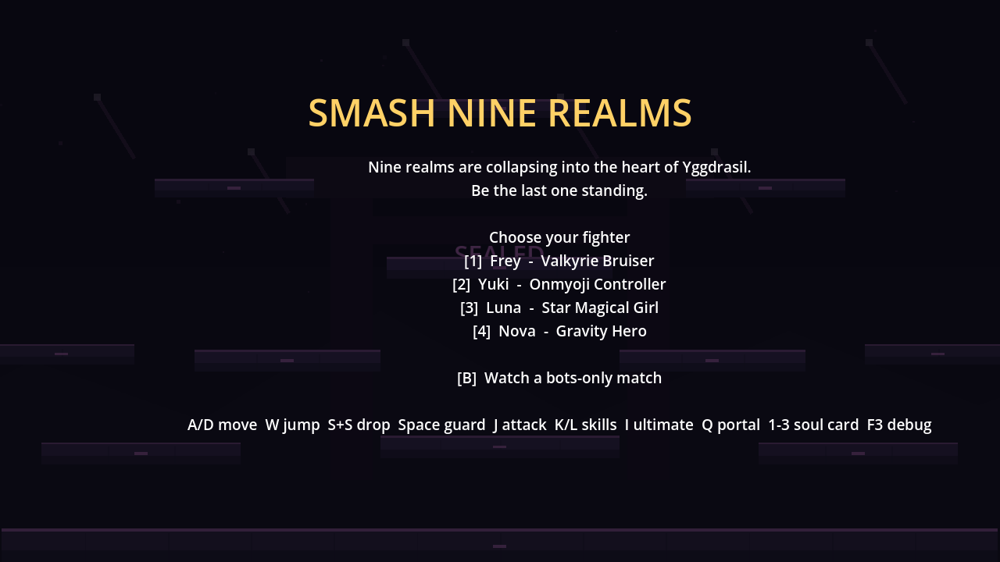
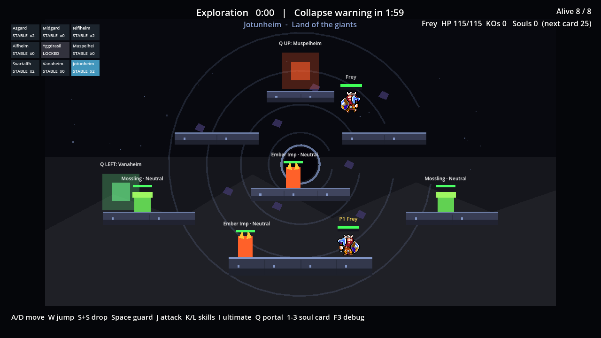
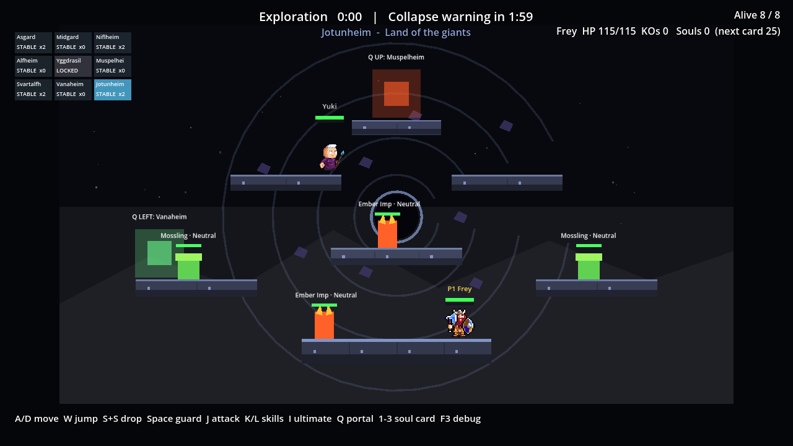
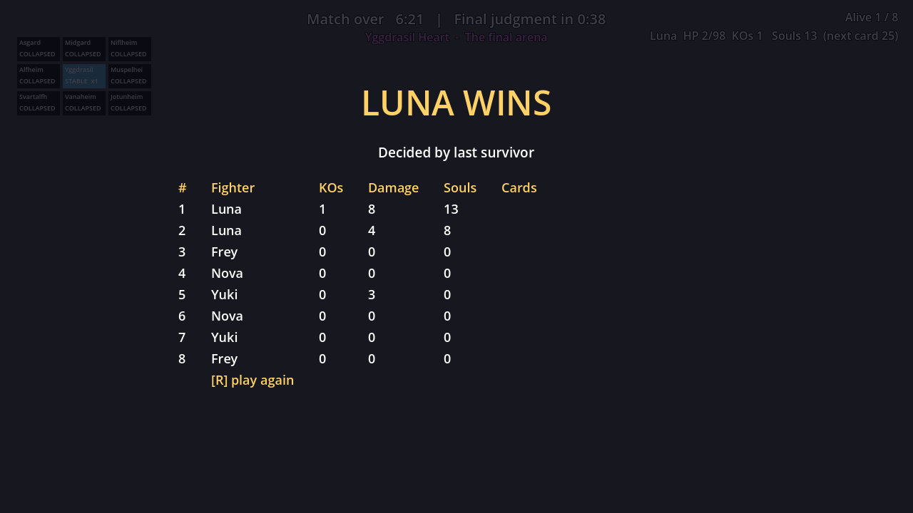

# CODEX-RETEST-02 결과 보고

## 결론

**제품 기능 판정: PASS.** 현재 `main`의 수정 커밋 `2bba7b1`, `17fa35f`, `2307d9b`을 대상으로 이전과 같은 실제 `InputEventKey` 입력 흐름을 다시 실행했다. `real_input_core.gd`의 전 항목이 다시 통과했고, R 10회(총 11경기) 동안 이전 null Viewport 오류가 재발하지 않았다. 모든 결과 화면에서 승자는 살아 있었고 `Alive 1/8`과 승자 HP가 결과 후에도 고정됐다.

최종 창 모드 실행 3개에는 카드에서 알려진 Windows 인증서 저장소 `ERROR`가 각각 1회, 총 **3회** 있었다. 이를 제외한 제품/엔진 `ERROR`, `SCRIPT ERROR`, `Parse Error`는 **0건**이다. 다만 재시작 측정 드라이버의 첫 검증 시 tester 전용 변수 타입 추론 `Parse Error` 1건과 그에 따른 스크립트 로드 `ERROR` 1건이 제품 장면 로드 전에 발생했고, 타입을 명시한 뒤 최종 실행은 정상 완료했다. 원문과 분류는 [validation-errors.log](./validation-errors.log)에 남겼다.

제품 소스와 기존 테스트는 수정하지 않았다. 허용 경로에 원본 입력을 상속하는 재검증 드라이버 3개와 이 보고서·JSON·로그·스크린샷만 추가했다.

이 유닛에서는 `.git/index.lock` 생성 권한이 없어 직접 커밋하지 못했다. [commit.ps1](./commit.ps1)은 이번 tester-02 허용 경로만 stage하는지 검사한 뒤 요구된 공동 작성자 꼬리말과 함께 커밋한다.

## 이전/현재 비교

| 항목 | CODEX-TESTER-01 이전 | CODEX-RETEST-02 현재 | 판정 |
|---|---|---|---|
| 1. 시작 화면 1/2/3/4/B | PASS. 4캐릭터 및 봇 관전 시작 성공 | PASS. 동일 입력 5종 모두 성공, 각 캐릭터·P1 인간 여부·카메라 렐름 일치 | **유지** |
| 2. 실제 경기 조작 | PASS. 이동 `141.3px`, 점프 `138.3px`, 가드/공격/드롭/궁극기 성공 | PASS. 이동 `141.3px`, 점프 `138.3px`, J/K/L 잠금 `0.213/0.437/0.567s`, 드롭 `228.1px`, 궁극기 거절·재사용 성공 | **유지** |
| 3. 포털 | PASS. Q 1회, 도착 오차 `3.4px` | PASS. Q 1회, Niflheim→Muspelheim, 도착 오차 `3.4px`, 카메라 전환 일치 | **유지** |
| 4. 소울 카드 | PASS. Vitality 수동 선택, Sky Step `4.94s` 자동 선택 | PASS. 같은 카드 순서, Vitality 수동 선택, Sky Step `4.92s` 자동 선택과 `(auto-picked)` 메시지 확인 | **유지** |
| 5. 붕괴·탈락·관전 | PASS (`real_input_collapse.gd`) | 이번 카드가 지정한 정확한 입력이 core/restart이므로 **재실행하지 않음** | **미검증** |
| 6. 결과·R 재시작 | **FAIL.** R 3/3회 null Viewport `SCRIPT ERROR`; 결과 뒤 승자 HP 0, `Alive 0/8` | **PASS.** R 10/10회 오류 0; 11/11 결과 도달; 모두 승자 생존, `Alive 1/8`; 결과 후 30프레임 동안 HP/Alive 불변 | **수정 확인** |
| 7. 단계별 캡처 | PASS. PNG 27장 | PASS. 현재 결과 PNG 22장 저장, 저장 오류 전부 0 | **유지** |
| 신규: 시작 화면 HUD | FAIL. 오버레이 아래 미니맵·상태·하단 안내가 노출 | PASS. clock/realm/status/info/minimap/warning/card가 모두 숨고 오버레이만 표시 | **수정 확인** |
| 신규: P1 렐름 혼합 오프닝 페어 | FAIL. Frey 선택 시 같은 렐름 상대도 Frey | PASS. seed 4100에서 P1 Frey의 같은 렐름 상대가 Yuki, 상대 1명이며 캐릭터가 다름 | **수정 확인** |

## 재시작 10회 상세

- 실제 입력: 각 경기 `B`, 결과 화면마다 `R`; 모두 `Input.parse_input_event(InputEventKey)`의 press/release 프레임으로 전달
- 시간 가속: 이전과 동일한 `Engine.time_scale=30`
- 결과 도달: **11/11 경기**
- R 입력 및 새 시작 화면 복귀: **10/10회**
- 시작 화면 노드 수: `751` × 11, span `0`
- 승자 생존: **11/11** (`HP 2.4–73.4`)
- Alive 수: 결과 시점과 30프레임 후 모두 **1**, 11/11 고정
- 승자 HP: 결과 시점과 30프레임 후 **11/11 동일**
- 이전 null Viewport `SCRIPT ERROR`: **0/10회**

원시 값은 [real_input_restart.json](./real_input_restart.json), 전체 콘솔은 [real_input_restart.console.log](./real_input_restart.console.log)에 있다.

## 시각적 확인

### 시작 화면 HUD 수정



시작 오버레이 뒤에 이전처럼 미니맵·상태·하단 안내가 겹치지 않는다. 배경 렐름은 보이지만 게임 HUD 노드는 측정상 모두 숨김 상태다.

### 혼합 오프닝 페어

| 이전: Frey + Frey | 현재: Frey + Yuki |
|---|---|
|  |  |

같은 seed/`1` 입력 계열의 P1 렐름이 동일 캐릭터 중복에서 Frey와 Yuki의 혼합 페어로 바뀌었다.

### 결과 상태 동결



Luna 승리 결과와 상단 `Alive 1/8`, 승자 HP `2/98`가 서로 일치한다. 측정 원시값은 `2.4`이며 30프레임 뒤에도 변하지 않았다.

## 확인 및 테스트

창 모드 Godot를 한 번에 하나만 실행했다.

```powershell
<godot> --path . -s tests/playtest/retest_new_checks_02.gd
<godot> --path . -s tests/playtest/retest_core_02.gd
<godot> --path . -s tests/playtest/retest_restart_02.gd
```

- `retest_core_02.gd`: 기존 `real_input_core.gd`를 그대로 상속해 입력·판정 로직은 변경하지 않고 출력 경로만 tester-02로 분리
- `retest_restart_02.gd`: 기존 B→결과→R 흐름을 R 10회로 확대하고 승자/Alive 동결 상태를 읽어 기록
- `retest_new_checks_02.gd`: 실제 `1` 입력 전후의 HUD 가시성과 P1 렐름 파트너 캐릭터를 읽어 기록
- 최종 실행 인증서 오류: **3건**(프로세스당 1건, 알려진 샌드박스 노이즈)
- 최종 실행의 그 외 오류: **0건**

## 현재 열려 있는 항목

- Windows/Godot 루트 인증서 저장소 오류는 최종 3개 실행 모두에서 재현됐다. 게임 기능과 별개인 알려진 샌드박스 노이즈지만 엄격한 “ERROR 0” 게이트는 여전히 충족하지 못한다.
- 이번 카드 범위에서 `real_input_collapse.gd`는 다시 실행하지 않았다. 붕괴·탈락·관전은 이전 PASS만 남아 있다.
- 결과 오버레이 뒤에 상단 매치 HUD와 미니맵이 희미하게 보인다. 값은 이제 일관되지만, 결과 화면에서 완전히 숨길지는 시각 디자인 판단이 필요하다.
- 자동 입력은 조작감·재미·공정성·가독성 같은 주관 품질을 판정하지 않는다.

## 사람이 확인해야 할 것

1. 1배속에서 혼합 오프닝 페어가 실제 초반 교전을 더 읽기 쉽고 재미있게 만드는지.
2. 결과 화면 뒤의 희미한 상단 HUD/미니맵이 유용한 맥락인지, 불필요한 시각 잡음인지.
3. 8인 압박 중 카드 선택 5초, 포털 접근, 붕괴 경고와 30 피해의 체감 공정성.
4. 인증서 오류가 샌드박스 밖의 일반 Windows 실행에서도 발생하는지.

## 남은 작업과 다음 권장 단계

- **완료:** core 동일 입력 재검증, R 10회 회귀, 결과 동결, 시작 HUD 숨김, 혼합 오프닝 페어, 스크린샷/원시 로그 저장.
- **현재 상태:** 제품 기능은 PASS이며, 알려진 인증서 환경 오류만 최종 각 프로세스에 1건 남아 있다.
- **남은 작업:** 사람 1배속 플레이 평가와 필요 시 결과 화면 HUD 표시 정책 결정.
- **다음 권장 단계:** 리드가 이 보고서를 확인한 뒤 일반 사용자 세션에서 인증서 오류를 분리하고, 짧은 수동 플레이로 위 네 항목을 확인한다.
